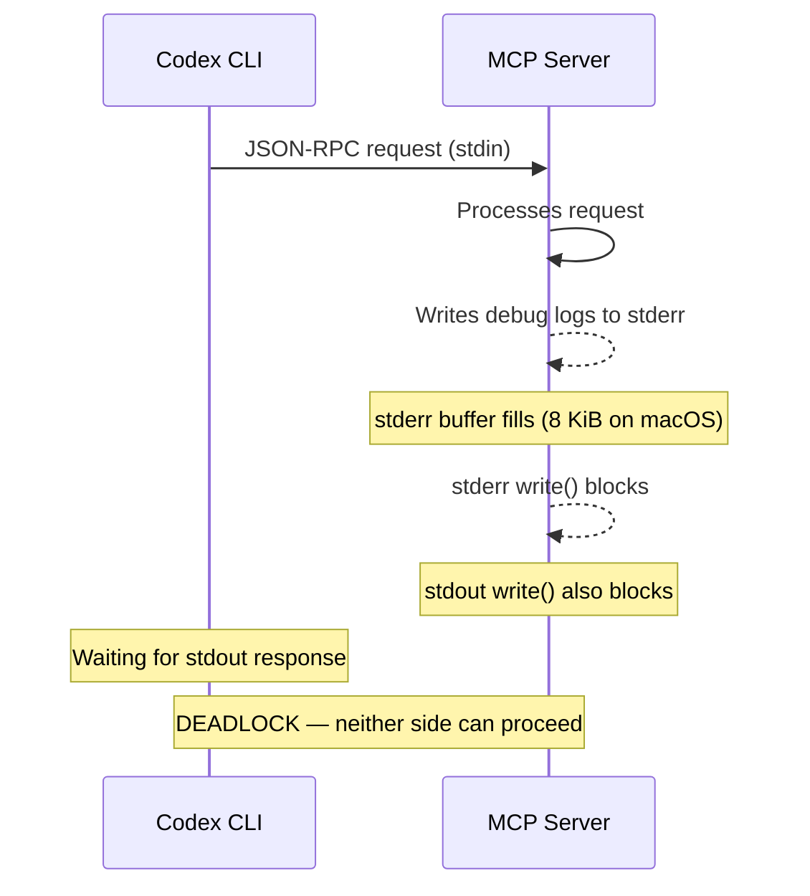
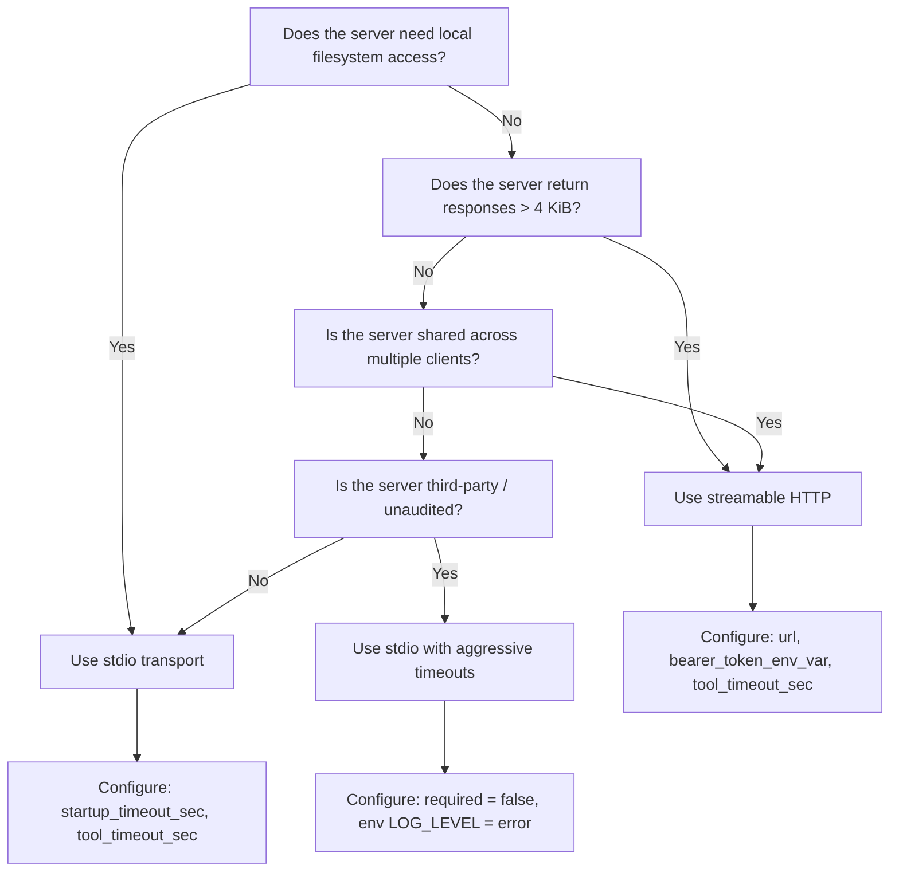

# The MCP stdio Pipe-Buffer Deadlock: Diagnosing, Preventing, and Recovering from the Most Common MCP Server Failure in Codex CLI


---

Every developer who has connected more than two MCP servers to Codex CLI has seen it: a tool call that spins forever, a session that silently stops responding, a `codex exec` pipeline that never exits. The cause, more often than not, is the **stdio pipe-buffer deadlock** — a failure mode baked into the operating system's anonymous pipe implementation that no amount of retry logic can fix.

This article dissects the problem at the kernel level, maps it to concrete Codex CLI symptoms, and provides battle-tested prevention and recovery patterns drawn from documented failures across Codex CLI, Claude Code, Cursor, and the codex-plugin-cc bridge [^1] [^2] [^3].

## Why stdio Is the Default MCP Transport

The Model Context Protocol defines two transport mechanisms: **stdio** (local subprocess communication over stdin/stdout) and **streamable HTTP** (remote communication over a single HTTP endpoint) [^4]. Codex CLI uses stdio as the default for locally installed MCP servers because it offers the lowest latency, requires no authentication, and works offline [^5].

The configuration is deceptively simple:

```toml
[mcp_servers.my_server]
command = "npx"
args = ["-y", "@example/my-mcp-server"]
```

Codex spawns the server as a child process, sends JSON-RPC messages to its stdin, and reads responses from its stdout. What could go wrong?

## The Deadlock Mechanism

### Kernel Pipe Buffers Are Finite

When Codex spawns an MCP server, the operating system creates anonymous pipes for stdin, stdout, and stderr. These pipes have **fixed kernel buffers**:

| Operating System | stdout Buffer | stderr Buffer |
|------------------|--------------|---------------|
| macOS (Darwin) | 8 KiB [^3] | 8 KiB |
| Linux (default) | 64 KiB [^6] | 64 KiB |
| Windows (named pipes) | 4–64 KiB [^2] | 4–64 KiB |

### The Classic Deadlock Sequence

The deadlock occurs when **both pipes fill simultaneously** and neither side can make progress:



The server's `write()` to stderr blocks because the pipe buffer is full. Codex never drains stderr because it is waiting for the stdout response. The stdout response never arrives because the server is blocked on stderr. Both processes hang indefinitely [^3] [^6].

### The Large-Response Variant

Even without stderr involvement, a single stdout response exceeding the pipe buffer causes the same deadlock. On macOS, any JSON-RPC response larger than 8 KiB triggers this [^3]:

1. The server writes the first 8 KiB of the response — the kernel buffer fills.
2. The server's `write()` syscall blocks, waiting for the reader to drain.
3. If the reader (Codex) is not actively draining in a separate thread or event loop tick, both sides stall.

This is documented as a reproducible bug in Cursor's MCP implementation [^3], and the same pipe semantics apply to every stdio-based MCP client, including Codex CLI.

## Symptoms in Codex CLI

Recognising the deadlock is half the battle. Here are the telltale signs:

### Interactive Sessions

- A tool call shows `Running…` indefinitely in the TUI
- The session becomes unresponsive to keyboard input
- `/mcp` shows the server as connected but the tool never returns

### Non-Interactive (`codex exec`) Pipelines

- The process hangs with 0% CPU usage
- No output appears on stdout or stderr
- The process must be killed with `SIGKILL` — `SIGTERM` has no effect because the blocked `write()` is uninterruptible on some platforms

### CI/CD Environments

- GitHub Actions jobs hit the 6-hour timeout
- The `codex exec` step produces no structured output
- Subsequent pipeline steps never execute

## The Windows Stdin Delivery Bug

A related but distinct failure affected Windows users throughout early 2026: Codex CLI's sandbox did not correctly deliver the `initialize` JSON-RPC message to the child process's stdin [^1]. Every MCP server appeared to time out identically, regardless of configuration.

**Diagnosis:** If you ran the MCP server manually outside Codex and it worked, but under Codex every server timed out, this was the Windows stdin delivery bug — not a pipe-buffer deadlock [^1].

**Fix:** This was resolved by OpenAI engineering in a 2026 update [^1]. If you still encounter it, ensure you are running Codex CLI v0.136 or later.

## The codex-plugin-cc IPC Deadlock

A third variant was documented in the codex-plugin-cc bridge (the cross-provider MCP proxy). When Codex spawned stdout-heavy PowerShell commands on Windows, the IPC pipe between the codex process and its broker filled, deadlocking subsequent writes and hanging the entire review session [^2].

**Root cause:** Commands producing output exceeding the IPC pipe buffer between the codex process and its broker deadlocked subsequent writes [^2].

## Prevention Patterns

### 1. Configure Timeouts Aggressively

Codex CLI's timeout settings are your first line of defence. Set them per server in `config.toml`:

```toml
[mcp_servers.my_server]
command = "node"
args = ["./my-server.js"]
startup_timeout_sec = 20
tool_timeout_sec = 120
```

The defaults are 10 seconds for startup and 60 seconds per tool call [^5]. For servers that return large responses (database queries, code search results, documentation lookups), increase `tool_timeout_sec` to at least 120 seconds. The timeout will not prevent the deadlock, but it will **recover from it** by killing the hung process.

### 2. Mark Servers as Non-Required

Unless a server is critical to every session, set `required = false` (the default) so a hung server does not block Codex CLI startup [^5]:

```toml
[mcp_servers.optional_server]
command = "npx"
args = ["-y", "@example/optional-server"]
required = false
startup_timeout_sec = 15
```

### 3. Drain stderr in Your MCP Servers

If you build or maintain MCP servers, the single most important fix is to **never let stderr accumulate**. The MCP specification requires that servers use stderr only for logging, and clients should capture it [^4]. In practice:

```javascript
// Bad: verbose logging to stderr
console.error(`Processing request: ${JSON.stringify(request)}`);

// Good: log to a file, not stderr
import { appendFileSync } from 'fs';
appendFileSync('/tmp/mcp-server.log',
  `${new Date().toISOString()} ${JSON.stringify(request)}\n`);
```

For servers you do not control, set the `env` key to suppress verbose logging:

```toml
[mcp_servers.verbose_server]
command = "node"
args = ["./verbose-server.js"]
env = { "LOG_LEVEL" = "error", "DEBUG" = "" }
```

### 4. Chunk Large Responses

MCP server authors should avoid returning tool results larger than 4 KiB in a single JSON-RPC response. For large datasets, return a summary with a file path or pagination token:

```json
{
  "result": {
    "summary": "Found 847 matching files",
    "output_file": "/tmp/search-results.jsonl",
    "truncated": true
  }
}
```

### 5. Migrate to Streamable HTTP for Remote Servers

For servers that do not need local filesystem access, streamable HTTP eliminates the pipe-buffer problem entirely [^4] [^7]:

```toml
[mcp_servers.remote_server]
url = "https://mcp.example.com/v1"
bearer_token_env_var = "MCP_REMOTE_TOKEN"
tool_timeout_sec = 180
```

The MCP 2026-07-28 Release Candidate makes streamable HTTP the recommended transport for all remote servers [^7]. The SSE transport is deprecated with a twelve-month removal runway.

## Recovery Patterns

### Interactive Recovery

When a tool call hangs in the TUI:

1. Press `Escape` or `Ctrl+C` to attempt cancellation
2. If the session remains stuck, use `/mcp` to check server status
3. Restart the hung server: exit and re-enter the session, or use `codex mcp restart <server-name>` if available in your version

### Pipeline Recovery with PostToolUse Hooks

For `codex exec` pipelines, add a PostToolUse hook that detects long-running tool calls and logs a warning:

```toml
[[hooks]]
event = "PostToolUse"
command = "bash"
args = ["-c", "echo \"Tool $TOOL_NAME completed in session\" >> /tmp/codex-tool-audit.log"]
timeout_ms = 5000
```

### CI Recovery with Timeout Wrappers

In CI environments, wrap `codex exec` with a timeout:

```bash
# GitHub Actions
timeout 300 codex exec \
  --approval-mode full-auto \
  --output-schema schema.json \
  "Analyse the codebase for security issues" \
  || echo "::warning::Codex exec timed out — possible MCP deadlock"
```

## Decision Framework: stdio vs Streamable HTTP



## The Bigger Picture: Why This Matters Now

The MCP Dev Summit Bengaluru (9–10 June 2026) featured a session from MIT ADT University specifically addressing the stdio pipe-buffer deadlock as a cross-agent problem documented across Cursor, Claude Code, and Codex CLI [^8]. The consensus: **stdio transport was designed for simple, low-throughput IPC**. As MCP servers grow more capable — returning search results, database query output, and generated code — they routinely exceed the pipe-buffer limits that were adequate for simple tool invocations.

The MCP 2026-07-28 Release Candidate's push toward streamable HTTP is not merely a protocol modernisation exercise. It is a direct response to the operational fragility of stdio at scale [^7]. For Codex CLI developers, the practical implication is clear: **use stdio for local-only, low-volume tools; use streamable HTTP for everything else**.

## Quick-Reference Checklist

| Action | Config Key | Default | Recommended |
|--------|-----------|---------|-------------|
| Increase tool timeout | `tool_timeout_sec` | 60 | 120–300 |
| Increase startup timeout | `startup_timeout_sec` | 10 | 15–30 |
| Mark non-critical servers optional | `required` | `false` | Keep `false` |
| Suppress stderr logging | `env.LOG_LEVEL` | varies | `"error"` |
| Switch to HTTP transport | `url` | n/a | Use for remote servers |

## Citations

[^1]: OpenAI Developer Community, "MCP servers all time out, narrowed it down to stdio bug," [https://community.openai.com/t/mcp-servers-all-time-out-narrowed-it-down-to-stdio-bug/1363658](https://community.openai.com/t/mcp-servers-all-time-out-narrowed-it-down-to-stdio-bug/1363658)

[^2]: openai/codex-plugin-cc Issue #330, "codex-companion IPC pipe deadlocks mid-review when codex spawns stdout-heavy PowerShell commands on Windows," [https://github.com/openai/codex-plugin-cc/issues/330](https://github.com/openai/codex-plugin-cc/issues/330)

[^3]: Cursor Community Forum, "stdio MCP server hangs on macOS when response > 8 KB (pipe buffer exhaustion)," [https://forum.cursor.com/t/bug-stdio-mcp-server-hangs-on-macos-when-response-8-kb-pipe-buffer-exhaustion/158804](https://forum.cursor.com/t/bug-stdio-mcp-server-hangs-on-macos-when-response-8-kb-pipe-buffer-exhaustion/158804)

[^4]: Model Context Protocol Specification, "Transports," [https://modelcontextprotocol.io/specification/2025-11-25/basic/transports](https://modelcontextprotocol.io/specification/2025-11-25/basic/transports)

[^5]: OpenAI Developers, "Model Context Protocol – Codex," [https://developers.openai.com/codex/mcp](https://developers.openai.com/codex/mcp)

[^6]: tey.sh, "Deadlocking Linux subprocesses using pipes," [https://tey.sh/TIL/002_subprocess_pipe_deadlocks](https://tey.sh/TIL/002_subprocess_pipe_deadlocks)

[^7]: OpenAI Developers, "Codex Changelog — MCP 2026-07-28 RC," [https://developers.openai.com/codex/changelog](https://developers.openai.com/codex/changelog)

[^8]: MCP Dev Summit Bengaluru, 9–10 June 2026, Agentic AI Foundation / Linux Foundation. Session: "stdio pipe-buffer deadlock problem documented across Cursor/Claude Code/Codex plugin-cc" (MIT ADT University). ⚠️ *Session details sourced from pre-event agenda; post-event proceedings not yet published.*
