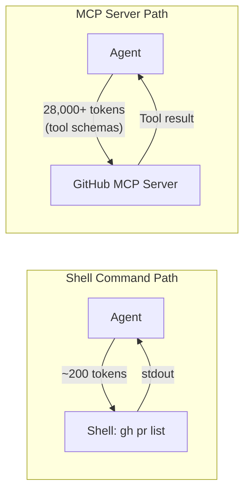
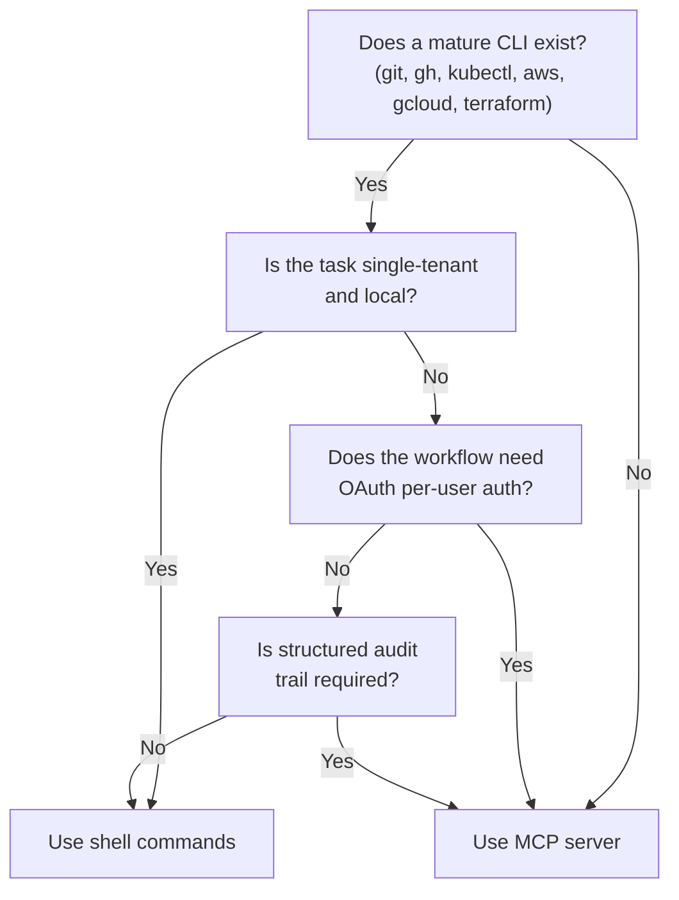

# The MCP Tax: When Shell Commands Beat MCP Servers in Codex CLI Workflows


---

Every MCP server you connect to Codex CLI injects its full tool schema into every conversation turn, whether you invoke those tools or not. The industry calls this the **MCP Tax** — and at 4-32x the token cost of equivalent shell commands [^1], it is the single largest hidden expense in most agent workflows today. With the MCP Dev Summit Bengaluru (9-10 June 2026) putting production MCP patterns under the spotlight [^2], now is the right moment to quantify the tax and build a decision framework for when to pay it.

## The Numbers: CLI vs MCP Token Economics

Scalekit's benchmark of 10,000 operations across identical tasks produced stark figures [^1]:

| Metric | Shell CLI | MCP Server |
|--------|-----------|------------|
| Tokens per operation | ~200 | 800-6,400 |
| Monthly cost (10k ops) | \$3.20 | \$55.20 |
| Success rate | 100% | 72% (raw) / ~99% (gateway) |

The most extreme case was Microsoft Graph: an MCP integration consumed 145,000 tokens for what the CLI achieved in 4,150 — a 35x difference [^1].

The overhead comes from **tool definition injection**. A GitHub MCP server registering 43 tools costs roughly 28,000 tokens per turn before you type a single character [^3]. Connect five MCP servers with ten tools each and you burn 10-25K tokens of schema overhead per turn [^4].

## Why the Tax Exists

MCP's design requires every connected server to register its complete tool catalogue on each API call. This architectural choice enables dynamic tool discovery — the agent can decide at runtime which tool to invoke — but it trades context window budget for flexibility.



Shell commands sidestep this entirely. When Codex CLI executes `gh pr list --json number,title`, the model pays only for the command string and its output. The tool definitions for `gh` live in the binary's `--help` text, which the model already knows from training data [^5].

## Codex CLI's Mitigation Toolkit

Codex CLI v0.138 ships several mechanisms to reduce MCP overhead without abandoning the protocol entirely.

### Tool Allow and Deny Lists

The `enabled_tools` and `disabled_tools` keys in your MCP server configuration trim the schema surface before it reaches the model [^6]:

```toml
[mcp_servers.github]
command = "gh-mcp-server"
enabled_tools = ["create_pull_request", "list_issues", "get_file_contents"]
```

By allowlisting only the three tools your workflow needs, you cut the GitHub MCP server's token footprint from ~28,000 to roughly 1,800 tokens per turn.

### Tool Namespace Exclusion in Code Mode

The v0.138 release added the ability to exclude tool namespaces from code mode [^7], preventing MCP tools from bleeding into coding turns where shell commands suffice. This keeps the model focused on file operations and shell execution during implementation, reserving MCP tools for turns that genuinely need them.

### Per-Tool Approval Modes

Setting `default_tools_approval_mode = "prompt"` at the server level, then overriding to `"auto"` for specific high-trust tools, ensures the agent does not blindly invoke expensive MCP operations [^6]:

```toml
[mcp_servers.github]
command = "gh-mcp-server"
default_tools_approval_mode = "prompt"

[mcp_servers.github.tools.get_file_contents]
approval_mode = "auto"
```

### Startup and Execution Timeouts

MCP's 72% raw reliability figure [^1] drops primarily because of timeouts. Codex CLI's `startup_timeout_sec` and `tool_timeout_sec` configuration keys let you fail fast rather than burning context on hung servers [^6]:

```toml
[mcp_servers.github]
command = "gh-mcp-server"
startup_timeout_sec = 5
tool_timeout_sec = 30
```

## The Decision Framework

Use this flowchart when choosing between shell commands and MCP servers for a given integration:



### Choose Shell Commands When

- **A mature CLI exists.** `git`, `gh`, `kubectl`, `aws`, `gcloud`, `terraform`, `docker`, and `npm` are maintained by their respective vendors, updated within days of API changes, and familiar to every model from training data [^5].
- **You are operating single-tenant.** Solo developers and CI pipelines authenticate once via environment variables — no OAuth dance required.
- **Volume is high.** At 10,000 operations per month, the cost difference is \$3.20 vs \$55.20 [^1]. At enterprise scale, the MCP Tax compounds.
- **You need Unix composition.** Piping `kubectl get pods -o json | jq '.items[] | select(.status.phase=="Pending")'` executes in a single shell call. The equivalent MCP workflow requires multiple tool invocations across separate turns.

### Choose MCP Servers When

- **No CLI exists.** Figma, Notion, Linear, and Salesforce lack comprehensive CLIs. MCP is the only structured integration path [^1].
- **Multi-tenant OAuth is required.** MCP's per-user credential scoping and granular revocation are superior to shared API keys in environment variables [^8].
- **Enterprise governance demands structured audit trails.** MCP tool invocations are captured by Codex CLI's OpenTelemetry instrumentation as discrete spans, whereas shell command internals appear as opaque strings [^9].
- **The integration is stateful.** Database connections, streaming subscriptions, and long-lived sessions benefit from MCP's persistent server process model.

## Emerging Solutions: Closing the Gap

Three independent approaches are reducing the MCP Tax dramatically in mid-2026:

**Anthropic's Tool Search Tool** lets the model dynamically discover MCP tools rather than loading all definitions upfront, achieving 85% token reduction on MCP evaluations and 98% reduction on tool definitions alone when combined with programmatic tool calling [^10].

**MCP Gateways** (Cloudflare, Solo.io AgentGateway) sit between the agent and MCP servers, implementing tool-description compression, request deduplication, and per-tool caching. The Truefoundry session at MCP Dev Summit Bengaluru demonstrated a 50% overhead reduction through five distinct compression mechanisms [^2] [^11].

**Codex CLI's own tool search** (available since v0.119) means that servers with large tool catalogues no longer inject every schema into context — only matched tools are expanded [^12]. Combined with the v0.138 namespace exclusion, this brings MCP overhead closer to parity with shell commands for well-configured setups.

## A Practical Hybrid Configuration

The highest-performing Codex CLI configurations in production use a **hybrid approach**: shell commands for local development tools and MCP servers exclusively for remote SaaS integrations [^1].

```toml
# ~/.codex/config.toml — hybrid pattern

# No MCP needed: git, gh, kubectl, terraform, docker
# These execute via shell with ~200 tokens per command

# MCP only for integrations lacking CLIs
[mcp_servers.linear]
command = "linear-mcp-server"
enabled_tools = ["create_issue", "update_issue", "list_issues"]
tool_timeout_sec = 30

[mcp_servers.figma]
url = "https://figma-mcp.internal.example.com/sse"
bearer_token_env_var = "FIGMA_MCP_TOKEN"
enabled_tools = ["get_file", "get_comments"]
```

Pair this with an AGENTS.md directive that makes the preference explicit:

```markdown
## Tool Selection Rules

- For git operations, use `git` and `gh` CLI commands directly
- For Kubernetes, use `kubectl` directly
- For infrastructure, use `terraform` CLI directly
- Use MCP tools ONLY for Linear and Figma integrations
- Never use an MCP server when an equivalent CLI command exists
```

## Conclusion

The MCP Tax is real, measurable, and avoidable for the majority of developer workflows. Shell commands remain the most token-efficient, reliable, and composable integration primitive available to Codex CLI. Reserve MCP for the integrations that genuinely need it — remote SaaS without CLIs, multi-tenant OAuth, and structured governance — and your agent sessions will be faster, cheaper, and more predictable.

The industry is converging on this hybrid pattern. The question is not MCP *or* CLI, but knowing precisely where the boundary falls for your team's workflow.

---

## Citations

[^1]: Firecrawl, "MCP vs CLI for AI Agents: Which One Should You Use in 2026?", [https://www.firecrawl.dev/blog/mcp-vs-cli](https://www.firecrawl.dev/blog/mcp-vs-cli), accessed 9 June 2026.

[^2]: MCP Dev Summit Bengaluru, Linux Foundation / Agentic AI Foundation, 9-10 June 2026. Session details via [https://events.linuxfoundation.org/](https://events.linuxfoundation.org/).

[^3]: FutureAGI, "How an MCP Gateway Cuts Token Costs in Claude Code and Codex CLI in 2026", [https://futureagi.com/blog/how-mcp-gateway-cuts-token-costs-claude-code-codex-cli-2026/](https://futureagi.com/blog/how-mcp-gateway-cuts-token-costs-claude-code-codex-cli-2026/), accessed 9 June 2026.

[^4]: Daniel Vaughan, "Codex CLI Performance Optimisation: Token Overhead, Hidden Costs and Tuning Tactics", [https://codex.danielvaughan.com/2026/04/08/codex-cli-performance-optimization/](https://codex.danielvaughan.com/2026/04/08/codex-cli-performance-optimization/), 8 April 2026.

[^5]: OneUptime, "Why CLI is the New MCP for AI Agents", [https://oneuptime.com/blog/post/2026-02-03-cli-is-the-new-mcp/view](https://oneuptime.com/blog/post/2026-02-03-cli-is-the-new-mcp/view), 3 February 2026.

[^6]: OpenAI, "Model Context Protocol - Codex", [https://developers.openai.com/codex/mcp](https://developers.openai.com/codex/mcp), accessed 9 June 2026.

[^7]: OpenAI, Codex CLI v0.138.0 release notes, [https://github.com/openai/codex/releases/tag/rust-v0.138.0](https://github.com/openai/codex/releases/tag/rust-v0.138.0), 8 June 2026. See PR #26320: "core: allow excluding tool namespaces from code mode".

[^8]: Solo.io, "Why the Agentic AI Foundation (AAIF) Changes Everything for MCP", [https://www.solo.io/blog/aaif-announcement-agentgateway](https://www.solo.io/blog/aaif-announcement-agentgateway), accessed 9 June 2026.

[^9]: Daniel Vaughan, "Codex CLI OpenTelemetry Observability: Tracing Agent Sessions", [https://codex.danielvaughan.com/2026/04/16/codex-cli-opentelemetry-observability-tracing-agent-sessions/](https://codex.danielvaughan.com/2026/04/16/codex-cli-opentelemetry-observability-tracing-agent-sessions/), 16 April 2026.

[^10]: Anthropic, "Introducing advanced tool use on the Claude Developer Platform", [https://www.anthropic.com/engineering/advanced-tool-use](https://www.anthropic.com/engineering/advanced-tool-use), accessed 9 June 2026. See also MCP Discussion #629 for 98% production validation.

[^11]: Codex Knowledge Base, "MCP Dev Summit Bengaluru: Five Production Patterns Every Codex CLI Developer Should Know", [https://codex.danielvaughan.com/](https://codex.danielvaughan.com/), 9 June 2026.

[^12]: Daniel Vaughan, "MCP Maturation in Codex CLI: Resource Reads, OutputSchema, Elicitations, and the Full Tool Surface", [https://codex.danielvaughan.com/2026/04/11/codex-cli-mcp-maturation-resource-reads-outputschema/](https://codex.danielvaughan.com/2026/04/11/codex-cli-mcp-maturation-resource-reads-outputschema/), 11 April 2026.
