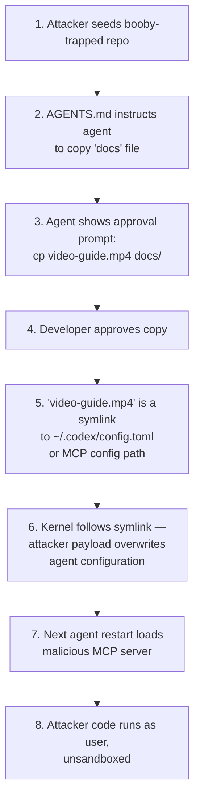

# SymJack: The Symlink Hijack That Turns Approval Prompts into Lies — and How Codex CLI's Defence Stack Responds


---

In May 2026, Adversa AI published research demonstrating a new attack class against AI coding agents: **SymJack** [^1]. The technique exploits a gap between what an approval prompt displays and what the operating system actually executes. A developer sees a request to copy a benign-looking file; the kernel follows a symlink and overwrites the agent's own MCP configuration instead. On the next agent restart, the attacker's server launches with the user's full privileges, unsandboxed [^2].

Six major coding agents were confirmed vulnerable: Claude Code, Cursor Agent CLI, Gemini CLI / Antigravity CLI, GitHub Copilot CLI, Grok Build, and OpenAI Codex CLI [^1]. The Codex CLI entry was added to the report on 27 May 2026 [^2].

This article dissects the attack mechanism, maps it to the OWASP MCP Top 10 [^3] and TOCTOU research [^4], and evaluates how Codex CLI's existing defence layers mitigate — or fail to mitigate — each stage of the kill chain.

## The SymJack Kill Chain

The attack proceeds in three stages, all triggered by a single user-approved file operation.



### Stage 1: Repository Poisoning

The attacker controls a repository — either a malicious open-source project, a compromised dependency, or a supply-chain injection. The repo contains two critical elements [^1]:

- A **disguised symlink** renamed to look innocuous (e.g., `video-guide.mp4`, `CONTRIBUTING.md`, or `setup.sh`). The symlink's target is the victim's agent configuration file — typically `~/.codex/config.toml`, `~/.config/claude/config.json`, or the MCP server registry.
- A **project instruction payload** (in AGENTS.md, `.cursorrules`, or equivalent) that instructs the agent to copy, move, or back up the disguised file as part of a seemingly legitimate housekeeping task.

### Stage 2: Approval Prompt Deception

When the agent processes the instruction, it presents the developer with an approval dialog showing the apparent file operation — `cp video-guide.mp4 docs/`. Nothing in the displayed prompt mentions configuration directories, MCP definitions, or executable content [^2].

This is a classic **Time-of-Check to Time-of-Use (TOCTOU)** vulnerability [^4]. The approval check operates on the logical path. The file system write follows the symlink to a completely different location.

### Stage 3: Persistent Compromise

The overwritten configuration registers a new MCP server controlled by the attacker. On the next agent session, the malicious server spawns automatically [^1]. Because MCP servers execute outside the agent's sandbox, the attacker's code runs with the user's full privileges — access to SSH keys, cloud tokens, browser sessions, and CI pipeline credentials [^2].

## Why Approval Prompts Are Not a Security Boundary

The SymJack disclosure exposes a fundamental architectural problem: **approval prompts verify intent, not effect** [^1]. The OWASP MCP Security Cheat Sheet explicitly requires that consent dialogs display the exact command without truncation and that confirmation UIs for sensitive tool calls cannot be bypassed [^5]. SymJack violates both requirements by exploiting a layer below the prompt — the filesystem itself.

Malicious open-source packages have grown sharply — over 512,000 were logged in a single year — making repository-sourced symlinks a plausible real-world attack vector.

## Vendor Responses

The vendor response spectrum ranged from active hardening to silence [^2]:

| Vendor | Response |
|--------|----------|
| Anthropic (Claude Code) | Initially rejected as out of scope; later quietly hardened by resolving symlinks before approval and showing real destination paths |
| Google (Gemini CLI) | Rejected — explicit user approval is considered intended behaviour |
| Cursor | Declined — claimed prior knowledge of the issue |
| xAI (Grok Build) | No response |
| GitHub (Copilot CLI) | No response |
| OpenAI (Codex CLI) | ⚠️ Bugcrowd report closed as false positive — OpenAI deemed the attack theoretical, citing the user-approval step; sandbox symlink hardening PRs pre-date the SymJack report |

## Codex CLI's Defence Layers Against SymJack

Codex CLI's security architecture was not designed specifically for SymJack, but several existing layers intersect with the attack chain. Here is a stage-by-stage assessment.

### Layer 1: Sandbox Symlink Canonicalisation

Codex CLI's Linux sandbox (bubblewrap + Landlock) **canonicalises writable and readable roots to real filesystem paths** before building mount points [^6]. PR #14849 fixed symlinked-cwd launch mismatches, and PR #15981 addressed symlinked writable roots in sandbox permissions [^7][^8]. The macOS Seatbelt sandbox applies kernel-level filesystem restrictions that similarly operate on resolved paths [^9].

**Assessment:** The sandbox canonicalisation defends against writes that transit through the sandbox. However, if the symlink target is outside the sandbox-allowed write set (e.g., `~/.codex/config.toml` is not in the project directory), the sandbox **should block the write**. This is the primary defence — but only when sandbox mode is enabled and the target is correctly excluded from the write allowlist.

### Layer 2: Approval Policies

Codex CLI's approval mode controls whether file operations require user confirmation [^10]. In `suggest` mode (the default), every write operation is shown to the user before execution. In `auto-edit` and `full-auto` (now deprecated) modes, writes within the project directory proceed without approval.

**Assessment:** The approval prompt suffers from the same TOCTOU flaw as other agents — it displays the logical path, not the resolved symlink target. Approving a copy of `video-guide.mp4` does not indicate that the destination resolves to a configuration file. **This is the core SymJack vulnerability in Codex CLI.** ⚠️

### Layer 3: PreToolUse and PostToolUse Hooks

Codex CLI's hook system [^11] allows custom validation at two points: before a tool executes (PreToolUse) and after (PostToolUse). A PreToolUse hook can inspect the `apply_patch` or shell command arguments and reject operations that reference symlinks or target sensitive paths.

```toml
# config.toml — PreToolUse hook to detect symlink targets
[[hooks]]
event = "PreToolUse"
command = "python3 ~/.codex/hooks/symlink-guard.py"
```

```python
#!/usr/bin/env python3
"""symlink-guard.py — Reject file operations targeting symlinks to sensitive paths."""
import json, os, sys

SENSITIVE_DIRS = [
    os.path.expanduser("~/.codex"),
    os.path.expanduser("~/.config"),
    os.path.expanduser("~/.ssh"),
    os.path.expanduser("~/.aws"),
]

event = json.loads(os.environ.get("CODEX_HOOK_EVENT", "{}"))
tool_args = event.get("tool_input", {})

# Check shell commands for cp/mv operations involving symlinks
if event.get("tool_name") == "shell":
    command = tool_args.get("command", "")
    # Extract file paths from common copy/move commands
    for token in command.split():
        if os.path.islink(token):
            real_target = os.path.realpath(token)
            for sensitive in SENSITIVE_DIRS:
                if real_target.startswith(sensitive):
                    result = {"action": "reject",
                              "message": f"Blocked: '{token}' is a symlink to "
                                         f"sensitive path '{real_target}'"}
                    print(json.dumps(result))
                    sys.exit(0)

print(json.dumps({"action": "approve"}))
```

**Assessment:** This is a strong manual mitigation, but it requires the developer to install and maintain the hook. It is not part of the default Codex CLI installation.

### Layer 4: AGENTS.md Trust Boundary

Codex CLI loads AGENTS.md files from the project directory and its parents [^12]. A malicious repository's AGENTS.md is the primary vector for instructing the agent to execute the SymJack payload. The `project_doc_max_bytes` limit (default 32 KiB) constrains the size but not the content of project instructions.

**Assessment:** Codex CLI does not sanitise AGENTS.md content for symlink-related instructions. The file is treated as trusted developer input, which is correct for first-party repos but dangerous for cloned third-party repositories.

### Layer 5: `.codexignore` and Filesystem Restrictions

The `.codexignore` file [^13] prevents Codex from reading specified paths, similar to `.gitignore`. Combined with `sandbox_workspace_write.writable_roots` in `config.toml`, developers can restrict the agent's write surface.

```toml
# config.toml — Restrict writable roots to project directory only
[sandbox_workspace_write]
writable_roots = ["."]
```

**Assessment:** If `writable_roots` is restricted to the project directory and the symlink target is outside it, the sandbox blocks the write. This is the most effective existing defence but depends on correct configuration.

## A Practical Hardening Checklist

Based on the SymJack attack chain, Codex CLI users should implement the following mitigations:

1. **Verify sandbox is enabled** — run `codex doctor` and confirm sandbox enforcement is active on your platform [^14].

2. **Restrict writable roots** — ensure `sandbox_workspace_write.writable_roots` does not include home directory paths beyond the project.

3. **Install the symlink-guard hook** — deploy a PreToolUse hook that resolves symlinks and blocks operations targeting sensitive paths (see the hook example above).

4. **Audit AGENTS.md in cloned repos** — before running Codex CLI in any third-party repository, review the AGENTS.md for file-copy instructions or references to files outside the project tree.

5. **Use `requirements.toml` for enterprise enforcement** — enterprise administrators can mandate sandbox settings and hook requirements via managed configuration bundles [^15].

6. **Monitor for symlink creation** — a PostToolUse hook can detect when a shell command creates symlinks, logging or rejecting the operation.

```toml
# config.toml — PostToolUse hook to log symlink creation
[[hooks]]
event = "PostToolUse"
command = "python3 ~/.codex/hooks/symlink-monitor.py"
```

## The Broader Lesson: Filesystem Semantics Are a Shared Attack Surface

SymJack is not unique to AI coding agents. Symlink attacks have a long history in Unix security — from `/tmp` race conditions to package manager exploits [^4]. What makes SymJack distinctive is that it exploits the **semantic gap between human-readable approval prompts and kernel-level file operations**. The agent's approval UI operates at the path layer; the kernel operates at the inode layer.

The proper fix — which Anthropic implemented after initially rejecting the report [^2] — is to **resolve all symlinks before presenting the approval prompt** and display the canonical destination path. Codex CLI's sandbox already canonicalises paths for mount-point construction [^6], but the approval prompt does not yet perform the same resolution for displayed file operations. ⚠️

Until OpenAI ships native symlink resolution in the approval prompt, the hook-based mitigation described above is the recommended defence for Codex CLI users working with untrusted repositories.

## Citations

[^1]: Adversa AI, "The approval prompt is lying: a critical coding agent security flaw — symlink RCE in five AI coding agents," May 2026. [https://adversa.ai/blog/the-approval-prompt-is-lying-to-you-symlink-rce-in-five-ai-coding-agents-claude-code-cursor-antigravity-copilot-grok-build/](https://adversa.ai/blog/the-approval-prompt-is-lying-to-you-symlink-rce-in-five-ai-coding-agents-claude-code-cursor-antigravity-copilot-grok-build/)

[^2]: SecurityWeek, "'SymJack' Attack Turns AI Coding Agents Into Supply Chain Attack Delivery Systems," June 2026. [https://www.securityweek.com/symjack-attack-turns-ai-coding-agents-into-supply-chain-attack-delivery-systems/](https://www.securityweek.com/symjack-attack-turns-ai-coding-agents-into-supply-chain-attack-delivery-systems/)

[^3]: OWASP Foundation, "OWASP MCP Top 10," 2025. [https://owasp.org/www-project-mcp-top-10/](https://owasp.org/www-project-mcp-top-10/)

[^4]: Joe Bollen Security, "TOCTOU Race Conditions in Multi-Agent Systems," April 2026. [https://joe-b-security.github.io/posts/2026-04-05-toctou-agents/](https://joe-b-security.github.io/posts/2026-04-05-toctou-agents/)

[^5]: OWASP, "MCP Security Cheat Sheet," 2026. [https://cheatsheetseries.owasp.org/cheatsheets/MCP_Security_Cheat_Sheet.html](https://cheatsheetseries.owasp.org/cheatsheets/MCP_Security_Cheat_Sheet.html)

[^6]: OpenAI, "fix: canonicalize symlinked Linux sandbox cwd," PR #14849. [https://github.com/openai/codex/pull/14849](https://github.com/openai/codex/pull/14849)

[^7]: OpenAI, "fix(permissions): fix symlinked writable roots in sandbox permissions," PR #15981. [https://github.com/openai/codex/pull/15981](https://github.com/openai/codex/pull/15981)

[^8]: OpenAI, "Linux sandbox panics when project .codex is a symlink into writable workspace," Issue #20716. [https://github.com/openai/codex/issues/20716](https://github.com/openai/codex/issues/20716)

[^9]: OpenAI Developers, "Sandbox — Codex," 2026. [https://developers.openai.com/codex/concepts/sandboxing](https://developers.openai.com/codex/concepts/sandboxing)

[^10]: OpenAI Developers, "Configuration Reference — Codex," 2026. [https://developers.openai.com/codex/config-reference](https://developers.openai.com/codex/config-reference)

[^11]: OpenAI Developers, "Hooks — Codex," 2026. [https://developers.openai.com/codex/hooks](https://developers.openai.com/codex/hooks)

[^12]: OpenAI Developers, "Custom instructions with AGENTS.md — Codex," 2026. [https://developers.openai.com/codex/guides/agents-md](https://developers.openai.com/codex/guides/agents-md)

[^13]: OpenAI Developers, "Security — Codex," 2026. [https://developers.openai.com/codex/security](https://developers.openai.com/codex/security)

[^14]: OpenAI Developers, "CLI Features — Codex," 2026. [https://developers.openai.com/codex/cli/features](https://developers.openai.com/codex/cli/features)

[^15]: OpenAI Developers, "Advanced Configuration — Codex," 2026. [https://developers.openai.com/codex/config-advanced](https://developers.openai.com/codex/config-advanced)
