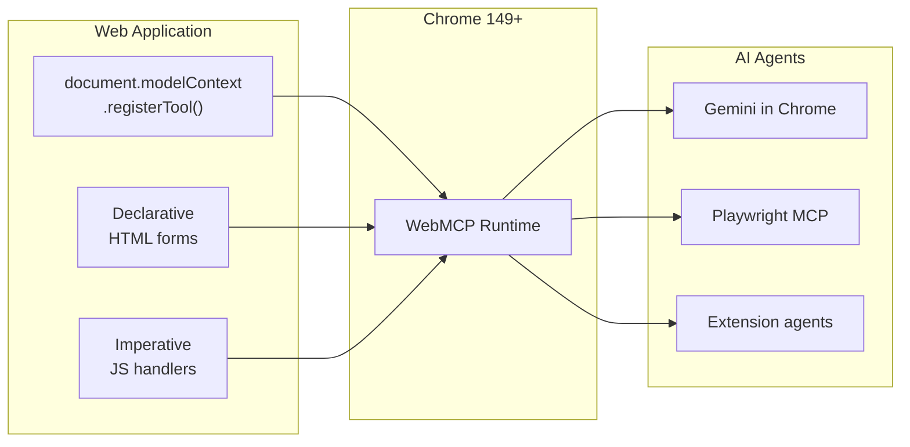
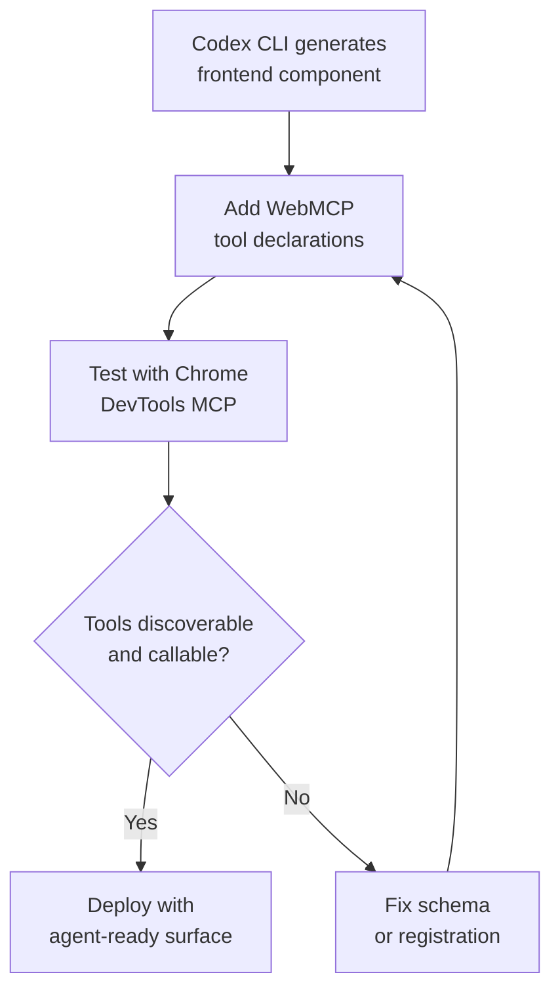

# WebMCP and Codex CLI: Building Agent-Ready Web Applications with Chrome's Browser-Tool Standard


---

Every browser-based AI agent today operates through the same fragile loop: read pixels or DOM nodes, guess what the interface means, plan a click sequence, hope nothing shifts, and pray the form submits. WebMCP — a proposed W3C open web standard co-developed by Google and Microsoft — replaces that guesswork with declared, machine-callable tools exposed directly through the browser API[^1][^2]. For Codex CLI developers building and testing web applications, this changes the relationship between the agent that writes frontend code and the agent that later consumes it.

## What WebMCP actually is

WebMCP extends the Model Context Protocol concept into the browser runtime. Where MCP servers today run as sidecar processes that Codex CLI discovers via `config.toml`, WebMCP tools live inside the web page itself and are registered through a new `document.modelContext` API[^3].

A website opts in by calling `document.modelContext.registerTool()` with a name, natural-language description, JSON Schema for inputs, and an `execute` handler[^4]. Any AI agent running inside the browser — whether Gemini in Chrome, an extension-based agent, or a headless Playwright session — can discover and call these tools instead of scraping the DOM.



The origin trial launched in Chrome 149[^5]. Chrome 146 shipped a flag-gated implementation (`chrome://flags/#enable-webmcp-testing`) for local development[^6]. Major consumer brands including Expedia, Booking.com, Shopify, and Instacart are already experimenting with the standard[^5].

## Two APIs: declarative and imperative

WebMCP offers two registration paths, and most real applications will use both.

### Declarative: annotated HTML forms

Standard HTML forms gain four attributes that turn them into agent-callable tools[^7]:

```html
<form toolname="search_flights"
      tooldescription="Search for available flights between two airports"
      toolautosubmit>
  <input name="origin"
         toolparamdescription="IATA airport code for departure"
         required />
  <input name="destination"
         toolparamdescription="IATA airport code for arrival"
         required />
  <input name="date" type="date"
         toolparamdescription="Departure date in YYYY-MM-DD format"
         required />
  <button type="submit">Search</button>
</form>
```

The `toolautosubmit` attribute permits agents to submit without waiting for user review. Without it, the browser populates fields visually and pauses for human confirmation — a useful safety default for destructive operations[^7].

### Imperative: JavaScript tool registration

When the interaction is not a form — a React modal, a Vue drawer, a custom state machine — the imperative API provides full control[^4]:

```javascript
document.modelContext.registerTool({
  name: 'toggle_layer',
  description: 'Control pizza layers (sauce, cheese). Use add, remove, or toggle.',
  inputSchema: {
    type: 'object',
    properties: {
      layer: { type: 'string', enum: ['sauce-layer', 'cheese-layer'] },
      action: { type: 'string', enum: ['add', 'remove', 'toggle'] },
    },
    required: ['layer'],
  },
  execute: async ({ layer, action }) => {
    await toggleLayer(layer, action);
    return `Performed ${action || 'toggle'} on layer: ${layer}`;
  },
});
```

Tools can be unregistered via `AbortController`, discovered cross-origin with `document.modelContext.getTools({ fromOrigins: ['https://partner.org'] })`, and monitored for changes through a `toolchange` event listener[^4].

> **Deprecation note:** `navigator.modelContext` was deprecated in Chrome 150 in favour of `document.modelContext`[^4]. If you are following older tutorials, update accordingly.

## How WebMCP differs from Playwright MCP and Chrome DevTools MCP

Codex CLI developers already have two browser-facing MCP servers available. WebMCP occupies a different layer[^8][^9].

| Dimension | Playwright MCP | Chrome DevTools MCP | WebMCP |
|---|---|---|---|
| **Runs where** | Sidecar process via stdio | Sidecar process via stdio | Inside the browser tab |
| **Configured in** | `config.toml` `[mcp_servers]` | `config.toml` `[mcp_servers]` | Web page JavaScript / HTML |
| **Primary model** | Drive UI via accessibility tree | Inspect via DevTools Protocol | Declared tools with JSON Schema |
| **Who provides tools** | Playwright library | Chrome | Website developer |
| **Failure mode** | Breaks when DOM changes | Limited to Chrome stable | Requires publisher opt-in |
| **Best for** | Cross-browser E2E testing | Performance profiling, debugging | Structured agent interactions |

The critical distinction: Playwright MCP and Chrome DevTools MCP let an *external agent* control a browser. WebMCP lets a *website publisher* expose capabilities to any agent. They are complementary, not competing.

## What this means for Codex CLI workflows

### 1. Building WebMCP-enabled applications

When Codex CLI generates frontend code, it can now scaffold WebMCP tool registrations alongside the UI components. An AGENTS.md directive makes this systematic:

```markdown
## WebMCP conventions

- Every user-facing form MUST include `toolname` and `tooldescription` attributes.
- Every `toolparamdescription` MUST describe the expected format, not just the field label.
- Destructive operations (delete, cancel, payment) MUST NOT use `toolautosubmit`.
- Imperative tools MUST be registered in a dedicated `webmcp-tools.js` module.
```

This creates a build-time contract: the agent that writes the form also declares the machine-readable interface, eliminating the gap between what humans see and what agents can call.

### 2. Testing with the Chrome origin trial

Codex CLI developers can test WebMCP tools locally today using Chrome's flag-gated implementation[^6]:

```bash
# Launch Chrome with WebMCP enabled for local testing
google-chrome --enable-features=WebMCP \
  --origin-trial-public-key=<your-trial-token> \
  http://localhost:3000
```

Combined with Chrome DevTools MCP, you can verify tool registration from within a Codex CLI session:

```bash
# In Codex CLI, after configuring Chrome DevTools MCP
codex "List all registered WebMCP tools on http://localhost:3000 \
       and verify their input schemas match the API contracts"
```

Google's Model Context Tool Inspector Extension provides a visual debugging surface for testing tool discovery and execution during development[^3].

### 3. Replacing brittle Playwright selectors with declared tools

Consider a checkout flow test. Today, Playwright MCP drives it through CSS selectors and accessibility labels:

```javascript
// Fragile: breaks when designers rename classes
await page.click('[data-testid="add-to-cart"]');
await page.fill('#quantity', '2');
await page.click('button:has-text("Checkout")');
```

With WebMCP, the same interaction becomes a structured tool call:

```javascript
// Stable: the website declares the interface contract
const tools = await document.modelContext.getTools();
const addToCart = tools.find(t => t.name === 'add_to_cart');
await document.modelContext.executeTool(addToCart, '{"product_id": "SKU-123", "quantity": 2}');
```

The website publisher owns the contract. When the UI changes, the tool definition stays stable — or it breaks visibly at the schema level rather than silently at the CSS selector level.

### 4. Cross-origin tool composition

WebMCP's `exposedTo` option and `getTools({ fromOrigins: [...] })` discovery mechanism enable a pattern where embedded services expose tools to a parent application[^4]. For Codex CLI developers building micro-frontends or widget-based architectures, this means agent-accessible capabilities can span iframe boundaries without brittle message passing:

```javascript
// Partner widget exposes a tool to the host origin
document.modelContext.registerTool(toolDef, {
  exposedTo: ['https://host-app.example.com']
});
```

## The security model

WebMCP implements two protection layers that Codex CLI developers should understand[^3]:

**Origin isolation.** Tools only function in origin-isolated documents. If `document.domain` has been set (a legacy cross-origin sharing pattern), WebMCP is disabled entirely. This prevents confused-deputy attacks where a tool registered on one origin is called in the context of another.

**Permissions policy.** Both APIs require the `tools` permissions policy, which defaults to `self`. Cross-origin iframes must receive explicit `allow="tools"` attributes. This mirrors the pattern Codex CLI developers already know from sandbox permission profiles — the default is restrictive, and access is granted explicitly.

```html
<!-- Grant WebMCP access to an embedded partner widget -->
<iframe src="https://partner.example.com/widget"
        allow="tools"
        loading="lazy"></iframe>
```

## Current limitations and honest assessment

WebMCP is promising but early. A May 2026 reality check from StudioMeyer noted several constraints[^6]:

- **No major agent consumes WebMCP tools directly on websites yet.** Claude Desktop, ChatGPT Operator, Gemini, and Perplexity still rely on DOM scraping or computer vision.
- **Chrome only.** Firefox and Safari have no public WebMCP timelines. Late 2026 is the projected date for Chrome to ship WebMCP enabled by default[^6].
- **Publisher opt-in required.** The standard depends on website developers registering tools — a chicken-and-egg problem until agent adoption drives demand.

⚠️ The performance claims circulated in some coverage (67% fewer errors, 45% better task completion compared to visual scraping) could not be traced to a primary source and should be treated as unverified.

For Codex CLI developers, the practical implication is clear: WebMCP is not yet a replacement for Playwright MCP or Chrome DevTools MCP in production testing workflows. It is an additive layer worth implementing now — the cost is low, and the payoff arrives when browser-native agents mature.

## The build-it-anyway case

The strongest argument for implementing WebMCP tools today is that Codex CLI already generates the code. Adding `toolname`, `tooldescription`, and `toolparamdescription` attributes to forms costs minutes per component. Writing imperative tool registrations for complex interactions adds a module per feature. Both create machine-readable documentation of your application's capabilities as a side effect — documentation that benefits human developers reading the codebase even before agents consume it.



The web is moving from pages designed for human eyes to surfaces designed for both human eyes and agent tools. Codex CLI developers who encode that duality into their AGENTS.md conventions and build pipelines now will find their applications ready when the agents arrive.

## Citations

[^1]: [WebMCP | AI on Chrome | Chrome for Developers](https://developer.chrome.com/docs/ai/webmcp) — Official WebMCP documentation.
[^2]: [What Is WebMCP? The Google I/O 2026 Web Standard That Changes AI Agent Tool Use](https://dev.to/soumyadeepdey/why-webmcp-is-the-most-important-thing-google-announced-at-io-2026-and-nobodys-talking-about-it-2edf) — Dev.to overview of the Google I/O announcement.
[^3]: [15 updates from Google I/O 2026: Powering the agentic web](https://developer.chrome.com/blog/chrome-at-io26) — Chrome team I/O 2026 announcements including WebMCP origin trial.
[^4]: [Imperative API | AI on Chrome | Chrome for Developers](https://developer.chrome.com/docs/ai/webmcp/imperative-api) — Official imperative API reference with `document.modelContext` examples.
[^5]: [Chrome 149 origin trial puts WebMCP in developers' hands at last](https://ppc.land/chrome-149-origin-trial-puts-webmcp-in-developers-hands-at-last/) — Chrome 149 origin trial launch coverage.
[^6]: [WebMCP Reality Check: Where the Spec Actually Stands](https://studiomeyer.io/en/blog/webmcp-reality-check-may-2026) — StudioMeyer's May 2026 assessment of WebMCP adoption and limitations.
[^7]: [Declarative API | AI on Chrome | Chrome for Developers](https://developer.chrome.com/docs/ai/webmcp/declarative-api) — Official declarative API reference with HTML form annotation attributes.
[^8]: [Browser-in-the-loop testing: Playwright + Chrome DevTools MCP + Codex CLI](https://codex.danielvaughan.com/2026/04/24/browser-in-the-loop-testing-playwright-chrome-devtools-mcp-codex-cli/) — Existing Codex CLI browser testing patterns for comparison.
[^9]: [Chrome's Built-In MCP Server: Use It in Your Workflow](https://www.computeleap.com/blog/chrome-built-in-mcp-server-native-mcp-v2-2026/) — Chrome native MCP capabilities overview.
