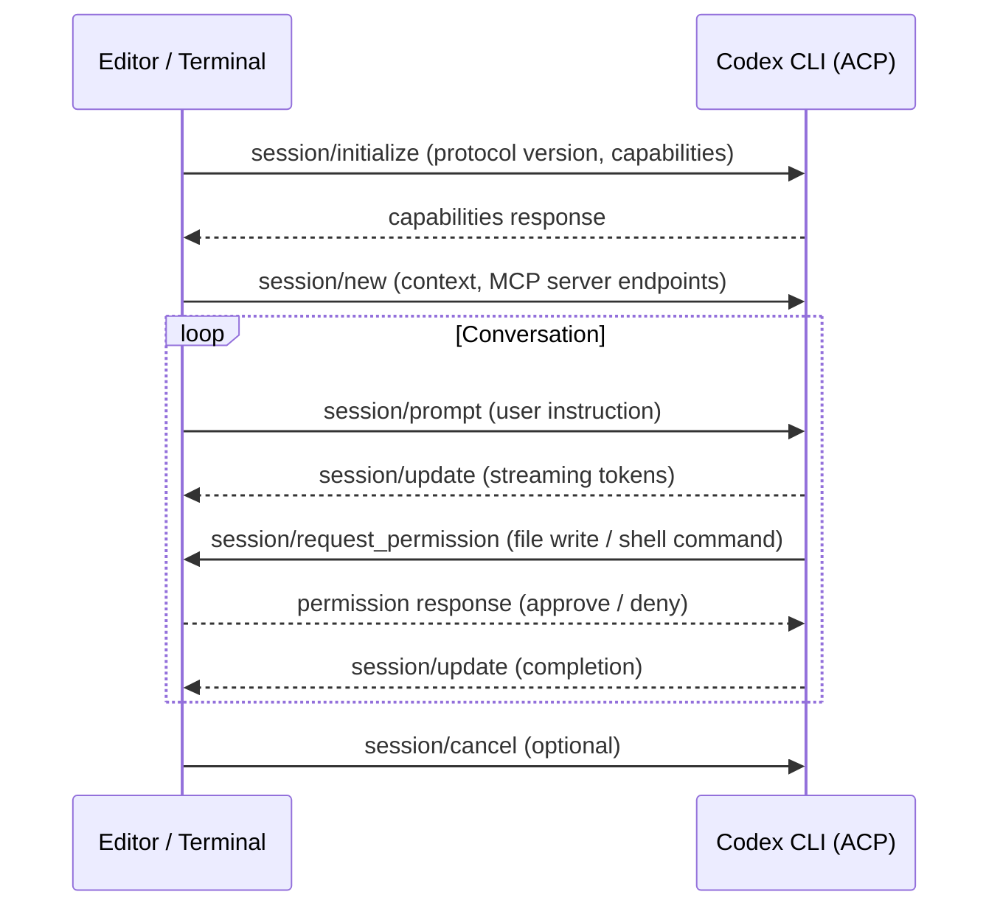
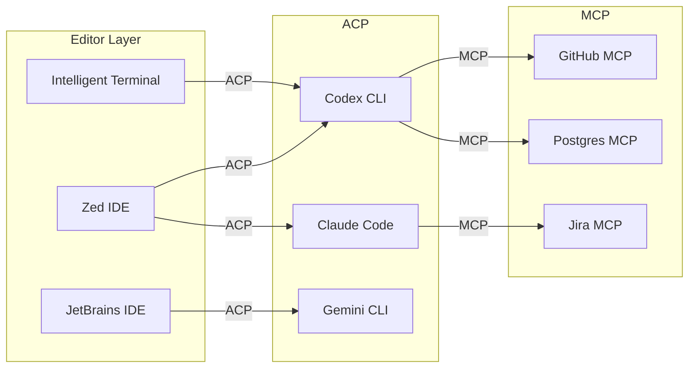
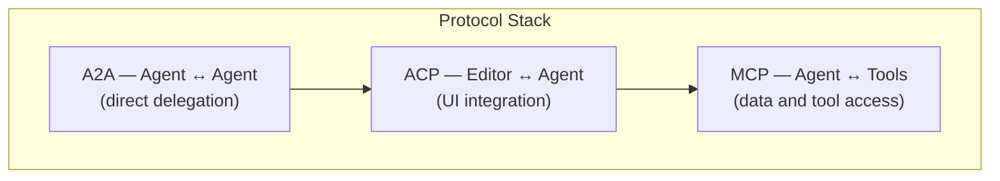

# The Agent Client Protocol Arrives in Microsoft Terminal: What ACP Means for Codex CLI and the Multi-Agent IDE Ecosystem


---

On 2 June 2026, Microsoft shipped Intelligent Terminal 0.1 — an experimental fork of Windows Terminal with a native agent pane that speaks the Agent Client Protocol (ACP)[^1]. The agent pane auto-detects whichever ACP-compatible CLI is installed on the machine: GitHub Copilot CLI by default, but also Claude Code, Codex CLI, and Gemini CLI[^2]. For Codex CLI developers, this is not merely another integration announcement. It marks the moment ACP crossed from niche open-source protocol to cross-vendor standard — adopted by JetBrains, Zed, Neovim, VS Code extensions, and now Microsoft's own terminal[^3].

This article explains what ACP is, how it differs from MCP, how Codex CLI implements it, and the practical configuration decisions senior developers face when running multiple agents side-by-side.

## ACP: The LSP Analogy, Applied to Agents

Before the Language Server Protocol (LSP), every editor needed bespoke integration code for every programming language. LSP solved this with a single JSON-RPC interface: any language server works in any compatible editor. ACP applies the same pattern to AI coding agents[^4].

The Agent Client Protocol standardises communication between code editors (or terminals) and coding agents — programs that use generative AI to autonomously modify code[^3]. Created by Zed Industries and developed openly with JetBrains, ACP reached protocol version 1 with over 25 compatible agents and multiple client implementations by early 2026[^5].

The core value proposition is straightforward: implement ACP once in your agent, and it works in Zed, JetBrains IDEs, Neovim, VS Code, Microsoft Intelligent Terminal, and any future client — without custom integration code for each surface.

## How ACP Works

### Transport and Message Format

ACP uses JSON-RPC 2.0 over stdio for local agents (the agent runs as a subprocess of the editor) and is developing HTTP/WebSocket transport for remote agents[^4]. Text content uses Markdown by default, and where possible the protocol reuses MCP's JSON representations, adding custom types only for agent-specific UI elements like diff display[^4].

### Lifecycle and Message Flow

An ACP session follows a structured lifecycle[^6]:



Five core message types orchestrate the interaction[^6]:

| Message | Direction | Purpose |
|---------|-----------|---------|
| `session/prompt` | Editor → Agent | Send user input |
| `session/update` | Agent → Editor | Stream response tokens |
| `session/cancel` | Editor → Agent | Halt mid-response |
| `session/request_permission` | Agent → Editor | Request approval for commands or file writes |
| `session/setModel` | Editor → Agent | Switch model mid-session |

The permission model is critical: agents cannot execute arbitrary commands. When Codex CLI needs to write a file or run a shell command, it sends a `session/request_permission` message — the editor surfaces the approval request in its UI, and the user decides[^6]. This maps naturally to Codex CLI's existing approval modes.

## ACP vs MCP: Complementary, Not Competing

Senior developers working with Codex CLI already know MCP (Model Context Protocol) well — it connects agents to external tools and data sources[^7]. ACP solves a different problem entirely:

| Dimension | ACP | MCP |
|-----------|-----|-----|
| **Purpose** | Agent ↔ editor communication | Agent ↔ tool/data access |
| **Direction** | Horizontal (editors to agents) | Vertical (agents to services) |
| **Transport** | JSON-RPC 2.0 over stdio | JSON-RPC 2.0 over stdio or streamable HTTP |
| **Streaming** | Real-time token streaming | Request-response |
| **Session state** | Built-in conversation history | Stateless per request |
| **Created by** | Zed Industries + JetBrains | Anthropic |

The two protocols compose naturally. During the `session/new` handshake, the editor passes available MCP server endpoints to the agent, so ACP and MCP wire up in a single initialisation step[^6]. In practice, this means your Codex CLI session in Zed or Intelligent Terminal automatically inherits the MCP servers configured in the editor — no double configuration required.



## Codex CLI's ACP Implementation

Codex CLI's ACP support is provided through a dedicated ACP server adapter (`codex-acp`) that bridges the OpenAI Codex runtime with ACP clients over stdio[^8]. The implementation handles the full ACP lifecycle:

- **`initialize`** and **`authenticate`** — negotiate protocol version and handle OpenAI authentication
- **`session/new`** and **`session/load`** — create or restore Codex sessions, inheriting `config.toml` profiles
- **`session/prompt`** — forward user instructions to the Codex agent loop
- **`session/cancel`** — halt mid-execution
- **`session/setMode`** and **`session/setModel`** — switch approval modes and models mid-conversation[^8]

Codex threads inherit your `config.toml` profiles, so you can use different reasoning effort levels per thread by switching models with the ACP `set_session_model()` method or the familiar `/model` slash command[^8].

### Configuration in Zed

Zed 1.0, which shipped on 29 April 2026 with parallel agents as its headline AI feature, runs Codex CLI alongside Claude Agent, Gemini CLI, and any other ACP-compatible agent in the same window[^9]:

```json
{
  "agent": {
    "profiles": {
      "codex": {
        "provider": "acp",
        "command": "codex",
        "args": ["--acp"]
      }
    }
  }
}
```

Each agent operates in its own thread, working concurrently on different parts of the codebase. The practical upshot: you can have Codex CLI running a goal-mode refactoring task in one pane whilst Claude Code reviews the changes in another[^9].

### Configuration in Neovim

For Neovim users, the `agentic.nvim` plugin provides ACP client support[^6]:

```lua
{
  "carlos-algms/agentic.nvim",
  config = function()
    require("agentic").setup({
      agents = {
        ["codex-cli"] = {
          command = "codex",
          args = {"--acp"}
        }
      }
    })
  end
}
```

### Configuration in Intelligent Terminal

Microsoft Intelligent Terminal auto-detects installed ACP agents. If Codex CLI is on your `PATH`, it appears in the agent selector. To switch from the default GitHub Copilot CLI to Codex, open Settings → Agent → Agent and model selection[^1].

The agent pane (toggled with `Ctrl+Shift+.`) maintains persistent context on your shell output. When a command fails, `Ctrl+Alt+.` opens the agent with full error context — a workflow that maps directly to Codex CLI's diagnostic capabilities[^1].

## Multi-Agent Terminal Workflows

The most interesting consequence of ACP standardisation is multi-agent composition. With Intelligent Terminal's session management panel (`Ctrl+Shift+/`), you can track active agents across tabs and switch between them[^1]. Combined with Zed's parallel agent threads, this enables workflows that were previously impossible:

### The Review-Implement-Verify Pattern

1. **Codex CLI** implements a feature in one thread (goal mode, `gpt-5.5`, `xhigh` reasoning effort)
2. **Claude Code** reviews the generated code in a parallel thread (optimised for critique)
3. **Gemini CLI** runs the test suite and reports coverage gaps in a third thread

Each agent speaks ACP to its host editor, and each uses MCP to access the project's GitHub, database, and CI systems. The agents do not communicate directly with each other — the developer orchestrates by reading outputs and directing follow-up prompts[^9].

### Practical Considerations

Multi-agent workflows introduce real operational concerns:

- **Token cost multiplication** — running three agents concurrently on the same codebase triples API spend. Use Codex CLI's `model_reasoning_effort` profiles to keep review passes cheap (`low` or `medium` effort) whilst reserving `xhigh` for implementation[^10].
- **File conflict risk** — two agents editing the same file simultaneously creates merge conflicts. Scope each agent to a distinct directory or use git worktrees to isolate workstreams.
- **Permission model alignment** — ACP's `session/request_permission` passes approval decisions to the editor, but each agent may also have its own approval configuration. Codex CLI's `config.toml` approval mode should match the trust level you expect from the ACP surface.

## The Protocol Stack: ACP + MCP + A2A

ACP and MCP are increasingly joined by a third protocol: Google's Agent-to-Agent (A2A) protocol for direct agent-to-agent communication[^7]. Together, these three protocols form a layered stack:



For Codex CLI developers, the practical takeaway is that MCP remains the protocol for connecting to external tools (databases, APIs, file systems), ACP is the protocol for embedding Codex CLI inside editors and terminals, and A2A may eventually enable Codex CLI to delegate tasks directly to other agents without human intermediation[^7].

## What This Means for Your Workflow

If you are running Codex CLI exclusively from the terminal with `codex` or `codex exec`, ACP changes nothing about your daily workflow. The protocol matters when you want Codex CLI to function as a first-class citizen inside your editor:

1. **Install the ACP adapter** — `codex-acp` bridges Codex CLI's runtime to any ACP client[^8].
2. **Configure your editor** — add the Codex agent profile to Zed, Neovim, JetBrains, or Intelligent Terminal settings.
3. **Align permission models** — ensure your `config.toml` approval and sandbox modes match the trust level appropriate for the ACP client surface.
4. **Scope MCP servers** — decide whether MCP servers should be configured in the editor (passed via ACP handshake) or in Codex CLI's own `config.toml`. Avoid duplicating server definitions across both.

The ACP ecosystem is moving quickly. The protocol reached v0.13.6 on 5 June 2026[^3], JetBrains has published comprehensive ACP documentation for IntelliJ-family IDEs[^11], and VS Code extensions like `vscode-acp` now support Codex CLI alongside Claude, Copilot, Qwen, Gemini, and OpenCode[^12]. Microsoft's adoption in Intelligent Terminal confirms that ACP has graduated from experiment to infrastructure.

For senior developers already invested in Codex CLI's MCP ecosystem, ACP is the natural complement — MCP gives your agent tools, and ACP gives your agent a home in every editor.

## Citations

[^1]: Microsoft Developer Blog, "Announcing Intelligent Terminal 0.1," 2 June 2026. [https://devblogs.microsoft.com/commandline/announcing-intelligent-terminal-version-0-1/](https://devblogs.microsoft.com/commandline/announcing-intelligent-terminal-version-0-1/)

[^2]: TechTimes, "Microsoft Intelligent Terminal Ships at Build 2026: AI Agent Fork Leaves Mainline Terminal Alone," 4 June 2026. [https://www.techtimes.com/articles/317761/20260604/microsoft-intelligent-terminal-ships-build-2026-ai-agent-fork-leaves-mainline-terminal-alone.htm](https://www.techtimes.com/articles/317761/20260604/microsoft-intelligent-terminal-ships-build-2026-ai-agent-fork-leaves-mainline-terminal-alone.htm)

[^3]: Agent Client Protocol GitHub repository, "agent-client-protocol," accessed 10 June 2026. [https://github.com/agentclientprotocol/agent-client-protocol](https://github.com/agentclientprotocol/agent-client-protocol)

[^4]: Agent Client Protocol, "Introduction — Get Started," accessed 10 June 2026. [https://agentclientprotocol.com/get-started/introduction](https://agentclientprotocol.com/get-started/introduction)

[^5]: JetBrains, "Agent Client Protocol (ACP)," accessed 10 June 2026. [https://www.jetbrains.com/acp/](https://www.jetbrains.com/acp/)

[^6]: Morph, "Agent Client Protocol (ACP) Explained: ACP vs MCP, Editor Support, Setup," 2026. [https://www.morphllm.com/agent-client-protocol](https://www.morphllm.com/agent-client-protocol)

[^7]: Cisco Outshift, "MCP and ACP: Decoding the language of models and agents," 2026. [https://outshift.cisco.com/blog/ai-ml/mcp-acp-decoding-language-of-models-and-agents](https://outshift.cisco.com/blog/ai-ml/mcp-acp-decoding-language-of-models-and-agents)

[^8]: GitHub, "agentclientprotocol/codex-acp — ACP server implementation for Codex CLI," accessed 10 June 2026. [https://github.com/agentclientprotocol/codex-acp](https://github.com/agentclientprotocol/codex-acp)

[^9]: Codex Knowledge Base, "Codex CLI in Zed 1.0: Parallel Agents, ACP Integration, and Multi-Agent IDE Workflows," 5 May 2026. [https://codex.danielvaughan.com/2026/05/05/codex-cli-in-zed-parallel-agents-acp-integration-ide-workflows/](https://codex.danielvaughan.com/2026/05/05/codex-cli-in-zed-parallel-agents-acp-integration-ide-workflows/)

[^10]: OpenAI Developers, "Advanced Configuration — Codex," accessed 10 June 2026. [https://developers.openai.com/codex/config-advanced](https://developers.openai.com/codex/config-advanced)

[^11]: JetBrains, "Agent Client Protocol (ACP) — AI Assistant Documentation," accessed 10 June 2026. [https://www.jetbrains.com/help/ai-assistant/acp.html](https://www.jetbrains.com/help/ai-assistant/acp.html)

[^12]: GitHub, "formulahendry/vscode-acp — Agent Client Protocol client for VS Code," accessed 10 June 2026. [https://github.com/formulahendry/vscode-acp](https://github.com/formulahendry/vscode-acp)
