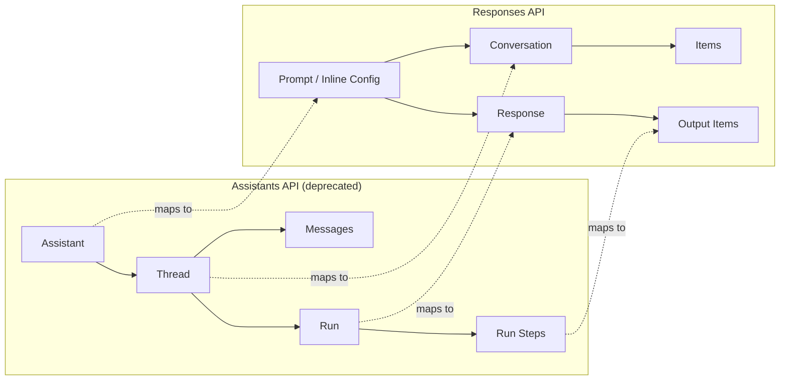

# Migrating from the Assistants API to the Responses API with Codex CLI: An Automated Refactoring Playbook for the August 2026 Shutdown


---

The Assistants API shuts down permanently on 26 August 2026 [^1]. Every `POST /v1/assistants`, `/v1/threads`, and `/v1/threads/{id}/runs` call will return an error. OpenAI has confirmed there is no extension [^2]. If your codebase still depends on the Assistants API, the clock is running — 77 days remain as of today.

This article shows how to use Codex CLI to systematically migrate an Assistants API integration to the Responses API, covering the object model mapping, the five mechanical refactoring patterns that Codex handles well, and the architectural changes that still need human judgement.

## Why This Migration Is Not Trivial

The Assistants API and the Responses API are architecturally different. The Assistants API was **stateful and asynchronous**: you created a Thread, appended Messages, started a Run, polled for completion, and retrieved results. The Responses API is **synchronous by default and stateless by default**, with explicit opt-in to state via the Conversations API [^3].

The key breaking changes are:

- **No polling loop**: Responses return immediately (or stream via SSE) [^3]
- **No server-side Assistants**: Configuration moves to dashboard-created Prompts, or is passed inline per request [^4]
- **Manual tool-call loops**: The Assistants API handled `requires_action` states internally; the Responses API requires your code to dispatch tool calls and re-submit results [^5]
- **Conversation history is not migrated**: OpenAI will not provide a tool to convert Threads to Conversations [^2]

For a simple chatbot wrapper, OpenAI estimates one to four engineering weeks. For a multi-tenant production system with stored Thread history, custom Assistant configurations per customer, and complex tool orchestration, it can take months [^2].

## The Object Model Mapping

Before touching code, understand what maps to what:

| Assistants API | Responses API | Notes |
|---|---|---|
| `Assistant` | `Prompt` (dashboard) or inline config | Prompts API also sunsetting 30 Nov 2026 [^6] |
| `Thread` | `Conversation` | Stores heterogeneous items, not just messages |
| `Run` | `Response` | Synchronous, no polling needed |
| `Run Step` | `Item` | Generalised: messages, tool calls, outputs |
| `Message` | `input_text` / `output_text` items | Content type changes |
| `tool_resources` | Inline `tools` parameter | No separate file attachment endpoints |



## Five Mechanical Refactoring Patterns for Codex CLI

These patterns are repetitive, AST-like transformations across many files — exactly where Codex CLI excels [^7].

### Pattern 1: Thread Creation to Conversation Creation

```python
# Before
thread = client.beta.threads.create(
    messages=[{"role": "user", "content": prompt}]
)

# After
conversation = client.conversations.create(
    items=[{"type": "message", "role": "user", "content": prompt}]
)
```

The Codex CLI prompt:

```bash
codex exec --approval-mode suggest \
  "Find every call to client.beta.threads.create() in this repo. \
   Refactor each to use client.conversations.create() with the \
   items parameter instead of messages. Preserve all metadata. \
   Run the test suite after each file change."
```

### Pattern 2: Run Polling to Direct Response

This is the most impactful change. The polling loop disappears entirely:

```python
# Before
run = client.beta.threads.runs.create(
    thread_id=thread.id, assistant_id=ASSISTANT_ID
)
while run.status in ("queued", "in_progress"):
    time.sleep(1)
    run = client.beta.threads.runs.retrieve(
        thread_id=thread.id, run_id=run.id
    )
messages = client.beta.threads.messages.list(thread_id=thread.id)

# After
response = client.responses.create(
    model="gpt-5.5",
    input=[{"role": "user", "content": prompt}],
    conversation={"id": conversation_id}
)
output = response.output  # Available immediately
```

### Pattern 3: Tool Dispatch Refactoring

The `requires_action` polling pattern becomes an explicit tool-call loop:

```python
# Before (implicit in Run polling)
if run.status == "requires_action":
    tool_outputs = handle_tool_calls(run.required_action)
    run = client.beta.threads.runs.submit_tool_outputs(
        thread_id=thread.id, run_id=run.id,
        tool_outputs=tool_outputs
    )

# After (explicit loop)
response = client.responses.create(
    model="gpt-5.5",
    input=input_items,
    tools=tool_definitions
)
while response.status == "incomplete":
    tool_results = dispatch_tool_calls(response.output)
    response = client.responses.create(
        model="gpt-5.5",
        input=tool_results,
        previous_response_id=response.id
    )
```

### Pattern 4: Assistant Configuration to Inline Parameters

```python
# Before: Assistant created once, referenced by ID
assistant = client.beta.assistants.create(
    model="gpt-4o", instructions="You are a helpful assistant.",
    tools=[{"type": "code_interpreter"}]
)

# After: Configuration passed inline per request
response = client.responses.create(
    model="gpt-5.5",
    instructions="You are a helpful assistant.",
    tools=[{"type": "code_interpreter"}],
    input=[{"role": "user", "content": prompt}]
)
```

### Pattern 5: Message Retrieval to Item Access

```python
# Before
messages = client.beta.threads.messages.list(thread_id=thread.id)
for msg in messages.data:
    print(msg.content[0].text.value)

# After
items = client.conversations.list_items(conversation_id=conv.id)
for item in items.data:
    if item.type == "message" and item.role == "assistant":
        print(item.content[0].text)
```

## The AGENTS.md Migration Anchor

Before running Codex CLI across your codebase, create an AGENTS.md with migration-specific constraints:

```markdown
## Migration Rules — Assistants API to Responses API

- Replace ALL `client.beta.threads` calls with `client.conversations` equivalents
- Replace ALL `client.beta.threads.runs` calls with `client.responses.create()`
- Remove ALL polling loops (`while run.status in ...`)
- Convert `assistant_id` references to inline `model` + `instructions` parameters
- Preserve existing error handling; wrap new synchronous calls in try/except
- Add `previous_response_id` chaining where multi-turn context is needed
- Run `pytest` after each file is modified — do not proceed if tests fail
- Do NOT delete Thread/conversation history migration code until data export is confirmed
```

This anchors every Codex CLI session to the same migration rules, preventing drift across multiple runs or developers [^8].

## The Codex Exec Migration Pipeline

For a systematic migration across a large codebase, use `codex exec` in a pipeline:

```bash
#!/usr/bin/env bash
set -euo pipefail

# Step 1: Inventory — find all Assistants API usage
codex exec --output-schema ./migration-inventory-schema.json \
  "Scan the entire codebase for Assistants API usage. \
   List every file and line that calls client.beta.threads, \
   client.beta.assistants, or client.beta.threads.runs. \
   Categorise each by migration pattern: thread-creation, \
   run-polling, tool-dispatch, assistant-config, or message-retrieval." \
  > migration-inventory.json

# Step 2: Migrate file by file
for file in $(jq -r '.[].file' migration-inventory.json | sort -u); do
  codex exec --approval-mode suggest \
    "Migrate all Assistants API calls in $file to the Responses API \
     following the rules in AGENTS.md. Run tests after changes."
done

# Step 3: Verify — confirm no Assistants API references remain
codex exec "Search the entire codebase for any remaining references to \
  client.beta.threads, client.beta.assistants, or the /v1/assistants \
  endpoint. Report findings."
```

This pipeline uses `--output-schema` for machine-parseable inventory and `--approval-mode suggest` for human review of each transformation [^9].

## What Codex CLI Cannot Do for You

Three aspects of this migration require human architectural decisions:

1. **Conversation history backfill**: Thread data must be exported before the shutdown. Codex can write the export script, but the decision about what to preserve is yours [^2].

2. **State management architecture**: The Responses API is stateless by default. If your application relied on server-side Thread persistence, you need to decide whether to use the Conversations API, manage state client-side, or adopt a different persistence layer entirely [^3].

3. **Prompt lifecycle strategy**: The Prompts API (the replacement for Assistants) is itself sunsetting on 30 November 2026 [^6]. ⚠️ This means inline configuration — passing `model`, `instructions`, and `tools` directly in each `responses.create()` call — is the more durable pattern. Codex CLI can refactor to either approach, but the strategic choice is yours.

## A PostToolUse Hook for Migration Safety

Add a hook that flags any accidentally introduced Assistants API calls during development:

```json
{
  "PostToolUse": [
    {
      "command": "grep -rn 'client.beta.threads\\|client.beta.assistants\\|/v1/assistants\\|/v1/threads' --include='*.py' .",
      "on_match": "warn",
      "message": "Assistants API reference detected — migration incomplete"
    }
  ]
}
```

This acts as a guardrail during the transition period, catching regressions before they reach production [^10].

## Timeline Recommendation

| Week | Action |
|---|---|
| Now | Run inventory scan; create AGENTS.md migration anchor |
| Week 1–2 | Migrate mechanical patterns (1–5) with Codex CLI |
| Week 3 | Refactor state management; export Thread history |
| Week 4 | Integration testing; remove Assistants API SDK imports |
| By 26 Aug | Production cutover; monitor for regressions |

## Citations

[^1]: OpenAI, "Assistants API beta deprecation — August 26, 2026 sunset," OpenAI Developer Community, 2025. [https://community.openai.com/t/assistants-api-beta-deprecation-august-26-2026-sunset/1354666](https://community.openai.com/t/assistants-api-beta-deprecation-august-26-2026-sunset/1354666)

[^2]: OpenAI, "Assistants migration guide," OpenAI API Documentation, 2026. [https://developers.openai.com/api/docs/assistants/migration](https://developers.openai.com/api/docs/assistants/migration)

[^3]: OpenAI, "Migrate to the Responses API," OpenAI API Documentation, 2026. [https://developers.openai.com/api/docs/guides/migrate-to-responses](https://developers.openai.com/api/docs/guides/migrate-to-responses)

[^4]: OpenAI, "Create a model response," OpenAI API Reference, 2026. [https://developers.openai.com/api/reference/resources/responses/methods/create](https://developers.openai.com/api/reference/resources/responses/methods/create)

[^5]: OpenAI, "Using tools," OpenAI API Documentation, 2026. [https://developers.openai.com/api/docs/guides/tools](https://developers.openai.com/api/docs/guides/tools)

[^6]: OpenAI, "Deprecations," OpenAI API Documentation, 2026. [https://developers.openai.com/api/docs/deprecations](https://developers.openai.com/api/docs/deprecations)

[^7]: OpenAI, "Refactor your codebase," Codex Use Cases, 2026. [https://developers.openai.com/codex/use-cases/refactor-your-codebase](https://developers.openai.com/codex/use-cases/refactor-your-codebase)

[^8]: Wafula et al., "Impact of AGENTS.md on Coding Agent Efficiency," arXiv:2601.20404, ICSE 2026. [https://arxiv.org/abs/2601.20404](https://arxiv.org/abs/2601.20404)

[^9]: OpenAI, "Non-interactive mode," Codex CLI Documentation, 2026. [https://developers.openai.com/codex/noninteractive](https://developers.openai.com/codex/noninteractive)

[^10]: OpenAI, "Hooks," Codex CLI Documentation, 2026. [https://developers.openai.com/codex/hooks](https://developers.openai.com/codex/hooks)
