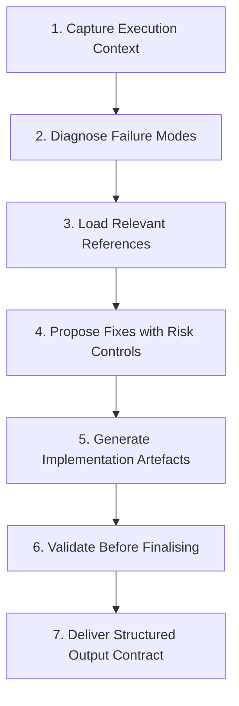

# Codex CLI for Terraform and Infrastructure as Code: The MCP Server, TerraShark, and Agent-Driven IaC Workflows


---

Infrastructure as code shipped a decade ago as the answer to snowflake servers. In 2026, the question has shifted: who writes the IaC? For a growing number of platform engineering teams, the answer is a coding agent backed by structured skills and live registry data. This article maps the practical integration surface between Codex CLI and the Terraform ecosystem — from HashiCorp's official MCP server through community skills that suppress hallucinations, to `codex exec` pipelines that audit drift in CI.

## The Hallucination Problem with IaC

LLMs hallucinate Terraform resource types and attribute names at rates that would be merely annoying in application code but catastrophic in infrastructure definitions[^1]. The TerraFormer paper (January 2026) documented that state-of-the-art models "struggle with Terraform synthesis, often hallucinating resource types and attribute names"[^2]. Unguided output tends to fail in predictable ways: hardcoded values, monolithic files, permissive IAM policies, missing encryption, and no automated tests or policy checks[^3].

The root cause is straightforward. HCL is a domain-specific language with a comparatively small training corpus relative to Python or TypeScript. Provider schemas change with every release — the AWS provider alone exposes over 1,300 resource types — and an LLM trained six months ago will confidently generate attributes that no longer exist[^4].

Codex CLI cannot solve this alone. What it can do is wire together three layers that collectively ground the agent in current, validated data: the Terraform MCP server for live registry access, structured skills for failure-mode diagnosis, and sandbox-enforced validation pipelines.

## Layer 1: The HashiCorp Terraform MCP Server

HashiCorp ships an official MCP server that gives any MCP-compatible client — including Codex CLI — real-time access to the Terraform Registry[^5]. The server exposes tools across five categories:

| Category | Key Tools | Purpose |
|----------|-----------|---------|
| **Registry** | `search_providers`, `get_provider_details`, `get_latest_provider_version` | Live provider documentation lookup |
| **Modules** | `search_modules`, `get_module_details`, `get_latest_module_version` | Verified module discovery |
| **Policy** | `search_policies`, `get_policy_details` | Sentinel governance policies |
| **Workspace** | `list_workspaces`, `create_workspace`, `create_run` | HCP Terraform / TFE operations |
| **Variables** | `list_variable_sets`, `create_workspace_variable` | Variable and tag management |

The server supports dual transports — stdio for local coding tools and Streamable HTTP for network deployments — with production security controls including CORS, TLS, and rate limiting[^6].

### Wiring it into Codex CLI

Add the server to your `config.toml`:

```toml
[mcp_servers.terraform]
command = "npx"
args = ["-y", "@hashicorp/terraform-mcp-server"]

[mcp_servers.terraform.env]
# For HCP Terraform workspace operations (optional)
TFC_TOKEN = "env:TFC_TOKEN"
```

For teams using HCP Terraform or Terraform Enterprise, the workspace management tools unlock agent-driven operations: listing organisations and projects, creating workspaces with variables, triggering runs, and inspecting plan/apply output — all from within a Codex session[^7].

To scope tool access, use `enabled_tools` to expose only the registry tools in read-only profiles:

```toml
[mcp_servers.terraform]
command = "npx"
args = ["-y", "@hashicorp/terraform-mcp-server"]
enabled_tools = [
  "search_providers",
  "get_provider_details",
  "get_latest_provider_version",
  "search_modules",
  "get_module_details",
  "search_policies"
]
```

This prevents an agent in `suggest` mode from accidentally creating workspaces or triggering runs.

> **Note:** The Terraform MCP server is currently in beta[^5]. Test thoroughly before using workspace-mutation tools in production pipelines.

## Layer 2: TerraShark — Failure-Mode-First IaC Skills

The Terraform MCP server solves the *data freshness* problem. It does not solve the *reasoning* problem — an agent can look up the correct attribute names and still produce a monolithic, insecure module with hardcoded credentials.

TerraShark is an open-source skill (MIT-licensed) designed specifically for the ways AI agents fail at infrastructure code[^8]. Its core `SKILL.md` is a 79-line operational workflow costing approximately 600 tokens on activation — roughly 7x more token-efficient than competing skills[^9].

### The Seven-Step Diagnostic Workflow

TerraShark enforces a structured sequence before generating any HCL:



Each response includes assumptions, remediation choices, tradeoffs, validation steps, and rollback notes[^8]. The skill ships 18 focused reference files loaded on demand — covering state safety, migration playbooks, provider-specific guidance, and compliance mappings for ISO 27001, SOC 2, FedRAMP, GDPR, PCI DSS, and HIPAA[^9].

### Installing TerraShark for Codex CLI

Clone the skill into your project and reference it from `AGENTS.md`:

```bash
git clone https://github.com/LukasNiessen/terrashark.git .terrashark
```

Then in your repository's `AGENTS.md`:

```markdown
## Infrastructure as Code

When working with Terraform or OpenTofu files:
- Follow the workflow defined in `.terrashark/SKILL.md`
- Always diagnose failure modes before generating HCL
- Load only the reference files relevant to identified risks
- Every module must include a validation step before finalising
```

The key insight is that TerraShark teaches the model *how to think* about infrastructure problems through diagnostic prompts rather than dumping reference material upfront[^9].

## Layer 3: Pulumi Agent Skills

For teams using Pulumi rather than Terraform — or migrating between the two — Pulumi ships a dedicated Agent Skills package that follows the open Agent Skills specification[^10]. Three skill groups are available:

- **Migration Skills** — Full Terraform-to-Pulumi migration workflow, including state translation, provider version alignment, and iterative `pulumi preview` convergence[^10]
- **Authoring Skills** — Covers Pulumi ESC for centralised secrets, OIDC credential setup, environment composition, and program integration[^10]
- **Delegation Skills** — Invocable via slash commands in Codex CLI sessions[^10]

Install via the universal Agent Skills CLI:

```bash
npx skills add pulumi/agent-skills --skill terraform-migration -a codex
npx skills add pulumi/agent-skills --skill authoring -a codex
```

Once installed, skills activate automatically based on context. Ask the agent to help migrate a Terraform project and it draws on the migration skill's workflow; debug resource recreation issues and the best practices skill checks for missing aliases[^10].

## Practical Workflow: Agent-Driven Drift Detection in CI

Combining the MCP server, a structured AGENTS.md, and `codex exec` produces a drift detection pipeline that runs in CI without human intervention:


```yaml
# .github/workflows/drift-check.yml
name: Terraform Drift Detection
on:
  schedule:
    - cron: '0 6 * * 1-5'  # Weekday mornings

jobs:
  drift:
    runs-on: ubuntu-latest
    steps:
      - uses: actions/checkout@v4

      - uses: openai/codex-action@v1
        with:
          codex_api_key: ${{ secrets.OPENAI_API_KEY }}
          approval_mode: full-auto
          sandbox_mode: workspace-write
          prompt: |
            Run terraform init and terraform plan -detailed-exitcode
            for each environment in environments/.
            For any environment with drift (exit code 2):
            1. Identify the drifted resources
            2. Classify each as intentional (tagged manual-override)
               or unintentional
            3. For unintentional drift, generate a remediation PR
            Output a JSON summary with environment, resource_address,
            drift_type, and recommended_action for each finding.
          output_schema: |
            {
              "type": "array",
              "items": {
                "type": "object",
                "properties": {
                  "environment": {"type": "string"},
                  "resource_address": {"type": "string"},
                  "drift_type": {"type": "string"},
                  "recommended_action": {"type": "string"}
                }
              }
            }
```


The structured `--output-schema` ensures machine-readable output regardless of model verbosity[^11]. The `codex-action` drops sudo privileges by default and runs in an isolated sandbox, limiting blast radius[^12].

## AGENTS.md Patterns for IaC Repositories

A well-structured `AGENTS.md` for an infrastructure repository differs materially from one written for application code. IaC guardrails must encode safety invariants that the agent cannot reason about from context alone:

```markdown
# AGENTS.md — Infrastructure Repository

## Hard Rules
- NEVER use `danger-full-access` sandbox mode
- NEVER hardcode credentials, access keys, or tokens in .tf files
- NEVER create IAM policies with `"Action": "*"` or `"Resource": "*"`
- ALWAYS use variables for environment-specific values
- ALWAYS include `prevent_destroy = true` on stateful resources

## Terraform Conventions
- One module per logical service boundary
- Pin provider versions to minor: `~> 5.80`
- Pin module versions to exact: `= 3.2.1`
- Backend configuration lives in `backend.tf`, never inline
- Use `terraform validate` and `tflint` before committing

## Testing Requirements
- Run `terraform validate` on every modified module
- Run `terraform plan` in a throwaway workspace before applying
- Use `checkov` or `tfsec` for static security analysis

## MCP Server Usage
- Use `search_providers` to verify resource types before writing them
- Use `get_provider_details` to confirm attribute names
- Use `search_policies` to find relevant Sentinel policies
- Do NOT use `create_workspace` or `create_run` without explicit approval
```

Research shows that developer-written `AGENTS.md` files improve task success rates by approximately 4% and reduce agent-generated bugs by 35–55%[^13]. For infrastructure code — where a single misplaced attribute can expose a database to the internet — that reduction in bugs translates directly to reduced blast radius.

## Sandbox Configuration for IaC Workflows

Terraform workflows require careful sandbox tuning. The agent needs to execute `terraform init`, `terraform validate`, and `terraform plan` — each of which requires network access for provider downloads and state backend communication:

```toml
[profiles.iac]
approval_policy = "auto-edit"
sandbox_mode = "workspace-write"

[profiles.iac.sandbox_workspace_write]
network_access = true
writable_roots = [".terraform", "terraform.tfstate.d"]

[profiles.iac.features.network_proxy]
enabled = true
domains = [
  "registry.terraform.io",
  "releases.hashicorp.com",
  "*.amazonaws.com",
  "app.terraform.io"
]
```

The domain allowlist is critical. Without it, a compromised provider or malicious prompt injection could exfiltrate state files — which frequently contain secrets — to an attacker-controlled endpoint[^14]. The `writable_roots` constraint prevents the agent from modifying files outside the Terraform working directory.

## Model Selection for IaC Tasks

Not all models handle HCL equally well. GPT-5.5 leads on complex multi-provider configurations with its 400K context window, but for straightforward single-module generation, GPT-5.4 produces comparable results at lower cost[^15]. Codex-Spark is unsuitable for IaC — the latency advantage is irrelevant for plan-heavy workflows, and its smaller context struggles with large state files.

For `codex exec` pipelines, specify the model explicitly:

```bash
codex exec --model gpt-5.5 --full-auto \
  --prompt "Review the Terraform plan output in plan.txt and identify security risks"
```

## The Token Efficiency Question

Pulumi's engineering blog raises a valid point: general-purpose programming languages (TypeScript, Python, Go) are more token-efficient for LLMs than HCL because of richer training data and better model familiarity[^16]. Teams starting greenfield infrastructure projects should consider whether Pulumi's TypeScript/Python/Go SDKs produce more reliable agent output than Terraform's HCL.

For existing Terraform estates, migration cost almost certainly outweighs the token efficiency gain. The practical answer is to layer grounding tools — the MCP server for live data, TerraShark for diagnostic reasoning, and `AGENTS.md` for hard guardrails — onto the existing HCL workflow.

## What This Stack Cannot Do

Three limitations remain unresolved:

1. **State file sensitivity** — Terraform state frequently contains plaintext secrets. Running `terraform show` inside an agent session exposes those secrets to the model's context window and potentially to OpenAI's API logs. Use remote state with encryption and avoid piping raw state into agent prompts.

2. **Apply-time side effects** — `terraform apply` creates real infrastructure with real cost. No amount of sandbox configuration makes an unreviewed apply safe. Keep `terraform apply` behind a human approval gate or a dedicated CI pipeline with plan review.

3. **Provider plugin trust** — `terraform init` downloads and executes arbitrary provider binaries. The Codex sandbox constrains filesystem access but cannot inspect the behaviour of downloaded Go binaries. Pin provider versions and use a provider mirror for supply chain control. ⚠️

## Citations

[^1]: TerraShark GitHub repository — "LLMs hallucinate a lot with Terraform." [https://github.com/LukasNiessen/terrashark](https://github.com/LukasNiessen/terrashark)

[^2]: Ruan, Y. et al. (2026). "TerraFormer: Automated Infrastructure-as-Code with LLMs Fine-Tuned via Policy-Guided Verifier Feedback." arXiv:2601.08734. [https://arxiv.org/html/2601.08734v1](https://arxiv.org/html/2601.08734v1)

[^3]: Ramblings, SJ. (2026). "Is Infrastructure as Code Dying? AI Agents vs Terraform & HCL." [https://sjramblings.io/is-infrastructure-as-code-the-next-abstraction-to-fall/](https://sjramblings.io/is-infrastructure-as-code-the-next-abstraction-to-fall/)

[^4]: Terraform Registry — AWS Provider. Provider exposes 1,300+ resource types across 300+ services. [https://registry.terraform.io/providers/hashicorp/aws/latest](https://registry.terraform.io/providers/hashicorp/aws/latest)

[^5]: HashiCorp. "Terraform MCP Server Overview." HashiCorp Developer Documentation. [https://developer.hashicorp.com/terraform/mcp-server](https://developer.hashicorp.com/terraform/mcp-server)

[^6]: HashiCorp. "Deploy the Terraform MCP Server." HashiCorp Developer Documentation. [https://developer.hashicorp.com/terraform/mcp-server/deploy](https://developer.hashicorp.com/terraform/mcp-server/deploy)

[^7]: HashiCorp. "Terraform MCP Server Reference." Full tool listing including workspace and run management. [https://developer.hashicorp.com/terraform/mcp-server/reference](https://developer.hashicorp.com/terraform/mcp-server/reference)

[^8]: Niessen, Lukas. "TerraShark: How I Fixed LLM Hallucinations in Terraform Without Burning All My Tokens." Medium, 2026. [https://lukasniessen.medium.com/terrashark-how-i-fixed-llm-hallucinations-in-terraform-without-burning-all-my-tokens-6c52a9910234](https://lukasniessen.medium.com/terrashark-how-i-fixed-llm-hallucinations-in-terraform-without-burning-all-my-tokens-6c52a9910234)

[^9]: TerraShark — Terraform Skill website. Feature comparison and token efficiency benchmarks. [https://terraformskill.com/](https://terraformskill.com/)

[^10]: Pulumi. "Agent Skills: Best Practices and More for AI Coding Assistants." Pulumi Blog, 2026. [https://www.pulumi.com/blog/pulumi-agent-skills/](https://www.pulumi.com/blog/pulumi-agent-skills/)

[^11]: OpenAI. "Codex CLI Reference — codex exec." Structured output via `--output-schema`. [https://developers.openai.com/codex/cli/reference](https://developers.openai.com/codex/cli/reference)

[^12]: OpenAI. "Codex GitHub Action." Security defaults including sudo removal. [https://developers.openai.com/codex/github-action](https://developers.openai.com/codex/github-action)

[^13]: OpenAI. "Custom Instructions with AGENTS.md." Developer-written files improve success rates by ~4% and reduce bugs 35–55%. [https://developers.openai.com/codex/guides/agents-md](https://developers.openai.com/codex/guides/agents-md)

[^14]: OpenAI. "Agent Approvals & Security." Sandbox and network access configuration. [https://developers.openai.com/codex/agent-approvals-security](https://developers.openai.com/codex/agent-approvals-security)

[^15]: OpenAI. "Codex Models." GPT-5.5 capabilities and context window. [https://developers.openai.com/codex/models](https://developers.openai.com/codex/models)

[^16]: Pulumi. "Token Efficiency vs Cognitive Efficiency: Choosing IaC for AI Agents." Pulumi Blog, 2026. [https://www.pulumi.com/blog/token-efficiency-vs-cognitive-efficiency-choosing-iac-for-ai-agents/](https://www.pulumi.com/blog/token-efficiency-vs-cognitive-efficiency-choosing-iac-for-ai-agents/)
