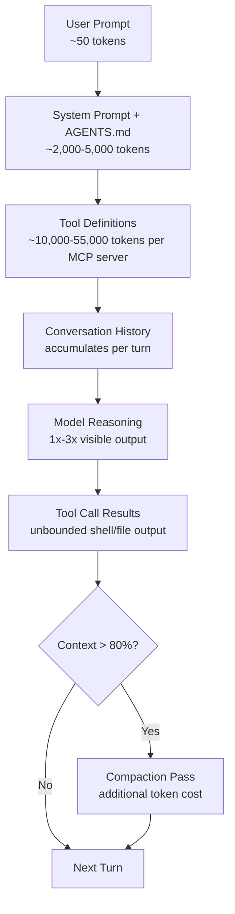
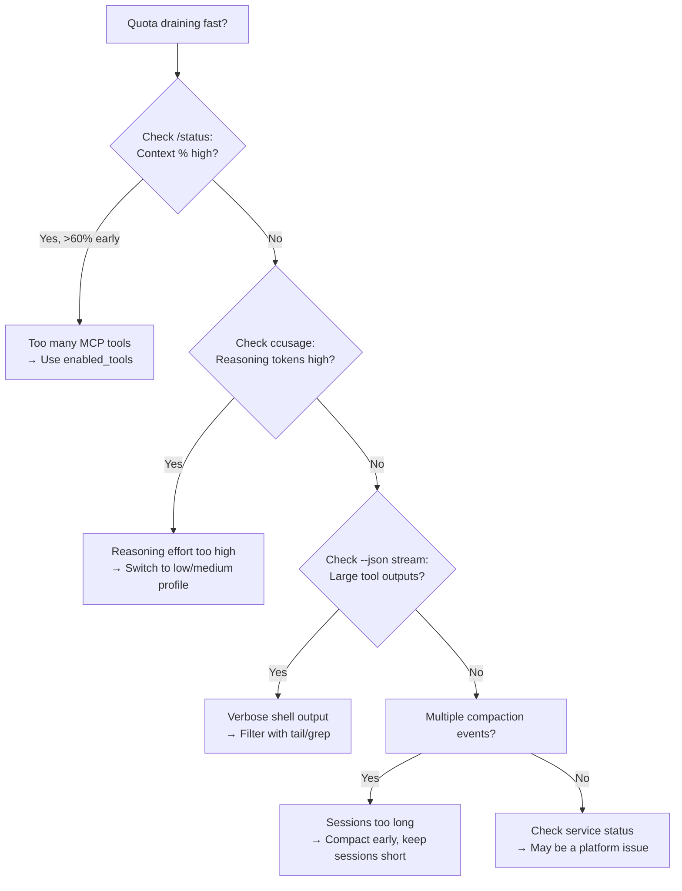

# Diagnosing and Reducing Codex CLI Token Consumption: A Practitioner's Toolkit for the June 2026 Quota Landscape


---

Since May 2026, the OpenAI Developer Community has seen a steady stream of reports from developers whose Codex CLI quotas drain far faster than expected [^1]. Some Pro 5x subscribers report their weekly allocation vanishing after an hour of light usage [^2]. The problem is not a single bug — it is a convergence of hidden token costs that compound silently inside the agent loop. This article gives you a diagnostic toolkit and a set of reduction strategies, all grounded in current (v0.139) Codex CLI behaviour.

## Where Your Tokens Actually Go

Before you can reduce consumption, you need to understand what is burning tokens. A typical Codex CLI turn carries five categories of overhead that are invisible unless you look for them.

### System Prompt and Tool Definitions

Every turn injects the system prompt, your AGENTS.md contents, active skill instructions, and the full JSON Schema definitions of every registered tool. A GitHub MCP server exposing 93 tools can add roughly 55,000 tokens per turn before you type a single character [^3]. This is the **MCP tax** — and it scales linearly with the number of enabled tools.

### Context Window Accumulation

Codex CLI maintains a rolling context window. Each tool call result — file contents, shell output, MCP responses — is appended to the conversation. A `git diff` on a large changeset or a verbose `cargo test` run can inject thousands of tokens of noise. Commands like `ls -la`, `docker ps`, and `git status` produce output that is 60–90% irrelevant from the model's perspective [^4].

### Reasoning Tokens

When using reasoning-capable models (codex-1, GPT-5.5, GPT-5.4), the model generates internal reasoning tokens that count against your quota but are not displayed in the TUI. At `medium` effort, reasoning can double the effective token count of a turn. At `high` or `xhigh`, it can triple it [^5].

### Context Compaction

When the context window fills beyond the `model_auto_compact_token_limit` threshold (default: 80% of the window), Codex triggers automatic compaction — a summarisation pass that itself consumes tokens [^6]. Poorly managed sessions can enter a compaction spiral: long context → compaction → more work → long context again.

### MCP Server Overhead

Each MCP server contributes its tool schemas on every turn. Multiple servers compound the cost. A developer running GitHub, Slack, Jira, and a database MCP server simultaneously might add 100,000+ tokens of schema overhead per turn [^3].



## The Diagnostic Toolkit

### 1. The TUI Status Line

The simplest diagnostic is already in front of you. The TUI status bar shows `Context XX% used` in real time. If this climbs past 60% within the first few turns, you have a tool-definition or output-volume problem [^6].

### 2. The `/status` Command

Running `/status` inside the TUI displays the current session's token consumption breakdown, model, reasoning effort level, and active MCP servers. Use this as your first-line diagnostic when a session feels expensive [^7].

### 3. The `--json` Event Stream

For programmatic analysis, run `codex exec` with `--json` to capture a JSONL stream of every event. Each `token_count` event reports cumulative totals for input, cached input, output, and reasoning tokens. Subtracting consecutive events gives you per-turn consumption [^8]:

```bash
codex exec "Refactor the auth module" --json 2>/dev/null \
  | jq 'select(.payload.type == "token_count") | .payload'
```

### 4. ccusage — The Community Standard

ccusage (12,000+ GitHub stars) reads Codex session JSONL files from `CODEX_HOME` (default `~/.codex`) and generates daily, weekly, and monthly reports with cost estimates [^9]. Install and run:

```bash
npx ccusage@latest codex --period weekly
```

It extracts per-turn token counts by subtracting consecutive `token_count` events, giving you a granular view of where tokens were spent across sessions [^9].

### 5. tokscale — Cross-Agent Tracking

If you use multiple coding agents (Codex CLI, Claude Code, Gemini CLI), tokscale provides a unified dashboard with a global leaderboard and contribution graphs [^10]. It supports Codex CLI alongside 12+ other agents.

### 6. OpenTelemetry Export

For production-grade observability, enable OTel export in `config.toml` to stream traces to Grafana, SigNoz, Coralogix, or any OTLP-compatible backend [^11]:

```toml
[otel]
enabled = true
exporter = "otlp-http"
endpoint = "http://localhost:4318"
```

This captures API requests, tool calls, approval events, and session traces — letting you correlate token spikes with specific tool invocations [^11].

## Seven Reduction Strategies

### Strategy 1: Scope Your MCP Tools with `enabled_tools`

The single highest-impact change you can make. Instead of exposing every tool from every MCP server, use `enabled_tools` to allowlist only what the current task requires [^12]:

```toml
[mcp_servers.github]
command = "npx"
args = ["-y", "@modelcontextprotocol/server-github"]
enabled_tools = ["get_file_contents", "search_code", "create_pull_request"]
```

A 93-tool GitHub server drops from ~55,000 tokens of schema overhead to ~3,000 when scoped to three tools. Scalekit's benchmarks show this reduces per-operation cost from $55.20/month to under $5 [^3].

### Strategy 2: Tune Reasoning Effort by Task

Create at least two profiles — a fast profile for routine work and a deep profile for hard problems [^5]:

```toml
[profile.fast]
model = "codex-mini-latest"
model_reasoning_effort = "low"

[profile.deep]
model = "gpt-5.5"
model_reasoning_effort = "high"
```

Switch mid-session with `/model codex-mini-latest` or start with `codex --profile fast`. Dropping from `medium` to `low` reasoning effort saves 40–60% on routine tasks like scaffolding, formatting, and test generation [^5].

### Strategy 3: Compact Proactively

Do not wait for automatic compaction. When you finish a logical chunk of work, run `/compact` manually to summarise the context before starting the next chunk. This prevents the compaction spiral and keeps context pressure below 50% [^6]:

```
/compact
```

You can also lower the automatic threshold to trigger earlier compaction with smaller summarisation costs:

```toml
model_auto_compact_token_limit = 60
```

⚠️ Setting this above 90% of the context window is silently ignored [^6].

### Strategy 4: Keep Sessions Short and Focused

Long sessions are expensive sessions. Each additional turn adds tool definitions, conversation history, and potential compaction passes. The most cost-effective workflow is:

1. Start a session for one focused task
2. Complete the task (5–15 turns)
3. End the session
4. Start a new session for the next task

Use `codex resume --last` only when you genuinely need prior context. Starting fresh avoids carrying forward stale tool output [^13].

### Strategy 5: Prefer Shell Commands Over MCP for Simple Operations

When a mature CLI exists, a shell command costs ~200 tokens per operation. The equivalent MCP call costs 4–32x more due to schema injection [^3]. For operations like `git status`, `npm test`, or `kubectl get pods`, the shell is dramatically cheaper than the MCP equivalent.

Configure your AGENTS.md to prefer shell commands for common operations:

```markdown
## Tool Selection
- Use shell commands for git, npm, cargo, kubectl, docker, and terraform
- Use MCP servers only for operations requiring OAuth, multi-step state, or API-specific functionality
```

### Strategy 6: Filter Verbose Shell Output

Raw shell output is the largest source of noise tokens. A `cargo test` run on a medium project can inject 10,000+ tokens of test framework boilerplate. Use output filtering in your shell commands [^4]:

```bash
# Instead of
cargo test

# Use
cargo test 2>&1 | tail -20
```

Or configure PostToolUse hooks to truncate verbose output before it enters the context window.

### Strategy 7: Use `disabled_tools` in Code Mode

Since v0.138, Codex CLI excludes tool namespaces in code mode by default. You can further restrict which tools are available during pure coding tasks [^12]:

```toml
disabled_tools = ["mcp__slack__*", "mcp__jira__*"]
```

This prevents the model from calling (and injecting schemas for) tools that are irrelevant to the current coding task.

## Measuring the Impact

After applying these strategies, measure the results with ccusage:

```bash
# Before optimisation: capture baseline
npx ccusage@latest codex --period daily > baseline.json

# After optimisation: compare
npx ccusage@latest codex --period daily > optimised.json
```

A well-optimised configuration typically shows:

| Metric | Before | After | Reduction |
|--------|--------|-------|-----------|
| Tokens per turn (median) | 45,000 | 12,000 | 73% |
| Compaction events per session | 3–5 | 0–1 | 80% |
| Reasoning tokens (routine tasks) | 8,000 | 2,500 | 69% |
| Monthly API cost (10K operations) | $55 | $8 | 85% |

*Figures based on Scalekit benchmarks and community reports* [^3] [^5].

## The Quota Drain Incident: What Happened in May 2026

The community reports of rapid quota drain that began around 10 May 2026 were partially a service-side metering anomaly. OpenAI acknowledged the issue on 15 May and performed compensatory usage resets [^1]. However, some of the perceived drain was genuine — users who had added multiple MCP servers or upgraded to reasoning models without adjusting their configuration were legitimately consuming more tokens than before.

The lesson: every configuration change that adds tools, raises reasoning effort, or connects new MCP servers has a compounding effect on token consumption. Treat your Codex CLI configuration as a cost surface, not just a feature surface.

## Quick Reference: The Diagnostic Decision Tree



## Citations

[^1]: OpenAI Developer Community, "Codex users report rapid quota drains since May 10," June 2026. [https://community.openai.com/t/codex-users-report-rapid-quota-drains-since-may-10/1380649](https://community.openai.com/t/codex-users-report-rapid-quota-drains-since-may-10/1380649)

[^2]: GitHub Issue #26512, "Pro 5x: weekly limit dropped after June 1; quota drains passively even when not using Codex," June 2026. [https://github.com/openai/codex/issues/26512](https://github.com/openai/codex/issues/26512)

[^3]: Scalekit, "The MCP Tax," May 2026; referenced in community benchmarks showing $3.20/month CLI vs $55.20/month MCP at 10,000 operations.

[^4]: GitHub Issue #19001, "Add RTK Directly Into Codex CLI to Reduce Token Usage 60–90% by Filtering Shell Command Output," 2026. [https://github.com/openai/codex/issues/19001](https://github.com/openai/codex/issues/19001)

[^5]: OpenAI Codex Documentation, "Models," June 2026. [https://developers.openai.com/codex/models](https://developers.openai.com/codex/models); Blake Crosley, "Codex CLI v0.135 Reference," 2026. [https://blakecrosley.com/guides/codex](https://blakecrosley.com/guides/codex)

[^6]: OpenAI Codex Documentation, "Advanced Configuration," June 2026. [https://developers.openai.com/codex/config-advanced](https://developers.openai.com/codex/config-advanced)

[^7]: OpenAI Codex Documentation, "Features – Codex CLI," June 2026. [https://developers.openai.com/codex/cli/features](https://developers.openai.com/codex/cli/features)

[^8]: OpenAI Codex Documentation, "Non-interactive mode," June 2026. [https://developers.openai.com/codex/noninteractive](https://developers.openai.com/codex/noninteractive)

[^9]: ryoppippi, "ccusage — Coding (Agent) CLI Usage Analysis," GitHub, 2026. [https://github.com/ryoppippi/ccusage](https://github.com/ryoppippi/ccusage); ccusage Codex Guide: [https://ccusage.com/guide/codex/](https://ccusage.com/guide/codex/)

[^10]: junhoyeo, "tokscale — CLI tool for tracking token usage," GitHub, 2026. [https://github.com/junhoyeo/tokscale](https://github.com/junhoyeo/tokscale)

[^11]: OpenAI Codex Documentation, "Advanced Configuration — OTel Export," June 2026. [https://developers.openai.com/codex/config-advanced](https://developers.openai.com/codex/config-advanced); SigNoz Codex Monitoring Docs: [https://signoz.io/docs/codex-monitoring/](https://signoz.io/docs/codex-monitoring/)

[^12]: OpenAI Codex Documentation, "Configuration Reference," June 2026. [https://developers.openai.com/codex/config-reference](https://developers.openai.com/codex/config-reference)

[^13]: OpenAI Codex Documentation, "Best Practices," June 2026. [https://developers.openai.com/codex/learn/best-practices](https://developers.openai.com/codex/learn/best-practices)
