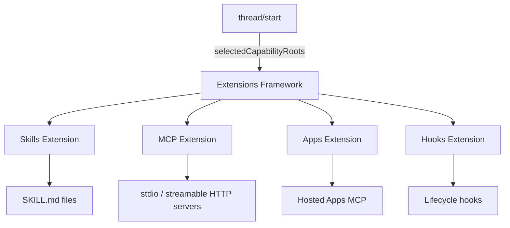
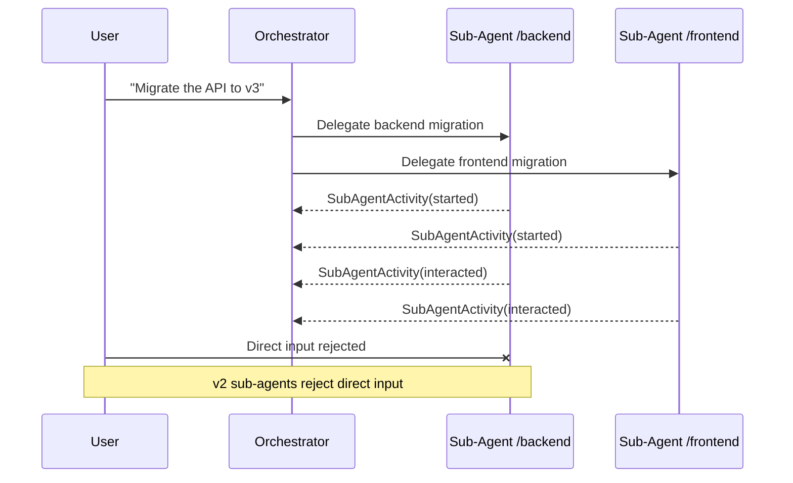

# Codex CLI v0.140 Alpha Signals: Extensions Unification, Multi-Agent v2 Path Tracking, and Python SDK Goal Routing


---

Less than twenty-four hours after v0.139.0 shipped code-mode web search and MCP schema fidelity improvements[^1], the first v0.140 alpha builds began landing. The 0.140.0-alpha.2 tag appeared on 10 June 2026[^2], carrying twenty-seven commits that reveal three architectural shifts the Codex CLI team is pursuing in parallel: a unified extensions API that abstracts skill, plugin, and MCP server discovery; a rewritten multi-agent v2 activity model built around canonical paths rather than legacy nicknames; and the first private goal-routing primitives in the Python SDK. None of these features are stable — they live behind alpha gates and internal API contracts — but they signal where the platform is heading, and understanding that direction is worth more than any single flag change.

This article traces each change, explains the engineering rationale from the merged pull requests, and identifies the configuration decisions that will follow once these features stabilise.

## The Extensions Unification

### The Problem: Four Discovery Paths

Codex CLI currently discovers capabilities through four separate mechanisms[^3]:

1. **Skills** — `SKILL.md` files resolved from the local filesystem, loaded contextually.
2. **MCP servers** — stdio or streamable HTTP processes declared in `config.toml` under `[mcp_servers]`.
3. **Plugins** — bundles containing skills, MCP servers, connectors, and hooks, installed via the marketplace or locally.
4. **Apps** — hosted integrations (GitHub, Slack, Google Drive) routed through OpenAI's app-server.

Each path has its own resolution logic, lifecycle management, and model-facing tool exposure. When Codex runs in a split-runtime architecture — where an orchestrator thread coordinates work across remote executors — the orchestrator cannot simply read the executor's filesystem to discover plugins. The executor owns the capabilities; the orchestrator needs a protocol-level abstraction to select and invoke them[^4].

### What Changed in v0.140

PR #27184 introduces `selectedCapabilityRoots` as an experimental field on the `thread/start` API[^4]:

```json
{
  "selectedCapabilityRoots": [
    {
      "id": "deploy-plugin@1",
      "location": {
        "type": "environment",
        "environmentId": "workspace",
        "path": "/opt/codex/plugins/deploy"
      }
    }
  ]
}
```

The root is intentionally untyped — it is not classified as a "plugin" or "skill" in the API. It can point at a standalone skill, a directory containing several skills, or a full plugin bundle. The skills extension discovers and exposes `SKILL.md` files beneath the root; later extensions will resolve MCP servers, connectors, and hooks from the same selection[^4].

PR #27191 takes the same approach for hosted Apps MCP: rather than wiring Apps MCP directly into the core runtime, it routes through the extensions framework[^5]. This means hosted tools follow the same discovery, lifecycle, and model-exposure path as local skills and plugins.



### Why This Matters

The unification has three practical consequences:

1. **Remote executors become first-class capability hosts.** A cloud Codex task can select plugins installed on its executor without the orchestrator needing filesystem access. This is the architectural prerequisite for Codex Cloud tasks to consume the same plugin ecosystem as local CLI sessions[^4].

2. **Plugin components can use heterogeneous runtimes.** A single plugin might contain a skill read from a filesystem, an HTTP MCP server that runs without an executor, and a stdio MCP server that needs a process environment. The extensions framework handles each through the appropriate runtime without the core needing to know the difference[^4].

3. **Extension API contracts are now tested.** PR #26835 adds explicit contract tests for the extension API surface[^6]. This signals that the team considers the extensions boundary stable enough to test against — a prerequisite for third-party extension development.

### Configuration Implications

For now, no user-facing configuration changes are required. The `selectedCapabilityRoots` field is experimental and not exposed through `config.toml`. When it stabilises, expect a new configuration surface for declaring capability roots that replace the current separate `[mcp_servers]`, skill path, and plugin installation mechanisms. The migration will likely be additive — existing configurations should continue to work through compatibility shims.

## Multi-Agent v2 Path-Based Activity Tracking

### The Problem: Legacy Nickname Events

Multi-agent v2 identifies agents by canonical paths — stable, deterministic identifiers derived from the agent's position in the orchestration tree[^7]. However, the tool handlers still emitted legacy collaboration events (`spawn_agent`, `send_message`, `followup_task`, `interrupt_agent`) built around nickname and role metadata[^7]. This created three problems:

- **App-server consumers** lacked a compact, path-based completion signal that behaved consistently across live events and replay.
- **The TUI** could not render bounded `/agent` status surfaces for v2 agents without loading full thread histories.
- **Analytics** had to reconcile two event vocabularies — path-based identification and nickname-based lifecycle — to produce coherent traces.

### What Changed

PR #27007 replaces the four legacy lifecycle emissions with a single `SubAgentActivity` event[^7]:

```json
{
  "type": "SubAgentActivity",
  "toolCallId": "call_abc123",
  "occurredAt": "2026-06-10T00:15:00Z",
  "threadId": "thread_xyz",
  "agentPath": "/orchestrator/backend-service",
  "kind": "started"
}
```

The `kind` field takes one of three values: `started`, `interacted`, or `interrupted`. This replaces the four separate event types with a single, path-addressed signal[^7].

The TUI's `/agent` command now lists running path-backed agents with summaries drawn from bounded local event buffers. Each summary is capped at 240 graphemes, the scan examines at most six recent items, only the last three wrapped lines are shown, and command output is omitted[^7]. This transforms `/agent` from a full-history load into a lightweight status check.

PR #27173 adds a complementary constraint: the app-server now rejects direct input to multi-agent v2 sub-agents[^8]. This enforces the architectural invariant that sub-agents receive work only through their parent orchestrator, not through direct user messages that would bypass the coordination layer.



### Rollout-Trace Integration

The `SubAgentActivity` event is also persisted as a terminal rollout-trace runtime payload. The trace consumer reduces it to the corresponding interaction edge — spawn, send, follow-up, or close — maintaining compatibility with existing trace analysis pipelines[^7]. The `interrupt_agent` operation is classified as a close-edge operation.

### Practical Impact

If you use multi-agent orchestration in Codex CLI, the `/agent` command will become significantly faster once v0.140 stabilises. The bounded event buffer approach means status checks no longer scale with session length. The path-based addressing also means that analytics dashboards can track agent performance by their position in the orchestration tree rather than by ephemeral nicknames.

## Python SDK Goal Routing

### Background

The `/goal` command, available since v0.128[^9], lets Codex persist a long-running objective and work autonomously toward it across multiple turns. Goals are stored on the app-server as persisted workflow objects with TUI controls for create, pause, resume, and clear[^10]. Until now, goal operations were handled entirely within the Rust CLI runtime.

### What Changed

PR #27110 adds private goal routing primitives to the Python SDK[^11]. This is the first of a planned series of six PRs in the "Python goal operations stack." The changes include:

- Private goal operation state and thread-scoped notification routing.
- Internal wrappers for the existing `thread/goal/clear` and `thread/goal/set` RPCs.
- Goal notifications included in the SDK notification union.
- Ordinary turn-ID routing preserved unchanged.

PR #27111 follows with private Python goal operations[^12], adding the operational layer on top of the routing foundation.

### Why This Matters

The Python SDK reaching goal-operation parity with the Rust CLI signals that OpenAI is investing in the SDK as a first-class surface for building long-running autonomous workflows programmatically. Teams that embed Codex through the Python SDK — for CI/CD pipelines, batch processing, or custom orchestration — will gain access to the same goal persistence, continuation, and budget management that interactive CLI users have had since April[^9].

The private API designation means these are not yet public-facing. Expect the public API to emerge once the remaining four PRs in the stack land and the team is satisfied with the contract stability.

### Related: New Goal After Completion

PR #26681 addresses a quality-of-life gap: previously, completing a goal left the session in a state where you could not set a new one without clearing first[^13]. v0.140 allows creating a new goal directly after the previous one completes, which removes a friction point in iterative goal-driven workflows.

## MCP Connection Resilience

### Streamable HTTP Retry

PR #25147 adds automatic retry for transient streamable HTTP failures during MCP startup[^14]. The change covers two specific failure points:

1. **Initialize request failures** — when the MCP handshake itself fails due to a transient network issue or server-side error. The transport is recreated between retry attempts.
2. **tools/list failures** — the first read-only operation after startup, which is safe to replay.

The retry logic distinguishes between retryable HTTP statuses and request-layer failures where no HTTP status is returned[^14]. Non-retryable statuses (such as 401 or 403) are surfaced immediately without retry. This is the correct approach — retrying authentication failures would add latency without solving the root cause.

This improvement is particularly relevant for teams using remote MCP servers over unreliable networks, or hosted MCP services that occasionally return 503 during deployment windows.

### MCP OAuth Credential Handling

PR #26713 improves the handling of unusable MCP OAuth credentials. When credentials exist but are no longer valid — expired tokens, revoked grants — Codex now reports the server as "logged out" rather than failing opaquely[^15]. This gives the user a clear recovery action: re-authenticate.

### Connection Manager Tightening

PR #27257 tightens the MCP connection manager's API visibility and method ordering[^16]. This is an internal refactoring, but it signals that the connection manager is being prepared for a more rigorous stability contract — consistent with the broader extensions unification described above.

## Additional Changes Worth Noting

### SOCKS5 TCP MITM Coverage

PR #22685 extends the managed MITM proxy to cover SOCKS5 TCP connections[^17]. For enterprise environments that route MCP traffic through SOCKS proxies, this ensures that certificate inspection and security policies apply consistently regardless of the transport protocol.

### Workspace Plugin Discovery

PR #27098 adds support for returning workspace-directory-installed plugins[^18]. This means plugins installed at the project level — rather than globally in `~/.codex/` — are now properly discovered and exposed. Combined with the extensions unification, this strengthens the per-project capability model.

### Performance and Stability

Several commits target performance and stability without changing user-facing behaviour:

- **fsmonitor preservation** (PR #26880): Codex forces `core.fsmonitor=false` on internal Git commands. This preserves the user's fsmonitor configuration for their own Git operations while preventing interference with Codex's internal reads[^19].
- **Cold resume acceleration** (PR #27031): rollout history is no longer reread during cold resume, reducing startup latency for sessions with long histories[^20].
- **No-op backfill elimination** (PR #26420): state writes that would not change the database are now skipped[^21].
- **Ctrl-C for non-TTY exec** (PR #26734): `codex exec` in non-TTY environments (CI pipelines, Docker containers) now handles Ctrl-C correctly[^22].

## What This Alpha Tells Us

Three architectural directions are now visible:

1. **Extensions as the universal capability layer.** Skills, plugins, MCP servers, and apps are converging on a single discovery and lifecycle framework. The `selectedCapabilityRoots` API is the unifying abstraction. This will eventually simplify configuration and enable capabilities to be portable across local CLI, cloud tasks, and IDE surfaces.

2. **Multi-agent v2 as the canonical orchestration model.** The removal of legacy nickname-based events and the enforcement of parent-only input routing indicate that multi-agent v2 is being hardened for production. The path-based activity tracking provides the observability foundation that enterprise deployments require.

3. **Python SDK reaching parity.** Goal routing is the first major feature area being ported to the Python SDK. This suggests that the SDK will eventually support the full interactive workflow that the CLI provides, making it suitable for building custom agent interfaces and orchestration layers.

None of these changes are ready for production use today. They are alpha-gated and the APIs are explicitly private or experimental. But understanding the direction helps teams plan their Codex CLI integration strategies — and avoids building on patterns that the platform is actively replacing.

## Citations

[^1]: [Codex CLI v0.139.0 Release](https://github.com/openai/codex/releases/tag/rust-v0.139.0) — OpenAI, 9 June 2026.
[^2]: [Codex CLI v0.140.0-alpha.2 Release](https://github.com/openai/codex/releases/tag/rust-v0.140.0-alpha.2) — OpenAI, 10 June 2026.
[^3]: [Codex CLI Features](https://developers.openai.com/codex/cli/features) — OpenAI Developer Documentation.
[^4]: [PR #27184: Load selected executor skills through extensions](https://github.com/openai/codex/pull/27184) — openai/codex, June 2026.
[^5]: [PR #27191: Route hosted Apps MCP through extensions](https://github.com/openai/codex/pull/27191) — openai/codex, June 2026.
[^6]: [PR #26835: Test extension API contracts](https://github.com/openai/codex/pull/26835) — openai/codex, June 2026.
[^7]: [PR #27007: multi-agent: add path-based v2 activity tracking](https://github.com/openai/codex/pull/27007) — openai/codex, June 2026.
[^8]: [PR #27173: app-server: reject direct input to multi-agent v2 sub-agents](https://github.com/openai/codex/pull/27173) — openai/codex, June 2026.
[^9]: [Codex CLI 0.128.0 adds /goal](https://simonwillison.net/2026/Apr/30/codex-goals/) — Simon Willison, 30 April 2026.
[^10]: [Follow a goal — Codex Use Cases](https://developers.openai.com/codex/use-cases/follow-goals) — OpenAI Developer Documentation.
[^11]: [PR #27110: Add Python goal routing foundation](https://github.com/openai/codex/pull/27110) — openai/codex, June 2026.
[^12]: [PR #27111: Add private Python goal operations](https://github.com/openai/codex/pull/27111) — openai/codex, June 2026.
[^13]: [PR #26681: Allow creating a new goal after completion](https://github.com/openai/codex/pull/26681) — openai/codex, June 2026.
[^14]: [PR #25147: Retry streamable HTTP initialize failures](https://github.com/openai/codex/pull/25147) — openai/codex, June 2026.
[^15]: [PR #26713: Report unusable MCP OAuth credentials as logged out](https://github.com/openai/codex/pull/26713) — openai/codex, June 2026.
[^16]: [PR #27257: Tighten MCP connection manager API visibility and order](https://github.com/openai/codex/pull/27257) — openai/codex, June 2026.
[^17]: [PR #22685: Add SOCKS5 TCP MITM coverage](https://github.com/openai/codex/pull/22685) — openai/codex, June 2026.
[^18]: [PR #27098: Return workspace directory installed plugins](https://github.com/openai/codex/pull/27098) — openai/codex, June 2026.
[^19]: [PR #26880: Preserve fsmonitor for worktree Git reads](https://github.com/openai/codex/pull/26880) — openai/codex, June 2026.
[^20]: [PR #27031: Avoid rereading rollout history during cold resume](https://github.com/openai/codex/pull/27031) — openai/codex, June 2026.
[^21]: [PR #26420: Avoid no-op backfill state writes](https://github.com/openai/codex/pull/26420) — openai/codex, June 2026.
[^22]: [PR #26734: Handle Ctrl-C for non-TTY unified exec](https://github.com/openai/codex/pull/26734) — openai/codex, June 2026.
