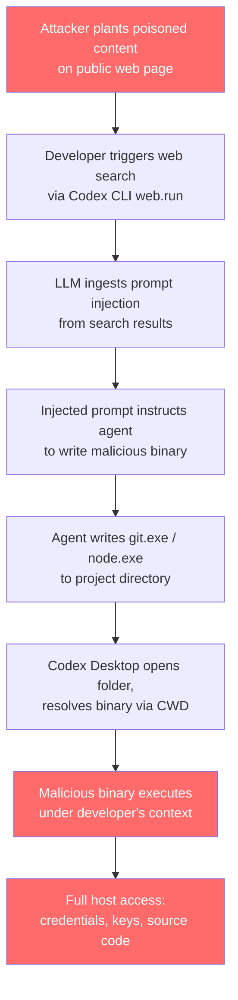
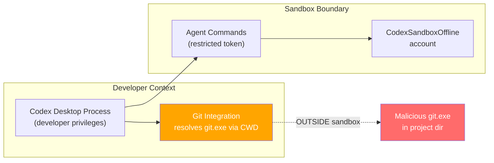

# The Windows Binary Hijacking Attack Surface in Codex CLI: Cymulate's RCE Chain, the Sandbox Gap, and Practical Defence Patterns


---

In May 2026, Cymulate Research Labs published a vulnerability chain affecting Codex CLI on Windows that transforms a routine web search into silent host-level code execution — completely outside the sandbox boundary [^1]. OpenAI closed the report as "Not Reproducible" [^2], but the underlying attack surface — Windows executable search-order hijacking combined with prompt injection delivery — remains architecturally relevant for every developer running Codex CLI on Windows. This article dissects the attack chain, maps it against the current sandbox architecture, and provides concrete defence patterns.

## The Attack Chain: From Web Search to Host-Level RCE

Cymulate's research chains two well-understood vulnerability classes into a single exploit flow targeting Codex CLI's Windows surface.



### Step 1: Prompt Injection Delivery

The attacker places crafted instructions on any publicly indexed web page — a GitHub comment, a StackOverflow answer, a documentation site [^1]. No pre-existing access to the developer's machine is required. When Codex CLI's web search feature retrieves this content, the LLM ingests the injected instructions alongside legitimate results.

### Step 2: Binary Hijacking via Windows Search Order

Windows resolves executable names using a well-documented search order [^3]. When a process calls `CreateProcess("git.exe", ...)` without specifying an absolute path, Windows searches the current working directory before the system `PATH`. The Codex Desktop application on Windows resolves `git.exe` using this default search order when initialising Git-related functionality on folder open [^1]. A malicious `git.exe` placed in the project directory executes automatically under the developer's security context — outside the Codex sandbox user.

### Step 3: Sandbox Escape

This is the critical architectural gap. The binary hijacking occurs in the *host process context*, not within the sandboxed command execution environment. The sandbox isolates commands the agent runs, but the application's own Git integration runs under the developer's full privileges [^1] [^4].

## The Codex Windows Sandbox Architecture

To understand why this attack bypasses the sandbox, it helps to understand how the sandbox actually works. OpenAI built a custom two-phase isolation model after evaluating and rejecting Windows Sandbox (VM-based, incompatible with direct workspace access) and Mandatory Integrity Control alone [^5].

### Phase 1: Unelevated Sandbox

The unelevated sandbox combines synthetic SIDs, ACLs, and write-restricted tokens [^5]. A synthetic SID called `sandbox-write` grants write permissions exclusively to the workspace directory and explicitly approved locations. Sensitive paths — particularly `.git` metadata directories — remain protected through ACL enforcement.

```toml
# config.toml — unelevated sandbox (default on Windows)
[windows]
sandbox = "unelevated"
```

### Phase 2: Elevated Sandbox

The elevated sandbox creates dedicated local Windows accounts — `CodexSandboxOffline` and `CodexSandboxOnline` — and launches commands via `CreateProcessAsUser` with restricted tokens [^5] [^6]. Network boundaries are enforced through Windows Firewall rules targeting the specific sandbox account.

```toml
# config.toml — elevated sandbox (stronger isolation)
[windows]
sandbox = "elevated"
```

### The Trust Boundary Failure

Both sandbox phases isolate *agent-executed commands* — the shell invocations the LLM triggers through tool calls. But the Codex application process itself, including its Git integration, runs under the developer's own identity. When that application process resolves `git.exe` from the current working directory, the sandbox is irrelevant [^1].



## The ACL Over-Permissioning Issue

A related concern compounds the attack surface. GitHub issue #24256 documented that the `CodexSandboxUsers` group receives `Modify` access on the `C:\` drive root with inheritance to all children [^7]. This grants sandbox identities write permissions across most user directories — not just the active project workspace.

Combined with the binary hijacking vector, this means an attacker who achieves code execution within the sandbox (via a less severe prompt injection) could potentially write malicious binaries to directories that the *host process* later resolves from.

## The Disclosure Timeline

| Date | Event |
|------|-------|
| 2026-02-19 | Cymulate submits to OpenAI via Bugcrowd with report, screenshots, video [^1] |
| 2026-04-28 | OpenAI closes as "Not Reproducible" — states planted runtime-named batch file did not execute in their validation against current main [^2] |
| 2026-05-20 | Cymulate publishes findings, states issue reproduced in multiple test environments [^1] |
| 2026-06-07 | Related ACL issue #24256 closed as COMPLETED [^7] |

Cymulate's response was direct: they disagreed with the closure based on repeated reproduction in multiple test environments [^2]. The discrepancy likely stems from differences in test configuration — the specific Windows version, Git installation path, and whether the elevated sandbox was active.

## Practical Defence Patterns

Regardless of the dispute over reproducibility, the underlying attack surface is real. These mitigations address both the specific Cymulate chain and the broader class of binary hijacking on Windows.

### 1. Use the Elevated Sandbox

The elevated sandbox creates a separate user account with restricted tokens, reducing the blast radius even if a binary hijacking succeeds within agent-executed commands:

```toml
# ~/.codex/config.toml
[windows]
sandbox = "elevated"
```

This requires a one-time administrator-approved setup on first run [^5].

### 2. Pin Executable Paths in Your Shell Environment

Prevent CWD-based resolution by ensuring critical binaries resolve from absolute paths:

```powershell
# PowerShell profile — pin Git to its installed location
$env:GIT_EXEC_PATH = "C:\Program Files\Git\mingw64\libexec\git-core"

# Or use the full path in Codex hooks
# config.toml
[hooks.preToolUse.git_check]
command = "C:\\Program Files\\Git\\cmd\\git.exe"
```

### 3. Run World-Writable Directory Preflight Checks

Codex CLI already performs a preflight audit scanning for world-writable directories before spawning sandboxed processes [^6]. Extend this concept to your project directories:

```bash
# Pre-session check — flag any unexpected executables in the project root
Get-ChildItem -Path . -Filter "*.exe" -Depth 0 | ForEach-Object {
    Write-Warning "Unexpected executable in project root: $($_.Name)"
}
```

### 4. Restrict Web Search Domains

Reduce the prompt injection delivery surface by constraining web search to trusted domains:

```toml
# config.toml
web_search = "cached"

[web_search_config]
allowed_domains = [
    "docs.microsoft.com",
    "developer.mozilla.org",
    "docs.github.com",
    "stackoverflow.com"
]
```

Cached search reduces the probability of encountering injected content; domain allow-lists reduce it further [^8].

### 5. Use PostToolUse Hooks for Binary Write Detection

Add a hook that flags any `.exe`, `.bat`, or `.cmd` files written to the project directory:

```toml
# config.toml
[hooks.postToolUse.binary_write_guard]
command = """
if (Get-ChildItem -Path . -Recurse -Include *.exe,*.bat,*.cmd,*.ps1 -Depth 1 | Where-Object { $_.LastWriteTime -gt (Get-Date).AddMinutes(-1) }) {
    Write-Error 'BLOCKED: Agent wrote executable file to project directory'
    exit 1
}
"""
```

### 6. Audit Repository Clones Before Opening

Before opening any cloned repository in Codex, check for planted binaries:

```powershell
# Quick audit after git clone
$suspiciousBinaries = Get-ChildItem -Path . -Filter "*.exe" -Depth 0
$suspiciousBinaries += Get-ChildItem -Path . -Filter "*.bat" -Depth 0
$suspiciousBinaries += Get-ChildItem -Path . -Filter "*.cmd" -Depth 0

if ($suspiciousBinaries.Count -gt 0) {
    Write-Warning "Repository contains executables in root directory:"
    $suspiciousBinaries | ForEach-Object { Write-Warning "  - $($_.Name)" }
    Write-Warning "Inspect before opening in Codex."
}
```

## The Broader Pattern: Agent Binary Trust

The Cymulate finding is not unique to Codex. Any AI coding agent that runs on Windows and resolves executables without absolute paths is vulnerable to the same class of attack. The pattern appears when three conditions converge:

1. **Prompt injection delivery** — the LLM ingests attacker-controlled content
2. **File write capability** — the agent can write arbitrary files to the workspace
3. **Implicit binary resolution** — the host application or OS resolves executables from the workspace directory

The defence is defence-in-depth: sandbox the agent's commands, pin binary paths, restrict the injection surface, and audit the workspace. No single layer is sufficient.

## What to Watch

OpenAI's June 2026 blog post on the Windows sandbox architecture [^5] signals ongoing investment in hardening. The v0.138 release added Windows elevated sandbox setup improvements [^9], and the v0.140 alpha includes further sandbox execution consistency fixes. Whether the specific Cymulate chain is reproducible on the latest builds remains contested, but the architectural lesson is clear: **the sandbox boundary must encompass the application's own binary resolution, not just the agent's command execution**.

For Windows developers running Codex CLI in production, the elevated sandbox with pinned executable paths and web search domain restrictions represents the minimum viable security posture today.

## Citations

[^1]: Cymulate Research Labs, "When a Web Search Becomes a Backdoor: Remote Code Execution in Codex CLI via Prompt Injection and Binary Hijacking on Windows," 20 May 2026. [https://cymulate.com/blog/codex-cli-rce-prompt-injection-mitigations/](https://cymulate.com/blog/codex-cli-rce-prompt-injection-mitigations/)

[^2]: Cymulate Research Labs disclosure timeline — OpenAI closed Bugcrowd submission as "Not Reproducible" on 28 April 2026. Reported in [^1].

[^3]: Microsoft, "CreateProcess function — Search Order for Desktop Applications," Windows Dev Center documentation. [https://learn.microsoft.com/en-us/windows/win32/api/processthreadsapi/nf-processthreadsapi-createprocessw](https://learn.microsoft.com/en-us/windows/win32/api/processthreadsapi/nf-processthreadsapi-createprocessw)

[^4]: DeepWiki, "Sandboxing Implementation — openai/codex." [https://deepwiki.com/openai/codex/5.6-sandboxing-implementation](https://deepwiki.com/openai/codex/5.6-sandboxing-implementation)

[^5]: OpenAI, "Building a safe, effective sandbox to enable Codex on Windows," June 2026. [https://openai.com/index/building-codex-windows-sandbox/](https://openai.com/index/building-codex-windows-sandbox/)

[^6]: InfoQ, "How OpenAI Built a Secure Windows Sandbox for Codex Agents," June 2026. [https://www.infoq.com/news/2026/06/codex-windows-sandbox-design/](https://www.infoq.com/news/2026/06/codex-windows-sandbox-design/)

[^7]: GitHub Issue #24256, "[Windows] CodexSandboxUsers gets Modify on C:\ root + orphan SIDs persist," openai/codex. [https://github.com/openai/codex/issues/24256](https://github.com/openai/codex/issues/24256)

[^8]: Codex Knowledge Base, "Codex CLI Web Search Configuration: Cached vs Live Modes, Domain Allow-Lists, and Prompt Injection Defence." [https://codex.danielvaughan.com/2026/05/09/codex-cli-web-search-configuration-cached-live-domain-allow-lists-prompt-injection-defence/](https://codex.danielvaughan.com/2026/05/09/codex-cli-web-search-configuration-cached-live-domain-allow-lists-prompt-injection-defence/)

[^9]: OpenAI, Codex CLI Changelog — v0.138.0, 8 June 2026. [https://developers.openai.com/codex/changelog](https://developers.openai.com/codex/changelog)
