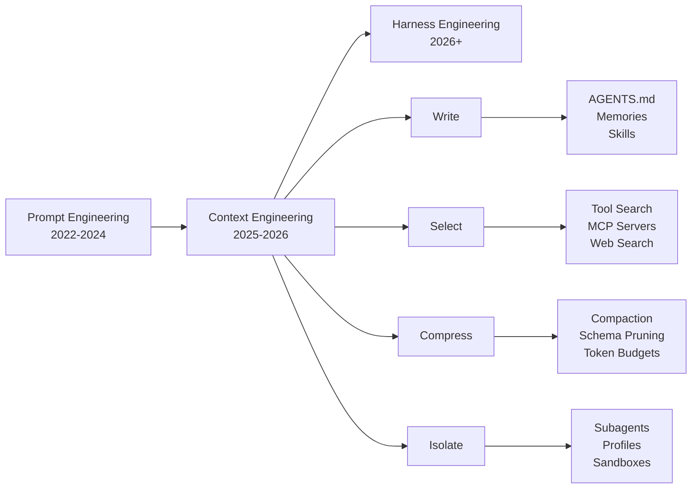
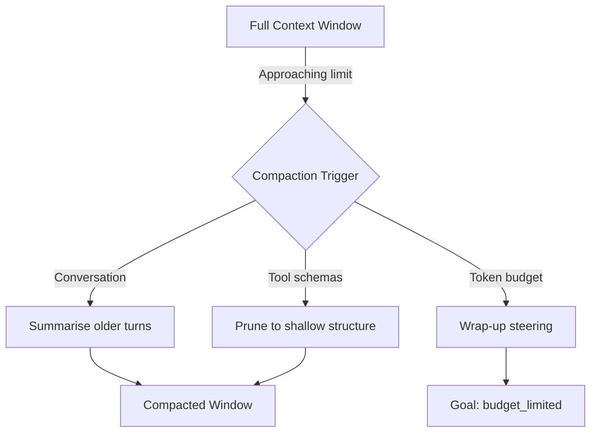

# Context Engineering for Codex CLI in June 2026: The Write-Select-Compress-Isolate Playbook


---

Andrej Karpathy put it concisely: context engineering is "the delicate art and science of filling the context window with just the right information for the next step"[^1]. By mid-2026, the term has moved from a Twitter coinage to an industry-wide discipline, and for good reason. Sourcegraph's practical guide to context engineering found that without structured retrieval, coding agents routinely miss files and facts outside their immediate window — what they call the "80% problem", where the agent completes the visible portion of a task and silently drops everything its context did not cover[^2]. That is not a prompt-wording issue — it is an information-supply problem driven entirely by what the model *sees*.

This article maps the four-strategy framework — **Write, Select, Compress, Isolate** — popularised by LangChain's context engineering repository[^3] and reinforced by Sourcegraph's practical guide[^4] onto the concrete mechanisms Codex CLI exposes as of v0.139. If you have read the earlier context engineering primer in this knowledge base (April 2026), treat this as its successor: the tooling has matured, the patterns have sharpened, and several new capabilities have shipped.

## The Shift: Prompt Engineering → Context Engineering → Harness Engineering

The industry trajectory is now clear. Between 2022 and 2026, the dominant paradigm shifted three times[^5]:

1. **Prompt engineering** (2022–2024): optimise the phrasing of a single request.
2. **Context engineering** (2025–2026): curate the entire information environment — instructions, documents, tool definitions, conversation history, memory — that surrounds every inference call.
3. **Harness engineering** (emerging): design the scaffolding that orchestrates context across multi-agent systems, including approval policies, sandbox boundaries, and event-driven hooks.

Codex CLI sits at the intersection of the second and third. Its harness — the Rust binary that manages the agent loop — handles context assembly automatically, but every configuration knob you turn changes *what* lands in the window and *when*.



## Strategy 1: Write — Persist Context Outside the Window

Writing context means saving durable knowledge outside the live context window so the agent can draw on it later[^3]. In Codex CLI, three mechanisms serve this purpose.

### AGENTS.md Hierarchy

Codex discovers instruction files in a strict order: global (`~/.codex/AGENTS.md`), then repository root down to the current working directory, concatenating as it goes[^6]. Files closer to the working directory appear later in the merged prompt, giving them effective override priority.

```toml
# ~/.codex/config.toml — tune the byte budget
project_doc_max_bytes = 65536          # default 32768
project_doc_fallback_filenames = ["TEAM_GUIDE.md", ".agents.md"]
```

The practical lesson from 2026: AGENTS.md is **operational policy**, not documentation. The model does not need to understand *why* you use conventional commits — it needs the exact command and what "done" looks like[^7]. Teams that treat AGENTS.md as a README consistently underperform teams that treat it as a runbook.

### Memories

Codex's native memory system (GA since v0.128) extracts durable insights from completed sessions and injects them into future ones[^8]. After a session idles, a two-phase pipeline runs: per-session extraction (with secret redaction), then global consolidation into `~/.codex/memories/memory_summary.md`.

```toml
# ~/.codex/config.toml
[features]
memories = true

# Fine-grained controls
[memories]
generate_memories = true
use_memories = true
disable_on_external_context = true     # skip MCP/web-search threads
min_rate_limit_remaining_percent = 20  # back off when rate-limited
```

As of v0.139, external tool output is excluded from memory storage[^9], which prevents MCP responses from polluting the memory corpus — a common problem in earlier versions.

### Skills and PLANS.md

Skills are reusable prompt fragments that inject specialised instructions when activated[^10]. The execplan pattern — writing a `PLANS.md` file at session start and updating it as work progresses — gives the agent a persistent reference document that survives compaction[^11]. This is context *writing* in its purest form: the agent produces a file that it later *reads* to maintain coherence across a multi-hour session.

## Strategy 2: Select — Pull the Right Tokens In

Selecting context means retrieving information into the window precisely when needed[^3].

### Tool Search

Since v0.119, Codex CLI ships a built-in tool search that uses semantic matching to surface relevant tools from the full catalogue, reducing tool-definition overhead by 85–98%[^12]. Without it, a 43-tool GitHub MCP server injects over 28,000 tokens of tool definitions into every turn[^13].

### MCP Server Scoping

The `enabled_tools` and `disabled_tools` arrays in `config.toml` act as allow/deny lists that determine which MCP tool definitions enter the context window at all[^14]:

```toml
[mcp_servers.github]
command = "npx"
args = ["-y", "@modelcontextprotocol/server-github"]
enabled_tools = ["create_pull_request", "get_file_contents", "search_code"]
```

This is context *selection* at the configuration layer — you decide which tools the model can see before it ever starts reasoning.

### Code-Mode Web Search

v0.139 added standalone web search in code mode, including from nested JavaScript tool calls[^15]. The agent can now pull in external documentation mid-session without leaving the coding flow. Combined with parallel execution, this means the agent selects and fetches context from the web in the background while continuing to write code.

## Strategy 3: Compress — Retain Only What Matters

Compressing context means reducing token usage while preserving the information the agent needs[^3].

### Automatic Compaction

When the conversation approaches the context window limit, Codex CLI triggers automatic compaction — summarising earlier turns into a condensed representation[^16]. The compaction algorithm preserves the most recent messages verbatim and summarises older ones. You can track compaction events via telemetry (`task.compact` metric with `remote` and `local` types).

### Schema Compaction

v0.139 introduced smarter schema handling: tool and connector input schemas now preserve `oneOf` and `allOf` structures, and large schemas "keep more shallow structure when compacted"[^15]. This matters because MCP tool definitions can be enormous — a Prisma MCP server exposing migration tools sends multi-kilobyte JSON schemas that previously lost structural information during compaction.

### Token Budget Discipline

Goal mode (GA since May 2026) treats token budget exhaustion as a soft stop, injecting wrap-up steering rather than aborting[^17]. This is compression at the session level: the agent learns to produce a summary and handoff notes when the budget runs low rather than simply stopping mid-thought.



## Strategy 4: Isolate — Split Context Across Boundaries

Isolating context means distributing work across separate context windows so that no single window becomes saturated[^3].

### Subagents

Codex CLI's multi-agent v2 runtime spawns subagents with their own context windows, each scoped to a specific role or subtask[^18]. A subagent inherits the parent's AGENTS.md instructions but operates within its own conversation history and tool set. This is the most direct implementation of context isolation: a frontend subagent never sees the backend subagent's database schemas, and vice versa.

```toml
# .codex/agents/frontend-reviewer.toml
model = "o4-mini"
instructions = """
You review React components for accessibility and performance.
You do not modify backend code.
"""

[sandbox]
writable_roots = ["src/components", "src/hooks"]
```

### Permission Profiles

Profiles scope the agent's capabilities per task, which implicitly scopes what context it encounters[^19]. A `debug` profile with elevated sandbox permissions sees different system resources than a `review` profile restricted to read-only file access. The profile shapes what tools are available, which shapes what tool definitions enter the context window, which shapes what the model reasons about.

### OS-Native Sandboxes

Seatbelt (macOS), Bubblewrap (Linux), and Landlock (Linux 5.13+) provide hard isolation boundaries that prevent the agent from accessing files outside its permitted scope[^20]. This is context isolation at the operating system level — the agent physically cannot read context it should not have.

## The Compounding Effect

These four strategies are not independent. They compound:

| Combination | Effect |
|---|---|
| Write + Select | AGENTS.md instructs the agent to use tool search before calling MCP tools, keeping the window lean |
| Write + Compress | PLANS.md survives compaction because the agent re-reads the file rather than relying on conversation history |
| Select + Isolate | Each subagent has its own `enabled_tools` list, so tool definitions are both selected and isolated |
| Compress + Isolate | Subagent compaction happens independently; one subagent's compaction does not discard another's context |

The measurable outcome: teams that implement all four strategies report that their agents maintain coherence across sessions exceeding 100,000 tokens of cumulative input, whereas single-window, unmanaged-context sessions typically degrade after 30,000–40,000 tokens[^21].

## A Minimal Context Engineering Checklist

For teams adopting Codex CLI for the first time or upgrading from ad-hoc prompting:

1. **Write an AGENTS.md** at repository root with exact commands, done criteria, and test expectations[^7].
2. **Enable memories** in `config.toml` so cross-session insights accumulate automatically[^8].
3. **Scope MCP tools** with `enabled_tools` — never expose the full catalogue[^14].
4. **Use subagents** for tasks that span more than two domains (frontend + backend, code + infrastructure)[^18].
5. **Monitor compaction** via OpenTelemetry traces to detect when sessions are hitting the window ceiling too early[^16].
6. **Write a PLANS.md** at the start of any multi-file task and instruct the agent to update it after each milestone[^11].

## What Comes Next

The discipline is still evolving. Harness engineering — the third phase in the trajectory — is beginning to formalise. Martin Fowler's harness-engineering framework[^22] and the "Inside the Scaffold" taxonomy[^23] both argue that the scaffolding around the model (approval policies, event hooks, sandbox configuration) matters more than either the prompt or the raw context. Codex CLI's architecture already supports this: `PostToolUse` hooks, execution policy rules via Starlark, and cloud-managed configuration bundles are all harness-layer constructs that shape context indirectly.

For now, the Write-Select-Compress-Isolate framework gives Codex CLI developers a practical, testable vocabulary for the decisions they make every day. The context window is not infinite. Engineering what goes into it is the highest-leverage activity in agentic development.

## Citations

[^1]: Andrej Karpathy on X, "+1 for 'context engineering' over 'prompt engineering'", [https://x.com/karpathy/status/1937902205765607626](https://x.com/karpathy/status/1937902205765607626)
[^2]: Sourcegraph, "Context Engineering: A Practical Guide for AI Agents (2026)", [https://sourcegraph.com/blog/context-engineering](https://sourcegraph.com/blog/context-engineering)
[^3]: LangChain, "Context Engineering Strategies", GitHub repository, [https://github.com/langchain-ai/context_engineering](https://github.com/langchain-ai/context_engineering)
[^4]: Sourcegraph, "Agentic Coding in 2026: A Practical Guide for Big Code", [https://sourcegraph.com/blog/agentic-coding](https://sourcegraph.com/blog/agentic-coding)
[^5]: "From Prompts to Harnesses — Four Years of AI Agentic Patterns", [https://bits-bytes-nn.github.io/insights/agentic-ai/2026/04/05/evolution-of-ai-agentic-patterns-en.html](https://bits-bytes-nn.github.io/insights/agentic-ai/2026/04/05/evolution-of-ai-agentic-patterns-en.html)
[^6]: OpenAI, "Custom instructions with AGENTS.md", [https://developers.openai.com/codex/guides/agents-md](https://developers.openai.com/codex/guides/agents-md)
[^7]: Blake Crosley, "AGENTS.md Patterns: What Actually Changes Agent Behavior", [https://blakecrosley.com/blog/agents-md-patterns](https://blakecrosley.com/blog/agents-md-patterns)
[^8]: OpenAI, "Memories – Codex", [https://developers.openai.com/codex/memories](https://developers.openai.com/codex/memories)
[^9]: OpenAI, "Codex CLI Changelog — v0.139.0", [https://developers.openai.com/codex/changelog](https://developers.openai.com/codex/changelog)
[^10]: OpenAI, "Plugins – Codex", [https://developers.openai.com/codex/plugins](https://developers.openai.com/codex/plugins)
[^11]: OpenAI, "Run long horizon tasks with Codex", [https://developers.openai.com/blog/run-long-horizon-tasks-with-codex](https://developers.openai.com/blog/run-long-horizon-tasks-with-codex)
[^12]: Scalekit, MCP token cost benchmarks, cited in "The MCP Tax: When Shell Commands Beat MCP Servers", Codex Knowledge Base, 2026-06-09
[^13]: Scalekit, MCP server token analysis, cited in "The MCP Tax", Codex Knowledge Base, 2026-06-09
[^14]: OpenAI, "Advanced Configuration – Codex", [https://developers.openai.com/codex/config-advanced](https://developers.openai.com/codex/config-advanced)
[^15]: OpenAI, "Codex CLI Changelog — v0.139.0", [https://developers.openai.com/codex/changelog](https://developers.openai.com/codex/changelog)
[^16]: OpenAI, "Features – Codex CLI", [https://developers.openai.com/codex/cli/features](https://developers.openai.com/codex/cli/features)
[^17]: OpenAI, "Run long horizon tasks with Codex", [https://developers.openai.com/blog/run-long-horizon-tasks-with-codex](https://developers.openai.com/blog/run-long-horizon-tasks-with-codex)
[^18]: OpenAI, "Subagents – Codex", [https://developers.openai.com/codex/subagents](https://developers.openai.com/codex/subagents)
[^19]: OpenAI, "Config basics – Codex", [https://developers.openai.com/codex/config-basic](https://developers.openai.com/codex/config-basic)
[^20]: OpenAI, "CLI – Codex", [https://developers.openai.com/codex/cli](https://developers.openai.com/codex/cli)
[^21]: Bind AI, "Context Engineering 2026: Complete Developer Guide", [https://blog.getbind.co/context-engineering-in-2026-the-complete-developers-guide/](https://blog.getbind.co/context-engineering-in-2026-the-complete-developers-guide/)
[^22]: Martin Fowler, harness-engineering framework, cited in "From Prompts to Harnesses — Four Years of AI Agentic Patterns"
[^23]: "Inside the Scaffold: What Academic Research Reveals About Codex CLI's Agent Architecture", Codex Knowledge Base, 2026-06-08
