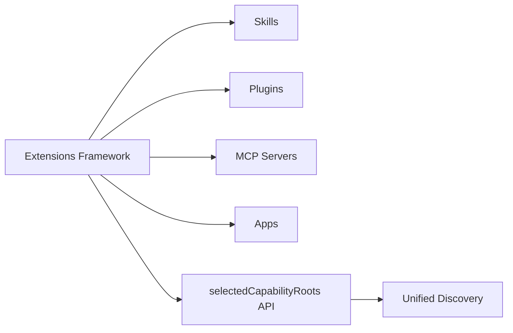
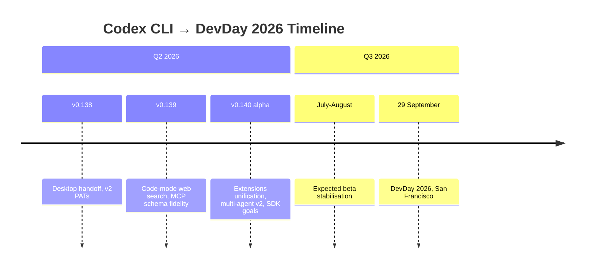

# OpenAI DevDay 2026: What Codex CLI Developers Should Expect and How to Prepare


---

OpenAI has announced DevDay 2026 for **29 September in San Francisco** [^1]. For Codex CLI developers, this is the single most consequential event of the year. DevDay 2025 gave us the Codex GA launch, GPT-5-Codex, and the Apps SDK [^2]. The 2026 edition arrives against a backdrop of an S-1 filing [^3], five million weekly Codex users [^4], and three architectural shifts already visible in the v0.140 alpha [^5]. This article maps what we know, what we can reasonably infer, and how to prepare.

## What Happened at DevDay 2025

DevDay 2025 (6 October, San Francisco) was the event where Codex graduated from preview to general availability [^2]. The key announcements for CLI developers were:

- **GPT-5-Codex** — a model fine-tuned specifically for agentic coding tasks [^2]
- **Codex SDK** — the first programmable interface for embedding Codex in custom tooling [^2]
- **Enterprise controls** — managed configuration, audit logging, and team budgets [^2]
- **Apps SDK** — allowing interactive applications inside ChatGPT [^6]
- **AgentKit** — a no-code builder for autonomous agents [^6]

Romain Huet's keynote demo was itself built almost entirely by Codex CLI, running multiple parallel sessions to ship an initial version in an afternoon [^7]. Tickets were \$650 [^8].

## The Strategic Context for 2026

Three macro shifts frame what DevDay 2026 is likely to prioritise.

### The IPO Clock

OpenAI filed its confidential S-1 with the SEC on 8 June 2026 [^3], with a fall market debut targeted as early as September [^9]. DevDay falls on 29 September — potentially the same week as a public offering. Developer platform metrics (API revenue, Codex seat growth, enterprise penetration) will be front and centre. Codex users are "predominantly paying customers, making the coding product a disproportionate revenue contributor relative to its user base size" [^9].

### The Knowledge Work Expansion

On 2 June 2026, OpenAI announced "Codex for every role, tool, and workflow" with six role-specific plugins and the Sites preview [^4]. Knowledge workers now account for roughly 20% of the Codex user base [^4]. DevDay 2026 will almost certainly position Codex as a general-purpose agent platform, not merely a coding tool.

### The Five-Million-User Threshold

Codex surpassed five million weekly developers in June 2026, with usage growing 6x since January and 10x since August 2025 [^4]. At this scale, stability, extensibility, and ecosystem health become the dominant engineering priorities — exactly what the v0.140 alpha signals address.

## What the Alpha Signals Tell Us

The v0.140.0-alpha.2 release (10 June 2026) contains 27 commits introducing three architectural shifts that are likely candidates for DevDay announcements [^5]:

### Extensions Unification

The new `selectedCapabilityRoots` API abstracts how Codex discovers capabilities — skills, plugins, MCP servers, and apps — through a single discovery surface [^5] [^10]. Hosted Apps MCP now routes through the extensions framework, and extension API contract tests enforce compatibility guarantees.



This strongly suggests a DevDay announcement around a stable extensions API — a single interface for third-party developers to build on Codex regardless of whether their integration is a skill, plugin, or MCP server.

### Multi-Agent v2 Path Tracking

The alpha replaces legacy nickname-based agent events with compact `SubAgentActivity` events and a bounded `/agent` status surface [^5]. Direct input rejection for sub-agents tightens the security boundary. This is the foundation for a production-grade multi-agent runtime.

### Python SDK Goal Routing

Private goal operation state, thread-scoped notification routing, and goal clear/set RPC wrappers landed as the first of six planned PRs [^5]. This signals a forthcoming SDK release that gives programmatic control over Codex's goal mode — enabling external orchestrators to drive Codex sessions towards specific outcomes.

## Likely DevDay 2026 Announcements

Based on alpha signals, the platform trajectory, and historical precedent, here is what Codex CLI developers should reasonably expect:

| Area | Prediction | Confidence |
|------|-----------|------------|
| Stable Extensions API | Unified capability discovery for skills, plugins, MCP, apps | High |
| Multi-Agent v2 GA | Production-grade sub-agent orchestration with path tracking | High |
| Python SDK 1.0 | Goals, streaming, auth — fully stable | Medium-High |
| GPT-6-Codex or GPT-5.5-Codex | A new model optimised for the extensions-aware runtime | Medium |
| Codex Marketplace | Paid distribution for skills and plugins | Medium |
| Enterprise SSO + SCIM | Formalised identity management for managed Codex deployments | Medium |
| On-device agent capabilities | Tighter integration with Apple Foundation Models and local inference | Low-Medium |

## How to Prepare

### Win an Early Ticket

OpenAI is running a weekly contest: build something with GPT-5.5 and Image Gen, post it on X, and 2–3 winners per week receive free DevDay tickets [^11]. Codex itself evaluates the submissions before the OpenAI team makes final selections [^11]. Given the GPT-5.5 focus, projects demonstrating the model's agentic strengths (multi-step workflows, tool use, vision) are likely to stand out.

### Upgrade to v0.139 Stable

The current stable release (v0.139.0, 9 June 2026) includes code-mode standalone web search, improved MCP tool schema fidelity with `oneOf`/`allOf` preservation, and enhanced `codex doctor` diagnostics [^12]. Run:

```bash
codex update
codex doctor
```

Ensure your `config.toml` and AGENTS.md files are current before the next wave of changes lands.

### Audit Your Extension Surface

If you maintain skills, plugins, or MCP server integrations, audit them against the emerging extensions framework patterns. The `selectedCapabilityRoots` API in v0.140 alpha [^10] will likely become the stable discovery mechanism. Key preparation steps:

```toml
# config.toml - ensure explicit capability declarations
[extensions]
enabled_roots = ["skills", "plugins", "mcp"]
```

### Test Multi-Agent Workflows

If you use sub-agents, test against the v0.140 alpha to catch any behavioural changes from the `SubAgentActivity` event migration. The direct input rejection for sub-agents is a breaking change for workflows that relied on feeding input directly to child agents [^5].

### Build with the Python SDK

The Python SDK's goal routing primitives are landing across six PRs [^5]. If you embed Codex programmatically, start experimenting with the alpha SDK now. Goal-based orchestration will likely be a flagship DevDay demo pattern.

```bash
pip install codex-sdk --pre
```

### Register for Notifications

Sign-ups are open at [openai.com/devday](https://openai.com/devday/) for notifications when full ticket applications open [^1]. Based on 2025 pricing, expect tickets around \$650 [^8].

## The Bigger Picture

DevDay 2026 arrives at an inflection point. Codex is no longer a coding assistant — it is OpenAI's developer platform play, a revenue engine that enterprise sales depend on [^9], and a gateway to the broader knowledge-work market [^4]. The S-1 filing means every announcement will carry financial weight.

For CLI developers, the practical implication is clear: the tools you build on today's alpha APIs will be the production integrations that DevDay showcases in September. The extensions unification, multi-agent v2, and Python SDK goals are not speculative features — they are the architectural foundations landing now, with a public debut date already set.



Mark 29 September. Build now.

## Citations

[^1]: OpenAI, "Announcing OpenAI DevDay 2026," [openai.com/index/devday-2026](https://openai.com/index/devday-2026/), June 2026.
[^2]: OpenAI DevDay 2025 announcements, [openai.com/devday](https://openai.com/devday/), October 2025.
[^3]: OpenAI, "Confidential submission of draft S-1 to the SEC," 8 June 2026. Reported by [Seeking Alpha](https://seekingalpha.com/news/4581882-openai-announces-date-for-upcoming-devday) and [IndMoney](https://www.indmoney.com/blog/us-stocks/openai-ipo-valuation-financials-risks).
[^4]: OpenAI, "Codex for every role, tool, and workflow," [openai.com/index/codex-for-every-role-tool-workflow](https://openai.com/index/codex-for-every-role-tool-workflow/), 2 June 2026.
[^5]: OpenAI Codex releases, v0.140.0-alpha.2, [github.com/openai/codex/releases](https://github.com/openai/codex/releases), 10 June 2026.
[^6]: IntuitionLabs, "OpenAI DevDay 2025: GPT-5 Pro, Sora 2 & Platform Updates," [intuitionlabs.ai](https://intuitionlabs.ai/articles/openai-devday-2025-announcements), October 2025.
[^7]: OpenAI Developers, "How Codex ran OpenAI DevDay 2025," [developers.openai.com/blog/codex-at-devday](https://developers.openai.com/blog/codex-at-devday), October 2025.
[^8]: OpenAI DevDay 2025 registration, [openai.com/devday/registration-closed](https://openai.com/devday/registration-closed/), 2025.
[^9]: Perplexity AI Magazine, "OpenAI Superapp 2026: ChatGPT + Codex Merge for IPO," [perplexityaimagazine.com](https://perplexityaimagazine.com/ai-news/openai-chatgpt-superapp-codex-ipo-2026/), June 2026; Sacra, "OpenAI revenue, valuation & funding," [sacra.com/c/openai](https://sacra.com/c/openai/), 2026.
[^10]: OpenAI Codex app-server README, `selectedCapabilityRoots` parameter, [github.com/openai/codex/blob/main/codex-rs/app-server/README.md](https://github.com/openai/codex/blob/main/codex-rs/app-server/README.md).
[^11]: OpenAI on X, "Want to secure an early ticket to OpenAI DevDay?", [x.com/OpenAI/status/2049535650626785334](https://x.com/OpenAI/status/2049535650626785334), June 2026.
[^12]: OpenAI Codex CLI v0.139.0 release notes, [github.com/openai/codex/releases/tag/rust-v0.139.0](https://github.com/openai/codex/releases/tag/rust-v0.139.0), 9 June 2026.
