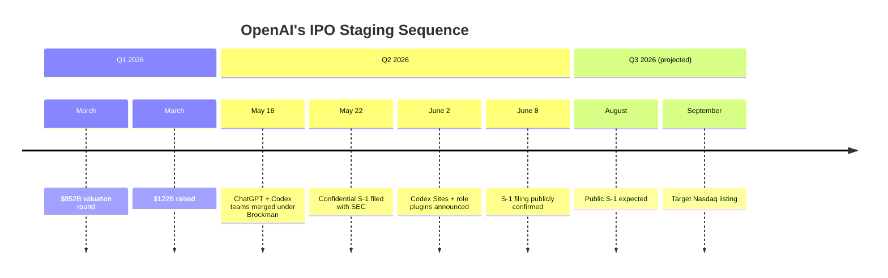
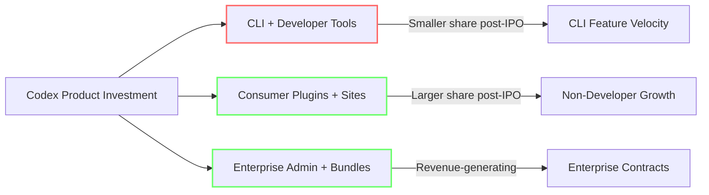

# OpenAI's S-1 Filing: What the IPO Path Means for Codex CLI Developers


---

On 8 June 2026, OpenAI confirmed that it had confidentially submitted a draft S-1 registration statement to the US Securities and Exchange Commission[^1]. The filing — reported by CNBC and Fortune hours before the official announcement — marks the first concrete step toward a public listing that could value the company above \$1 trillion[^2]. For the five million weekly Codex users[^3] and, more specifically, for CLI-first developers who have woven Codex into their daily workflows, this is not merely financial news. Public-market dynamics will reshape pricing, model deprecation cadences, and platform investment priorities in ways that deserve scrutiny before the roadshow prospectus lands in August.

This article examines the disclosed financials, maps the strategic context of the ChatGPT–Codex organisational merger, and outlines practical steps CLI developers should take now — before quarterly earnings calls start driving product decisions.

---

## The Filing: What We Know

OpenAI submitted the confidential S-1 around 22 May 2026 under the JOBS Act provision that permits companies to keep their initial registration sealed until roughly fifteen days before the first investor roadshow[^4]. Goldman Sachs, Morgan Stanley, and JPMorgan are leading the offering[^2]. The target is a Nasdaq debut as early as September 2026[^4].

The company's last private valuation closed at \$852 billion in a March 2026 funding round that raised \$122 billion[^2]. IPO analysts expect the public listing to target north of \$1 trillion[^4].

Because the filing is confidential, no share price, ticker, or formal risk-factor language is yet public. What we do have are the financial figures OpenAI and its investors have disclosed piecemeal over the preceding months — and those numbers tell a story CLI developers should read carefully.

---

## The Numbers Behind the Platform

| Metric | Figure | Source window |
|---|---|---|
| Annualised revenue | ~\$25 billion | February 2026[^5] |
| Q1 2026 non-GAAP operating margin | −122% | Q1 2026[^6] |
| Projected 2026 operating loss | ~\$14 billion | Internal projections[^6] |
| Profitability target | ~2029–2030 | Management guidance[^4] |
| Five-year compute obligations | ~\$600 billion | HSBC estimate[^6] |
| Token throughput | 15 billion tokens/min | Platform telemetry[^6] |
| Codex weekly active users | 5 million+ | June 2026[^3] |

The core tension is visible in a single ratio: OpenAI loses \$1.22 for every dollar of revenue it earns[^6]. This is a company that must grow into its valuation while simultaneously funding \$600 billion in compute commitments over five years[^6]. That arithmetic has direct consequences for every API consumer and CLI user on the platform.

---

## The ChatGPT–Codex Merger: IPO Staging

On 16 May 2026, three weeks before the S-1 was confirmed, OpenAI folded its consumer ChatGPT team and the Codex product team into a single core product group under President Greg Brockman[^7]. The official rationale was resource consolidation — three teams competing for the same GPU allocation is wasteful[^8]. The timing, however, is unmistakably IPO-adjacent.

Public-market investors want simple narratives. A company with a single unified product ("the agentic platform") that serves 900 million weekly ChatGPT users[^8] and five million weekly Codex users[^3] is easier to underwrite than one with competing product lines and unclear revenue attribution. The merger streamlines the S-1 story: one platform, one subscription, one agent runtime.



For CLI developers, the merger has a concrete implication: Codex is no longer a standalone product with its own P&L visibility. It is a feature of the unified platform. That means Codex-specific investment decisions will increasingly be weighed against consumer-facing ChatGPT features, enterprise plugins, and the new Sites hosting product[^9] — all competing for the same engineering bandwidth under quarterly earnings scrutiny.

---

## What Public Markets Do to Developer Platforms

History offers instructive precedents. When Twilio went public in 2016, API pricing remained stable for roughly eighteen months before unit-economics pressure led to rate adjustments. When MongoDB listed in 2017, the community edition continued but enterprise features accelerated behind the paid tier. The pattern is consistent: public companies optimise for gross margin, and developer tools that don't contribute to that margin face rationalisation.

For OpenAI, three specific pressure vectors emerge:

### 1. Model Deprecation Will Accelerate

Older, cheaper inference paths reduce margin. Analysts have already warned that public-market pressure will force OpenAI to "eliminate cheaper inference paths that don't meet shareholder margin targets"[^6]. For CLI developers, this means the model you configure in `config.toml` today may sunset faster than historical cadences suggest. The deprecation wave of June–July 2026 — which retired GPT-5.2 and GPT-5.2-Codex[^10] — may be a preview of the post-IPO tempo.

### 2. Pricing Flexibility Narrows After Listing

Enterprise contracts negotiated in Q3 2026 represent the last private-cycle pricing window[^11]. Post-IPO, discount machinery slows because every concession shows up in quarterly revenue-per-user metrics that analysts scrutinise. The current token-based pricing model (shifted from per-message in April 2026[^12]) gives OpenAI cleaner unit economics to present to investors — but also makes future price increases more granular and harder to detect.

### 3. The Free Tier and Plus Tier Face the Biggest Squeeze

Internal projections reportedly show an 80% reduction in free-tier capacity post-IPO[^11]. Plus-tier subscribers (at \$20/month) sit in a revenue band that may not justify the compute cost of GPT-5.5 inference. CLI developers on Plus plans should watch for capability restrictions that push power users toward Pro (\$100/month) or Pro 5x (\$200/month)[^12].

---

## Codex as Revenue Engine

Despite the lack of Codex-specific revenue breakdowns in the public disclosures, the trajectory is clear. Codex grew from roughly 800,000 weekly users in early February to over 5 million by June — a 6x increase in four months[^3]. Sam Altman noted in April that "it feels like Codex is having a ChatGPT moment"[^13].

The non-developer adoption rate is particularly significant for the IPO narrative: 20% of Codex users are now non-developers (analysts, marketers, operations staff), growing at three times the rate of developer adoption[^3]. Data-analysis usage alone grew 110% week-over-week in the June 2 disclosure[^3]. This broadening user base makes Codex's revenue contribution more defensible to public investors — but it also means the product roadmap will increasingly serve non-developer use cases.

For CLI developers, this creates a bifurcation risk:



⚠️ This bifurcation is speculative but consistent with how other developer platforms have evolved post-IPO. OpenAI has not publicly stated any plan to reduce CLI investment.

---

## Practical Preparation for CLI Developers

The S-1 filing is a signal, not a crisis. But signals are worth acting on. Here are five concrete steps to take before the public listing.

### 1. Configure Multi-Provider Fallback Now

Codex CLI's custom provider support means you can configure fallback providers in `config.toml` today. If OpenAI deprecates a model or adjusts rate limits post-IPO, a pre-configured Bedrock or Ollama provider keeps your workflows running:

```toml
# ~/.codex/fallback.config.toml
model = "gpt-5.5"

[providers.bedrock]
base_url = "https://bedrock-runtime.eu-west-1.amazonaws.com"
model = "anthropic.claude-sonnet-4-20250514"

[providers.local]
base_url = "http://localhost:11434/v1"
model = "gpt-oss-120b"
```

Switch profiles on the fly with `codex --profile fallback` to test your secondary provider before you need it under pressure.

### 2. Lock In Enterprise Pricing Before Q4

If your organisation uses Codex at scale, Q3 2026 is the last window to negotiate enterprise pricing under private-company dynamics[^11]. Post-IPO, every discount appears in quarterly filings. Push for multi-year commitments with fixed token rates now.

### 3. Pin Model Versions Explicitly

Do not rely on model aliases like `gpt-5.5` in production automation. Pin specific model versions in your `config.toml` and `codex exec` scripts:

```bash
# Pin to a specific model version in automation
codex exec -m gpt-5.5-2026-04-23 \
  --approval-mode full-auto \
  "Run the migration pipeline"
```

When deprecation notices arrive, you will have a clear inventory of which workflows need updating.

### 4. Audit Your Token Spend

The shift to token-based pricing makes your consumption directly visible. Use `codex doctor` and the `--json` event stream to build a baseline of your token usage before the IPO. Post-listing price adjustments will be easier to absorb if you already know your burn rate:

```bash
# Export session token metrics
codex exec --json "Summarise this module" 2>&1 | \
  jq 'select(.type == "usage") | {input: .input_tokens, output: .output_tokens}'
```

### 5. Diversify Your AGENTS.md Investment

AGENTS.md files are plain Markdown — they are not locked to Codex. Claude Code reads the same files as `CLAUDE.md`, and Gemini CLI as `GEMINI.md`[^14]. Structure your agent configuration so the core instructions are in a shared file that any tool can consume:

```bash
# Keep a tool-agnostic base
echo "See SHARED_AGENTS.md for project conventions" > AGENTS.md
echo "See SHARED_AGENTS.md for project conventions" > CLAUDE.md
```

This reduces switching costs if post-IPO pricing or feature changes make a multi-tool strategy necessary.

---

## The Competitive Pressure Valve

OpenAI is not filing in a vacuum. Anthropic submitted its own confidential S-1 on 1 June 2026[^15], and Claude Code has captured over 1,000 enterprise accounts spending more than \$1 million annually[^11]. Google's Antigravity CLI, which launched at Google I/O on 19 May, completes its Gemini CLI migration deadline on 18 June[^16]. Cursor's TypeScript SDK entered public beta in April[^17].

This competitive density is, paradoxically, the best insurance for CLI developers. A post-IPO OpenAI under quarterly scrutiny cannot afford to alienate its developer base when three well-funded competitors are actively courting the same users. The pricing and deprecation risks outlined above are real, but they are moderated by a market where developers have genuine alternatives.

The S-1 is a starting gun, not an ending. Read the public filing when it drops in August. Compare the risk factors against your current Codex dependency. And configure your fallback providers before you need them.

---

## Citations

[^1]: CNBC, "OpenAI files confidential S-1 with the SEC, has not decided timing yet," 8 June 2026. [https://www.cnbc.com/video/2026/06/08/openai-files-confidential-s-1-with-the-sec-has-not-decided-timing-yet.html](https://www.cnbc.com/video/2026/06/08/openai-files-confidential-s-1-with-the-sec-has-not-decided-timing-yet.html)

[^2]: Fortune, "OpenAI files confidential SEC S-1 paperwork for IPO," 9 June 2026. [https://fortune.com/2026/06/09/openai-files-confidential-s-1-sec-ipo/](https://fortune.com/2026/06/09/openai-files-confidential-s-1-sec-ipo/)

[^3]: OpenAI, "Introducing upgrades to Codex," 2 June 2026. [https://openai.com/index/introducing-upgrades-to-codex/](https://openai.com/index/introducing-upgrades-to-codex/)

[^4]: ChatForest, "OpenAI IPO Guide 2026 — Confidential S-1 Filed, September Target, and What It Means for Developers," June 2026. [https://chatforest.com/reviews/openai-ipo-2026-s1-filing-valuation-risks-guide/](https://chatforest.com/reviews/openai-ipo-2026-s1-filing-valuation-risks-guide/)

[^5]: IndMoney, "Inside OpenAI's Confidential SEC IPO Filing: Valuation, Financials and Risks," June 2026. [https://www.indmoney.com/blog/us-stocks/openai-ipo-valuation-financials-risks](https://www.indmoney.com/blog/us-stocks/openai-ipo-valuation-financials-risks)

[^6]: RoboRhythms, "OpenAI Just Filed for IPO and the 2026 Math Is Brutal," June 2026. [https://www.roborhythms.com/openai-ipo-filing-2026/](https://www.roborhythms.com/openai-ipo-filing-2026/)

[^7]: TechTimes, "OpenAI Unifies ChatGPT, Codex, and Developer API Under Co-Founder Brockman Four Days Before Google I/O," 16 May 2026. [https://www.techtimes.com/articles/316730/20260516/openai-unifies-chatgpt-codex-developer-api-under-co-founder-brockman-four-days-before-google-i-o.htm](https://www.techtimes.com/articles/316730/20260516/openai-unifies-chatgpt-codex-developer-api-under-co-founder-brockman-four-days-before-google-i-o.htm)

[^8]: The Next Web, "OpenAI merges ChatGPT and Codex under Greg Brockman. The side quests are over," May 2026. [https://thenextweb.com/news/openai-brockman-chatgpt-codex-unified-agentic-platform](https://thenextweb.com/news/openai-brockman-chatgpt-codex-unified-agentic-platform)

[^9]: VentureBeat, "OpenAI's Codex update lets agents build interactive enterprise workspaces via Sites and role-specific plugins," June 2026. [https://venturebeat.com/orchestration/openais-codex-update-lets-agents-build-interactive-enterprise-workspaces-via-sites-and-role-specific-plugins](https://venturebeat.com/orchestration/openais-codex-update-lets-agents-build-interactive-enterprise-workspaces-via-sites-and-role-specific-plugins)

[^10]: Codex Knowledge Base, "Codex CLI June 2026 Model Sunset," June 2026. [https://codex.danielvaughan.com/2026/06/01/codex-cli-june-2026-model-sunset-gpt52-gpt52codex-migration-checklist/](https://codex.danielvaughan.com/2026/06/01/codex-cli-june-2026-model-sunset-gpt52-gpt52codex-migration-checklist/)

[^11]: AI Tool Briefing, "OpenAI Files for IPO: What AI Pros Need to Know," June 2026. [https://aitoolbriefing.com/industry/openai-files-s1-ipo-2026/](https://aitoolbriefing.com/industry/openai-files-s1-ipo-2026/)

[^12]: OpenAI, "Codex Pricing," June 2026. [https://developers.openai.com/codex/pricing](https://developers.openai.com/codex/pricing)

[^13]: Memeburn, "OpenAI Folds Codex Into ChatGPT After 400% Growth in 2026," June 2026. [https://memeburn.com/openai-folds-codex-into-chatgpt-after-400-growth-in-2026/](https://memeburn.com/openai-folds-codex-into-chatgpt-after-400-growth-in-2026/)

[^14]: Codex Knowledge Base, "Codex CLI External Agent Migration," May 2026. [https://codex.danielvaughan.com/2026/05/06/codex-cli-external-agent-migration-detect-import-api-cross-agent-portability/](https://codex.danielvaughan.com/2026/05/06/codex-cli-external-agent-migration-detect-import-api-cross-agent-portability/)

[^15]: Yahoo Finance, "Anthropic Files Confidential S-1: Joins \$3 Trillion AI IPO Race," June 2026. [https://finance.yahoo.com/markets/stocks/articles/anthropic-files-confidential-1-joins-161008569.html](https://finance.yahoo.com/markets/stocks/articles/anthropic-files-confidential-1-joins-161008569.html)

[^16]: Lushbinary, "AI Coding Agents 2026: Claude Code vs Antigravity 2.0 vs Codex vs Cursor vs Kiro vs Copilot vs Windsurf," June 2026. [https://lushbinary.com/blog/ai-coding-agents-comparison-cursor-windsurf-claude-copilot-kiro-2026/](https://lushbinary.com/blog/ai-coding-agents-comparison-cursor-windsurf-claude-copilot-kiro-2026/)

[^17]: DevToolPicks, "Cursor Just Launched an SDK for Building AI Agents: What It Means for Indie Hackers," 2026. [https://devtoolpicks.com/blog/cursor-sdk-launch-ai-agents-indie-hackers-2026](https://devtoolpicks.com/blog/cursor-sdk-launch-ai-agents-indie-hackers-2026)
