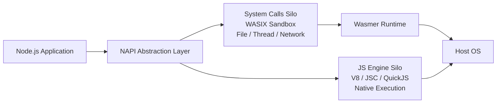
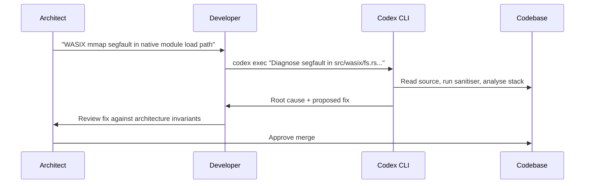

# From One Year to Two Weeks: How Wasmer Built Edge.js with Codex CLI and What Systems Programmers Should Learn from It


---

On 3 June 2026, OpenAI published a case study detailing how Wasmer — a small WebAssembly infrastructure company — used Codex to build Edge.js, a full Node.js v24-compatible runtime that executes inside a WebAssembly sandbox [^1]. The headline figure was stark: a project estimated at one year of engineering was shipped in two weeks, a 10–20× acceleration [^2]. This is not a CRUD application or a marketing site. Edge.js is a systems-level runtime that reimplements NAPI bindings, bridges multiple JavaScript engines, and isolates OS system calls through WASIX — the kind of work traditionally reserved for large, specialist teams.

For senior developers considering Codex CLI for similarly ambitious projects, the Wasmer story is less about the speed-up itself and more about the *patterns* that made it possible.

## What Edge.js Actually Is

Edge.js splits its sandbox into two silos [^3]:

1. **JavaScript engine silo** — runs natively (V8, JavaScriptCore, or QuickJS), since JavaScript execution is sandboxed by design.
2. **OS system calls silo** — isolated via WASIX for file operations, threading, and network access.



This architecture avoids the traditional approach of running the entire runtime inside WebAssembly, which would impose prohibitive overhead. Instead, Edge.js sandboxes only the unsafe parts — system calls and native module logic — whilst the JavaScript engine runs at native speed [^3]. The result passes 3,592 of 3,626 tests in the Node.js v24 test suite [^4], with a 5–20% overhead in native mode and approximately 30% when fully sandboxed with the `--safe` flag [^3].

## The Development Workflow That Delivered

Wasmer's CEO Syrus Akbary Nieto described the shift bluntly: "We are actually moving out of the IDE itself, and we are not touching the code as much. We are just guiding it where we want it to go" [^2]. This phrasing — *guiding rather than writing* — captures a pattern that maps directly to Codex CLI's architecture.

### Phase 1: Architectural Scaffolding

Codex was used from the project's inception [^5]. The initial phase involved defining the dual-silo architecture, the NAPI abstraction layer, and the WASIX integration points. For Codex CLI users, this maps to the **plan-then-implement** workflow:

```bash
codex exec --sandbox workspace-write \
  "Design the module boundary between the JS engine silo and the WASIX \
   system call silo. Write an ARCHITECTURE.md explaining the NAPI \
   abstraction layer, the engine-swap mechanism, and the WASIX \
   isolation boundary. Include a dependency graph."
```

At this stage, the model is operating as an architectural reasoning engine. GPT-5.4 and GPT-5.5 — the models Wasmer primarily used [^6] — handle this well because architectural decisions follow documented patterns with well-defined trade-offs.

### Phase 2: Systems-Level Implementation

The bulk of the two-week sprint involved implementing NAPI bindings, bridging libuv, simdutf, llhttp, ncrypto, and ares [^3]. This is exactly the kind of work where coding agents excel when given sufficient context: each dependency has well-documented APIs, test suites, and header files that serve as ground truth.

The Codex CLI pattern for this phase leverages the `/goal` command for long-horizon work:

```bash
codex
> /goal Implement the NAPI abstraction layer that bridges V8's native
>   bindings to our WASIX-compatible system call interface. The layer
>   must pass the Node.js NAPI test suite. Reference the existing
>   libuv event loop integration in src/runtime/event_loop.rs.
```

Goal mode keeps Codex planning, executing, and self-correcting across multiple turns without requiring human intervention at each step [^7] — critical when the task involves hundreds of interconnected source files.

### Phase 3: Low-Level Debugging

Perhaps the most striking claim from Wasmer was that Codex performed low-level debugging and assembly analysis, identifying bugs and their root causes "with remarkable speed" [^2]. Team members with no C++ expertise were able to collaborate on fixing bugs thanks to Codex's ability to reason about memory layouts, pointer arithmetic, and calling conventions [^5].

For Codex CLI users, this maps to a specific workflow pattern:

```bash
codex exec --sandbox danger-full-access \
  "The WASIX file-read syscall segfaults when called from a native
   module loaded via NAPI. The crash occurs in src/wasix/fs.rs at
   the mmap boundary. Reproduce the crash, analyse the core dump,
   identify the root cause, and propose a fix. Do not modify the
   NAPI interface contract."
```

The `danger-full-access` sandbox is required here because debugging involves reading core dumps, running sanitisers, and executing the runtime under test conditions. The explicit constraint — *do not modify the NAPI interface contract* — prevents the model from "solving" the bug by changing the public API.

## The Patterns That Generalise

The Wasmer case study validates several patterns for using Codex CLI on systems-level projects:

### 1. Sandbox Only What Is Unsafe — In Your Agent Configuration Too

Edge.js's architectural insight — sandbox the system calls, not the engine — mirrors the correct Codex CLI configuration strategy. Use `workspace-write` for the implementation phase and escalate to `danger-full-access` only for debugging sessions that require core dump access or sanitiser execution.

```toml
# config.toml for systems programming projects
[profiles.implement]
sandbox = "workspace-write"
model = "gpt-5.5"
approval_policy = "unless-allow-listed"

[profiles.debug]
sandbox = "danger-full-access"
model = "gpt-5.5"
approval_policy = "on-failure"
```

### 2. Use AGENTS.md to Encode Architectural Invariants

Wasmer's dual-silo design has hard boundaries that the agent must never cross. Encoding these in AGENTS.md prevents the model from, say, moving a system call out of the WASIX silo into native execution:

```markdown
## Architecture Invariants

- All OS system calls MUST route through the WASIX silo in `src/wasix/`
- The JS engine silo MUST NOT make direct syscalls
- NAPI bindings are the ONLY bridge between silos
- Native modules MUST target NAPI, never V8 directly
```

Research shows that well-structured AGENTS.md files reduce agent runtime by 28.64% [^8] — but more importantly for systems work, they prevent architectural drift that would be catastrophic in a runtime.

### 3. Break the Work Into Engine-Testable Units

Edge.js's test suite (3,592 passing tests) served as a continuous verification signal. Each Codex CLI session could target a specific test failure:

```bash
codex exec --sandbox workspace-write \
  --output-schema test-result.schema.json \
  "Fix the failing test: test/parallel/test-net-connect-options.js.
   The test expects TCP connection options to propagate through the
   WASIX networking layer. Do not skip or modify the test."
```

The `--output-schema` flag forces structured output, making it possible to chain results into a CI pipeline that tracks progress across hundreds of test cases.

### 4. Let Domain Non-Experts Contribute via the Agent

Wasmer explicitly noted that developers without C++ or Node internals expertise contributed bug fixes through Codex [^5]. This is the **guided debugging** pattern: a senior architect identifies the symptom and the subsystem, then hands the investigation to a developer who uses Codex to navigate unfamiliar code:



This pattern requires that the AGENTS.md file is comprehensive enough to prevent the non-expert from accepting a fix that violates architectural invariants.

## What This Means for Codex CLI's Positioning

The Edge.js project demonstrates that Codex CLI is not limited to application-layer development. Systems programming — runtimes, sandboxes, native bindings — is within reach, provided:

1. **The domain has well-documented APIs** (NAPI, POSIX, WASIX all have extensive specifications).
2. **Test suites exist** to verify correctness continuously.
3. **Architectural invariants are encoded** in AGENTS.md rather than left implicit.
4. **The sandbox configuration matches the task** — write access for implementation, full access for debugging.

The 10–20× speed-up is notable, but the more durable insight is that Codex enabled a small company to tackle a project "that was only possible at big companies" [^2]. The constraint was never the model's capability — it was the engineering harness around it.

## Caveats

Edge.js's performance overhead (5–30% depending on sandbox mode) means it is not a drop-in replacement for Node.js in latency-sensitive paths [^3]. The project also lacks snapshot support for fast startup, which is planned for future releases [^3]. And critically, the "two weeks" timeline involved experienced WebAssembly engineers guiding the agent — not novices prompting from scratch. ⚠️ The specific acceleration factor (10–20×) is self-reported by Wasmer and has not been independently verified.

## Citations

[^1]: OpenAI, "How Wasmer used Codex to build a Node.js runtime for the edge," openai.com, 3 June 2026. [https://openai.com/index/wasmer/](https://openai.com/index/wasmer/)

[^2]: StartupHub.ai, "Wasmer's Node.js Edge Runtime Built in Record Time," startuphub.ai, June 2026. [https://www.startuphub.ai/ai-news/artificial-intelligence/2026/wasmer-s-node-js-edge-runtime-built-in-record-time](https://www.startuphub.ai/ai-news/artificial-intelligence/2026/wasmer-s-node-js-edge-runtime-built-in-record-time)

[^3]: Wasmer, "Edge.js: Running Node apps inside a WebAssembly Sandbox," wasmer.io, 2026. [https://wasmer.io/posts/edgejs-safe-nodejs-using-wasm-sandbox](https://wasmer.io/posts/edgejs-safe-nodejs-using-wasm-sandbox)

[^4]: SimpleNews.ai, "Edge.js: Wasmer's WebAssembly-Sandboxed Node.js Runtime Promises Secure Code Execution Without Docker," simplenews.ai, 2026. [https://www.simplenews.ai/news/edge-js-wasmer-webassembly-sandboxed-nodejs-runtime](https://www.simplenews.ai/news/edge-js-wasmer-webassembly-sandboxed-nodejs-runtime)

[^5]: StartupHub.ai, "Wasmer's Syrus Akbary on AI-Powered JavaScript Runtime," startuphub.ai, 2026. [https://www.startuphub.ai/ai-news/artificial-intelligence/2026/wasmer-s-syrus-akbary-on-ai-powered-javascript-runtime](https://www.startuphub.ai/ai-news/artificial-intelligence/2026/wasmer-s-syrus-akbary-on-ai-powered-javascript-runtime)

[^6]: Heise Online, "JavaScript runtime developed with AI: Edge.js for secure Node.js applications," heise.de, 2026. [https://www.heise.de/en/news/JavaScript-runtime-developed-with-AI-Edge-js-for-secure-Node-js-applications-11215908.html](https://www.heise.de/en/news/JavaScript-runtime-developed-with-AI-Edge-js-for-secure-Node-js-applications-11215908.html)

[^7]: OpenAI, "Run long horizon tasks with Codex," developers.openai.com, 2026. [https://developers.openai.com/blog/run-long-horizon-tasks-with-codex](https://developers.openai.com/blog/run-long-horizon-tasks-with-codex)

[^8]: Lulla et al., "On the Impact of AGENTS.md Files on the Efficiency of AI Coding Agents," arXiv:2601.20404, 2026.
