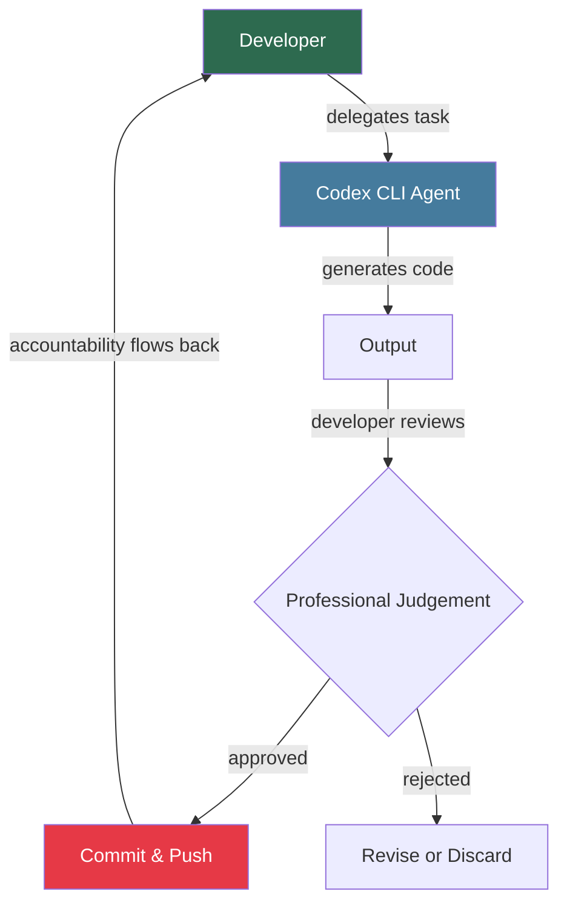
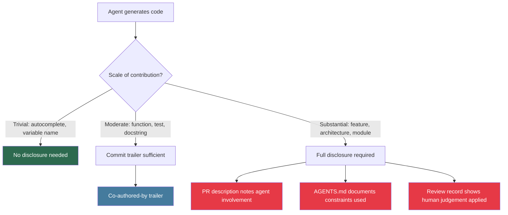

# Agent Ethics and Professional Responsibility: Attribution, Disclosure, and Accountability When Delegating Engineering Judgement to Codex CLI


---

Every professional code of conduct in software engineering — ACM, IEEE, BCS — was written before a developer could delegate substantial engineering judgement to an autonomous agent. Yet the obligations those codes impose have not changed: you remain accountable for the code you ship, the systems you deploy, and the harm they cause. This article maps the ethical landscape that senior developers navigate daily when using Codex CLI, and provides concrete configuration patterns for maintaining professional standards in the agentic era.

## The Non-Delegable Core

The ACM Code of Ethics (Principle 1.6) states that computing professionals are obliged to perform work only in areas of competence, and to be forthright about any limitations in their competence[^1]. The IEEE/ACM Software Engineering Code of Ethics (Principle 3.10) requires engineers to ensure adequate testing, debugging, and review of software on which they work[^2]. The BCS Code of Conduct (Section 1) mandates that members shall have due regard for public health, privacy, security, and the wellbeing of others[^3].

None of these codes contemplates AI agents, but their logic is clear: **professional responsibility is non-delegable**. When you run `codex --full-auto` and push the result, you are asserting — to your employer, your users, and your profession — that the code meets the standard of care expected of a competent engineer. The agent is a tool, not a colleague who shares liability.



The arrow from "Commit & Push" back to "Developer" is the critical one. No amount of automation removes it.

## Attribution: The Transparency Obligation

### The Codex CLI Default

Since February 2026, Codex CLI injects a `Co-authored-by: Codex <noreply@openai.com>` trailer into commit messages by default[^4]. This is controlled by the `commit_attribution` key in `~/.codex/config.toml`:

```toml
# Default — agent co-authorship is declared
commit_attribution = true

# Disabling attribution is possible but raises ethical questions
# commit_attribution = false
```

Disabling attribution is technically permitted but professionally questionable. If your organisation's code review process assumes human authorship, suppressing the trailer amounts to a material omission.

### The Linux Kernel Precedent

In April 2026, the Linux kernel project published its formal AI patch policy — the first major open-source governance framework for agent-generated contributions[^5]. The key provisions:

1. **AI agents cannot use `Signed-off-by`** — the legally binding Developer Certificate of Origin tag remains reserved for humans who take personal responsibility.
2. **A new `Assisted-by` tag is mandatory** for AI-assisted contributions, providing an auditable trail.
3. **Human liability is absolute** — any bugs, security flaws, or licensing violations in AI-generated code fall on the human submitter[^5].

This framework is already propagating. Apache, CPython, and the major JavaScript foundations are expected to adopt similar policies within the year[^6].

### Configuring Attribution for Compliance

For teams contributing to projects with formal AI disclosure policies, configure Codex CLI to include explicit attribution metadata:

```toml
# ~/.codex/config.toml
commit_attribution = true

# AGENTS.md addition for commit message conventions
# Add to your repository's AGENTS.md:
```

In your repository's `AGENTS.md`, add a commit message convention section:

```markdown
## Commit Conventions

- Always include `Co-authored-by: Codex <noreply@openai.com>` in commit messages.
- For Linux kernel contributions, use `Assisted-by: OpenAI Codex CLI` instead of `Co-authored-by`.
- Never use `Signed-off-by` for commits where the agent wrote substantial portions of the code without line-by-line human review.
```

## Agent Fingerprinting and Detectability

Attempting to disguise agent-generated code is increasingly futile. Research presented at MSR 2026 (Mining Software Repositories, Rio de Janeiro, April 2026) demonstrated that AI coding agent authorship can be identified with 97.2% F1-score across five major agents, using 41 features spanning commit patterns, PR structure, and code characteristics[^7].

Distinctive Codex CLI signatures include multiline commits (67.5% of agent PRs) and specific code complexity patterns[^7]. Coderbuds has open-sourced detection rules covering Claude Code, GitHub Copilot, and Cursor, with Codex patterns available in YAML format[^8].

The practical implication: **assume your agent-generated code is identifiable**. Colleagues, auditors, and open-source maintainers can detect it. Transparency is not optional — it is the only defensible posture.

## The Copyright Trilemma

AI-generated code that lacks significant human creative contribution is ineligible for copyright protection under current US law[^9]. This creates a three-way tension:

1. **Developer-as-author**: if you prompt the agent with sufficient specificity and review the output with professional judgement, your contribution may constitute copyrightable authorship.
2. **Agent-as-tool**: the AI is legally a tool, not an author, but the code it produces may inadvertently incorporate patterns from its training data, carrying latent open-source licence obligations[^10].
3. **Organisation-as-deployer**: your employer's terms of service with OpenAI govern commercial use, but no major AI coding vendor (including OpenAI) offers copyright indemnification comparable to Microsoft's Copilot Copyright Commitment[^11].

### Practical Licence Hygiene

Configure Codex CLI to respect licence boundaries:

```toml
# Profile for open-source contributions with licence awareness
[profiles.oss-contrib]
model = "gpt-5.5"
model_reasoning_effort = "high"
```

In `AGENTS.md`, add licence-aware constraints:

```markdown
## Licence Compliance

- Never generate code that replicates substantial portions of known copyrighted works.
- When generating code for GPL-licensed projects, ensure all output is compatible with the project's licence.
- Flag any generated code that resembles well-known library APIs for human review.
- Do not copy-paste from web search results without verifying the source licence.
```

## The EU AI Act: What Applies on 2 August 2026

The EU AI Act's main enforcement date — 2 August 2026 — activates the high-risk AI compliance framework (Articles 8–15), Article 50 transparency requirements, and national enforcement powers[^12]. For developers using Codex CLI, the key questions are:

**Does Codex CLI trigger high-risk obligations?** Generally, no. AI-generated code for ordinary development assistance does not fall under Annex III's regulated use cases[^13]. However, two scenarios do trigger obligations:

- **Worker evaluation**: using Codex CLI output to evaluate developer productivity, rank engineers, or allocate tasks algorithmically falls under the employment category of Annex III[^13].
- **Safety-critical deployment**: if the agent autonomously generates code deployed to energy grids, financial infrastructure, or healthcare systems, the deploying organisation inherits full high-risk documentation, logging, and human oversight obligations under Articles 9–17[^12].

**Article 50 transparency**: AI-generated content must be disclosed when it could be mistaken for human-created content[^12]. For code, the `Co-authored-by` trailer satisfies this requirement in most interpretations. ⚠️ Legal interpretations may vary across EU member states — consult your organisation's legal counsel for jurisdiction-specific guidance.

### Configuration for EU Compliance

```toml
# Enforce attribution for EU AI Act Article 50 compliance
commit_attribution = true

# Enable audit logging
[history]
# Sessions are saved as JSONL in ~/.codex/sessions/
# Retain for the period required by your organisation's data retention policy
```

## The CSA Disclosure Vacuum

The Cloud Security Alliance published its "AI Agent Disclosure Vacuum" whitepaper in April 2026, identifying a critical gap: most enterprises cannot reliably distinguish AI agent activity from human activity in their logs[^14]. The whitepaper found that nearly three-quarters of surveyed enterprises report their AI agents receive more access than required for their assigned tasks[^14].

For Codex CLI users, this translates into a practical obligation: **make agent activity auditable**. The minimum configuration:

```toml
# Export session traces for audit
# Codex CLI supports OpenTelemetry export
[telemetry]
# Configure OTLP endpoint for your observability platform
```

Combined with the `commit_attribution = true` default, this ensures that SOC 2 auditors — who increasingly ask for agent activity trails[^4] — can trace which code originated from agent sessions.

## The Disclosure Decision Framework

Not every use of Codex CLI requires the same level of disclosure. Here is a practical framework, adapted from Red Hat's guidance on AI-assisted contributions[^10]:



The threshold matters. A developer who asks Codex CLI to autocomplete a variable name is using a tool no differently from an IDE's built-in suggestions. A developer who delegates an entire feature to `codex exec` and merges the result bears a disclosure obligation proportional to the delegation.

## Seven Practices for Professional Integrity

### 1. Never Suppress Attribution

Keep `commit_attribution = true`. If your organisation requires it disabled for branding reasons, ensure an alternative disclosure mechanism exists (PR template, commit body note, or CI metadata).

### 2. Review Before You Sign

The `Signed-off-by` tag — used by the Linux kernel and many other projects — is a personal attestation that you have the right to submit the code and have reviewed it[^5]. Never attach it to code you have not read and understood.

### 3. Match Approval Mode to Accountability

```toml
# For code you'll personally review: suggest mode
[profiles.reviewed]
approval_policy = "on-request"
sandbox_mode = "workspace-write"

# For exploratory work you'll discard: full-auto is acceptable
[profiles.exploratory]
approval_policy = "on-request"
sandbox_mode = "workspace-write"
```

Running `--full-auto` on production code destined for a safety-critical system without subsequent human review is a professional judgement failure, regardless of the agent's capability.

### 4. Document Constraints in AGENTS.md

Your `AGENTS.md` is not just an agent configuration file — it is a record of the professional constraints you imposed on the agent's behaviour. Version-control it, review changes, and treat it as part of your engineering governance:

```markdown
## Professional Constraints

- All security-sensitive code requires human review before commit.
- Generated tests must achieve branch coverage; do not generate tests that merely assert the current output.
- Do not modify authentication, authorisation, or cryptographic code without explicit human approval.
- Flag any generated code that makes assumptions about data privacy or user consent.
```

### 5. Maintain a Verification Trail

For regulated environments, ensure that your review process is documented:

```bash
# Use codex exec with structured output for auditable reviews
codex exec "Review this diff for security issues" \
  --output-schema '{"findings": [{"severity": "string", "description": "string", "line": "number"}]}' \
  < <(git diff HEAD~1)
```

### 6. Disclose in Open Source Contributions

When contributing to open-source projects, follow the project's AI disclosure policy. Where no policy exists, default to the Linux kernel's `Assisted-by` tag as the emerging standard[^5].

### 7. Know When Not to Delegate

Some engineering decisions should not be delegated to an agent, regardless of its capability:

- **Architectural decisions** that bind the project for years
- **Security design** where threat modelling requires domain expertise
- **Ethical trade-offs** where user privacy, accessibility, or fairness are at stake
- **Regulatory compliance** where incorrect implementation carries legal penalties

Use Codex CLI to explore options and generate drafts in these areas, but keep the final decision — and the professional judgement it represents — firmly human.

## The Professional Standard Is Evolving

The gap between what professional codes of conduct require and what the tooling makes possible is narrowing. The Linux kernel's AI patch policy, the CSA's disclosure framework, and the EU AI Act's transparency requirements are converging on a single principle: **the human engineer remains the accountable party, and transparency about AI involvement is not optional**.

Codex CLI's default configuration — with attribution enabled, session logging, and explicit approval modes — already supports this principle. The remaining work is organisational: ensuring that teams adopt these defaults consistently, that review processes account for agent-generated code, and that professional development includes the ethical dimensions of agent delegation.

The code of ethics you signed when you joined ACM, IEEE, or BCS did not anticipate Codex CLI. But its core obligation — that you exercise professional judgement and accept responsibility for the systems you build — applies without modification. The tool has changed. The standard has not.

## Citations

[^1]: ACM, "ACM Code of Ethics and Professional Conduct," [https://www.acm.org/code-of-ethics](https://www.acm.org/code-of-ethics)
[^2]: ACM/IEEE, "Software Engineering Code of Ethics and Professional Practice," [https://www.acm.org/code-of-ethics/software-engineering-code](https://www.acm.org/code-of-ethics/software-engineering-code)
[^3]: BCS, "BCS Code of Conduct for members," [https://www.bcs.org/membership-and-registrations/become-a-member/bcs-code-of-conduct/](https://www.bcs.org/membership-and-registrations/become-a-member/bcs-code-of-conduct/)
[^4]: Codex CLI commit attribution configuration, Codex Knowledge Base, [https://codex.danielvaughan.com/2026/03/28/codex-cli-commit-attribution/](https://codex.danielvaughan.com/2026/03/28/codex-cli-commit-attribution/)
[^5]: Linux kernel AI patch policy, Tom's Hardware, April 2026, [https://www.tomshardware.com/software/linux/linux-lays-down-the-law-on-ai-generated-code-yes-to-copilot-no-to-ai-slop-and-humans-take-the-fall-for-mistakes-after-months-of-fierce-debate-torvalds-and-maintainers-come-to-an-agreement](https://www.tomshardware.com/software/linux/linux-lays-down-the-law-on-ai-generated-code-yes-to-copilot-no-to-ai-slop-and-humans-take-the-fall-for-mistakes-after-months-of-fierce-debate-torvalds-and-maintainers-come-to-an-agreement)
[^6]: Ship or Skip, "Linux Kernel Maintainers Publish Official AI Patch Policy," April 2026, [https://shiporskip.io/news/linux-kernel-ai-assisted-patches-official-guidance-maintainer-policy-2026](https://shiporskip.io/news/linux-kernel-ai-assisted-patches-official-guidance-maintainer-policy-2026)
[^7]: Ghaleb et al., "Fingerprinting AI Coding Agents on GitHub," MSR 2026, [https://arxiv.org/abs/2601.17406](https://arxiv.org/abs/2601.17406)
[^8]: Coderbuds, "Open-Sourcing AI Code Detection," 2026, [https://coderbuds.com/blog/open-source-ai-code-detection-yaml-rules](https://coderbuds.com/blog/open-source-ai-code-detection-yaml-rules)
[^9]: Carlton Fields, "AI Makes Securing Copyright Protection for Software Code Tricky," 2026, [https://www.carltonfields.com/insights/publications/2026/ai-makes-securing-copyright-protection-for-software-code-tricky-bloomberg-law](https://www.carltonfields.com/insights/publications/2026/ai-makes-securing-copyright-protection-for-software-code-tricky-bloomberg-law)
[^10]: Red Hat, "AI-assisted development and open source: legal and cultural issues," 2026, [https://www.redhat.com/en/blog/ai-assisted-development-and-open-source-navigating-legal-issues](https://www.redhat.com/en/blog/ai-assisted-development-and-open-source-navigating-legal-issues)
[^11]: BuildMVPFast, "AI Generated Code Liability: Copyright Risk, EU Directive & Startup Legal Guide 2026," [https://www.buildmvpfast.com/blog/ai-generated-code-liability-legal-risk-copyright-2026](https://www.buildmvpfast.com/blog/ai-generated-code-liability-legal-risk-copyright-2026)
[^12]: EU AI Act developer compliance guide, Anonymize.dev, 2026, [https://anonymize.dev/blog/eu-ai-act-developer-checklist-2026.html](https://anonymize.dev/blog/eu-ai-act-developer-checklist-2026.html)
[^13]: Augment Code, "The 2026 EU AI Act and AI-Generated Code: What Changes for Dev Teams," [https://www.augmentcode.com/guides/eu-ai-act-2026](https://www.augmentcode.com/guides/eu-ai-act-2026)
[^14]: Cloud Security Alliance, "The AI Agent Disclosure Vacuum," April 2026, [https://labs.cloudsecurityalliance.org/research/csa-whitepaper-ai-agent-disclosure-accountability-gap-202604/](https://labs.cloudsecurityalliance.org/research/csa-whitepaper-ai-agent-disclosure-accountability-gap-202604/)
