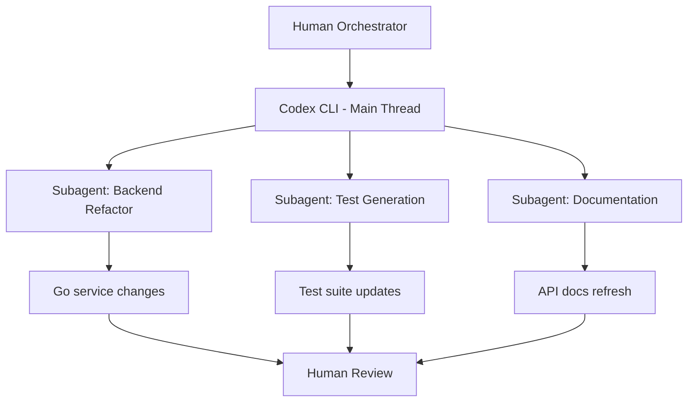
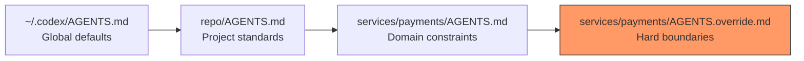

# Anthropic's Eight Agentic Coding Trends Mapped to Codex CLI: A Practitioner's Configuration Guide


Anthropic's 2026 Agentic Coding Trends Report landed in June with the kind of data that makes engineering managers forward emails and developers actually read them. The headline numbers are striking: 78% of Claude Code sessions now involve multi-file edits, average session length has climbed from four minutes to twenty-three, and agents execute an average of 47 tool calls per session [^1]. The eight trends the report identifies — from the orchestration shift to intent-as-infrastructure — are not Claude-specific observations. They describe structural changes in how software gets built with any agent, Codex CLI included.

This article maps each of the eight trends to concrete Codex CLI configuration, commands, and workflow patterns. If you have read the report and thought "yes, but what do I actually change in my `config.toml`?", this is the answer.

## Trend 1: The Orchestration Shift

The report's central thesis: engineers are transitioning from implementers to orchestrators of agent systems [^1]. Rakuten's team deployed an agent across a 12.5-million-line codebase in a single seven-hour autonomous run [^2].

In Codex CLI, orchestration means structuring the agent's environment rather than writing the code yourself. The primary levers are AGENTS.md, profiles, and subagent configuration.

```toml
# ~/.codex/orchestrator.config.toml
model = "gpt-5.5"
model_reasoning_effort = "high"

[agents]
max_threads = 4
max_depth = 2

[agents.backend]
description = "Handles Go services under services/api/. Runs go test after every change."

[agents.frontend]
description = "Handles React components under web/. Runs vitest after every change."
```

The orchestrator profile delegates decomposed tasks to specialised subagents, each scoped to a service boundary. The `max_depth = 2` setting allows subagents to spawn their own children for nested decomposition — the agent equivalent of a team lead delegating to seniors who delegate to juniors.

## Trend 2: The Delegation Gap

Developers use AI in roughly 60% of their work but report being able to fully delegate only 0–20% of tasks [^1]. The gap is not a capability problem; it is a trust problem rooted in unclear specifications.

Codex CLI closes this gap through its approval policy gradient:

```toml
# Level 1: Watch everything (0% delegation)
approval_policy = "on-request"

# Level 2: Trust reads, approve writes (partial delegation)
[approval_policy.granular]
sandbox_approval = "auto-edit-only"
rules = "auto"

# Level 3: Trust within boundaries (high delegation)
approval_policy = "never"
sandbox_mode = "workspace-write"

# Level 4: Full delegation with auto-review guardrail
approval_policy = "never"
approvals_reviewer = "auto_review"
```

The critical insight: delegation is not binary. Move through these levels per-project, using the `--profile` flag to switch contexts. A mature payment service gets Level 2; a new prototype gets Level 3. The auto-review subagent at Level 4 adds a second model pass that catches the mistakes the delegation gap is really about [^3].

## Trend 3: Long-Running Agents

Autonomous sessions now stretch from minutes to hours [^1]. A seven-hour misaligned run wastes substantially more resources than a five-minute one.

Codex CLI mitigates long-run risk through compaction, timeouts, and session management:

```toml
# Prevent context degradation in long sessions
model_auto_compact_token_limit = 80000
model_context_window = 200000

# Bound subagent execution time
[agents]
job_max_runtime_seconds = 3600
```

For sessions that genuinely need to run for hours, the session lifecycle commands become essential:

```bash
# Archive completed sessions to keep the picker clean
codex archive <SESSION_ID>

# Fork a long session to explore an alternative approach
# without polluting the original transcript
codex fork --last

# Resume after a break — context survives terminal closure
codex resume --last
```

The `/compact` slash command is your manual pressure valve. When a long session starts producing vague or repetitive output, compact the history and re-anchor the agent with a fresh instruction [^4].

## Trend 4: Multi-Agent Systems

Single-agent workflows evolve into coordinated teams [^1]. Orchestrators decompose problems whilst specialised agents handle components.

Codex CLI's subagent system supports this natively:



For cross-vendor multi-agent setups, the `codex mcp-server` command exposes Codex CLI as an MCP server that other agents can call [^5]:

```bash
# Expose Codex as a tool for an external orchestrator
codex mcp-server --sandbox workspace-write

# Or run parallel agents in isolated worktrees
git worktree add ../feature-auth -b feature/auth
git worktree add ../feature-billing -b feature/billing
# Terminal 1: codex --profile backend (in ../feature-auth)
# Terminal 2: codex --profile backend (in ../feature-billing)
```

The `agents.max_threads = 6` default caps concurrency. For larger parallel workloads, the Oh-My-Codex orchestration layer wraps Codex CLI with a git-worktree-per-worker pattern [^6].

## Trend 5: Cross-Organisational Adoption

Agent orchestration expands beyond engineering. Zapier reports 89% AI adoption across their entire organisation with 800+ internal agents deployed [^2].

For CLI-first teams supporting non-engineering adoption, Codex profiles and AGENTS.md templates lower the barrier:

```markdown
<!-- AGENTS.md for a data analytics team -->
## Context
This repository contains Jupyter notebooks and Python scripts for
quarterly revenue analysis. The team uses pandas, matplotlib, and
BigQuery.

## Rules
- Never modify data in the production BigQuery dataset
- Always add a markdown cell explaining methodology before analysis code
- Run `pytest tests/` after modifying any utility function
- Output charts as PNG files in the `reports/` directory
```

Combined with a restrictive profile (`sandbox_mode = "read-only"` for production data queries), non-engineering teams get guardrailed agent access without needing to understand sandbox internals [^3].

## Trend 6: Backlog Expansion

Approximately 27% of AI-assisted work represents tasks that would not have existed otherwise — internal dashboards, papercut fixes, and previously unfeasible experiments [^1]. The coding phase is 60–70% faster; testing is 50–60% faster [^7].

Codex CLI's `exec` subcommand is purpose-built for this expanded backlog:

```bash
# Previously uneconomical: lint every historical commit message
codex exec "Scan the last 200 commit messages. Flag any that \
don't follow Conventional Commits format. Output a CSV with \
commit hash, message, and suggested fix." \
  --output-schema '{"type":"array","items":{"type":"object",\
  "properties":{"hash":{"type":"string"},"message":{"type":"string"},\
  "fix":{"type":"string"}}}}' > commit-lint.json

# Previously uneconomical: generate missing JSDoc for every export
codex exec "Find every exported function in src/ missing JSDoc. \
Add comprehensive JSDoc with @param, @returns, and @example tags."
```

The economics shift when a task that took a developer two hours now takes fifteen minutes of agent time at a fraction of the token cost. Profile-based model routing amplifies this — use `codex-spark` for bulk papercut work and reserve `gpt-5.5` for architectural decisions [^8].

## Trend 7: Verification as the Bottleneck

As execution costs drop, assessing what deserves building matters more than writing the code [^1]. The report finds that developer acceptance of agent-generated changes is 89% when the agent provides a diff summary, versus 62% for raw output [^7].

Codex CLI addresses verification through its layered hook system:

```toml
# config.toml — verification hooks
[[hooks]]
event = "PostToolUse"
command = "python3 .codex/hooks/verify-tests.py"

[[hooks]]
event = "Stop"
command = "bash .codex/hooks/run-full-suite.sh"
```

```python
# .codex/hooks/verify-tests.py
import json, sys, subprocess

payload = json.load(sys.stdin)
tool_name = payload.get("tool_name", "")
if tool_name in ("apply_patch", "write"):
    result = subprocess.run(["npm", "test"], capture_output=True)
    if result.returncode != 0:
        response = {
            "decision": "report_error",
            "message": f"Tests failed after edit:\n{result.stderr.decode()[:500]}"
        }
        json.dump(response, sys.stdout)
        sys.exit(0)

json.dump({"decision": "approve"}, sys.stdout)
```

The `/review` slash command adds a dedicated reviewer mode that analyses diffs without modifying the working tree — ideal for the verification-first workflow the report advocates [^3].

## Trend 8: Intent as Infrastructure

Specifications replace prompts as durable, executable artefacts [^1]. Projects with well-maintained context files see 40% fewer agent errors and 55% faster task completion [^7].

In Codex CLI, intent-as-infrastructure manifests through the AGENTS.md hierarchy:

```
project-root/
  AGENTS.md                    # Global intent: coding standards, test commands
  services/
    payments/
      AGENTS.md                # Service intent: PCI compliance rules, schema constraints
      AGENTS.override.md       # Hard overrides: never touch migration files directly
    auth/
      AGENTS.md                # Service intent: OAuth patterns, session handling
  infrastructure/
    AGENTS.md                  # IaC intent: Terraform conventions, state lock rules
```



The resolution chain walks from global to local, concatenating instructions up to the `project_doc_max_bytes` limit (32 KiB by default) [^9]. Override files at any level replace rather than append, giving teams a hard boundary mechanism for compliance-critical paths.

Version-controlling AGENTS.md files means intent survives model upgrades, team changes, and profile switches. When GPT-5.5 ships a point release, the AGENTS.md still applies — prompt patterns may not [^10].

## Putting It Together: A Starter Configuration

For teams adopting these trends systematically, here is a minimal `config.toml` that addresses all eight:

```toml
# Trend 1 & 4: Orchestration and multi-agent
model = "gpt-5.5"
model_reasoning_effort = "high"
[agents]
max_threads = 4
max_depth = 2

# Trend 2: Closing the delegation gap
approval_policy = "never"
approvals_reviewer = "auto_review"
sandbox_mode = "workspace-write"

# Trend 3: Long-running sessions
model_auto_compact_token_limit = 80000

# Trend 7: Verification hooks
[[hooks]]
event = "PostToolUse"
command = "python3 .codex/hooks/post-edit-verify.py"

[[hooks]]
event = "Stop"
command = "bash .codex/hooks/final-verification.sh"
```

Combine with a layered AGENTS.md hierarchy (Trend 8), `codex exec` for backlog expansion (Trend 6), restrictive profiles for non-engineering teams (Trend 5), and you have a configuration stack that operationalises every trend the report identifies.

## The Report's Blind Spot

Anthropic's report is inevitably Claude-centric. Its session metrics come from Claude Code telemetry; its case studies feature Claude deployments. But the structural trends it identifies — orchestration over implementation, verification over generation, intent over prompts — are agent-agnostic observations. The question is not whether these trends apply to Codex CLI. It is whether your configuration already reflects them.

## Citations

[^1]: Anthropic, "2026 Agentic Coding Trends Report," June 2026. [https://resources.anthropic.com/2026-agentic-coding-trends-report](https://resources.anthropic.com/2026-agentic-coding-trends-report)

[^2]: Hivetrail, "We Read Anthropic's 2026 Agentic Coding Trends Report. Here's What It Actually Means for Engineering Teams," June 2026. [https://hivetrail.com/blog/anthropic-2026-agentic-coding-report/](https://hivetrail.com/blog/anthropic-2026-agentic-coding-report/)

[^3]: OpenAI, "Configuration Reference — Codex CLI," June 2026. [https://developers.openai.com/codex/config-reference](https://developers.openai.com/codex/config-reference)

[^4]: OpenAI, "Slash Commands in Codex CLI," June 2026. [https://developers.openai.com/codex/cli/slash-commands](https://developers.openai.com/codex/cli/slash-commands)

[^5]: OpenAI, "Features — Codex CLI," June 2026. [https://developers.openai.com/codex/cli/features](https://developers.openai.com/codex/cli/features)

[^6]: Particula Tech, "Run Parallel Coding Agents With the oh-my-codex Pattern," 2026. [https://particula.tech/blog/parallel-coding-agents-worktree-pattern-oh-my-codex](https://particula.tech/blog/parallel-coding-agents-worktree-pattern-oh-my-codex)

[^7]: ByteIota, "Anthropic's 2026 Agentic Coding Report: 8 Trends Now," June 2026. [https://byteiota.com/anthropics-2026-agentic-coding-report-8-trends-now/](https://byteiota.com/anthropics-2026-agentic-coding-report-8-trends-now/)

[^8]: OpenAI, "Advanced Configuration — Codex," June 2026. [https://developers.openai.com/codex/config-advanced](https://developers.openai.com/codex/config-advanced)

[^9]: OpenAI, "Custom Instructions with AGENTS.md — Codex," June 2026. [https://developers.openai.com/codex/guides/agents-md](https://developers.openai.com/codex/guides/agents-md)

[^10]: Code Gateway, "AGENTS.md for Codex CLI (2026): Lookup Order, Limits & Monorepo Templates," 2026. [https://www.codegateway.dev/en/blog/agents-md-playbook-2026](https://www.codegateway.dev/en/blog/agents-md-playbook-2026)
