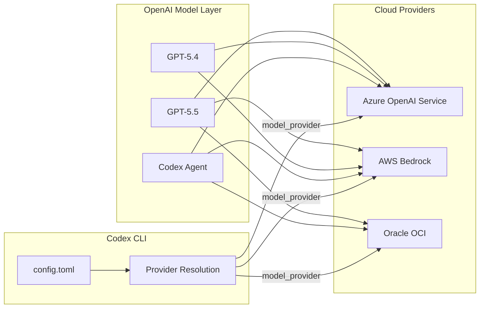

# Codex CLI Goes Multi-Cloud: Oracle OCI Joins AWS Bedrock and Azure, and What Provider-Agnostic Agent Workflows Look Like in Practice


---

On 10 June 2026, OpenAI announced that its frontier models and Codex are accessible through Oracle Cloud Infrastructure, with eligible Oracle Universal Credits applicable toward usage [^1]. The announcement follows the AWS Bedrock general availability of OpenAI models in April [^2] and the longstanding Azure OpenAI Service integration [^3]. For the first time, Codex CLI developers can choose between three major cloud providers — or configure fallback chains across all three — without changing a line of agent logic.

This article examines what the multi-cloud distribution strategy means for CLI-first developers, walks through provider configuration for each platform, and presents patterns for building agent workflows that survive provider outages and procurement shifts.

## The Strategic Picture: Why OpenAI Went Multi-Cloud

OpenAI's infrastructure commitments tell the story: roughly \$250 billion to Microsoft Azure, \$300 billion to Oracle, and \$38 billion to AWS in multi-year capacity agreements [^4]. The exclusivity that defined the early commercial AI era — where Azure was the sole distribution channel — ended in late 2025 when the Microsoft partnership was restructured [^5].

The architectural split matters for CLI developers:

- **Azure** retains first-release exclusivity for stateless API calls. New model versions appear here first [^5].
- **AWS Bedrock** gained stateful runtime environments, making it the natural home for agentic workloads that need persistent state alongside AWS-native data sources [^6].
- **Oracle OCI** targets enterprises with existing Oracle commitments, allowing them to apply Universal Credits toward OpenAI usage without separate procurement [^1].



For teams that have spent years building on one cloud, the message is clear: you no longer need to maintain a separate OpenAI billing relationship. Your existing cloud commitment can fund your agent workflows.

## Provider Configuration: Three Paths to the Same Models

### AWS Bedrock (Built-In Provider)

Bedrock is a first-class built-in provider since Codex CLI v0.124.0. No custom provider block is required [^7].

```toml
# ~/.codex/config.toml
model_provider = "amazon-bedrock"
model = "openai.gpt-5.5"

[model_providers.amazon-bedrock.aws]
profile = "codex-bedrock"
region = "us-east-2"
```

Authentication follows the standard AWS credential chain: environment variables, shared credentials file, SSO, or federated identity [^8]. For desktop and IDE configurations, export credentials in `~/.codex/.env`:

```bash
export AWS_BEARER_TOKEN_BEDROCK=<your-bedrock-api-key>
export AWS_REGION=us-east-2
```

**Current limitations:** Fast Mode is unavailable on Bedrock as it requires OpenAI priority processing infrastructure. Cloud-native features — web search, image generation, voice dictation — are also excluded [^8].

### Oracle OCI (Custom Provider)

OCI exposes an OpenAI-compatible Responses API endpoint at `https://inference.generativeai.<region>.oci.oraclecloud.com/openai/v1` [^9]. Since Codex CLI does not yet ship a built-in OCI provider, configure it as a custom model provider:

```toml
# ~/.codex/config.toml
model_provider = "oracle-oci"
model = "gpt-5.5"

[model_providers.oracle-oci]
name = "Oracle Cloud Infrastructure"
base_url = "https://inference.generativeai.us-chicago-1.oci.oraclecloud.com/openai/v1"
wire_api = "responses"

[model_providers.oracle-oci.auth]
command = "/usr/local/bin/oci-token"
args = ["--profile", "codex"]
timeout_ms = 5000
refresh_interval_ms = 300000
```

The `auth.command` pattern is essential for OCI because Oracle uses its own IAM credential system rather than static API keys [^10]. The `oci-genai-auth` package provides a CLI helper that exchanges OCI credentials for bearer tokens compatible with the Responses API [^9].

Install the authentication helper:

```bash
pip install oci-genai-auth
```

Then create a wrapper script at `/usr/local/bin/oci-token`:

```bash
#!/usr/bin/env bash
set -euo pipefail
python3 -c "
from oci_genai_auth import get_token
print(get_token(profile='codex'))
"
```

⚠️ OCI availability was described as "coming in the coming weeks" at announcement time [^1]. Confirm regional model availability with your Oracle representative before committing to this configuration.

### Azure OpenAI Service (Custom Provider)

Azure remains the most mature integration path. Configure it as a custom provider pointing at your Azure AI Foundry deployment:

```toml
# ~/.codex/config.toml
model_provider = "azure"
model = "gpt-5.5"

[model_providers.azure]
name = "Azure OpenAI"
base_url = "https://YOUR-RESOURCE.openai.azure.com/openai"
env_key = "AZURE_OPENAI_API_KEY"
query_params = { api-version = "2026-04-01-preview" }
wire_api = "responses"
```

For workload identity or managed identity scenarios, use the `auth.command` pattern with the Azure CLI:

```toml
[model_providers.azure.auth]
command = "az"
args = ["account", "get-access-token", "--resource", "https://cognitiveservices.azure.com", "--query", "accessToken", "-o", "tsv"]
timeout_ms = 10000
refresh_interval_ms = 1800000
```

Azure retains advantages that the other providers currently lack: first access to new model releases, full support for Fast Mode, and cloud-native features like web search and image generation [^3].

## Profile-Based Provider Switching

The most practical multi-cloud pattern uses Codex CLI profiles to switch providers without editing configuration:

```toml
# ~/.codex/config.toml — default uses OpenAI direct
model = "gpt-5.5"

# AWS profile for regulated workloads
[profile.aws]
model_provider = "amazon-bedrock"
model = "openai.gpt-5.5"

[profile.aws.model_providers.amazon-bedrock.aws]
profile = "codex-bedrock"
region = "eu-west-1"

# Azure profile for Fast Mode access
[profile.azure]
model_provider = "azure"
model = "gpt-5.5"

[profile.azure.model_providers.azure]
name = "Azure OpenAI"
base_url = "https://codex-prod.openai.azure.com/openai"
env_key = "AZURE_OPENAI_API_KEY"
query_params = { api-version = "2026-04-01-preview" }
wire_api = "responses"

# OCI profile for Oracle-committed teams
[profile.oci]
model_provider = "oracle-oci"
model = "gpt-5.5"
```

Switch at invocation time:

```bash
# Default — OpenAI direct
codex "refactor the auth module"

# Use AWS Bedrock for this session
codex --profile aws "refactor the auth module"

# Use Azure for Fast Mode
codex --profile azure "refactor the auth module"
```

Or set the provider per-project in `.codex/config.toml` at the repository root, ensuring all team members on that project route through the same provider without individual configuration.

## The Oracle MCP Server: Database-Aware Agent Workflows

Beyond model hosting, the Oracle partnership introduces the Oracle Autonomous AI Database MCP Server [^11]. This MCP server connects Codex CLI directly to Oracle databases, enabling schema inspection, metadata retrieval, and query execution through the Model Context Protocol.

Configure it in your MCP settings:

```json
{
  "mcpServers": {
    "oracle-db": {
      "command": "npx",
      "args": ["-y", "@oracle/autonomous-db-mcp-server"],
      "env": {
        "OCI_CONFIG_PROFILE": "codex",
        "DB_CONNECTION_STRING": "your-adb-connection-string"
      }
    }
  }
}
```

This turns Codex into a database-aware agent: it can inspect table schemas before generating migration SQL, validate query plans, and check constraint definitions — all within the sandbox boundary [^11].

## Decision Framework: Choosing a Provider

| Criterion | OpenAI Direct | AWS Bedrock | Azure OpenAI | Oracle OCI |
|-----------|:------------:|:-----------:|:------------:|:----------:|
| Fast Mode | ✅ | ❌ | ✅ | ⚠️ TBC |
| Web search | ✅ | ❌ | ✅ | ⚠️ TBC |
| Image generation | ✅ | ❌ | ✅ | ⚠️ TBC |
| IAM integration | ❌ | AWS IAM | Azure AD | OCI IAM |
| Billing consolidation | Separate | AWS bill | Azure bill | Oracle UCM |
| Data residency | US/EU | Per-region | Per-region | Per-region |
| First model access | ✅ | Delayed | ✅ (first) | Delayed |
| SigV4/native auth | ❌ | ✅ | ✅ | ✅ |

**Choose OpenAI Direct** when you need every feature immediately and billing consolidation is not a concern.

**Choose AWS Bedrock** when your data lives in AWS, you need IAM governance over agent access, and you can accept the feature limitations [^8].

**Choose Azure OpenAI** when you need first access to new models, Fast Mode, and full cloud feature parity [^3].

**Choose Oracle OCI** when your organisation has existing Universal Credits commitments and Oracle database workflows that benefit from the MCP server integration [^1].

## Enterprise Considerations

### Procurement Alignment

The multi-cloud story is fundamentally a procurement story. Enterprise teams that previously needed to justify a new vendor relationship with OpenAI can now route agent costs through existing cloud commitments. For organisations with Oracle UCM credits approaching expiration, redirecting them toward Codex usage represents immediate value recovery [^1].

### Compliance and Data Residency

Each provider offers regional model deployment, but the available regions differ. AWS Bedrock currently supports OpenAI models in US regions with EU expansion planned [^2]. Azure has the broadest regional coverage [^3]. OCI regional availability was not specified at announcement [^1].

For teams operating under GDPR, HIPAA, or sector-specific regulations, verify that your chosen provider offers model inference in your required jurisdiction before committing.

### Audit and Observability

All three cloud providers integrate with their native observability stacks. AWS routes through CloudTrail [^2], Azure through Azure Monitor [^3], and OCI through its audit logging service. This means agent activity — every model call, every tool invocation — appears in the same audit trail as your other cloud workloads.

## What This Means for AGENTS.md Portability

The multi-cloud story reinforces a principle that has been gaining traction since mid-2025: your agent logic should be provider-agnostic [^12]. AGENTS.md files, skill definitions, and hook configurations are all provider-independent by design. When you switch from OpenAI direct to Bedrock or OCI, the only change is in `config.toml` — your AGENTS.md, your `.rules` files, and your MCP server configurations remain identical.

This is the architectural payoff of the Codex CLI design: the model provider is a configuration concern, not an application concern.

## Looking Ahead

The Oracle announcement completes the trio of major cloud providers. Rumoured Google Cloud integration — potentially through the Vertex AI Model Garden — would add a fourth, though no official announcement has been made [^4].

For CLI developers, the practical advice is straightforward:

1. **Default to OpenAI direct** for development, where you need every feature.
2. **Configure a cloud provider profile** for production and CI/CD, where billing consolidation and IAM governance matter.
3. **Test your workflows on your target provider** before committing — feature gaps (especially Fast Mode and web search) may affect agent behaviour.
4. **Keep your agent logic provider-agnostic** by treating the model provider as a deployment-time configuration decision, not a development-time one.

The multi-cloud era for coding agents has arrived. Your `config.toml` is the only file that needs to know about it.

---

## Citations

[^1]: OpenAI, "Access OpenAI models and Codex through your Oracle cloud commitment," openai.com, 10 June 2026. [https://openai.com/index/openai-on-oracle-cloud/](https://openai.com/index/openai-on-oracle-cloud/)

[^2]: About Amazon, "OpenAI Models on Amazon Bedrock," aboutamazon.com, April 2026. [https://www.aboutamazon.com/news/aws/bedrock-openai-models](https://www.aboutamazon.com/news/aws/bedrock-openai-models)

[^3]: Microsoft, "Azure OpenAI Service documentation," learn.microsoft.com, 2026. [https://learn.microsoft.com/en-us/azure/ai-services/openai/](https://learn.microsoft.com/en-us/azure/ai-services/openai/)

[^4]: Artificial Intelligence News, "OpenAI spreads \$600B cloud AI bet across AWS, Oracle, Microsoft," artificialintelligence-news.com, 2026. [https://www.artificialintelligence-news.com/news/openai-spreads-600b-cloud-ai-bet-aws-oracle-microsoft/](https://www.artificialintelligence-news.com/news/openai-spreads-600b-cloud-ai-bet-aws-oracle-microsoft/)

[^5]: Tech Insider, "OpenAI on AWS Bedrock: \$38B Deal Ends Azure Lock-In," tech-insider.org, 2026. [https://tech-insider.org/openai-amazon-bedrock-38-billion-azure-exclusivity-end-2026/](https://tech-insider.org/openai-amazon-bedrock-38-billion-azure-exclusivity-end-2026/)

[^6]: InfoQ, "OpenAI Secures AWS Distribution for Frontier Platform in \$110B Multi-Cloud Deal," infoq.com, March 2026. [https://www.infoq.com/news/2026/03/openai-aws-frontier-stateful/](https://www.infoq.com/news/2026/03/openai-aws-frontier-stateful/)

[^7]: OpenAI Developers, "Use Codex with Amazon Bedrock," developers.openai.com, 2026. [https://developers.openai.com/codex/amazon-bedrock](https://developers.openai.com/codex/amazon-bedrock)

[^8]: OpenAI Developers, "Use Codex with Amazon Bedrock — authentication and limitations," developers.openai.com, 2026. [https://developers.openai.com/codex/amazon-bedrock](https://developers.openai.com/codex/amazon-bedrock)

[^9]: Oracle, "OCI Responses API — OpenAI-compatible endpoints," docs.oracle.com, 2026. [https://docs.oracle.com/en-us/iaas/Content/generative-ai/oci-openai.htm](https://docs.oracle.com/en-us/iaas/Content/generative-ai/oci-openai.htm)

[^10]: OpenAI Developers, "Advanced Configuration — custom model providers," developers.openai.com, 2026. [https://developers.openai.com/codex/config-advanced](https://developers.openai.com/codex/config-advanced)

[^11]: Oracle Blogs, "Connecting Codex to Enterprise Data with Oracle Autonomous AI Database MCP Server," blogs.oracle.com, 2026. [https://blogs.oracle.com/machinelearning/connecting-codex-to-enterprise-data-with-oracle-autonomous-ai-database-mcp-server](https://blogs.oracle.com/machinelearning/connecting-codex-to-enterprise-data-with-oracle-autonomous-ai-database-mcp-server)

[^12]: OpenAI Developers, "Custom instructions with AGENTS.md," developers.openai.com, 2026. [https://developers.openai.com/codex/guides/agents-md](https://developers.openai.com/codex/guides/agents-md)
