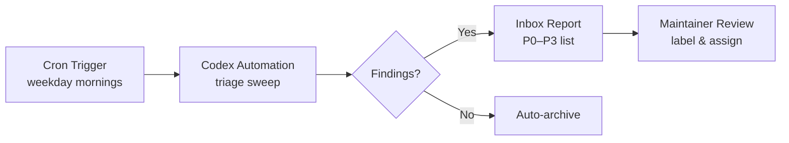
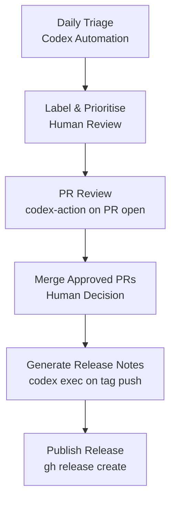

# Codex CLI for Open Source Maintainers: Automated Triage, PR Review, and Release Note Workflows


---

Open source maintainers face an unprecedented volume problem. Pull requests from AI coding agents jumped from four million in September 2025 to seventeen million by March 2026 — a fourfold increase in six months — yet community estimates suggest only one in ten of those PRs is legitimate [^1]. GitHub now processes 275 million commits per week [^1]. For unpaid maintainers already stretched thin, the review queue has become actively hostile to participate in.

Codex CLI, particularly since the v0.139 stable release (9 June 2026) [^2], offers a practical toolkit for reclaiming maintainer time. This article walks through three concrete workflows — issue triage, pull request review, and release note generation — using Codex CLI, `codex exec`, Codex Automations, and the `openai/codex-action` GitHub Action.

## The Codex for Open Source Programme

Before diving into workflows, it is worth noting that OpenAI launched the **Codex for Open Source** programme in March 2026 [^3]. Core maintainers of widely-used public projects can apply for six months of ChatGPT Pro with Codex (roughly \$1,200 in value), API credits through the Open Source Fund, and conditional access to Codex Security [^3]. Eligibility is based on repository usage, ecosystem importance, and evidence of active maintenance — not raw star counts [^4].

If you maintain an open source project with meaningful adoption, apply at [openai.com/form/codex-for-oss](https://openai.com/form/codex-for-oss/) before investing time in configuration.

## Workflow 1: Automated Issue Triage

### The Problem

A popular open source project might receive dozens of issues per day. Many are duplicates, some are environment-specific, and a subset are genuine regressions requiring immediate attention. Manual triage consumes hours that could be spent on code.

### The Solution: Codex Automations + Bug Triage Sweeps

Codex Automations schedule recurring tasks that run in the background, reporting findings to your inbox and auto-archiving when there is nothing to report [^5]. The bug triage use case is one of OpenAI's documented patterns [^6].

#### Step 1: Install the Required Plugins

```bash
codex plugin install github
codex plugin install linear    # optional, if you use Linear
codex plugin install slack     # optional, for Slack channel scanning
```

#### Step 2: Run an Initial Manual Sweep

Use this starter prompt in a Codex session:

```
Run a bug triage sweep for myorg/myrepo covering the last 48 hours.
Use these plugins: @GitHub.
Input sources: GitHub issues labelled "needs-triage", open PRs with
failing checks.
Output format: Prioritised list (P0–P3) with evidence and next actions.
Rules: Read-only. Group duplicates. Separate facts from guesses.
```

Codex will scan the specified sources and return a prioritised list [^6]. Review the output in the same thread, refine the filtering criteria (drop noisy alerts, merge duplicates, adjust priority thresholds), and iterate until the signal-to-noise ratio is acceptable.

#### Step 3: Schedule the Automation

Once the triage prompt is tuned, convert the thread into a scheduled automation:



Configure the schedule to run on weekday mornings. Keep the automation in **draft-only** mode — Codex should never auto-label or auto-close issues without human review [^6].

#### Step 4: Structured Output for CI Integration

For projects that want to integrate triage into a CI pipeline, `codex exec` with `--output-schema` produces machine-parseable JSON:

```bash
codex exec \
  --model o4-mini \
  --output-schema ./triage-schema.json \
  "Triage the 20 most recent open issues in myorg/myrepo. \
   Classify each as: bug, feature-request, question, duplicate, \
   or environment-specific. Return JSON."
```

Where `triage-schema.json` defines the expected structure:

```json
{
  "type": "object",
  "properties": {
    "issues": {
      "type": "array",
      "items": {
        "type": "object",
        "properties": {
          "number": { "type": "integer" },
          "classification": { "type": "string" },
          "priority": { "type": "string" },
          "duplicate_of": { "type": "integer" },
          "reasoning": { "type": "string" }
        },
        "required": ["number", "classification", "priority", "reasoning"]
      }
    }
  }
}
```

Pipe the output into a labelling script, with a human approval gate before any labels are applied.

## Workflow 2: Automated Pull Request Review

### Automatic Reviews in the Codex App

If you use the Codex desktop application, enable **Automatic reviews** in Settings. Codex will post a review whenever someone opens a new PR, without requiring an `@codex review` comment [^7]. This is the zero-configuration path.

### CI-Based Review with the GitHub Action

For more control, use the `openai/codex-action` GitHub Action to gate PRs on Codex-driven quality checks [^8]:


```yaml
# .github/workflows/codex-review.yml
name: Codex PR Review
on:
  pull_request:
    types: [opened, synchronize]

permissions:
  contents: read
  pull-requests: write

jobs:
  review:
    runs-on: ubuntu-latest
    steps:
      - uses: actions/checkout@v4
      - uses: openai/codex-action@v1
        with:
          prompt: |
            Review this pull request for:
            1. Correctness and potential regressions
            2. Test coverage for changed code paths
            3. Documentation updates if public API changed
            4. CHANGELOG.md entry if user-facing
            Post findings as a PR review comment.
          model: o4-mini
          sandbox: read-only
        env:
          OPENAI_API_KEY: ${{ secrets.OPENAI_API_KEY }}
```


Critical configuration: always pass `sandbox: read-only` for review jobs — the agent should never modify the repository during review [^8].

### CLI-Based Review for Local Workflows

For maintainers who prefer terminal workflows, Codex CLI's built-in review command works before you even push:

```bash
# Review staged changes before committing
codex review

# Review a specific PR by number
codex review --pr 1234
```

The review output integrates with the terminal, showing findings inline with the diff [^7].

### Handling the AI PR Flood

For projects drowning in low-quality AI-generated PRs, add a pre-review triage step:

```yaml
- uses: openai/codex-action@v1
  with:
    prompt: |
      Assess whether this PR was likely generated by an AI agent
      without genuine understanding. Check for:
      - Generic commit messages with no project context
      - Changes that don't address a filed issue
      - Cosmetic-only changes (whitespace, formatting) disguised as fixes
      Return: { "likely_ai_generated": bool, "confidence": float, "reasoning": string }
    output-schema: ./ai-pr-schema.json
    model: o4-mini
    sandbox: read-only
```

⚠️ This heuristic is imperfect — some legitimate contributors use AI tools. Use the signal to prioritise review order, not to auto-close PRs.

## Workflow 3: Release Note Generation

### The codex exec Pipeline

Generating release notes from Git history is a natural fit for `codex exec`:

```bash
#!/usr/bin/env bash
# generate-release-notes.sh
VERSION="${1:?Usage: $0 <version>}"
PREV_TAG=$(git describe --tags --abbrev=0 HEAD^ 2>/dev/null || echo "")

if [ -z "$PREV_TAG" ]; then
  COMMITS=$(git log --oneline --no-merges)
else
  COMMITS=$(git log --oneline --no-merges "${PREV_TAG}..HEAD")
fi

echo "$COMMITS" | codex exec \
  --model o4-mini \
  "Generate release notes for version ${VERSION}. \
   Group changes into: Breaking Changes, New Features, Bug Fixes, \
   Documentation, and Internal. Use British English. \
   Link PR numbers as GitHub references. \
   Omit dependency bumps unless they fix a security vulnerability."
```

### Structured Release Notes with Output Schema

For projects that publish structured changelogs (e.g. for automated distribution):

```bash
codex exec \
  --model o4-mini \
  --output-schema ./release-notes-schema.json \
  "Parse the following commits and generate structured release notes. \
   $(git log --oneline --no-merges v1.2.0..HEAD)"
```

### Automating the Release Cycle

Combine triage, review, and release notes into a single maintainer workflow:



## AGENTS.md for Maintainer Repositories

An effective `AGENTS.md` file at the repository root dramatically improves Codex's output quality for maintainer tasks [^9]. Here is a template for open source projects:

```markdown
# AGENTS.md

## Project Context
This is [project-name], a [brief description]. Licensed under [licence].
Primary language: [language]. Build system: [system].

## Issue Triage Rules
- P0: Security vulnerabilities, data loss, or complete service failure
- P1: Regressions in the current stable release
- P2: Bugs affecting common workflows
- P3: Edge cases, cosmetic issues, feature requests

## PR Review Standards
- All PRs must include tests for changed behaviour
- Public API changes require documentation updates
- CHANGELOG.md must be updated for user-facing changes
- Commit messages follow Conventional Commits format

## Release Process
- Semantic versioning: MAJOR.MINOR.PATCH
- Release notes group changes by: Breaking, Features, Fixes, Docs
- Security fixes get expedited releases
```

Codex reads every `AGENTS.md` file along the path from the Git root to the current directory [^9], so you can place subsystem-specific instructions in subdirectories.

## Model Selection for Maintainer Workflows

Different tasks have different cost-quality tradeoffs:

| Task | Recommended Model | Reasoning Effort | Rationale |
|------|-------------------|------------------|-----------|
| Issue triage | `o4-mini` | `low` | High volume, classification is straightforward |
| PR review | `o4-mini` | `medium` | Needs to understand code changes |
| Security review | `gpt-5.5` | `high` | Correctness is paramount |
| Release notes | `o4-mini` | `low` | Summarisation from structured input |

Configure these as profiles in `~/.codex/config.toml`:

```toml
[profiles.triage]
model = "o4-mini"
model_reasoning_effort = "low"
sandbox = "read-only"

[profiles.review]
model = "o4-mini"
model_reasoning_effort = "medium"
sandbox = "read-only"

[profiles.release]
model = "o4-mini"
model_reasoning_effort = "low"
sandbox = "read-only"
```

Activate with `codex --profile triage` or `CODEX_PROFILE=triage` [^10].

## Cost Considerations

For projects on the Codex for Open Source programme, API credits offset most costs [^3]. For projects funding their own usage:

- A daily triage sweep over 50 issues with `o4-mini` at `low` reasoning effort typically costs under \$0.10 per run [^11].
- PR reviews vary widely — simple changes cost a few cents, whilst large refactors touching dozens of files can reach \$1–2 per review.
- Release note generation from a few hundred commits is typically under \$0.05.

Set a `max_tokens` ceiling in your automation configuration to prevent runaway costs on unexpectedly large inputs.

## What Codex Cannot Replace

Codex automates the mechanical parts of maintenance — classification, first-pass review, summarisation. It cannot replace:

- **Architectural judgement**: whether a feature belongs in the project
- **Community governance**: CoC enforcement, contributor relationship management
- **Security triage**: Codex can flag suspicious patterns, but vulnerability assessment and disclosure remain human responsibilities
- **Release decisions**: when to cut a release and what to include

The goal is to reduce the hours spent on mechanical work so that maintainers can focus on the decisions that require human insight [^1].

## Citations

[^1]: GitHub's AI Agent Problem: 17 Million PRs, Five Outages, and a Kill Switch — [danilchenko.dev](https://www.danilchenko.dev/posts/2026-04-11-github-ai-agents-pull-requests/)
[^2]: Codex CLI v0.139.0 Release Notes — [GitHub Releases](https://github.com/openai/codex/releases/tag/rust-v0.139.0)
[^3]: Codex for Open Source Programme — [OpenAI Developers](https://developers.openai.com/community/codex-for-oss)
[^4]: OpenAI Launches Codex for Open Source — [WinBuzzer](https://winbuzzer.com/2026/03/09/openai-codex-open-source-maintainers-free-chatgpt-pro-xcxwbn/)
[^5]: Codex Automations Documentation — [OpenAI Developers](https://developers.openai.com/codex/app/automations)
[^6]: Automate Bug Triage — Codex Use Cases — [OpenAI Developers](https://developers.openai.com/codex/use-cases/automation-bug-triage)
[^7]: Code Review in GitHub — Codex Integrations — [OpenAI Developers](https://developers.openai.com/codex/integrations/github)
[^8]: Codex GitHub Action Documentation — [OpenAI Developers](https://developers.openai.com/codex/github-action)
[^9]: AGENTS.md for Codex CLI — [OpenAI Developers](https://developers.openai.com/codex/cli)
[^10]: Codex CLI Configuration Reference — [OpenAI Developers](https://developers.openai.com/codex/config-reference)
[^11]: Codex CLI Token Consumption Diagnosis and Reduction — [Codex Knowledge Base](https://codex.danielvaughan.com/2026/06/10/codex-cli-token-consumption-diagnosis-reduction-quota-drain-practitioner-toolkit/)
