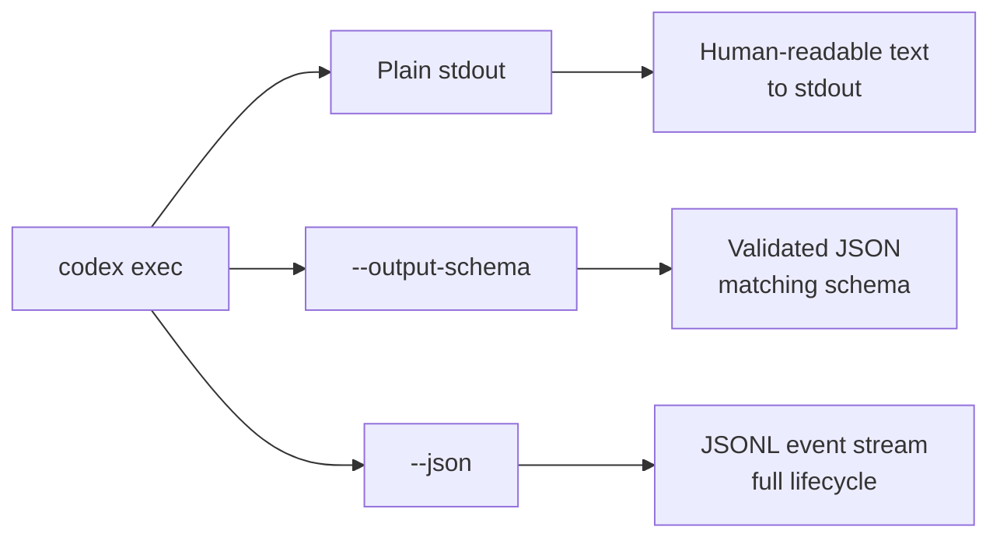
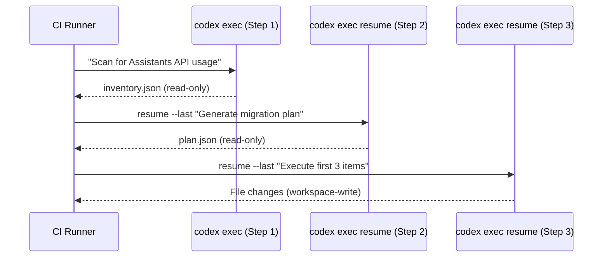

# Codex exec Structured Output Pipelines: Building Type-Safe Automation with --output-schema, --json, and Resume


---

Most developers first encounter `codex exec` as a way to fire off a one-shot prompt from a script. That sells it short. With `--output-schema` for type-safe final responses, `--json` for real-time JSONL event streaming, and `resume` for multi-step session chaining, `codex exec` becomes a full pipeline runtime — one that slots into CI/CD, cron jobs, and bespoke developer tooling without brittle text parsing.

This article walks through the three output modes, shows how to compose them into production-grade pipelines, and covers the sharp edges you will hit in practice.

## The Three Output Modes

`codex exec` supports three distinct output strategies, each suited to a different automation tier [^1].



### Plain stdout

The default. Progress streams to stderr; the agent's final message lands on stdout. Adequate for simple piping — `codex exec "summarise this diff" | tee summary.md` — but downstream consumers must parse free-form text [^1].

### --output-schema

Pass a JSON Schema file and Codex validates the agent's final response against it. The output is guaranteed to conform to the schema's shape, making it safe for `jq` pipelines, database inserts, or downstream API calls [^1] [^2].

### --json

Switches stdout to a newline-delimited JSONL stream covering the full execution lifecycle. Every event — `thread.started`, `turn.started`, `item.*`, `turn.completed`, `turn.failed`, `error` — arrives as a standalone JSON object [^1] [^3]. This mode is for monitoring, logging, and building custom UIs on top of the agent loop.

## Structured Output with --output-schema

### Defining the Schema

Create a standard JSON Schema file in your repository. Codex uses JSON Schema draft 2020-12 [^4]:

```json
{
  "$schema": "https://json-schema.org/draft/2020-12/schema",
  "type": "object",
  "properties": {
    "failures": {
      "type": "array",
      "items": {
        "type": "object",
        "properties": {
          "test_name": { "type": "string" },
          "root_cause": { "type": "string" },
          "confidence": { "enum": ["high", "medium", "low"] },
          "related_files": {
            "type": "array",
            "items": { "type": "string" }
          }
        },
        "required": ["test_name", "root_cause", "confidence"]
      }
    },
    "summary": { "type": "string" }
  },
  "required": ["failures", "summary"],
  "additionalProperties": false
}
```

### Invoking with the Schema

```bash
npm test 2>&1 | codex exec \
  "Classify each test failure by root cause and confidence" \
  --output-schema ./schemas/failure-triage.json \
  -o ./results/triage.json \
  --sandbox read-only
```

Key flags in combination:

| Flag | Purpose |
|------|---------|
| `--output-schema` | Enforces typed JSON response [^1] |
| `-o` / `--output-last-message` | Writes the validated JSON to a file [^1] |
| `--sandbox read-only` | Prevents the agent from modifying the repository [^1] |
| `--ephemeral` | Skips session persistence — useful in CI where disk is transient [^1] |

### What Happens When Validation Fails

⚠️ If the agent's response does not conform to the schema, Codex retries internally before surfacing an error. The exact retry behaviour is not documented in the public API reference as of v0.139.0, so treat schema validation failures as non-deterministic in CI — always wrap calls in a retry step or check the exit code.

## The JSONL Event Stream

### Event Anatomy

Each line in the `--json` stream is a self-contained JSON object with a `type` field [^3]:

```bash
codex exec --json "refactor the auth module" 2>/dev/null | head -5
```

Produces output like:

```jsonl
{"type":"thread.started","thread_id":"th_abc123","timestamp":"2026-06-11T09:14:22Z"}
{"type":"turn.started","turn_id":"trn_001"}
{"type":"item.agent_message","content":"I'll start by examining..."}
{"type":"item.command_execution","command":"grep -r 'auth' src/","exit_code":0}
{"type":"item.file_change","path":"src/auth.ts","action":"edit"}
```

### Practical Parsing Patterns

Filter for tool calls only:

```bash
codex exec --json "audit dependencies" 2>/dev/null \
  | jq -c 'select(.type == "item.command_execution")'
```

Extract token usage from the completion event:

```bash
codex exec --json "generate migration" 2>/dev/null \
  | jq -c 'select(.type == "turn.completed") | .usage'
```

Build a real-time progress monitor:

```bash
codex exec --json "large refactoring task" 2>/dev/null \
  | while IFS= read -r line; do
      type=$(echo "$line" | jq -r '.type')
      case "$type" in
        turn.started)  echo "⏳ Turn started" ;;
        turn.completed) echo "✅ Turn completed" ;;
        turn.failed)   echo "❌ Turn failed"; exit 1 ;;
        item.file_change) echo "📝 $(echo "$line" | jq -r '.path')" ;;
      esac
    done
```

## Resumable Multi-Step Pipelines

The `codex exec resume` subcommand continues a previous session, preserving the full transcript and plan history [^1] [^5]. This enables multi-step pipelines where each stage builds on the agent's accumulated context.

### Session Chaining

```bash
# Step 1: Inventory the codebase
codex exec "Scan for all Assistants API usage and output an inventory" \
  --output-schema ./schemas/inventory.json \
  -o ./results/inventory.json

# Step 2: Resume with the same context — generate migration plan
codex exec resume --last \
  "Based on the inventory, generate a migration plan to the Responses API" \
  --output-schema ./schemas/migration-plan.json \
  -o ./results/plan.json

# Step 3: Resume again — execute the migration
codex exec resume --last \
  "Execute the first three items from the migration plan" \
  --sandbox workspace-write
```



### Resume with Structured Output

Since v0.139.0, `codex exec resume` accepts `--output-schema`, so resumed sessions enforce typed output without losing accumulated context [^6]. This was a significant gap in earlier versions.

### Targeting a Specific Session

When multiple sessions exist, use the session ID instead of `--last`:

```bash
codex exec resume th_abc123def456 "continue with the next batch"
```

Use `--all` to search across all working directories, not just the current one [^1].

## CI/CD Integration Patterns

### GitHub Actions with Structured Output


```yaml
name: Nightly Dependency Audit
on:
  schedule:
    - cron: '0 3 * * 1'  # Monday 03:00 UTC

jobs:
  audit:
    runs-on: ubuntu-latest
    steps:
      - uses: actions/checkout@v4

      - name: Run Codex audit
        uses: openai/codex-action@v1
        id: audit
        with:
          openai-api-key: ${{ secrets.OPENAI_API_KEY }}
          prompt: |
            Audit all npm dependencies for known vulnerabilities,
            licence conflicts, and outdated major versions.
          codex-args: >-
            ["--output-schema", ".github/schemas/audit.json",
             "--ephemeral", "--sandbox", "read-only"]
          output-file: audit-results.json
          sandbox: read-only

      - name: Parse and gate
        run: |
          CRITICAL=$(jq '[.vulnerabilities[] | select(.severity == "critical")] | length' audit-results.json)
          if [ "$CRITICAL" -gt 0 ]; then
            echo "::error::$CRITICAL critical vulnerabilities found"
            exit 1
          fi
```


The `openai/codex-action@v1` handles CLI installation, authentication proxy setup, and sandbox configuration [^7]. Pass `--output-schema` through `codex-args` as a JSON array.

### Profile-Based Pipeline Configuration

Use profiles to isolate CI settings from interactive defaults [^8]:

```toml
# ~/.codex/ci.config.toml
model = "o4-mini"
model_reasoning_effort = "low"
approval_policy = "never"

[sandbox]
mode = "read-only"
```

```bash
codex exec --profile ci "generate release notes" \
  --output-schema ./schemas/release-notes.json
```

This keeps CI runs cost-efficient with `o4-mini` and low reasoning effort, while your interactive sessions can use `o3` at high effort [^8].

## Sharp Edges and Production Considerations

### Schema Design

Keep schemas flat where possible. Deeply nested `oneOf`/`allOf` constructs work — v0.139.0 improved schema fidelity for MCP tool definitions [^6] — but complex discriminated unions increase the chance of validation retries.

Set `"additionalProperties": false` on every object. Without it, the agent may inject extra fields that break downstream consumers expecting a strict shape.

### Token Economics

Structured output is not free. The schema is included in the system prompt, consuming input tokens on every turn [^9]. A 200-line schema adds roughly 800-1,000 tokens. For high-frequency CI runs, this compounds.

The `--json` event stream itself has negligible overhead — events are emitted from the existing agent loop, not generated by the model.

### Stdin Piping

`codex exec` reads from stdin when piped, appending the content to the prompt [^1]. This is powerful for feeding test output, logs, or diffs:

```bash
git diff HEAD~5..HEAD | codex exec \
  "Review this diff for security issues" \
  --output-schema ./schemas/security-review.json
```

Use `codex exec -` to force the entire prompt to come from stdin [^1].

### Error Handling in Pipelines

Always check exit codes. `codex exec` returns non-zero on agent failures, MCP initialisation errors (when `required = true` servers fail), and schema validation exhaustion [^1]:

```bash
set -euo pipefail

if ! codex exec --output-schema ./schema.json -o ./result.json "task"; then
  echo "Codex exec failed — check stderr for details"
  # Fallback or alert
  exit 1
fi

# Safe to consume result.json
jq '.summary' ./result.json
```

### Ephemeral vs Persistent Sessions

In CI, use `--ephemeral` to skip writing session rollout files to disk. This reduces I/O and avoids accumulating state across pipeline runs [^1].

For local multi-step pipelines, omit `--ephemeral` — you need the session persisted for `resume` to find it.

## Combining All Three Modes

The most powerful pattern combines structured output with JSONL monitoring and session chaining:

```bash
# Step 1: Structured inventory with live monitoring
codex exec --json \
  "Inventory all API endpoints" \
  --output-schema ./schemas/endpoints.json \
  -o ./results/endpoints.json \
  2>/dev/null \
  | tee >(jq -c 'select(.type == "turn.completed") | .usage' > token-log.jsonl)

# Step 2: Resume with structured plan
codex exec resume --last --json \
  "Generate test coverage plan for untested endpoints" \
  --output-schema ./schemas/test-plan.json \
  -o ./results/test-plan.json \
  2>/dev/null \
  | tee >(jq -c 'select(.type == "item.command_execution")' > commands-log.jsonl)
```

This gives you: typed output for downstream processing, token usage tracking for cost attribution, and a full audit log of every command the agent executed — all from the same pipeline.

## Summary

`codex exec` is Codex CLI's pipeline surface. `--output-schema` makes agent output machine-parseable. `--json` makes agent execution observable. `resume` makes agent context persistent across pipeline stages. Together, they turn a conversational coding agent into reliable automation infrastructure.

The key principle: **treat the agent like any other CLI tool in your pipeline** — validate its output, check its exit codes, and keep its configuration in version control.

## Citations

[^1]: OpenAI, "Non-interactive mode – Codex CLI," OpenAI Developers, 2026. [https://developers.openai.com/codex/noninteractive](https://developers.openai.com/codex/noninteractive)

[^2]: OpenAI, "Command line options – Codex CLI," OpenAI Developers, 2026. [https://developers.openai.com/codex/cli/reference](https://developers.openai.com/codex/cli/reference)

[^3]: Steve Kinney, "Structured CLI Output as Pipeline Glue," *Self-Testing AI Agents*, 2026. [https://stevekinney.com/courses/self-testing-ai-agents/structured-cli-output-as-pipeline-glue](https://stevekinney.com/courses/self-testing-ai-agents/structured-cli-output-as-pipeline-glue)

[^4]: OpenAI, "MCP 2026-07-28 RC — JSON Schema 2020-12 upgrade for tool definitions (SEP-2106)," Model Context Protocol specification, 2026. [https://spec.modelcontextprotocol.io](https://spec.modelcontextprotocol.io)

[^5]: OpenAI, "Codex CLI Resume, Continue, and Save Chat," OpenAI Developers, 2026. [https://developers.openai.com/codex/cli/reference](https://developers.openai.com/codex/cli/reference)

[^6]: OpenAI, "Codex CLI v0.139.0 release notes," GitHub, June 9, 2026. [https://github.com/openai/codex/releases/tag/v0.139.0](https://github.com/openai/codex/releases/tag/v0.139.0)

[^7]: OpenAI, "GitHub Action – Codex," OpenAI Developers, 2026. [https://developers.openai.com/codex/github-action](https://developers.openai.com/codex/github-action)

[^8]: OpenAI, "Advanced Configuration – Codex," OpenAI Developers, 2026. [https://developers.openai.com/codex/config-advanced](https://developers.openai.com/codex/config-advanced)

[^9]: OpenAI, "Features – Codex CLI," OpenAI Developers, 2026. [https://developers.openai.com/codex/cli/features](https://developers.openai.com/codex/cli/features)
