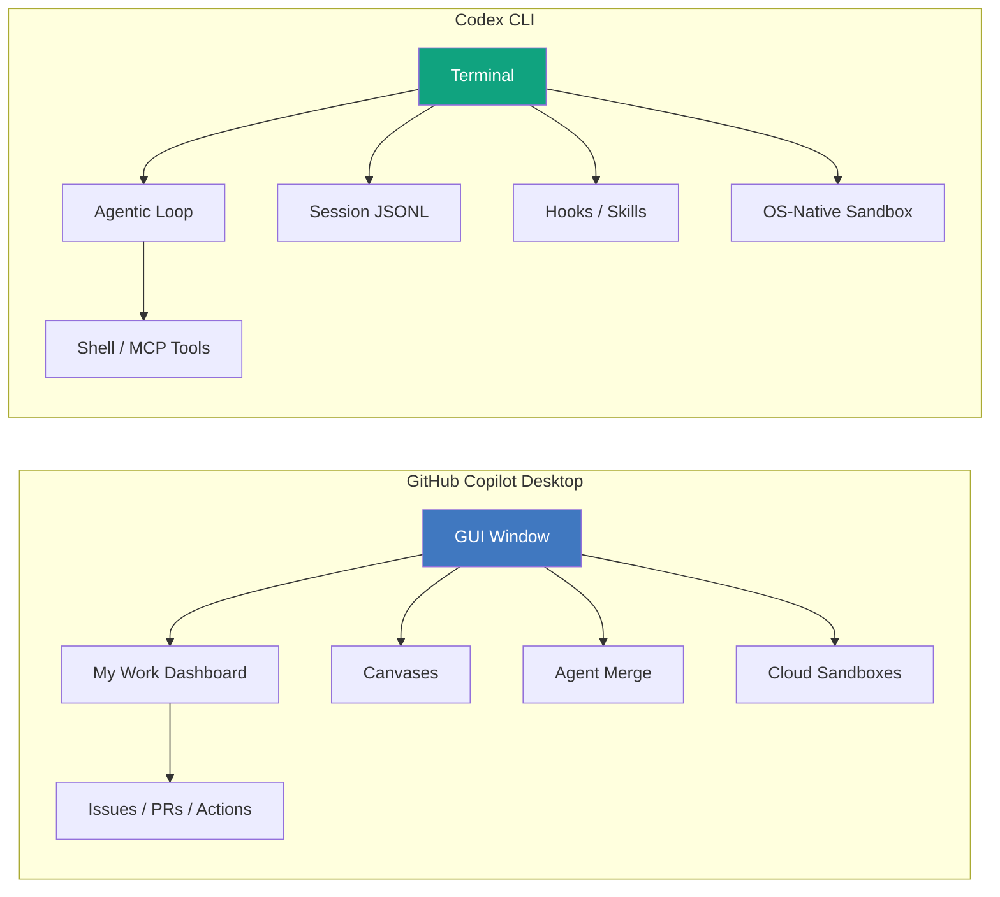
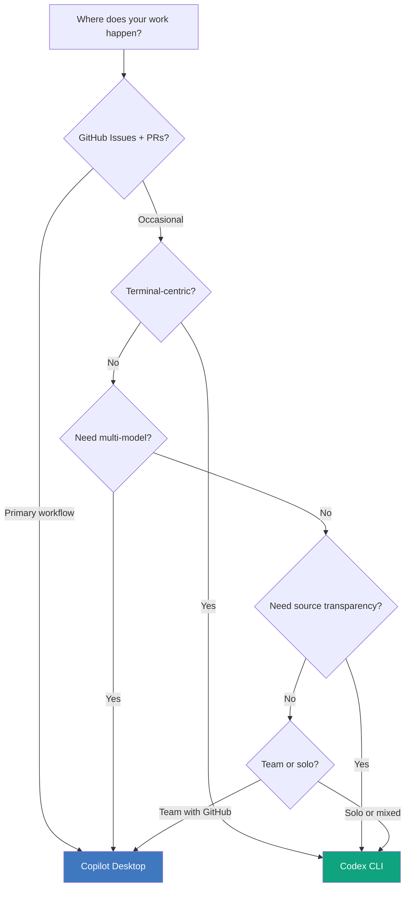
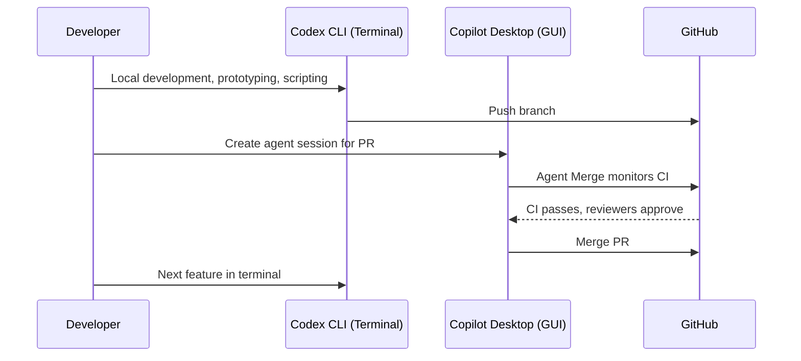

# GitHub Copilot Desktop App vs Codex CLI: Agent-Native GUI Meets Terminal-First Agent in the June 2026 Showdown


---

GitHub's Copilot Desktop App expanded its technical preview to all paid subscribers on 2 June 2026[^1], removing the waitlist that had gated access since the Microsoft Build 2026 announcement[^2]. The app represents a fundamentally different design philosophy from Codex CLI: a standalone GUI that orchestrates multiple agents in parallel, owns its own window, and treats GitHub's issue-PR-Actions plane as a first-class surface. For Codex CLI practitioners, the question is not which tool is "better" — it is where each architecture excels, and how the two can coexist in a senior developer's workflow.

This article dissects the architectural differences, maps feature sets against real workflow requirements, and offers a practical decision framework.

## Two Architectures, Two Bets

The Copilot Desktop App and Codex CLI make opposing bets about where agentic coding work should happen.



**Copilot Desktop** is a purpose-built GUI that owns the orchestration surface. It manages git worktrees automatically, displays "canvases" — bidirectional work surfaces showing plans, terminal output, and deployment states — and provides a "My Work" dashboard aggregating active sessions, issues, and pull requests across repositories[^2]. The agent runs in GitHub's cloud sandboxes by default, with local sandbox fallback.

**Codex CLI** is a terminal-resident agent. It runs in your existing shell, writes to your existing filesystem (sandboxed by Seatbelt on macOS or bubblewrap on Linux[^3]), and integrates via Unix pipes, MCP servers, and hooks. There is no proprietary GUI layer — the terminal *is* the interface.

## Feature Comparison

| Capability | Copilot Desktop | Codex CLI |
|---|---|---|
| **Interface** | Dedicated GUI with canvases and dashboards | Terminal TUI with `/` slash commands |
| **Model lock-in** | Multi-vendor (Claude, GPT, Gemini)[^4] | OpenAI models (GPT-5.5, o4-mini, Spark)[^3] |
| **Source transparency** | Proprietary | Open source (Apache 2.0)[^3] |
| **Worktree management** | Automatic per-session isolation[^2] | Manual or via `codex exec` flags |
| **Cloud execution** | Native cloud sandboxes[^2] | Local-first; cloud via SSH/app-server |
| **CI integration** | Deep GitHub Actions binding, Agent Merge[^2] | `codex exec` in CI, `openai/codex-action`[^5] |
| **Approval model** | PR-as-review-gate, optional autopilot[^2] | Command-level approval policies, hooks[^3] |
| **Scheduling** | Cloud automations, `/every` command[^2] | Thread automations, `codex exec` + cron |
| **Voice input** | On-device speech-to-text[^2] | Realtime WebSocket sessions[^3] |
| **Code review** | `/security-review`, `/rubberduck` skills[^2] | `/review` command, hook-based gates |
| **Memory** | Memory++ with `/chronicle` cross-device[^2] | Session JSONL + `codex resume/fork` |
| **SDK** | Copilot SDK (Node, Python, Go, .NET, Rust, Java)[^2] | Codex Python SDK, app-server JSON-RPC[^3] |

## Where Copilot Desktop Wins

### 1. Multi-Agent Orchestration with Visual Feedback

Copilot Desktop's canvas model gives each agent session a persistent visual surface. You can see plans materialise, watch terminal output in real-time, and edit canvases bidirectionally — the agent updates them, and you can reorder or redirect work[^2]. For teams coordinating three or four parallel agents on different features, the GUI provides situational awareness that a terminal multiplexer cannot easily match.

### 2. GitHub-Native Workflow Integration

Agent Merge is the standout feature: it monitors CI, tracks required reviewers, addresses failing checks, and can merge when all conditions are satisfied[^2]. If your workflow already lives on GitHub Issues and Pull Requests, Copilot Desktop removes the glue code between agent output and your review process.

### 3. Multi-Model Flexibility

Copilot Desktop offers Claude, GPT, and Gemini model variants from a single interface[^4]. You are not locked to one vendor's reasoning. For teams that want to route different tasks to different models — security review to Claude, code generation to GPT-5.5, quick edits to Gemini Flash — this flexibility is significant.

## Where Codex CLI Wins

### 1. Terminal-First Composability

Codex CLI is a Unix citizen. Its output pipes into `jq`, `grep`, and downstream tools. `codex exec` produces JSONL event streams or structured JSON via `--output-schema`[^5], making it trivially scriptable. The terminal-first model means Codex fits into any existing toolchain without requiring a new application in the dock.

```bash
# Pipe structured analysis into downstream processing
codex exec --output-schema '{"type":"object","properties":{"risks":{"type":"array","items":{"type":"string"}}}}' \
  "Analyse this repository for security risks" | jq '.risks[]'
```

### 2. Open Source Transparency

Codex CLI is Apache 2.0 licensed[^3]. You can read the agentic loop, inspect prompt strategies, and audit the sandbox boundary. For regulated environments, security teams, or anyone who needs to understand what the agent is doing at a code level, this transparency is non-negotiable.

### 3. Granular Approval Policies and Hooks

Codex CLI's `PreToolUse` and `PostToolUse` hooks provide fine-grained governance that operates at the command level, not the PR level[^3]. You can block specific shell commands, validate file modifications, enforce naming conventions, and gate MCP tool calls — all before they execute. This is a different trust model from Copilot Desktop's PR-as-review-gate approach.

```toml
# config.toml — command-level approval policy
[policy]
auto_approve = [
  "shell:read:*",    # Auto-approve read-only commands
  "mcp:context7:*"   # Auto-approve documentation lookups
]
```

### 4. Profile-Based Configuration

Codex CLI profiles let you switch entire configuration stacks — model, approval policy, reasoning effort, enabled tools — with a single flag[^3]. This maps naturally to different work modes: a `review` profile with high reasoning and strict approvals, a `script` profile with Spark for quick edits, a `ci` profile for headless automation.

## The Decision Framework

The choice between these tools is not about capability parity — it is about where your work already happens.



**Choose Copilot Desktop when:**
- Your team coordinates through GitHub Issues, PRs, and Actions
- You need to orchestrate multiple parallel agents with visual feedback
- Multi-model routing is a priority
- Agent Merge would replace manual CI babysitting

**Choose Codex CLI when:**
- You live in the terminal and compose tools via pipes
- You need open-source transparency for auditing or compliance
- Granular, command-level approval policies are required
- You embed agent intelligence in CI/CD pipelines or custom harnesses
- Profile-based configuration switching matches your workflow

**Use both when:**
- Copilot Desktop manages issue triage, PR review, and Agent Merge
- Codex CLI handles local development, scripting, and `codex exec` pipelines
- Neither tool locks you out of the other — Codex CLI's AGENTS.md files work regardless of which tool reads them[^6]

## The Dual-Stack Pattern

The most pragmatic approach for senior developers is a dual-stack workflow. Both tools operate on the same repository. AGENTS.md files are tool-agnostic — Codex CLI, Claude Code, and GitHub Copilot all read them[^6]. The differentiation happens at the orchestration layer:



This pattern eliminates the false binary. Use each tool where its architecture provides a genuine advantage, rather than forcing one tool to cover workflows it was not designed for.

## Pricing Implications

The cost structures differ significantly. Copilot Desktop rides on your existing Copilot subscription (Pro at \$10/month, Pro+ at \$39/month, or Enterprise pricing)[^1]. Codex CLI costs land on the OpenAI API meter — per-token billing tied to your ChatGPT plan or API key[^5]. For teams already paying for GitHub Enterprise with Copilot, the Desktop app is effectively included. For developers who prefer pay-per-use without a subscription ceiling, Codex CLI's token-based model offers more granular cost control.

## What This Means for the Market

The Copilot Desktop App signals that GitHub — and by extension, Microsoft — views the future of coding agents not as IDE plugins but as standalone applications that own the development workflow end-to-end[^1]. This is the same bet OpenAI made with the Codex App (the cloud-hosted web surface)[^5], but approached from the opposite direction: GitHub starts with the collaboration graph, OpenAI starts with the model.

For Codex CLI practitioners, the takeaway is reassuring rather than threatening. Codex CLI's terminal-first, open-source, Unix-composable architecture occupies a distinct niche that a GUI application cannot subsume. The tools are complementary, not competitive — provided you match each to the workflows it serves best.

## Citations

[^1]: GitHub, "Expanded technical preview availability for the GitHub Copilot app," GitHub Changelog, 2 June 2026. [https://github.blog/changelog/2026-06-02-expanded-technical-preview-availability-for-the-github-copilot-app/](https://github.blog/changelog/2026-06-02-expanded-technical-preview-availability-for-the-github-copilot-app/)

[^2]: GitHub, "GitHub Copilot app: The agent-native desktop experience," GitHub Blog, May 2026. [https://github.blog/news-insights/product-news/github-copilot-app-the-agent-native-desktop-experience/](https://github.blog/news-insights/product-news/github-copilot-app-the-agent-native-desktop-experience/)

[^3]: OpenAI, "Codex CLI," OpenAI Developers, 2026. [https://developers.openai.com/codex/cli](https://developers.openai.com/codex/cli)

[^4]: Pickuma, "GitHub Copilot Desktop vs Claude Code vs Codex CLI: Picking Your Agent," DEV Community, 2026. [https://dev.to/pickuma/github-copilot-desktop-vs-claude-code-vs-codex-cli-picking-your-agent-41ck](https://dev.to/pickuma/github-copilot-desktop-vs-claude-code-vs-codex-cli-picking-your-agent-41ck)

[^5]: OpenAI, "Codex CLI Reference — Command line options," OpenAI Developers, 2026. [https://developers.openai.com/codex/cli/reference](https://developers.openai.com/codex/cli/reference)

[^6]: OpenAI, "Custom instructions with AGENTS.md," OpenAI Developers, 2026. [https://developers.openai.com/codex/guides/agents-md](https://developers.openai.com/codex/guides/agents-md)
