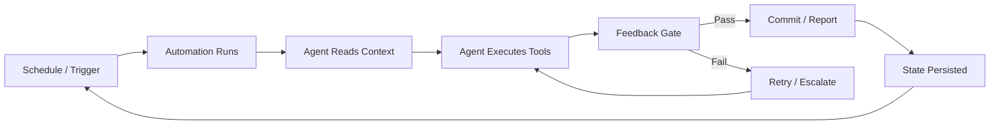
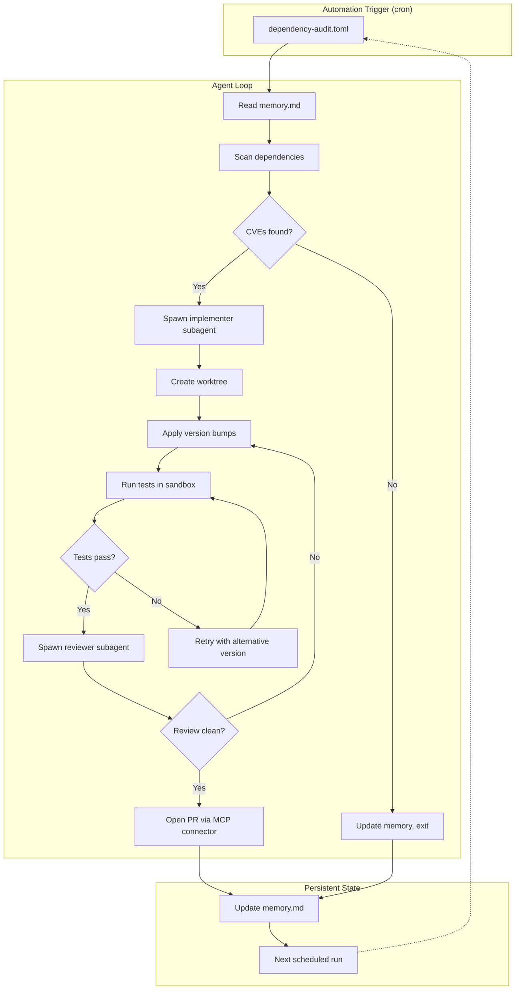
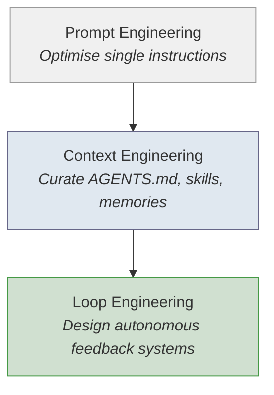

# Loop Engineering with Codex CLI: Designing Autonomous Agent Loops That Run While You Sleep


---

Loop engineering is the discipline of designing systems that prompt agents on your behalf, rather than prompting them yourself. The term, popularised by Addy Osmani in his June 2026 essay and grounded in Andrej Karpathy's "loopy era" thesis, represents the next evolutionary step beyond prompt engineering and context engineering [^1] [^2]. Where prompt engineering optimises a single instruction and context engineering curates the information an agent receives, loop engineering designs the feedback loops, scheduling, and verification gates that let agents run autonomously for hours or days.

Codex CLI ships every primitive you need for loop engineering out of the box. This article maps the five building blocks to concrete Codex CLI configuration, shows how to wire them together, and identifies the failure modes that catch teams off guard.

## The Paradigm Shift: From Prompt to Loop

Karpathy's AutoResearch project demonstrated the pattern: give an agent an objective metric, a codebase, and boundaries for what it can change, then let it loop autonomously — running experiments, tweaking parameters, and committing improvements without human intervention. AutoResearch ran 700 experiments in two days and discovered 20 optimisations that improved training loss [^2].

The same principle applies to software engineering workflows. Instead of opening a terminal and typing instructions, you design the loop once and let it execute repeatedly:



The critical insight is that the leverage point has shifted. Optimising your prompt matters less than designing the loop's feedback mechanisms, isolation boundaries, and termination conditions [^1].

## The Five Building Blocks in Codex CLI

### 1. Automations: Scheduled Discovery

Codex Automations are scheduled tasks that run in the background in dedicated worktrees [^3]. Each automation lives as a TOML file inside `.codex/automations/` with three components:

```toml
# .codex/automations/dependency-audit.toml
prompt = """
Scan package.json and requirements.txt for dependencies with known CVEs
published in the last 7 days. If any are found, open a draft PR with
the version bumps and a summary of the advisories.
"""
schedule = "0 6 * * 1-5"  # Weekdays at 06:00
memory = "dependency-audit-memory.md"
```

The `memory` file persists between runs — it is the loop's state. The agent reads it at the start of each cycle and updates it at the end. This is how Codex avoids re-discovering the same issues and can track trends across runs [^3].

Automations surface findings in your inbox without requiring you to check. This "unprompted recurring work" pattern is the entry point for most teams adopting loop engineering [^1].

### 2. Goal Mode: Run Until Done

The `/goal` command, graduated from experimental status in v0.133.0, keeps the agent working toward a specific objective for hours or even days [^4] [^5]. Unlike a standard prompt where the agent completes one response and stops, goal mode re-enters the agent loop after each turn, checking a verifiable completion condition:

```bash
codex --goal "All functions in src/api/ have JSDoc comments with @param
and @return tags. Run 'npm run lint:jsdoc' to verify — exit code 0 means done."
```

Goal mode uses a separate small model to evaluate completion after every turn, so the agent that wrote the code is not the one grading it [^1]. This maker-verifier separation is fundamental to reliable loops.

Key configuration for goal mode in `config.toml`:

```toml
[goals]
max_turns = 200
check_model = "o4-mini"
timeout_minutes = 480
```

### 3. Worktrees: Parallel Isolation

Loop engineering at scale means running multiple agents simultaneously. Git worktrees prevent file collisions by giving each agent its own working directory backed by the same repository [^6]:

```bash
# Codex creates worktrees automatically for automations
# For manual parallel loops:
codex --worktree feature-auth "Implement OAuth2 PKCE flow per AGENTS.md spec"
codex --worktree feature-billing "Add Stripe webhook handlers per billing-spec.md"
```

Each worktree gets its own sandbox, preventing one agent's file writes from corrupting another's state. The orchestration layer manages branch creation and cleanup [^6].

### 4. Subagents: Specialised Roles

Subagents enable the maker-verifier pattern that makes loops trustworthy. Define narrow, opinionated agents in `.codex/agents/`:

```toml
# .codex/agents/reviewer.toml
name = "reviewer"
description = "Security and correctness review. Never writes code."
developer_instructions = """
Review the diff for security vulnerabilities, logic errors, and
deviation from AGENTS.md conventions. Output findings as structured
JSON. Never modify files directly.
"""
sandbox_mode = "read-only"
model = "o3"
model_reasoning_effort = "high"
```

```toml
# .codex/agents/implementer.toml
name = "implementer"
description = "Implements changes based on reviewed specifications."
developer_instructions = """
Implement only what the specification requires. Run tests after every
file change. Stop if tests fail twice consecutively.
"""
sandbox_mode = "workspace-write"
model = "o4-mini"
```

The parent agent orchestrates by spawning subagents in parallel. Results are consolidated before the next loop iteration [^7]. Configure concurrency limits in `config.toml`:

```toml
[agents]
max_threads = 6
max_depth = 1
job_max_runtime_seconds = 1800
```

The `max_depth = 1` setting prevents recursive delegation — subagents cannot spawn their own subagents, which avoids runaway resource consumption [^7].

### 5. Skills: Encoded Knowledge

Skills are reusable instruction files that encode project conventions, reducing context repetition across loop iterations [^8]. In a loop engineering context, skills define the "how" while automations define the "when":

```markdown
<!-- .codex/skills/pr-review.md -->
# PR Review Skill

## Steps
1. Run `git diff main...HEAD --stat` to scope the change
2. Check each modified file against the conventions in AGENTS.md
3. Run `npm test` and `npm run lint` — both must pass
4. Output a structured review with severity levels: critical, warning, info
5. If any critical findings, set exit code 1

## Anti-patterns
- Never approve without running tests
- Never suggest changes outside the PR's scope
```

Skills ship as plugins for team distribution via `codex plugin install` and work identically across Codex CLI, Claude Code, and other AGENTS.md-compatible agents [^8].

## Wiring the Complete Loop

Here is a production loop pattern combining all five building blocks:



The memory file tracks which CVEs have been processed, which PRs are pending review, and what failed on previous runs. This statefulness is what distinguishes loop engineering from one-shot automation [^1].

## The Three Risks That Compound

Osmani and the wider loop engineering literature identify three failure modes that worsen as loops improve [^1]:

### Verification Weakness

Unattended mistakes compound faster than attended ones. A loop that ships ten PRs overnight with a subtle test gap creates ten instances of the same defect. **Mitigation:** Always use a separate verifier subagent with `sandbox_mode = "read-only"` and `model_reasoning_effort = "high"`. Never let the maker grade its own work.

### Comprehension Debt

Code ships faster than understanding grows. If your loop generates 2,000 lines overnight and no human reads them critically, your team accumulates understanding debt that surfaces during incidents. **Mitigation:** Set `approval_policy = "on-request"` for high-risk paths. Configure PostToolUse hooks that flag changes exceeding a diff threshold:

```toml
# config.toml
[hooks.post_tool_use]
command = "scripts/diff-gate.sh"
max_diff_lines = 500
```

### Cognitive Surrender

The most insidious risk. As loops reliably produce good output, engineers stop reviewing critically. Comfort creates danger. **Mitigation:** Rotate review responsibility. Require human sign-off on merge, not on generation. The loop handles creation; humans handle judgement.

## Practical Configuration Checklist

For teams adopting loop engineering with Codex CLI:

| Component | Configuration | Purpose |
|-----------|--------------|---------|
| Automations | `.codex/automations/*.toml` | Scheduled loop triggers |
| Goal mode | `--goal` flag or `/goal` command | Condition-based termination |
| Worktrees | `--worktree` flag | Parallel isolation |
| Subagents | `.codex/agents/*.toml` | Maker-verifier separation |
| Skills | `.codex/skills/*.md` | Encoded conventions |
| Memory | `memory` field in automation TOML | Cross-run state persistence |
| Approval gates | `approval_policy` in `config.toml` | Human judgement checkpoints |
| Diff hooks | `[hooks.post_tool_use]` | Change magnitude guardrails |

## Where Loop Engineering Sits in the Stack

The progression from prompt engineering through context engineering to loop engineering reflects the maturation of agent tooling [^9]:



Loop engineering does not replace the earlier disciplines — it builds on them. Your loops are only as good as the context engineering that feeds them. A poorly written AGENTS.md produces poor results whether a human triggers the agent or an automation does [^9].

⚠️ Loop engineering is still an emerging discipline. Best practices are stabilising rapidly, but teams should expect to iterate on their loop designs as tooling evolves through the v0.140+ release cycle.

## Citations

[^1]: Osmani, A. (2026). *Loop Engineering: The Guide for AI Agents*. [https://addyosmani.com/blog/loop-engineering/](https://addyosmani.com/blog/loop-engineering/)

[^2]: Karpathy, A. (2026). *No Priors Interview: Code Agents, AutoResearch, and the Loopy Era of AI*. [https://www.nextbigfuture.com/2026/03/andrej-karpathy-on-code-agents-autoresearch-and-the-self-improvement-loopy-era-of-ai.html](https://www.nextbigfuture.com/2026/03/andrej-karpathy-on-code-agents-autoresearch-and-the-self-improvement-loopy-era-of-ai.html)

[^3]: OpenAI. (2026). *Automations — Codex App*. OpenAI Developers. [https://developers.openai.com/codex/app/automations](https://developers.openai.com/codex/app/automations)

[^4]: OpenAI. (2026). *Features — Codex CLI*. OpenAI Developers. [https://developers.openai.com/codex/cli/features](https://developers.openai.com/codex/cli/features)

[^5]: OpenAI. (2026). *Codex Changelog*. OpenAI Developers. [https://developers.openai.com/codex/changelog](https://developers.openai.com/codex/changelog)

[^6]: Lushbinary. (2026). *Loop Engineering: The Guide for AI Agents*. [https://lushbinary.com/blog/loop-engineering-ai-coding-agents-guide/](https://lushbinary.com/blog/loop-engineering-ai-coding-agents-guide/)

[^7]: OpenAI. (2026). *Subagents — Codex*. OpenAI Developers. [https://developers.openai.com/codex/subagents](https://developers.openai.com/codex/subagents)

[^8]: OpenAI. (2026). *Plugins — Codex*. OpenAI Developers. [https://developers.openai.com/codex/plugins](https://developers.openai.com/codex/plugins)

[^9]: Bolin, M. (2026). *Unrolling the Codex Agent Loop*. OpenAI. [https://openai.com/index/unrolling-the-codex-agent-loop/](https://openai.com/index/unrolling-the-codex-agent-loop/)
