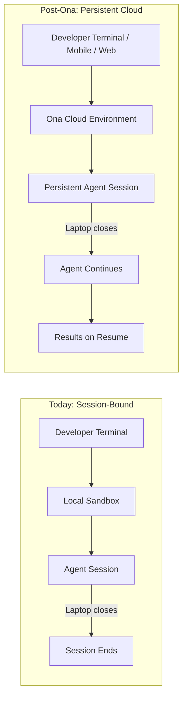
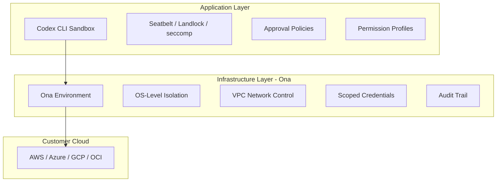

# OpenAI Acquires Ona (Formerly Gitpod): What Persistent Cloud Sandboxes Mean for Codex CLI Developers


---

OpenAI announced today that it will acquire Ona — the company formerly known as Gitpod — bringing its secure cloud execution and orchestration technology into the Codex ecosystem [^1]. The deal, subject to customary regulatory approval, signals a strategic shift: Codex is moving from session-bound local work to persistent, multi-day agent execution in customer-controlled cloud environments. For CLI-first developers, this changes the infrastructure assumptions underneath every `codex exec` pipeline and every long-running goal-mode session.

## What Ona Actually Is

Ona began life as Gitpod, the open-source cloud development environment (CDE) platform that pioneered browser-accessible, pre-configured workspaces [^2]. In September 2025, the company rebranded to Ona and pivoted from IDE-centric CDEs to what CEO Johannes Landgraf called "mission control for your personal team of software engineering agents" [^3]. The tagline shift was not cosmetic — it reflected a complete architectural rethink.

Ona's platform now comprises three components [^4]:

- **Ona Environments** — API-first, sandboxed cloud environments with OS-level isolation, defined declaratively via `devcontainer.json` or equivalent configuration
- **Ona Agents** — AI collaborators that generate code, run commands, create pull requests, and respond to review feedback autonomously
- **Ona Guardrails** — Enterprise security controls including audit trails, RBAC, SSO/OIDC, and VPC deployment

The company moved away from Kubernetes-based orchestration, building custom infrastructure optimised for the specific demands of development workloads and AI agent execution [^4]. According to Ona's internal metrics, agents co-authored 60% of merged pull requests and contributed 72% of merged code in a recent reporting period [^3].

Ona has supported 2 million developers in secure, reproducible cloud environments, with clients including major financial institutions, European pharmaceutical companies, and Asian sovereign wealth funds [^1].

## Why This Matters for Codex

The acquisition addresses a structural limitation in Codex's current architecture. Today, Codex CLI sessions are bound to the machine where they start. The local sandbox — Seatbelt on macOS, Landlock plus seccomp on Linux, restricted tokens on Windows — provides strong isolation but ties execution to an active terminal session [^5]. Close your laptop, and the agent stops.

OpenAI's announcement makes the problem statement explicit: "As Codex becomes more capable, its most valuable work is unfolding over hours or days, rather than minutes, and people should be able to delegate more ambitious work without remaining tied to the machine where it began" [^1].

More than 5 million people now use Codex weekly — up 400% from earlier this year [^1]. At that scale, the session-bound model creates a bottleneck: developers cannot delegate overnight refactoring, multi-repository migrations, or week-long test suite expansions without keeping hardware running.



## The Sandbox Evolution

Codex CLI's existing sandbox is the strongest in the AI coding agent space — it is the only major CLI agent that enables sandboxing by default [^5]. The three modes are well understood:

| Mode | Filesystem | Network | Use Case |
|------|-----------|---------|----------|
| `read-only` | Inspect only | Blocked | Code review, analysis |
| `workspace-write` | Workspace boundary | Approval required | Default development |
| `danger-full-access` | Unrestricted | Unrestricted | Trusted automation |

Ona's cloud environments add a fourth dimension: **infrastructure-level isolation**. Each agent gets a full cloud environment with dedicated tools, network access, and scoped permissions, running inside a customer's VPC with kernel-level policy enforcement [^4]. This is not a replacement for Codex's application-level sandbox — it is a layer beneath it.



The customer-controlled execution model is the critical detail for enterprise teams. OpenAI provides the intelligence and orchestration; the agent operates inside infrastructure the organisation already owns [^1]. This sidesteps the data residency objections that block many enterprise AI deployments.

## What Changes for CLI Developers

### 1. Long-Running `codex exec` Pipelines

Today, `codex exec` runs headless but terminates when the process exits or the machine shuts down. With Ona environments, `codex exec` pipelines could persist across interruptions. A multi-repository migration that takes eight hours would no longer require an always-on CI runner or a developer keeping a terminal session open.

⚠️ *No CLI subcommand for Ona environments has been announced. The integration timeline depends on post-acquisition engineering work.*

### 2. Resume and Fork Across Devices

Codex already supports `codex resume` and `codex fork` for session continuity [^6]. Ona's persistent environments would make these commands work across machines — start a session on your workstation, resume it from your phone via the Codex mobile app, and pick up the results on a different machine the next morning.

### 3. The `/app` Handoff Gets More Useful

The v0.138.0 `/app` command already hands off CLI threads to Codex Desktop [^7]. With cloud-backed persistent sessions, this handoff becomes bidirectional and device-independent: CLI to Desktop, Desktop to mobile, mobile back to CLI, all pointing at the same running environment.

### 4. Enterprise Deployment Patterns

For teams already using Codex in CI via `openai/codex-action@v1`, Ona environments could replace the ephemeral GitHub Actions runner with a persistent, pre-configured environment that accumulates project context across runs. The `devcontainer.json` declarative configuration aligns with existing CI/CD infrastructure-as-code practices.

## Competitive Context

The acquisition positions Codex against a converging field:

| Platform | Cloud Execution | Agent Persistence | Customer-Controlled Infra |
|----------|----------------|-------------------|--------------------------|
| **Codex + Ona** | Ona Environments | Hours/days (announced) | VPC deployment |
| **Claude Code** | Anthropic cloud sandbox | Session-bound | No [^8] |
| **GitHub Copilot** | Codespaces | Session-bound | GitHub-hosted |
| **Cursor** | Local only | Session-bound | N/A |
| **Devin** | Devin cloud sandbox | Multi-hour tasks | Devin-hosted [^9] |

Devin is the closest competitor in persistent agent execution, but its sandbox is Devin-hosted rather than customer-controlled. Ona's VPC deployment model gives Codex a differentiation angle for regulated industries where data cannot leave the organisation's cloud boundary.

## What to Do Now

The acquisition has not closed. Until it does, OpenAI and Ona remain separate companies [^1]. But CLI developers can prepare:

**Audit your session durations.** Run `codex history` and check how often sessions hit the compaction threshold or get interrupted by hardware constraints. If your most productive sessions are being cut short, persistent environments will matter to you.

**Review your sandbox configuration.** Ona environments will layer beneath existing sandbox settings. Ensure your `config.toml` profiles and AGENTS.md instructions are clean and portable — they will need to work identically in local and cloud contexts:

```toml
# config.toml — portable profile
[profile.cloud-ready]
model = "o3"
approval_policy = "on-request"
sandbox_mode = "workspace-write"
```

**Evaluate `devcontainer.json` readiness.** Ona environments use declarative configuration. If your project already has a `.devcontainer/devcontainer.json` for Codespaces or DevPod, it is likely compatible. If it does not, now is the time to create one:

```json
{
  "name": "codex-ready",
  "image": "mcr.microsoft.com/devcontainers/base:ubuntu",
  "features": {
    "ghcr.io/devcontainers/features/node:1": {},
    "ghcr.io/devcontainers/features/rust:1": {}
  },
  "postCreateCommand": "npm install && cargo build"
}
```

**Watch the changelog.** The Codex CLI changelog at `developers.openai.com/codex/changelog` will be the first place new Ona-related CLI capabilities appear [^7]. Subscribe to the GitHub releases feed at `github.com/openai/codex/releases` for version-level detail.

## The Bigger Picture

OpenAI's acquisition pattern tells a story. The Oracle OCI partnership (10 June) expanded the cloud provider surface [^10]. The Ona acquisition (11 June) adds the execution layer. Together, they move Codex from a tool that runs on your machine to an agent platform that runs in your cloud.

For senior developers, the practical question is not whether persistent cloud execution is coming — it is — but how quickly your organisation's security and compliance teams will approve it. The customer-controlled VPC model is designed to accelerate that approval, but every regulated enterprise has its own procurement timeline.

The CLI itself is unlikely to change overnight. Codex CLI's value proposition has always been terminal-first composability: pipes, scripts, profiles, hooks. Ona adds infrastructure beneath that composability rather than replacing it. Your `codex exec` one-liners and AGENTS.md files will still work. They will simply run in more places, for longer, without you watching.

## Citations

[^1]: OpenAI. "OpenAI to acquire Ona." OpenAI News, 11 June 2026. [https://openai.com/index/openai-to-acquire-ona/](https://openai.com/index/openai-to-acquire-ona/)

[^2]: Gitpod. "Gitpod — Dev environments built for the cloud." GitHub repository. [https://github.com/gitpod-io/gitpod](https://github.com/gitpod-io/gitpod)

[^3]: InfoQ. "Gitpod Rebrands to Ona, Aiming to Become the AI-Powered Center of Software Development." September 2025. [https://www.infoq.com/news/2025/09/gitpod-ona/](https://www.infoq.com/news/2025/09/gitpod-ona/)

[^4]: FlowHunt. "Ona: The Future of AI-Powered Coding Agents with Fully Sandboxed Cloud Environments." [https://www.flowhunt.io/blog/ona-ai-powered-coding-agents-sandboxed-cloud-environments/](https://www.flowhunt.io/blog/ona-ai-powered-coding-agents-sandboxed-cloud-environments/)

[^5]: OpenAI. "Sandbox — Codex." OpenAI Developers. [https://developers.openai.com/codex/concepts/sandboxing](https://developers.openai.com/codex/concepts/sandboxing)

[^6]: OpenAI. "Features — Codex CLI." OpenAI Developers. [https://developers.openai.com/codex/cli/features](https://developers.openai.com/codex/cli/features)

[^7]: OpenAI. "Changelog — Codex." OpenAI Developers. [https://developers.openai.com/codex/changelog](https://developers.openai.com/codex/changelog)

[^8]: Anthropic. "Claude Code." [https://docs.anthropic.com/en/docs/claude-code](https://docs.anthropic.com/en/docs/claude-code)

[^9]: Cognition. "Devin — The AI Software Engineer." [https://devin.ai](https://devin.ai)

[^10]: OpenAI. "Codex is now generally available." OpenAI News, June 2026. [https://openai.com/index/codex-now-generally-available/](https://openai.com/index/codex-now-generally-available/)
