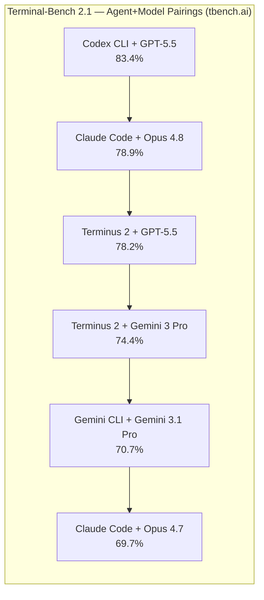
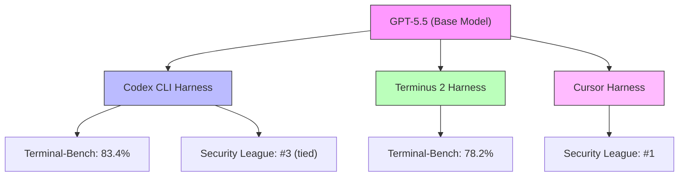
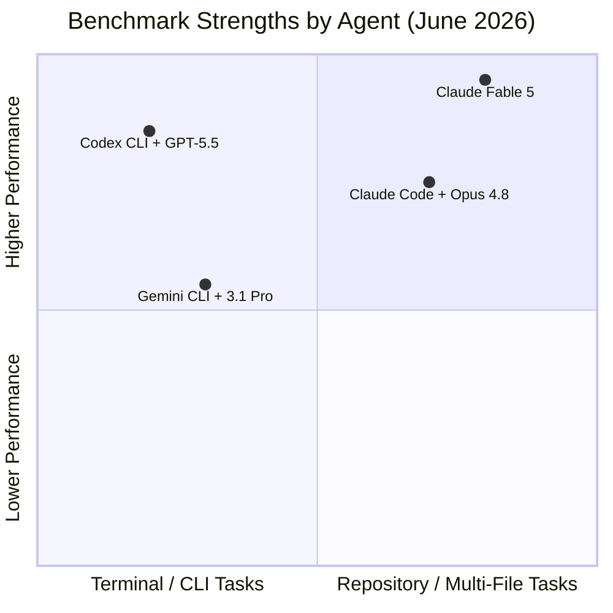

# Terminal-Bench 2.1 and the June 2026 Benchmark Landscape: Why the Harness Matters More Than the Model for Codex CLI Developers


---

The June 2026 coding agent benchmark results are in, and they tell a story that most leaderboard chasers miss entirely. Codex CLI with GPT-5.5 tops Terminal-Bench 2.1 at 83.4% amongst named CLI agents[^1], yet the same GPT-5.5 model scores 76.40% when run through the Terminus 2 harness on the same benchmark[^2]. That 7-point gap has nothing to do with the model and everything to do with the agent loop that wraps it.

This article unpacks the June 2026 benchmark landscape — Terminal-Bench 2.1, SWE-bench, the Agent Security League, and the Artificial Analysis composite index — and extracts the practical lessons Codex CLI developers should draw from the numbers.

## Terminal-Bench 2.1: What Changed

Terminal-Bench originated as a research benchmark from the Laude Institute, published at ICLR 2026[^3]. Version 2.1 is the verified revision, produced through a collaborative review process that fixed ambiguous task definitions and flawed validation scripts from the original 2.0 release[^2].

The benchmark comprises 89 hand-crafted tasks spanning scientific computing, software engineering, machine learning, security, system administration, and data science[^4]. Each task drops the agent into a Docker container with an instruction, a time limit, and a set of pytest validations. The agent must pass all tests to receive credit — there is no partial scoring.

Two methodological shifts distinguish 2.1 from its predecessors:

1. **Time-based limits replaced turn limits.** Agents that think longer but act fewer times are no longer penalised[^2].
2. **Infrastructure moved from EC2 to Daytona.** Remote evaluation via Daytona sandboxes reduced infrastructure variance between runs[^2].

These changes particularly benefit agents with sophisticated planning phases — and Codex CLI's reasoning-effort-tunable loop is one of them.

## The June 2026 Leaderboard



The full rankings from tbench.ai as of 9 June 2026[^1]:

| Rank | Agent + Model | Score |
|------|--------------|-------|
| 1 | Codex CLI + GPT-5.5 | 83.4% |
| 2 | Claude Code + Opus 4.8 | 78.9% |
| 3 | Terminus 2 + GPT-5.5 | 78.2% |
| 4 | Terminus 2 + Gemini 3 Pro | 74.4% |
| 5 | Gemini CLI + Gemini 3.1 Pro | 70.7% |
| 6 | Claude Code + Opus 4.7 | 69.7% |

Note the critical detail: GPT-5.5 appears twice — once at 83.4% inside Codex CLI, once at 78.2% inside Terminus 2. The model is identical; the harness engineering accounts for the 5.2-point spread.

## The Harness-Model Decoupling Thesis

This is the single most important insight from the June 2026 benchmark cycle: **the same model scores differently inside different agents**[^1]. The agent's tool loop, sandbox configuration, file-handling strategy, retry logic, and verification patterns are not incidental — they are co-equal determinants of performance.

Endor Labs' Agent Security League reinforces this finding from the security angle. GPT-5.5 sits at the top of the code security board when wrapped by Cursor, but only ties for third when wrapped by Codex CLI[^5]. Within the same week, the same model, two different harnesses, two materially different security outcomes. As Endor Labs put it: "the harness shapes outcomes more than the model alone"[^5].



For Codex CLI developers, this means your `config.toml` settings, AGENTS.md instructions, hook configurations, and permission profiles are not cosmetic — they are performance-critical infrastructure.

## Where Codex CLI Leads and Where It Trails

No single agent sweeps every benchmark. The June 2026 numbers tell a nuanced story:

### Codex CLI strengths

- **Terminal-native workflows:** 83.4% on Terminal-Bench 2.1, the highest score of any named CLI agent[^1]. Codex CLI's OS-native sandbox and deep shell integration give it an edge on tasks involving process management, filesystem operations, and multi-step terminal workflows.
- **SWE-bench Verified:** GPT-5.5 scores 82.60% on SWE-bench Verified[^6], and has been reported as high as 88.7% in some evaluations[^7]. This benchmark tests single-repository bug fixes with known solutions.
- **Token efficiency:** Codex CLI uses approximately 4x fewer tokens than Claude Code for equivalent tasks[^8], which matters when you are paying per million tokens.

### Where others lead

- **SWE-bench Pro (complex repository tasks):** Claude Opus 4.8 leads at 69.2%, with Claude Fable 5 extending that to 80.3%[^9]. GPT-5.5 scores 58.6% on this harder variant[^7]. SWE-bench Pro tests longer-horizon, production-style fixes that require reasoning across multiple files and understanding broader codebase context.
- **SWE-bench Verified (absolute top):** Claude Fable 5 (released 9 June 2026) reaches 95.0% on SWE-bench Verified[^9], surpassing GPT-5.5's score by a significant margin.
- **Composite intelligence:** The Artificial Analysis Intelligence Index v4.0 places Claude Opus 4.8 first at 61.4, with GPT-5.5 close behind at 60.2[^10]. This composite aggregates 10 evaluations across reasoning, coding, agentic tool use, science, and long-context retrieval.

### The practical interpretation



Codex CLI dominates terminal-native, sandbox-first workflows. Claude Code leads on complex multi-file repository reasoning. Neither tool sweeps every category. If your daily work is CI triage, infrastructure scripting, and single-service changes, Codex CLI's benchmark profile aligns with your workflow. If you spend your days on large cross-cutting refactors across sprawling codebases, the SWE-bench Pro numbers are more relevant.

## What Codex CLI's Harness Does Differently

Understanding *why* Codex CLI scores well on Terminal-Bench helps you configure it for your own workflows. Several architectural decisions contribute:

### OS-native sandboxing

Codex CLI uses operating system-level isolation (macOS Seatbelt, Linux namespaces, Windows restricted tokens) rather than Docker containers[^11]. On Terminal-Bench's Docker-based tasks, this means the agent's own sandbox does not conflict with the benchmark's container — a subtle advantage that container-in-container harnesses must work around.

### Reasoning effort tuning

The `--reasoning-effort` flag (or per-profile `reasoning_effort` in `config.toml`) lets the model trade speed for depth[^12]. On hard Terminal-Bench tasks — where 93.3% of human-rated "hard" tasks are also empirically hard for agents[^4] — higher reasoning effort yields measurable gains.

```toml
# Profile tuned for complex terminal tasks
[profiles.deep]
model = "gpt-5.5"
reasoning_effort = "high"
```

### Verification loops

Codex CLI's PostToolUse hooks enable verification after every tool call[^13]. On Terminal-Bench tasks where the agent must iteratively build, test, and fix, these hooks catch failures early rather than accumulating errors across a long action sequence.

### Tool call efficiency

Codex CLI's sandbox allows direct filesystem and process operations without routing through MCP tool calls for basic actions[^11]. This reduces the token overhead per step, which compounds over the 89 tasks in the benchmark suite.

## How to Use Benchmarks Without Being Misled

Senior developers should approach the June 2026 leaderboards with the following principles:

**1. Always read agent+model pairings, not models in isolation.** A "GPT-5.5 score" is meaningless without knowing which harness produced it. Terminal-Bench explicitly reports agent-model combinations because "the agent can make [a significant] difference on performance"[^14].

**2. Match the benchmark to your workflow.** Terminal-Bench tests terminal-native tasks in isolated containers. SWE-bench Pro tests multi-file repository fixes. The Agent Security League tests secure code generation. Your daily work probably overlaps with one category more than the others — weight your tool selection accordingly.

**3. Check the evaluation harness.** Terminal-Bench 2.1 on vals.ai uses the Terminus 2 harness for all models, producing an apples-to-apples model comparison[^2]. Terminal-Bench on tbench.ai uses each agent's native harness, producing an apples-to-apples *tool* comparison. Both are valid; they answer different questions.

**4. Watch for fallback configurations.** Claude Fable 5's 80.52% on vals.ai used Claude Opus 4.8 as a fallback for model refusals[^2]. This is a valid production pattern but complicates interpretation — you are benchmarking a model ensemble, not a single model.

**5. Benchmark your own tasks.** The most relevant benchmark is the one you run on your codebase. Codex CLI's `codex exec` with `--output-schema` can produce structured pass/fail results against your own test suites, giving you a private leaderboard that actually reflects your work[^15].

## The Bigger Picture: Benchmark Convergence

The June 2026 numbers show the top tier of coding agents converging. The gap between first and sixth place on Terminal-Bench 2.1 is 13.7 points (83.4% to 69.7%)[^1]. Six months ago, the spread was wider. As models and harnesses improve in parallel, the marginal gains from switching agents shrink.

What has not converged is *cost*. Codex CLI's 4x token efficiency advantage[^8] means that for equivalent Terminal-Bench performance, your monthly API bill is substantially lower. At typical enterprise usage of 100–200 USD per developer per month[^16], a 4x token efficiency gap translates directly into either cost savings or the ability to run more tasks within the same budget.

The practical takeaway for June 2026: invest in harness engineering — your AGENTS.md files, hook configurations, profile tuning, and sandbox policies — rather than chasing the next model release. The benchmarks show that a well-configured Codex CLI with GPT-5.5 outperforms a default-configured alternative with a nominally superior model. Configuration is the new competitive advantage.

## Citations

[^1]: [MorphLLM — Best AI Coding Agent (2026): Ranked by Terminal-Bench, Price, and Source](https://www.morphllm.com/ai-coding-agent)
[^2]: [Vals.ai — Terminal-Bench 2.1](https://www.vals.ai/benchmarks/terminal-bench-2-1)
[^3]: [Terminal-Bench: Benchmarking Agents on Hard, Realistic Tasks in Command Line Interfaces — ICLR 2026](https://arxiv.org/abs/2601.11868)
[^4]: [Epoch AI — Terminal-Bench 2.0](https://epoch.ai/benchmarks/terminal-bench)
[^5]: [Endor Labs — GPT-5.5 Sets a New Code Security Record with Cursor, not Codex, in Agent Security League](https://www.endorlabs.com/learn/gpt-5-5-sets-a-new-code-security-record-with-cursor-not-codex-in-agent-security-league)
[^6]: [Vals.ai — SWE-bench Verified](https://www.vals.ai/benchmarks/swebench)
[^7]: [MorphLLM — Codex vs Claude Code (June 2026)](https://www.morphllm.com/comparisons/codex-vs-claude-code)
[^8]: [CodeAnt — Claude Code CLI vs Codex CLI vs Gemini CLI: Best AI CLI Tool for Developers in 2026](https://www.codeant.ai/blogs/claude-code-cli-vs-codex-cli-vs-gemini-cli-best-ai-cli-tool-for-developers-in-2025)
[^9]: [MorphLLM — SWE-bench Pro Leaderboard (2026)](https://www.morphllm.com/swe-bench-pro)
[^10]: [Artificial Analysis — AI Coding Agent Benchmarks & Leaderboard](https://artificialanalysis.ai/agents/coding-agents)
[^11]: [OpenAI Developers — Sandbox (Codex)](https://developers.openai.com/codex/concepts/sandboxing)
[^12]: [OpenAI Developers — Configuration Reference](https://developers.openai.com/codex/config-reference)
[^13]: [OpenAI Developers — Agent Approvals & Security](https://developers.openai.com/codex/agent-approvals-security)
[^14]: [Epoch AI — Terminal-Bench 2.0 Methodology](https://epoch.ai/benchmarks/terminal-bench)
[^15]: [OpenAI Developers — Codex CLI Reference](https://developers.openai.com/codex/cli/reference)
[^16]: [OpenAI Developers — Codex Pricing](https://developers.openai.com/codex/pricing)
