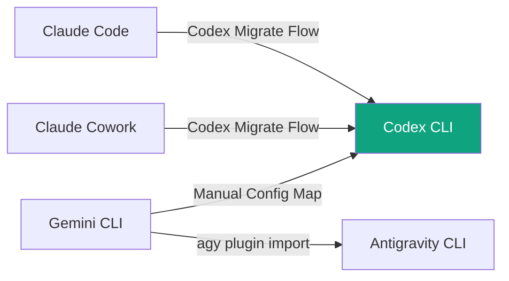
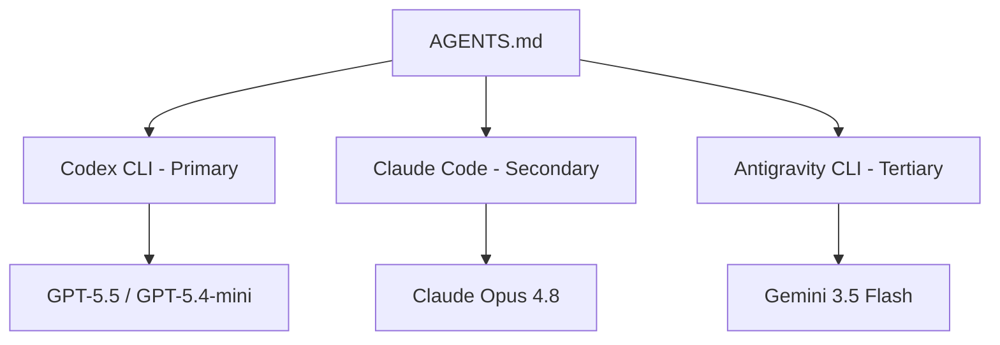

# The Three Migration Paths into Codex CLI: Moving Workflows from Claude Code, Claude Cowork, and Gemini CLI Before the June 18 Deadline


---

Three events converged in the first fortnight of June 2026 to force a consolidation moment for developers running multi-agent setups. Google announced that Gemini CLI stops serving free, Pro, and Ultra users on 18 June — seven days from today[^1]. OpenAI shipped Codex app 26.608 on 9 June with built-in migration flows for both Claude Code and Claude Cowork, surfaced during onboarding[^2]. And Anthropic moved Claude Code's programmatic usage to credit-metered billing on 15 June[^3]. The net effect: developers who previously maintained two or three coding agent configurations in parallel now have a strong incentive to consolidate, and Codex CLI is positioning itself as the target.

This article covers the three practical migration paths into Codex CLI, what transfers automatically, what breaks, and the configuration decisions you need to make this week.

---

## Why Consolidation Is Happening Now

The coding agent market hit an inflection point. With more than 5 million weekly active Codex users as of early June[^4], and Claude Code, Gemini CLI, and Antigravity all competing for the same developer workflows, maintaining parallel configurations across multiple agents has become a genuine operational burden. Each tool has its own instruction files (AGENTS.md, CLAUDE.md, GEMINI.md), its own hook system, its own MCP configuration, and its own approval model.

The Gemini CLI shutdown forces the issue. Developers who relied on Gemini CLI for certain workflows — particularly those using the free Code Assist tier or Google AI Pro credits — must choose between Google's closed-source replacement (Antigravity CLI, invoked as `agy`) or moving those workflows elsewhere[^1]. For teams already running Codex CLI, absorbing Gemini CLI workflows into their existing Codex setup is the path of least resistance.



---

## Path 1: Claude Code to Codex CLI

This is the most mature migration path. OpenAI has invested heavily in making this transition smooth, including a built-in import feature, an official `migrate-to-codex` skill, and community tools like `cc2codex`[^5].

### What Transfers Automatically

The Codex app's **Settings → Import other agent setup** scans your machine for Claude Code configurations and migrates what it can[^6]:

- **Skills**: Reusable procedures from Claude Code transfer into Codex skills. The structural mapping is largely mechanical — most skills work without modification.
- **MCP servers**: Server definitions from Claude Code's `.mcp.json` files import into Codex's MCP configuration with endpoint URLs preserved.
- **Hooks**: Deterministic gates map into Codex hooks. Claude Code supports 17 lifecycle hook events; Codex supports a smaller set (`SessionStart`, `PreToolUse`, `PostToolUse`, `PermissionRequest`, `UserPromptSubmit`, `Stop`), so some hooks require manual review[^7].
- **Instruction files**: `CLAUDE.md` rules transfer into layered `AGENTS.md` files, preserving the directory hierarchy.
- **Session history**: Up to 30 days of session transcripts are importable for context continuity.

### What Does Not Transfer

- **API keys and environment variables**: Deliberately excluded for security. Re-enter them after import[^6].
- **Auto-memory**: Claude Code's automatic context memory system has no direct Codex equivalent. You will need to use Codex's memories system (`/memory` or the memories MCP server) as a manual replacement[^7].
- **Subagent orchestration**: Claude Code's `Task` and `Agent` primitives do not map cleanly to Codex's multi-agent v2 system. Complex orchestration patterns require manual porting[^7].
- **Hook triggers without equivalents**: Some Claude Code hook events (e.g., `Notification`, `SubagentStart`) have no Codex mapping and are flagged for manual review during import.

### Configuration Mapping Cheat Sheet

```toml
# Claude Code → Codex CLI configuration mapping

# CLAUDE.md → AGENTS.md (rename, adjust syntax)
# ~/.claude/config.json → ~/.codex/config.toml
# .claude/settings.json → .codex/config.toml (project-level)
# claude_desktop_config.json MCP → .mcp.json (Codex format)
```

### CLI Migration Script

For CLI-first developers, the `migrate-to-codex` skill offers granular control[^5]:

```bash
# Scan only — see what would transfer
codex exec --skill migrate-to-codex -- --scan-only

# Dry run — preview the migration plan
codex exec --skill migrate-to-codex -- --dry-run

# Execute the migration
codex exec --skill migrate-to-codex -- --source claude-code --target ~/.codex
```

---

## Path 2: Claude Cowork to Codex CLI

This is the newest migration path, shipping with Codex app 26.608 on 9 June 2026[^2]. Claude Cowork is Anthropic's desktop agent for knowledge work — it operates on local files, folders, and desktop applications rather than codebases[^8]. The migration challenge is fundamentally different from Claude Code because Cowork workflows are not code-centric.

### What Claude Cowork Does Differently

Claude Cowork runs on desktop, connecting to local applications (Blender, Adobe, Autodesk, spreadsheet tools) and completing multi-step knowledge work tasks[^8]. It reached general availability on 9 April 2026 with enterprise features including role-based access controls, group spend limits, and OpenTelemetry support[^9]. As of June 2026, Anthropic doubled Cowork's 5-hour usage limit for eligible users through 5 July[^10].

### What the Migration Flow Captures

The Codex app's Claude Cowork import flow is more limited than the Claude Code path:

- **Task templates**: Reusable Cowork task definitions transfer as Codex skills.
- **File access patterns**: Cowork's workspace configuration maps to Codex's writable roots and sandbox settings.
- **MCP server connections**: Any MCP servers configured in Cowork transfer to Codex's `.mcp.json`.

### What You Lose

- **Desktop application connectors**: Cowork's integrations with desktop applications (Blender, Adobe, Spotify, etc.) have no Codex equivalent. Codex is terminal-first; desktop automation requires Computer Use, which operates differently[^11].
- **Visual context**: Cowork's ability to see and interact with GUI elements does not transfer. Codex's Computer Use feature covers some of this ground but with a different interaction model.
- **Knowledge-work framing**: Cowork is designed for non-developers. Codex's UX assumptions are developer-centric. Workflows around report generation, presentation creation, and spreadsheet manipulation may need significant rethinking in Codex's paradigm.

### When to Stay on Cowork

If your primary use case is desktop application automation, document creation, or visual knowledge work, the Codex migration may not be appropriate. Codex excels at code, infrastructure, and terminal-based workflows. For pure knowledge work, Cowork remains the better-fitted tool — the migration flow exists primarily for developers who use Cowork alongside Claude Code and want to consolidate their MCP and skill configurations.

---

## Path 3: Gemini CLI to Codex CLI

Unlike the Claude migrations, there is no automated import flow from Gemini CLI to Codex CLI. Google's official migration path is Antigravity CLI (`agy`)[^1], and Codex treats this as a manual configuration exercise.

### The June 18 Deadline

Gemini CLI stops authenticating free, Google AI Pro, and Google AI Ultra users on 18 June 2026. After that date, the auth endpoint returns HTTP 410 Gone[^1]. Enterprise users with Gemini Code Assist Standard or Enterprise licences retain access, but the writing is on the wall — Google wants everyone on Antigravity[^12].

### Manual Configuration Mapping

```toml
# Gemini CLI → Codex CLI configuration mapping

# GEMINI.md → AGENTS.md (rename, adjust format)
# .gemini/settings.json → ~/.codex/config.toml
# .gemini/skills/ → ~/.codex/skills/ (restructure as Codex skills)
```

The key structural differences:

| Gemini CLI | Codex CLI | Notes |
|---|---|---|
| `GEMINI.md` | `AGENTS.md` | Content transfers; format is compatible |
| `.gemini/skills/` | `~/.codex/skills/` or plugin skills | Markdown skills map directly |
| `gemini_api_key` | `OPENAI_API_KEY` | Different provider, different auth |
| `--model gemini-3-pro` | `--model gpt-5.5` | Model names do not map |
| Extensions (Python) | Plugins (manifest-driven) | Ecosystem difference; no auto-import |

### Model Considerations

Gemini CLI developers accustomed to Gemini models can still access them through Codex CLI's custom provider configuration, pointing at the Gemini API's OpenAI-compatible endpoint[^13]:

```toml
# ~/.codex/config.toml — access Gemini models through Codex CLI
[model_providers.gemini]
name = "Google Gemini"
base_url = "https://generativelanguage.googleapis.com/v1beta/openai"
env_key = "GEMINI_API_KEY"
wire_api = "responses"
```

⚠️ **Critical**: `wire_api` must be set to `"responses"`, not `"chat"`. OpenAI removed Chat Completions support from Codex CLI's wire protocol. Guides written before mid-2026 that show `wire_api = "chat"` will produce silent failures[^14].

### The Antigravity Alternative

If you prefer to stay within Google's ecosystem, Antigravity CLI offers a smoother path[^1]:

```bash
# Install Antigravity CLI
curl -fsSL https://antigravity.google/install.sh | bash

# Import Gemini CLI extensions
agy plugin import gemini
```

Four breaking changes to watch: the default model switches to `gemini-3-pro`, `--stream` emits SSE by default, the agent state directory moves to `~/.antigravity/`, and exit codes are non-zero on tool-use failures[^15].

---

## The Dual-Stack Alternative

Not every team should consolidate to a single agent. A dual-stack setup — typically Codex CLI as the primary agent with Claude Code or Antigravity as a secondary — has legitimate use cases:

- **Cross-model verification**: Running the same task through GPT-5.5 (via Codex) and Claude Opus 4.8 (via Claude Code) catches model-specific blind spots[^16].
- **Benchmark-driven routing**: Terminal-Bench 2.1 shows Codex CLI + GPT-5.5 at 83.4% and Claude Code + Opus 4.8 at 78.9%, but SWE-bench Pro reverses the ranking[^17]. Different tasks may genuinely suit different agents.
- **Risk distribution**: Post-IPO pricing uncertainty at both OpenAI and Anthropic makes single-vendor dependence a business risk[^18].

For dual-stack setups, keep instruction files portable. AGENTS.md is read by Codex CLI, Claude Code, Gemini CLI, Antigravity, Cursor, Aider, Kiro, and more than a dozen other tools[^19]. Write your agent instructions in AGENTS.md and they work everywhere.



---

## Decision Framework

Use this framework to decide which migration path — or non-migration — is right for your situation:

**Consolidate to Codex CLI if:**
- Your primary workflows are code-centric (development, review, CI/CD, infrastructure)
- You already have Codex CLI in production and want to reduce configuration overhead
- You need structured output (`--output-schema`) for pipeline automation
- You want open-source transparency (Apache 2.0 licence)[^20]

**Stay dual-stack if:**
- You actively use both GPT-5.5 and Claude Opus 4.8 for different task types
- Your team includes both developers and non-developers with different tool preferences
- You are hedging against post-IPO pricing changes at either vendor

**Do not migrate from Claude Cowork if:**
- Your primary use case is desktop application automation
- You rely on Cowork's visual context and application connectors
- Your workflows are knowledge-work, not code

---

## This Week's Checklist

1. **Audit your Gemini CLI usage** — if you are on a free, Pro, or Ultra plan, you have until 18 June before authentication fails
2. **Run the Codex migration scan** — `codex exec --skill migrate-to-codex -- --scan-only` to see what Claude Code or Cowork configuration exists on your machine
3. **Verify `wire_api = "responses"`** — if you have custom providers in `config.toml`, confirm they use the Responses API wire protocol
4. **Test your AGENTS.md portability** — ensure your primary instruction file works across all agents you intend to keep
5. **Back up session history** — both Claude Code and Gemini CLI sessions may become inaccessible after migration or shutdown

---

## Citations

[^1]: Google Developers Blog, "An important update: Transitioning Gemini CLI to Antigravity CLI", [https://developers.googleblog.com/an-important-update-transitioning-gemini-cli-to-antigravity-cli/](https://developers.googleblog.com/an-important-update-transitioning-gemini-cli-to-antigravity-cli/)
[^2]: OpenAI, "Codex Changelog — Codex app 26.608", [https://developers.openai.com/codex/changelog](https://developers.openai.com/codex/changelog)
[^3]: Codex Knowledge Base, "Coding Agent Landscape, June 2026", [https://codex.danielvaughan.com/2026/06/05/coding-agent-landscape-june-2026/](https://codex.danielvaughan.com/2026/06/05/coding-agent-landscape-june-2026/)
[^4]: OpenAI, "Codex is becoming a productivity tool for everyone", [https://openai.com/index/codex-for-knowledge-work/](https://openai.com/index/codex-for-knowledge-work/)
[^5]: OpenAI Skills Repository, "migrate-to-codex SKILL.md", [https://github.com/openai/skills/blob/main/skills/.curated/migrate-to-codex/SKILL.md](https://github.com/openai/skills/blob/main/skills/.curated/migrate-to-codex/SKILL.md)
[^6]: MindWired AI, "Claude Code to Codex Migration: One-Click Import Guide", [https://mindwiredai.com/2026/05/18/claude-code-to-codex-migration-guide/](https://mindwiredai.com/2026/05/18/claude-code-to-codex-migration-guide/)
[^7]: Blake Crosley, "Claude Code to Codex Migration Guide 2026", [https://blakecrosley.com/blog/claude-code-to-codex-migration](https://blakecrosley.com/blog/claude-code-to-codex-migration)
[^8]: Anthropic, "Claude Cowork — agentic AI for knowledge work", [https://www.anthropic.com/product/claude-cowork](https://www.anthropic.com/product/claude-cowork)
[^9]: Anthropic, "Managed Agents and Claude Cowork GA: April 9, 2026", [https://www.anthropic.com/news/claude-for-small-business](https://www.anthropic.com/news/claude-for-small-business)
[^10]: The New Stack, "Why Anthropic just doubled Claude Cowork limits at no charge", [https://thenewstack.io/anthropic-claude-cowork-promotion/](https://thenewstack.io/anthropic-claude-cowork-promotion/)
[^11]: OpenAI Developers, "Codex CLI Features", [https://developers.openai.com/codex/cli/features](https://developers.openai.com/codex/cli/features)
[^12]: The Register, "Bye-bye, Gemini CLI; Google nudges devs toward Antigravity", [https://www.theregister.com/ai-ml/2026/05/20/bye-bye-gemini-cli-google-nudges-devs-toward-antigravity/](https://www.theregister.com/ai-ml/2026/05/20/bye-bye-gemini-cli-google-nudges-devs-toward-antigravity/)
[^13]: OpenAI Developers, "Advanced Configuration — Codex CLI", [https://developers.openai.com/codex/config-advanced](https://developers.openai.com/codex/config-advanced)
[^14]: Morphic LLM, "Codex config.toml (2026): Add Any Custom Provider in 6 Lines", [https://www.morphllm.com/codex-provider-configuration](https://www.morphllm.com/codex-provider-configuration)
[^15]: Digital Applied, "Gemini CLI Dies June 18: The Antigravity Migration Guide", [https://www.digitalapplied.com/blog/gemini-cli-to-antigravity-cli-migration-june-18-2026-guide](https://www.digitalapplied.com/blog/gemini-cli-to-antigravity-cli-migration-june-18-2026-guide)
[^16]: Towards Data Science, "How to Combine Claude Code and Codex for Maximum Coding Power", [https://towardsdatascience.com/how-to-combining-claude-code-and-codex-for-max-coding-power/](https://towardsdatascience.com/how-to-combining-claude-code-and-codex-for-max-coding-power/)
[^17]: Codex Knowledge Base, "Terminal-Bench 2.1 and the June 2026 Benchmark Landscape", [https://codex.danielvaughan.com/2026/06/11/terminal-bench-2-1-june-2026-benchmark-landscape/](https://codex.danielvaughan.com/2026/06/11/terminal-bench-2-1-june-2026-benchmark-landscape/)
[^18]: Codex Knowledge Base, "OpenAI's S-1 Filing: What the IPO Path Means for Codex CLI Developers", [https://codex.danielvaughan.com/2026/06/10/openai-s1-ipo-filing-codex-cli-developer-implications/](https://codex.danielvaughan.com/2026/06/10/openai-s1-ipo-filing-codex-cli-developer-implications/)
[^19]: Build Better AI Blog, "AGENTS.md Complete Guide for Engineering Teams (2026)", [https://blog.buildbetter.ai/agents-md-complete-guide-for-engineering-teams-in-2026/](https://blog.buildbetter.ai/agents-md-complete-guide-for-engineering-teams-in-2026/)
[^20]: OpenAI, "Codex CLI — GitHub Repository", [https://github.com/openai/codex](https://github.com/openai/codex)
