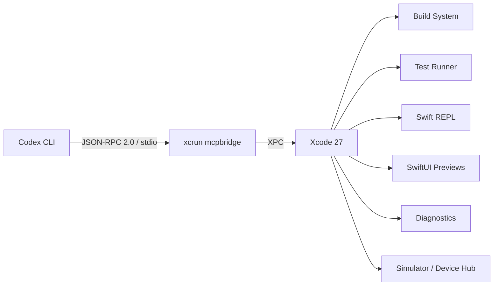
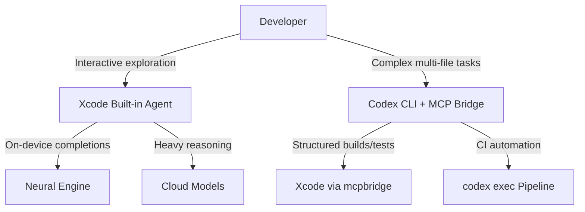

# Xcode 27 and Codex CLI: Connecting Apple's MCP Bridge for Agentic iOS and macOS Development


---

Apple's WWDC 2026 announcements on 9–10 June introduced Xcode 27 with first-class support for external coding agents via the Model Context Protocol [^1]. For Codex CLI users building iOS and macOS applications, this changes the development surface fundamentally: your terminal agent can now build projects, run tests, render SwiftUI previews, execute Swift REPL snippets, and query Apple's documentation — all through structured JSON rather than parsing compiler output.

This article covers the architecture, setup, and practical workflows for connecting Codex CLI to Xcode 27's MCP bridge.

## The Two-Protocol Architecture

Xcode 27 introduces a dual-protocol system that separates capability from authorisation [^2]:



**Model Context Protocol (MCP)** governs what agents can do inside Xcode. The `mcpbridge` binary translates MCP requests over standard input/output into XPC calls against Xcode's live process [^3]. Because it communicates via XPC rather than a network socket, mcpbridge has direct access to Xcode's live state: active code diagnostics, resolved symbol information, SwiftUI preview rendering, and the Swift REPL [^4].

**Agent Client Protocol (ACP)** is new in Xcode 27 and governs which agents are permitted to connect. Any third-party agent implementing ACP can register with Xcode, but connection requires explicit user consent [^2].

## The 20 MCP Tools

Xcode exposes 20 structured tools across six categories [^5][^6]:

| Category | Tools | Purpose |
|---|---|---|
| **File Operations** | `XcodeRead`, `XcodeWrite`, `XcodeUpdate`, `XcodeGlob`, `XcodeGrep`, `XcodeLS`, `XcodeMakeDir`, `XcodeRM`, `XcodeMV` | Project file manipulation |
| **Build & Test** | `BuildProject`, `GetBuildLog`, `RunAllTests`, `RunSomeTests`, `GetTestList` | Structured build errors and test results |
| **Diagnostics** | `XcodeListNavigatorIssues`, `XcodeRefreshCodeIssuesInFile` | Live compiler warnings and errors |
| **Code Execution** | `ExecuteSnippet` | Swift REPL for API verification |
| **Preview** | `RenderPreview` | Headless SwiftUI preview rendering |
| **Documentation** | `DocumentationSearch` | Apple documentation queries |

The critical advantage over shell-based `xcodebuild` invocations is structure: `BuildProject` returns typed error objects with file paths, line numbers, and severity levels rather than free-text compiler output that an LLM must parse heuristically [^4].

## Setup: One Command

Apple's official documentation provides the configuration for Codex CLI [^7]:

```bash
codex mcp add xcode -- xcrun mcpbridge
```

Verify the registration:

```bash
codex mcp list
```

Before this works, enable MCP access in Xcode:

1. Open **Xcode → Settings → Intelligence**
2. Under **Model Context Protocol**, enable **"Allow external agents to use Xcode tools"** [^7]

Your project must be open in Xcode before prompting Codex CLI. The mcpbridge connects to whichever project is active in the frontmost Xcode window [^7].

### AGENTS.md Hints

Apple recommends adding Xcode-specific context to your `AGENTS.md` [^7]. A minimal addition for an iOS project:

```markdown
## Xcode Integration

- This is an iOS project using SwiftUI with a minimum deployment target of iOS 18
- Use the Xcode MCP tools for building (`BuildProject`), testing (`RunAllTests`), and previewing (`RenderPreview`)
- Prefer `ExecuteSnippet` to verify unfamiliar Apple APIs before writing implementation code
- Run `DocumentationSearch` before suggesting deprecated APIs
- Build target: MyApp (scheme: MyApp-Debug)
```

## Practical Workflows

### Build-Test-Fix Loop

With the MCP bridge connected, Codex CLI can execute a structured build-test-fix cycle without shelling out to `xcodebuild`:

```
> Fix the crash in PaymentViewController. Build the project, run the
  PaymentTests suite, and iterate until all tests pass.
```

Codex calls `BuildProject` → reads structured errors → edits Swift files → calls `RunSomeTests` with the specific test class → reads pass/fail results → iterates. Each step returns structured JSON, eliminating the parsing ambiguity that plagues shell-based workflows [^4].

### SwiftUI Preview Verification

The `RenderPreview` tool renders SwiftUI views headlessly and returns image data:

```
> Update the ProfileCard to use the new liquid glass material from iOS 27.
  Render a preview after each change so I can verify the visual output.
```

This closes the visual feedback loop without requiring the developer to switch to Xcode's canvas manually [^8].

### Swift REPL Exploration

`ExecuteSnippet` runs Swift code in an isolated REPL session, ideal for verifying API behaviour before committing to an implementation:

```
> Before implementing the new HealthKit query, use ExecuteSnippet to verify
  the HKQuantityType initialiser syntax for bodyMass in the iOS 27 SDK.
```

This is particularly valuable for catching API changes between SDK versions — a common source of agent hallucination in Apple platform development [^4].

### Crash Diagnosis from Organiser

Xcode 27's agents can pull crash reports directly from Organiser [^1]. Combined with Codex CLI's codebase awareness:

```
> Pull the top crash from Organiser, symbolicate it, identify the root
  cause in our codebase, write a fix, and run the relevant test suite.
```

## Codex CLI vs Xcode's Built-in Agents

Xcode 27 ships with built-in agent support for Claude, ChatGPT, and Gemini, configured directly in Intelligence settings [^2]. Why use Codex CLI as an external agent instead?

| Consideration | Built-in Agents | Codex CLI (External) |
|---|---|---|
| **Sandbox** | Xcode-managed | OS-level Seatbelt + configurable [^9] |
| **Automation** | Interactive only | `codex exec` for CI pipelines |
| **Extensibility** | Xcode MCP tools only | Full MCP ecosystem + plugins |
| **Multi-repo** | Single project | Cross-repo context via AGENTS.md |
| **Approval policy** | Xcode-controlled | Configurable permission profiles |
| **Model routing** | Fixed per-provider | Profile-based model switching |

The key differentiator is automation. Codex CLI's `codex exec` mode enables non-interactive pipelines that can build, test, and report via the Xcode MCP bridge — something the built-in agents cannot do [^9].

### Hybrid Pattern

The most effective setup for teams combines both surfaces:



Use Xcode's built-in agents for quick inline completions (powered by the Neural Engine, entirely on-device [^10]) and exploratory conversations. Use Codex CLI for complex multi-file refactoring, automated test maintenance, and CI integration where `codex exec` with `--output-schema` produces structured reports.

## Apple's Seven Agent Skills

Xcode 27 ships seven built-in agent skills using the same `SKILL.md` format as Codex CLI [^11]:

1. **swiftui-specialist** — idiomatic SwiftUI patterns
2. **swiftui-whats-new-27** — latest SwiftUI APIs from this release cycle
3. **uikit-app-modernization** — patterns for updating UIKit implementations
4. **test-modernizer** — current testing practices
5. **audit-xcode-security-settings** — security best practices review
6. **c-bounds-safety** — C bounds safety guidance
7. **device-interaction** — Device Hub and simulator management

These skills are exportable and reusable in Codex CLI:

```bash
xcrun agent skills export --output-dir ~/Downloads/xcode-skills
```

Copy the exported skill directories into your project's `.agents/skills/` or your global `~/.codex/skills/` to make them available in Codex CLI sessions [^11]. The `swiftui-specialist` and `test-modernizer` skills are particularly valuable for maintaining idiomatic Swift code when working through a terminal agent.

## XcodeBuildMCP: The Community Alternative

Before Apple shipped mcpbridge, the community built **XcodeBuildMCP** (maintained by Sentry) as a third-party MCP server wrapping `xcodebuild` [^12]. With Xcode 27's native bridge, the question is whether XcodeBuildMCP remains relevant.

| Feature | mcpbridge (Apple) | XcodeBuildMCP (Sentry) |
|---|---|---|
| **Connection** | XPC (requires Xcode running) | CLI subprocess (headless) |
| **SwiftUI Previews** | `RenderPreview` built-in | Not supported |
| **Swift REPL** | `ExecuteSnippet` built-in | Not supported |
| **CI/headless builds** | Requires Xcode GUI process | Works headless via `xcodebuild` |
| **Linux CI runners** | Not available | Not available (macOS only) |

For CI pipelines on headless Mac runners where Xcode cannot display a GUI, XcodeBuildMCP remains the practical choice. For interactive development, mcpbridge is strictly superior due to its live diagnostic and preview access [^12].

## Configuration for Teams

A team `config.toml` snippet registering the Xcode MCP bridge alongside model routing for Swift work:

```toml
[mcp.xcode]
command = ["xcrun", "mcpbridge"]
transport = "stdio"

[profiles.ios]
model = "gpt-5.5"
reasoning_effort = "high"
```

Invoke with the iOS profile:

```bash
codex --profile ios "Refactor the networking layer to use Swift 6 structured concurrency"
```

## Limitations and Sharp Edges

**Xcode must be running.** The mcpbridge communicates via XPC, which requires a live Xcode process. Headless CI environments cannot use this bridge — use XcodeBuildMCP or direct `xcodebuild` invocations instead [^6].

**Single-project binding.** mcpbridge connects to the frontmost Xcode project. Multi-project workflows require switching the active project or running separate Codex sessions [^7].

**macOS only.** The MCP bridge is an Xcode feature; it is unavailable on Linux or Windows. ⚠️ Remote development via SSH (running Codex on a remote Mac) has not been officially documented for this workflow.

**ACP registration.** Xcode 27's Agent Client Protocol may require periodic re-authorisation. The specifics of ACP token lifecycle are not yet fully documented. ⚠️

**Tool coverage.** The 20 tools cover build, test, preview, and diagnostics — but not all Xcode features. Instruments profiling, Core Data model editing, and Interface Builder manipulation are not exposed via MCP as of Xcode 27 beta 1 [^6]. ⚠️

## What This Means for Codex CLI iOS Developers

The Xcode 27 MCP bridge closes the gap that previously made Codex CLI a second-class citizen for Apple platform development. Prior to mcpbridge, terminal agents had to shell out to `xcodebuild`, parse unstructured output, and could not access previews, diagnostics, or the REPL. With a single `codex mcp add` command, Codex CLI gains structured access to 20 Xcode capabilities — transforming it from a text editor with build scripts into a genuine IDE-aware coding agent for iOS and macOS.

The combination of Codex CLI's automation surface (`codex exec`, profiles, hooks, skills) with Xcode 27's structured tool bridge creates a development workflow that neither tool could achieve alone.

---

## Citations

[^1]: Apple, "Apple aids app development with new intelligence frameworks and advanced tools," Apple Newsroom, June 2026. [https://www.apple.com/newsroom/2026/06/apple-aids-app-development-with-new-intelligence-frameworks-and-advanced-tools/](https://www.apple.com/newsroom/2026/06/apple-aids-app-development-with-new-intelligence-frameworks-and-advanced-tools/)

[^2]: "Xcode 27: The Future of Agent-Driven Development is Here," DEV Community, June 2026. [https://dev.to/arshtechpro/xcode-27-the-future-of-agent-driven-development-is-here-12fk](https://dev.to/arshtechpro/xcode-27-the-future-of-agent-driven-development-is-here-12fk)

[^3]: "WWDC 2026 Day 3: Xcode 27 Neural Engine Completes Code Without Sending Source to Any Server," TechTimes, June 10, 2026. [https://www.techtimes.com/articles/318110/20260610/wwdc-2026-day-3-xcode-27-neural-engine-completes-code-without-sending-source-any-server.htm](https://www.techtimes.com/articles/318110/20260610/wwdc-2026-day-3-xcode-27-neural-engine-completes-code-without-sending-source-any-server.htm)

[^4]: "Xcode 27: Agentic Coding & Device Hub Guide," Lushbinary, June 2026. [https://lushbinary.com/blog/xcode-27-agentic-coding-device-hub-guide/](https://lushbinary.com/blog/xcode-27-agentic-coding-device-hub-guide/)

[^5]: kleinpanic, "xcode-mcp-suite: SDK, CLI, and MCP proxy for Xcode's agentic coding bridge," GitHub, 2026. [https://github.com/kleinpanic/xcode-mcp-suite](https://github.com/kleinpanic/xcode-mcp-suite)

[^6]: "Xcode 27 AI Agents: Multi-Model Guide for iOS Devs," byteiota, June 2026. [https://byteiota.com/xcode-27-ai-agents-multi-model-guide-for-ios-devs/](https://byteiota.com/xcode-27-ai-agents-multi-model-guide-for-ios-devs/)

[^7]: Apple, "Giving external agents access to Xcode," Apple Developer Documentation, 2026. [https://developer.apple.com/documentation/xcode/giving-external-agents-access-to-xcode](https://developer.apple.com/documentation/xcode/giving-external-agents-access-to-xcode)

[^8]: "WWDC 2026 - Xcode 27 Ships With Apple's Own Agent Skills: What They Are and How to Use Them," DEV Community, June 2026. [https://dev.to/arshtechpro/wwdc-2026-xcode-27-ships-with-apples-own-agent-skills-what-they-are-and-how-to-use-them-3g2](https://dev.to/arshtechpro/wwdc-2026-xcode-27-ships-with-apples-own-agent-skills-what-they-are-and-how-to-use-them-3g2)

[^9]: OpenAI, "Codex CLI Features," OpenAI Developers, 2026. [https://developers.openai.com/codex/cli/features](https://developers.openai.com/codex/cli/features)

[^10]: "Xcode 27 On-Device AI Code Completion Uses Neural Engine, Skips Cloud Entirely," TechTimes, June 9, 2026. [https://www.techtimes.com/articles/318045/20260609/xcode-27-device-ai-code-completion-uses-neural-engine-skips-cloud-entirely.htm](https://www.techtimes.com/articles/318045/20260609/xcode-27-device-ai-code-completion-uses-neural-engine-skips-cloud-entirely.htm)

[^11]: "WWDC 2026 - Xcode 27 Ships With Apple's Own Agent Skills," DEV Community, June 2026. [https://dev.to/arshtechpro/wwdc-2026-xcode-27-ships-with-apples-own-agent-skills-what-they-are-and-how-to-use-them-3g2](https://dev.to/arshtechpro/wwdc-2026-xcode-27-ships-with-apples-own-agent-skills-what-they-are-and-how-to-use-them-3g2)

[^12]: Sentry, "XcodeBuildMCP: A Model Context Protocol server and CLI for iOS and macOS projects," GitHub, 2026. [https://github.com/getsentry/XcodeBuildMCP](https://github.com/getsentry/XcodeBuildMCP)
