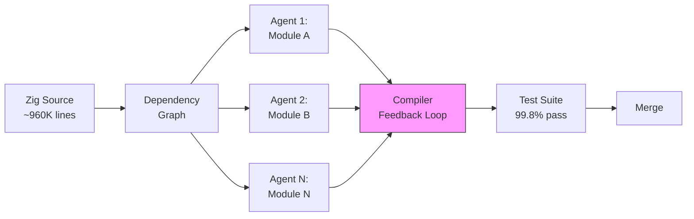
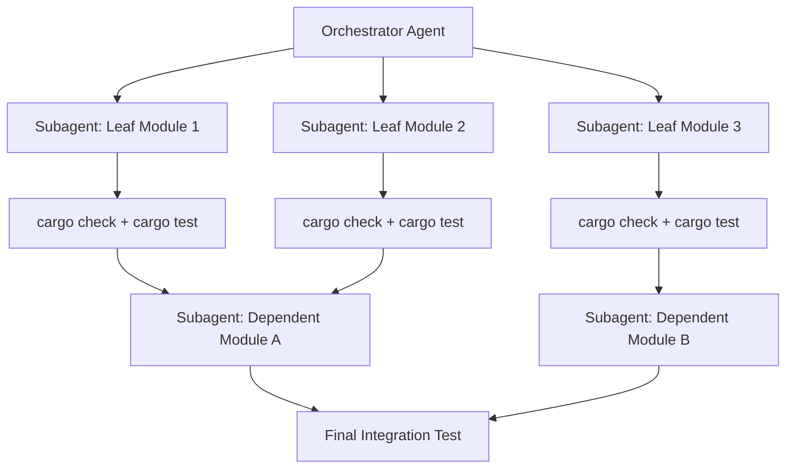

# Agent-Driven Codebase Rewrites: What Bun's Zig-to-Rust Port Teaches Codex CLI Practitioners About Large-Scale Code Translation


---

On 14 May 2026, Jarred Sumner merged PR #30412 into Bun's main branch: 1,009,257 lines of Rust across 6,755 commits, translating the JavaScript runtime from Zig to Rust in six days [^1]. The agents wrote every line. No human typed code. The PR passed 99.8% of Bun's existing test suite [^2].

Then the community counted: 13,365 `unsafe` blocks [^3].

The Bun port is the first million-line agent-driven rewrite to land in a production runtime. It is also a cautionary tale about what "passing tests" actually proves. This article examines the engineering patterns behind the port, maps them to Codex CLI's feature set, and provides a practitioner's framework for running your own large-scale code translations — without the unsafe hangover.

## The Bun Rewrite: Architecture of a Six-Day Port

Anthropic's internal agent infrastructure drove the translation in four phases [^4]:

1. **Inventory** — agents received the full Zig codebase and built a dependency graph
2. **Parallel translation** — individual modules were translated concurrently, file by file
3. **Iterative compilation** — compiler errors were fed back through correction loops until each module compiled
4. **Test verification** — the existing test suite validated behavioural parity



The approach was a *faithful transliteration* — the agents preserved the original architecture, data structures, and control flow [^5]. This is what produced the unsafe blocks: Zig's manual memory management does not map cleanly onto Rust's ownership model, and the agents chose `unsafe` over redesign.

### What the Test Pass Rate Actually Proves

A 99.8% pass rate says the new implementation behaves like the old one at the public interface. It does not say the implementation is *safe*, *idiomatic*, or *better* [^3]. By comparison, uv — which operates at a similar layer of system complexity — manages with 73 unsafe blocks [^3]. Bun's audit later found five functions that were *unsound* — real undefined behaviour reachable from safe Rust — not even part of the 13,365 count [^6].

The lesson: **test parity is necessary but not sufficient for agent-driven rewrites.** You need a verification strategy that goes beyond "the tests pass."

## Mapping the Pattern to Codex CLI

Codex CLI cannot replicate Anthropic's internal infrastructure — but it ships every primitive you need to run a structured, parallel code translation at scale. Here is the mapping.

### Phase 1: Inventory with `codex exec`

Before translating anything, build a machine-readable inventory of what needs translating. Use `codex exec` with `--output-schema` to produce structured JSON [^7]:

```bash
codex exec \
  --output-schema '{"type":"object","properties":{"modules":{"type":"array","items":{"type":"object","properties":{"path":{"type":"string"},"lines":{"type":"integer"},"dependencies":{"type":"array","items":{"type":"string"}},"complexity":{"type":"string","enum":["low","medium","high"]}}}}}}' \
  "Analyse the Zig source tree in src/. For each module, list the file path, line count, internal dependencies, and complexity rating."
```

This gives you a dependency graph you can feed into subsequent phases programmatically.

### Phase 2: AGENTS.md for Translation Governance

Create a translation-specific AGENTS.md in your project root that constrains the agent's approach:

```markdown
# Translation Rules

## Scope
You are translating this codebase from [SOURCE_LANG] to [TARGET_LANG].

## Constraints
- Translate one module at a time. Do not refactor architecture.
- Every translated file MUST compile before you move to the next.
- Do NOT use `unsafe` unless you can document why safe Rust
  cannot express the pattern. Add a `// SAFETY:` comment for each block.
- Preserve the existing test assertions. Add new tests for
  ownership and lifetime correctness.
- Do not modify files outside the current module's scope.

## Verification
After each module: run `cargo check`, then `cargo test`.
Report the module name, lines translated, unsafe block count,
and test results.
```

Nested `AGENTS.md` files in subdirectories can override rules for specific modules — for instance, FFI-heavy modules where `unsafe` is genuinely unavoidable [^8].

### Phase 3: Parallel Translation with Worktrees and Subagents

Codex CLI supports two parallelisation strategies for independent modules.

**Strategy A: Git worktrees with tmux orchestration**

Each module gets its own worktree and agent instance [^9]:

```bash
# Create isolated worktrees per module
for module in parser runtime bundler; do
  git worktree add "../bun-translate-$module" -b "translate/$module"
done

# Launch parallel agents (tmux or oh-my-codex)
codex --cd ../bun-translate-parser \
  "Translate src/parser/ from Zig to Rust following AGENTS.md rules"
codex --cd ../bun-translate-runtime \
  "Translate src/runtime/ from Zig to Rust following AGENTS.md rules"
```

**Strategy B: Native subagents via multi-agent v2**

For tighter orchestration, use Codex's subagent system [^10]. The orchestrating agent spawns child agents for independent modules:

```toml
# .codex/config.toml
[agents]
max_subagents = 8
max_depth = 1
```

The orchestrator prompt then becomes:

```
Translate the codebase from Zig to Rust. Use the dependency graph
in inventory.json. For each leaf module (no downstream dependants),
spawn a subagent to translate it. Wait for leaf modules to complete
before starting modules that depend on them. After each subagent
completes, verify with `cargo check`.
```



### Phase 4: Goal Mode for Long-Running Translation Loops

For modules too large for a single turn, use `/goal` to maintain persistent progress [^11]:

```
/goal Translate src/runtime/ from Zig to Rust.
Stop condition: cargo test --workspace passes with zero failures
and cargo clippy reports no warnings.
Checkpoint: after each sub-module compiles, commit with message
"translate: <module_name>".
```

Goal mode loops plan-act-test-review until the stop condition is met or you pause it. For multi-day translations, combine with `codex archive` and `codex resume` to manage session lifecycle [^12].

### Phase 5: Verification Beyond Test Parity

This is where the Bun case study offers its sharpest lesson. Passing the existing test suite is the floor, not the ceiling. Build a layered verification strategy:

| Layer | Tool | What It Catches |
|-------|------|----------------|
| Compilation | `cargo check` | Type errors, lifetime violations |
| Linting | `cargo clippy` | Idiomatic issues, common mistakes |
| Test parity | `cargo test` | Behavioural regressions |
| Unsafe audit | `cargo geiger` | Unsafe block inventory |
| Soundness | `miri` | Undefined behaviour in unsafe code |
| Coverage | `cargo tarpaulin` | Untested translation paths |

Wire these into a PostToolUse hook so Codex runs them automatically after each file write [^13]:

```json
{
  "postToolUse": {
    "on": ["write_file"],
    "run": "cargo check 2>&1 | head -20 && cargo geiger --count-unsafe 2>&1 | tail -5",
    "on_fail": "stop"
  }
}
```

## The Unsafe Threshold Decision

Bun shipped 13,365 unsafe blocks. Their subsequent audit found that approximately 9,300 can become safe code and roughly 4,000 must remain unsafe due to FFI boundaries with JavaScriptCore [^6]. Five functions were *unsound* — real bugs the audit surfaced [^6].

For your own translations, establish an **unsafe budget** before you start:

```markdown
<!-- In AGENTS.md -->
## Unsafe Policy
- FFI boundary code: unsafe permitted with SAFETY comment
- Pure logic code: unsafe blocks MUST be flagged for human review
- Target: fewer than 5 unsafe blocks per 1,000 lines of translated code
- Any unsound pattern (UB reachable from safe code): immediate stop
```

The ratio matters. uv achieves 73 unsafe blocks in a comparable system-level Rust codebase [^3]. If your agent is producing hundreds of unsafe blocks in application-level code, the translation strategy needs revisiting — the agent is likely preserving patterns that should be redesigned, not transliterated.

## Cost and Token Economics

A million-line translation is token-intensive. Rough estimates for Codex CLI with GPT-5.5 [^14]:

- **Inventory phase**: ~50K input tokens, ~10K output tokens per run
- **Per-module translation**: ~200K input tokens (source + context), ~150K output tokens
- **Compiler feedback loops**: 3-5 iterations at ~50K tokens each

For a 100-module codebase, budget approximately 40-60M tokens total. At current GPT-5.5 pricing, that is roughly \$300-500 in API credits — or covered by a ChatGPT Pro subscription's included Codex usage if you spread the work across sessions [^15].

Use profile-based model routing to reduce costs on boilerplate translation [^16]:

```toml
# .codex/config.toml
[profile.translate-leaf]
model = "o4-mini"  # Cheaper for straightforward modules

[profile.translate-complex]
model = "gpt-5.5"  # Full model for complex modules with FFI
```

## When Not to Use Agent-Driven Translation

The Bun port worked because Zig and Rust share enough structural similarity for line-by-line transliteration. Agent-driven translation is a poor fit when:

- **The source language is dynamically typed** (Python to Rust) — the type inference gap is too wide for faithful translation
- **The target architecture should differ** from the source — agents excel at transliteration, not redesign
- **The codebase lacks test coverage** — without parity tests, you cannot verify the translation
- **Business logic is undocumented** — agents cannot infer intent from code alone if the code is ambiguous

For these cases, use OpenAI's recommended five-phase modernisation approach instead: inventory, pilot, design, validate, then implement [^17].

## Conclusion

The Bun rewrite proved that million-line agent-driven code translation is technically feasible. It also proved that *feasible* and *safe* are different things. The 13,365 unsafe blocks — and five unsound functions — are the invoice for speed without verification depth.

Codex CLI gives you every primitive the Bun team used: parallel execution via worktrees and subagents, persistent loops via goal mode, structured output via `codex exec`, and governance via AGENTS.md. The piece Codex CLI adds that Anthropic's internal tooling apparently lacked is the hook system — the ability to wire `cargo geiger`, `miri`, and `clippy` into the agent loop so verification happens continuously, not as a post-merge audit.

The agent writes the code. The hooks write the safety net.

## Citations

[^1]: Elecmonkey, "Bun Team: PR #30412 — Rewrite Bun in Rust / #30683 — Remove .zig source files," June 2026. [https://www.elecmonkey.com/en/blog/bun-rust-rewrite](https://www.elecmonkey.com/en/blog/bun-rust-rewrite)

[^2]: BigGo Finance, "Bun Founder Uses Claude to Port 960,000 Lines of Zig to Rust in Six Days," May 2026. [https://finance.biggo.com/news/9gU9IZ4BLfE1EzqPRz4k](https://finance.biggo.com/news/9gU9IZ4BLfE1EzqPRz4k)

[^3]: bytecode.news, "Bun Has Been Converted to Rust. Now What?" June 2026. [https://bytecode.news/posts/2026/06/bun-has-been-converted-to-rust-now-what](https://bytecode.news/posts/2026/06/bun-has-been-converted-to-rust-now-what)

[^4]: dasroot.net, "Bun's Rust Rewrite: Engineering Reality, Unsafe Blocks, and the AI-Speed Migration," May 2026. [https://dasroot.net/posts/2026/05/bun-rust-rewrite-engineering-reality-unsafe-blocks-ai-migration/](https://dasroot.net/posts/2026/05/bun-rust-rewrite-engineering-reality-unsafe-blocks-ai-migration/)

[^5]: The Register, "Anthropic's Bun Rust rewrite merged at speed of AI," May 2026. [https://www.theregister.com/devops/2026/05/14/anthropics-bun-rust-rewrite-merged-at-speed-of-ai/5240381](https://www.theregister.com/devops/2026/05/14/anthropics-bun-rust-rewrite-merged-at-speed-of-ai/5240381)

[^6]: Bun, "Bun's unreleased Rust port has 13,365 unsafe blocks. Most can be removed," June 2026. [https://bun.com/bun-unsafe-audit](https://bun.com/bun-unsafe-audit)

[^7]: OpenAI, "Codex CLI Features — codex exec," 2026. [https://developers.openai.com/codex/cli/features](https://developers.openai.com/codex/cli/features)

[^8]: OpenAI, "Custom instructions with AGENTS.md," 2026. [https://developers.openai.com/codex/guides/agents-md](https://developers.openai.com/codex/guides/agents-md)

[^9]: particula.tech, "Run Parallel Coding Agents With the oh-my-codex Pattern," 2026. [https://particula.tech/blog/parallel-coding-agents-worktree-pattern-oh-my-codex](https://particula.tech/blog/parallel-coding-agents-worktree-pattern-oh-my-codex)

[^10]: OpenAI, "Subagents — Codex," 2026. [https://developers.openai.com/codex/subagents](https://developers.openai.com/codex/subagents)

[^11]: OpenAI, "Follow a goal — Codex use cases," 2026. [https://developers.openai.com/codex/use-cases/follow-goals](https://developers.openai.com/codex/use-cases/follow-goals)

[^12]: OpenAI, "Codex CLI Changelog — session archiving," June 2026. [https://developers.openai.com/codex/changelog](https://developers.openai.com/codex/changelog)

[^13]: OpenAI, "Advanced Configuration — Codex," 2026. [https://developers.openai.com/codex/config-advanced](https://developers.openai.com/codex/config-advanced)

[^14]: OpenAI, "Codex Pricing," 2026. [https://developers.openai.com/codex/pricing](https://developers.openai.com/codex/pricing)

[^15]: OpenAI, "Codex rate card," 2026. [https://help.openai.com/en/articles/20001106-codex-rate-card](https://help.openai.com/en/articles/20001106-codex-rate-card)

[^16]: OpenAI, "Configuration Reference — Codex," 2026. [https://developers.openai.com/codex/config-reference](https://developers.openai.com/codex/config-reference)

[^17]: OpenAI, "Modernizing your Codebase with Codex — Cookbook," 2026. [https://developers.openai.com/cookbook/examples/codex/code_modernization](https://developers.openai.com/cookbook/examples/codex/code_modernization)
