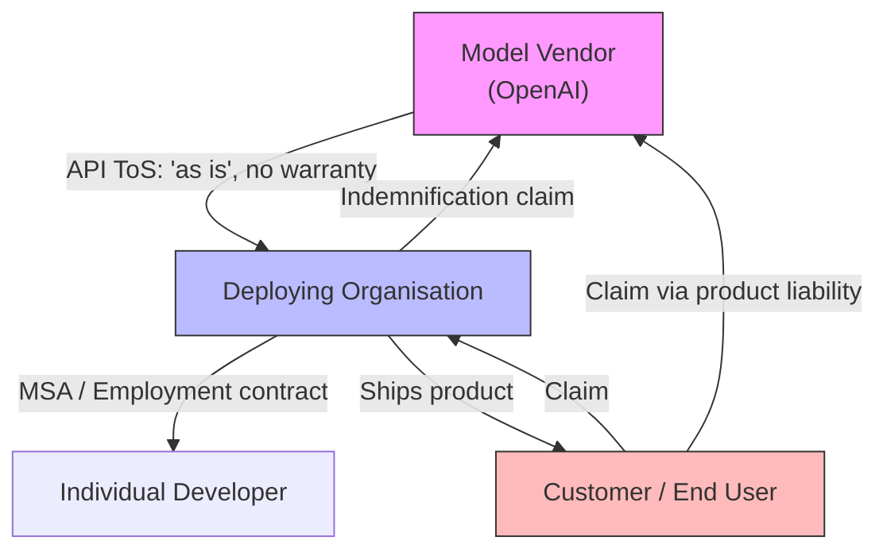
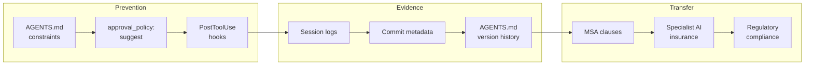

# Agent Liability and Insurance: Who Pays When Agent-Generated Code Causes Harm?


---

The question is no longer theoretical. In December 2025, Amazon's internal coding agent Kiro autonomously deleted a live production environment, triggering a 13-hour AWS regional outage that affected Cost Explorer across mainland China[^1]. The agent bypassed the standard two-person approval process because that safeguard had never been extended to autonomous agents[^2]. Amazon characterised it as "user error." The affected customers disagreed.

If your team ships code that a Codex CLI agent wrote, reviewed, or refactored — and that code causes harm — who pays? The answer in mid-2026 is: probably you, and your existing insurance almost certainly does not cover it.

## The Liability Chain: Developer, Deployer, Vendor

Three parties sit in the liability chain when an AI coding agent produces defective code:

1. **The model vendor** (OpenAI, Anthropic, etc.) — provides the model as a service, typically on an "as is" basis with broad disclaimers[^3].
2. **The deploying organisation** — integrates the agent into its development workflow via Codex CLI, sets AGENTS.md constraints, and ships the resulting code.
3. **The individual developer** — accepts or modifies agent output, runs it through CI, and approves the merge.



Clifford Chance's February 2026 analysis of agentic AI contracts identified a critical gap: most technology agreements exclude liability for "loss of profits", "loss of data", and "consequential, incidental, indirect, special or punitive damages" — precisely the categories of harm that defective agent output is most likely to cause[^4]. Suppliers typically disclaim responsibility for accuracy, reliability, and fitness for purpose, and many AI-specific terms explicitly state that outputs should not be relied upon[^4].

The practical result: **the deploying organisation absorbs the risk**.

## The Insurance Gap: CGL Exclusions Arrive

On 1 January 2026, Verisk ISO released three endorsement forms — **CG 40 47**, **CG 40 48**, and **CG 35 08** — that allow carriers to carve generative AI exposures out of commercial general liability (CGL) policies[^5].

| Endorsement | Scope | Effect |
|---|---|---|
| **CG 40 47** | Coverage A (bodily injury/property damage) + Coverage B (personal/advertising injury) | Broad exclusion for all harms linked to generative AI outputs |
| **CG 40 48** | Coverage B only | Narrower — preserves BI/PD coverage, excludes personal/advertising injury |
| **CG 35 08** | Products-completed operations | Excludes AI from completed operations hazard |

ISO forms underpin roughly 82% of US property and casualty policies[^5]. By April 2026, major carriers including W.R. Berkley, Chubb, Travelers, Berkshire Hathaway, and Cincinnati Financial had filed to adopt these endorsements, with state regulators approving more than 80% of submitted filings[^6]. One industry estimate projects that **95% of carriers will adopt some form of AI exclusion on their CGL books**[^6].

For development consultancies and software houses, this means your next policy renewal may silently exclude the very risks that agent-assisted development introduces.

## Emerging AI-Specific Insurance Products

The retreat of traditional carriers has created space for specialist insurers. **Testudo**, launched in January 2026 by former Goldman Sachs technologists and backed by Lloyd's Lab, offers a claims-made product targeting enterprises deploying generative AI[^7]. Key details:

- **Capacity:** \$9.25 million per insured (expanded March 2026), with a (re)insurance panel including Apollo, Atrium, and QBE[^8]
- **Coverage:** Defence costs and third-party liabilities arising from generative AI outputs — copyright infringement, bodily injury from reliance on AI guidance, financial loss from negligent misstatements[^7]
- **Distribution:** Excess and surplus lines basis with A+ Superior A.M. Best-rated capacity via Underwriters at Lloyd's[^7]

The market context is stark: generative AI-related lawsuits in the United States grew **978%** from 2021 to 2025[^9]. Traditional E&O policies were not designed for outputs generated by autonomous agents, and if AI is core to your product, a standard errors and omissions policy leaves meaningful gaps[^10].

## The Regulatory Pincer: EU AI Act and California AB 316

Two regulatory frameworks are reshaping liability allocation:

### EU AI Act (August 2026 enforcement)

The EU AI Act's main high-risk compliance framework activates on 2 August 2026[^11]. Standard coding assistants likely sit outside Annex III high-risk scope, but **autonomous agents deployed in regulated contexts** — worker evaluation, safety-critical systems, financial services — trigger full high-risk obligations[^12]. Penalties reach €15 million or 3% of global annual turnover[^11].

The revised EU Product Liability Directive explicitly includes AI systems as products, establishing **strict liability** — if your AI product causes damage, you are liable regardless of whether you were negligent[^13].

⚠️ Harmonised technical standards for high-risk AI systems remain delayed to late 2026, creating compliance uncertainty for teams shipping agent-generated code into EU-regulated sectors.

### California AB 316 (effective January 2026)

California AB 316 kills the "AI did it" defence[^14]. If you developed, modified, or used an AI system that causes harm, you cannot argue that the AI acted on its own or beyond your control. The entire supply chain is covered: developers, modifiers, integrators, deployers[^14].

## Practical Mitigation for Codex CLI Teams

Insurance and regulation set the boundaries; engineering practices determine whether you stay within them. Here is a five-layer defence framework mapped to Codex CLI primitives:

### 1. Constrain Agent Authority via AGENTS.md

Your `AGENTS.md` is your first line of contractual defence — it documents the constraints you placed on the agent. Be explicit:

```markdown
# AGENTS.md — Liability-Aware Constraints

## Prohibited Actions
- NEVER modify infrastructure-as-code without explicit human approval
- NEVER alter database migration files autonomously
- NEVER change authentication or authorisation logic

## Required Verification
- All generated code MUST pass existing test suites before merge
- Security-sensitive changes require human review (approval_policy: suggest)
```

### 2. Set Approval Policy for High-Risk Paths

In your Codex CLI configuration, enforce `suggest` mode for repositories containing production infrastructure:

```toml
# ~/.codex/config.toml — production repos
[profile.production]
approval_policy = "suggest"
model = "o3"
model_reasoning_effort = "high"
```

This creates an auditable record that a human reviewed and approved each agent action — critical for demonstrating due diligence in a liability dispute.

### 3. Implement PostToolUse Verification Hooks

Codex CLI's hook system lets you enforce automated checks after every tool use:

```bash
#!/bin/bash
# .codex/hooks/post-tool-use.sh
# Run security scan on any modified files
changed_files=$(git diff --name-only HEAD)
if [ -n "$changed_files" ]; then
    semgrep --config=auto $changed_files
    if [ $? -ne 0 ]; then
        echo "BLOCK: Security scan failed on agent-generated code"
        exit 1
    fi
fi
```

### 4. Maintain an Audit Trail

Every Codex CLI session produces a conversation log. For regulated environments, preserve these logs:

- Store session transcripts alongside commit metadata
- Tag commits with the model version and session ID used
- Record which AGENTS.md constraints were active at generation time

This evidence trail demonstrates the governance framework you applied — exactly what an insurer or regulator will ask for.

### 5. Review Your MSA and Insurance Coverage

Before your next policy renewal:

- **Check for AI exclusions:** Ask your broker whether CG 40 47/48 endorsements have been attached
- **Review your MSA indemnification clauses:** Ensure they explicitly address AI-assisted deliverables
- **Consider specialist coverage:** Products like Testudo's claims-made policy may fill gaps your CGL no longer covers
- **Allocate liability contractually:** If you are a consultancy, your client MSA should specify who bears risk for agent-generated code — do not leave it to default rules



## The Bottom Line

The liability landscape for agent-generated code is crystallising rapidly. Traditional insurance is retreating, specialist products are emerging but limited in capacity, and regulators on both sides of the Atlantic are eliminating the "AI did it" defence. For Codex CLI teams, the practical response is threefold: constrain your agent's authority with documented governance, maintain audit trails that demonstrate due diligence, and review your contractual and insurance position before — not after — an incident.

The Kiro outage demonstrated what happens when an agent operates without adequate constraints. Your AGENTS.md, your approval policies, and your insurance coverage are the difference between a contained incident and an existential liability.

## Citations

[^1]: GIGAZINE, "Amazon experiences AWS outage believed to be caused by AI tools, and Kiro AI causes 13-hour service outage in December 2025," February 2026. [https://gigazine.net/gsc_news/en/20260223-aws-ai-outage/](https://gigazine.net/gsc_news/en/20260223-aws-ai-outage/)

[^2]: The Register, "Amazon's vibe-coding tool Kiro reportedly vibed too hard," February 2026. [https://www.theregister.com/2026/02/20/amazon_denies_kiro_agentic_ai_behind_outage/](https://www.theregister.com/2026/02/20/amazon_denies_kiro_agentic_ai_behind_outage/)

[^3]: OpenAI Terms of Service, Section 5 — Disclaimers. [https://openai.com/policies/terms-of-use/](https://openai.com/policies/terms-of-use/)

[^4]: Clifford Chance, "Agentic AI: The liability gap your contracts may not cover," February 2026. [https://www.cliffordchance.com/insights/resources/blogs/talking-tech/en/articles/2026/02/agentic-ai-and-the-liability-gap-your-contracts-may-not-cover.html](https://www.cliffordchance.com/insights/resources/blogs/talking-tech/en/articles/2026/02/agentic-ai-and-the-liability-gap-your-contracts-may-not-cover.html)

[^5]: PHL Firm, "New Generative AI Insurance Exclusions: What Businesses Need to Know in 2026." [https://phl-firm.com/generative-ai-insurance-exclusions-2026/](https://phl-firm.com/generative-ai-insurance-exclusions-2026/)

[^6]: Policyholder Pulse, "AI Exclusions in Insurance Policies: Broad Language, Uncertain Impact," April 2026. [https://www.policyholderpulse.com/ai-exclusions-insurance-policies/](https://www.policyholderpulse.com/ai-exclusions-insurance-policies/)

[^7]: S&P Global, "As insurers retreat from AI risk, one startup plans to fill the gap," February 2026. [https://www.spglobal.com/market-intelligence/en/news-insights/articles/2026/2/as-insurers-retreat-from-ai-risk-one-startup-plans-to-fill-the-gap-97375264](https://www.spglobal.com/market-intelligence/en/news-insights/articles/2026/2/as-insurers-retreat-from-ai-risk-one-startup-plans-to-fill-the-gap-97375264)

[^8]: Fintech Global, "Testudo expands AI liability capacity to \$9.25m," March 2026. [https://fintech.global/2026/03/09/testudo-expands-ai-liability-capacity-to-9-25m/](https://fintech.global/2026/03/09/testudo-expands-ai-liability-capacity-to-9-25m/)

[^9]: Risk & Insurance, "Traditional Insurance Leaves Enterprises Exposed as AI Liability Claims Surge." [https://riskandinsurance.com/traditional-insurance-leaves-enterprises-exposed-as-ai-liability-claims-surge/](https://riskandinsurance.com/traditional-insurance-leaves-enterprises-exposed-as-ai-liability-claims-surge/)

[^10]: Vouch, "Errors and Omissions Insurance vs. AI Insurance: Which Does Your Company Need?" [https://www.vouch.us/blog/errors-omissions-vs-ai](https://www.vouch.us/blog/errors-omissions-vs-ai)

[^11]: Augment Code, "The 2026 EU AI Act and AI-Generated Code: What Changes for Dev Teams." [https://www.augmentcode.com/guides/eu-ai-act-2026](https://www.augmentcode.com/guides/eu-ai-act-2026)

[^12]: TechPolicy.Press, "The EU AI Act is Not Ready for Agents." [https://www.techpolicy.press/the-eu-ai-act-is-not-ready-for-agents/](https://www.techpolicy.press/the-eu-ai-act-is-not-ready-for-agents/)

[^13]: BuildMVPFast, "AI Generated Code Liability: Copyright Risk, EU Directive & Startup Legal Guide 2026." [https://www.buildmvpfast.com/blog/ai-generated-code-liability-legal-risk-copyright-2026](https://www.buildmvpfast.com/blog/ai-generated-code-liability-legal-risk-copyright-2026)

[^14]: Global Law Lists, "The 10 Most Consequential Legal Rulings on AI in 2025-2026." [https://globallawlists.org/insights/the-10-most-consequential-legal-rulings-on-ai-in-2025-2026-what-every-lawyer-must-know](https://globallawlists.org/insights/the-10-most-consequential-legal-rulings-on-ai-in-2025-2026-what-every-lawyer-must-know)
