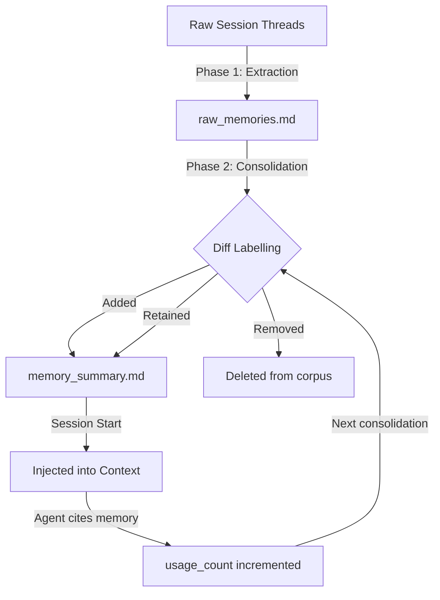

# The Agent Memory Audit: A Quarterly Review Checklist for Codex CLI Teams


---

Codex CLI's Dreaming v3 memory system extracts durable insights from completed sessions and injects them into future ones automatically [^1]. Over weeks and months of active use, the memory layer accumulates hundreds of entries — personal preferences, architectural decisions, project conventions, and debugging heuristics. Left unreviewed, this corpus drifts. Stale facts persist, project-specific conventions leak across repositories, and sycophantic reinforcement compounds as the agent increasingly defers to stored preferences over codebase evidence [^2].

This article provides a structured quarterly audit process for teams running Codex CLI at scale. Each section maps to a concrete step, with commands and configuration you can run today.

## Why Quarterly?

The default `max_unused_days` setting is 60 days [^3]. Memories cited within that window survive consolidation; neglected ones age out. A quarterly cadence — every 90 days — catches entries that narrowly survived the 60-day threshold but have drifted out of relevance. It also aligns with typical sprint planning cadences and provides a natural checkpoint before accumulated memory degrades agent accuracy.

OP-Bench research (January 2026) demonstrated that every personalised agent configuration suffered measurable over-personalisation, with relative performance drops between 26.2% and 61.1% compared to memory-free baselines [^2]. Regular auditing is the operational countermeasure.

## Step 1: Export and Inventory the Memory Corpus

Begin by inspecting the raw artefacts. Codex stores memories under `~/.codex/memory/` (or `$CODEX_HOME/memory/` if you have customised the home directory) [^1][^3]:

```bash
# List all memory artefacts with sizes
ls -lhR ~/.codex/memory/

# Count raw memories, consolidated entries, and rollout summaries
echo "Raw memories:       $(wc -l < ~/.codex/memory/raw_memories.md 2>/dev/null || echo 0)"
echo "Rollout summaries:  $(ls ~/.codex/memory/rollout_summaries/ 2>/dev/null | wc -l)"
echo "Skills:             $(ls ~/.codex/memory/skills/ 2>/dev/null | wc -l)"
```

Record these counts at every audit. A healthy memory system grows slowly; if raw memory line counts double between quarters, extraction is too aggressive or `min_rollout_idle_hours` is set too low [^3].

### What to look for

- **memory_summary.md** — the consolidated view injected at session start, capped at 5,000 tokens [^4]. If this file exceeds 4,000 tokens, consolidation is struggling to compress and you risk silent truncation.
- **MEMORY.md** — the searchable registry that the agent `grep`s on demand [^4]. Size here matters less, but duplicated entries signal consolidation failures.
- **rollout_summaries/** — per-session extractions. Hundreds of files here is normal for active users; check for summaries from projects you no longer work on.

## Step 2: Review for Staleness

Memory staleness — when previously accurate facts become incorrect after circumstances change — is one of the hardest open problems in agent memory systems [^5]. During the quarterly audit, scan for three categories:

### Outdated technical facts

```bash
# Search for potentially stale version references
grep -n -i -E "v[0-9]+\.[0-9]+|version [0-9]" ~/.codex/memory/MEMORY.md
```

Look for pinned dependency versions, framework references, or API versions that have since been upgraded. A memory stating "project uses React 18" when you migrated to React 19 will cause the agent to generate incorrect imports and deprecated patterns.

### Departed project conventions

If your team rotates between repositories, memories from Project A contaminate sessions in Project B. The `disable_on_external_context` key exists precisely for this [^3], but it only prevents *new* memory generation from MCP and web-search contexts — it does not retroactively clean existing cross-project leakage.

```bash
# Find memories mentioning projects you no longer work on
grep -n -i "project-alpha\|legacy-api\|old-monolith" ~/.codex/memory/MEMORY.md
```

### Personal preferences that became team standards

Memories like "Daniel prefers pytest over unittest" are useful personal context. But if the team has since standardised on pytest via `AGENTS.md`, the memory is redundant. Worse, the dual signal (memory *and* AGENTS.md both saying "use pytest") wastes context tokens without adding value [^6].

## Step 3: Prune Per-Project Leakage

The most common audit finding is cross-project contamination: conventions from one repository leaking into sessions for another. Codex CLI's memory is per-user, not per-project [^4], which means a developer working across three microservices accumulates a blended memory corpus.

### Targeted deletion

Use the interactive memory drop command to remove specific entries:

```bash
# Drop memories matching a query
codex /m_drop "project-alpha convention"
codex /m_drop "legacy API endpoint"
```

### Nuclear option: full reset

For severe contamination — typically after joining a new team or switching tech stacks — a full reset is faster than surgical pruning:

```bash
codex debug clear-memories
```

This wipes all artefacts and resets the SQLite state [^3]. The agent starts fresh, re-extracting memories from subsequent sessions.

### Selective disable without deletion

If you want to preserve the memory corpus for later review but stop it influencing sessions:

```toml
# ~/.codex/config.toml
[memories]
use_memories = false       # Stop injecting into sessions
generate_memories = true   # Continue recording for future review
```

This "write-only" mode lets the system continue capturing context whilst you audit the existing corpus without interference [^4].

## Step 4: Verify Consolidation Quality

Phase 2 consolidation runs a dedicated sub-agent (using `codex-spark` by default) that performs incremental diff labelling: tagging memories as Added, Retained, or Removed [^3]. Verify that this process is functioning correctly.



### Signs of consolidation failure

- **Duplicate entries** in `memory_summary.md` — the same fact phrased differently across multiple consolidation runs.
- **Contradictory entries** — "uses tabs for indentation" alongside "uses 2-space indentation". The consolidation model should resolve conflicts, but edge cases persist.
- **Bloated summary** — if `memory_summary.md` approaches the 5,000-token ceiling, low-value entries are displacing high-value ones.

Run a manual consolidation check:

```bash
# Count unique vs total lines in the summary (rough duplication check)
TOTAL=$(wc -l < ~/.codex/memory/memory_summary.md)
UNIQUE=$(sort -u ~/.codex/memory/memory_summary.md | wc -l)
echo "Total lines: $TOTAL / Unique: $UNIQUE / Duplicates: $((TOTAL - UNIQUE))"
```

## Step 5: Benchmark Against Memory-Free Baselines

The most rigorous audit step: run a representative task with and without memory injection, then compare outputs.

```toml
# ~/.codex/config.toml — temporary memory-free profile
[memories]
use_memories = false
generate_memories = false
```

Choose a task where your team has a known-good expected output — a code review, a test generation, or an architectural recommendation. Run it twice: once with memories enabled, once without.

### What to compare

| Signal | Memory-On Worse | Action |
|--------|-----------------|--------|
| Agent endorses an outdated pattern | Staleness | Prune stale entries |
| Agent repeats stored preferences unprompted | Repetition [^2] | Reduce `max_raw_memories_for_global` |
| Agent agrees with a flawed assumption | Sycophancy [^2] | Add Self-ReCheck prompt to AGENTS.md |
| Agent produces more accurate output | Healthy memory | No action needed |

If memory-on output is consistently worse across three or more tasks, the memory corpus has degraded past the point of surgical repair and a full reset is warranted.

## Step 6: Tune Retention Parameters

After auditing, adjust configuration to prevent the same issues recurring:

```toml
# ~/.codex/config.toml
[memories]
generate_memories = true
use_memories = true
min_rollout_idle_hours = 12      # Default: 12. Increase to reduce extraction noise
max_rollout_age_days = 60        # Default: 90. Tighter window reduces stale candidates
max_rollouts_per_startup = 2000  # Default: 5000. Lower cap reduces consolidation load
max_unused_days = 30             # Default: 60. Aggressive pruning of uncited memories
max_raw_memories_for_global = 100 # Default: 200. Smaller consolidation input
```

The key trade-off: tighter retention catches staleness earlier but risks discarding useful long-tail memories. Start conservative (shorter windows, lower caps) and relax if the agent starts "forgetting" genuinely useful context [^3].

## Step 7: Document and Automate

Create a recurring calendar entry for the quarterly audit. Track metrics across quarters to spot trends:

| Metric | Q1 | Q2 | Q3 | Q4 |
|--------|----|----|----|----|
| Raw memory lines | — | — | — | — |
| Rollout summaries | — | — | — | — |
| memory_summary.md tokens | — | — | — | — |
| Duplicate entries found | — | — | — | — |
| Cross-project leaks found | — | — | — | — |
| Memory-free baseline delta | — | — | — | — |

For teams with compliance requirements, note that the EU AI Act (fully applicable from August 2026) requires audit trails for high-risk AI systems [^7]. Even if your use case is not classified as high-risk, maintaining a memory audit log demonstrates governance maturity.

### Automation with hooks

You can partially automate the staleness check by adding a pre-session script:

```bash
#!/bin/bash
# ~/.codex/hooks/pre-session-memory-check.sh
SUMMARY_TOKENS=$(wc -w < ~/.codex/memory/memory_summary.md 2>/dev/null || echo 0)
if [ "$SUMMARY_TOKENS" -gt 4000 ]; then
    echo "WARNING: memory_summary.md approaching 5000-token ceiling ($SUMMARY_TOKENS words)"
    echo "Consider running quarterly memory audit"
fi
```

## The Checklist

For quick reference, here is the complete quarterly audit as a single checklist:

1. **Export** — Run `ls -lhR ~/.codex/memory/` and record artefact counts
2. **Staleness scan** — Grep for outdated versions, departed projects, redundant preferences
3. **Prune** — Use `/m_drop` for targeted removal or `codex debug clear-memories` for full reset
4. **Consolidation check** — Verify no duplicates or contradictions in `memory_summary.md`
5. **Baseline comparison** — Run a known task with `use_memories = false` and compare
6. **Tune** — Adjust `max_unused_days`, `max_rollout_age_days`, and related parameters
7. **Document** — Record metrics and any configuration changes for the next quarter

## Conclusion

Codex CLI's memory system is powerful precisely because it operates automatically — but that automation means degradation is equally automatic and equally invisible. A quarterly audit takes less than an hour and prevents the slow accumulation of stale facts, cross-project contamination, and sycophantic reinforcement that erode agent quality over time.

The companion article on [memory over-personalisation](/articles/2026-06-12-codex-cli-memory-over-personalisation-sycophancy-risk-configuration-defence) covers the research evidence and configuration defences in depth. This checklist provides the operational process to keep those defences effective quarter after quarter.

---

## Citations

[^1]: OpenAI, "Memories — Codex," OpenAI Developers, 2026. [https://developers.openai.com/codex/memories](https://developers.openai.com/codex/memories)

[^2]: Y. Zhang et al., "OP-Bench: Benchmarking Over-Personalization for Memory-Augmented Personalized Conversational Agents," arXiv:2601.13722, January 2026. [https://arxiv.org/abs/2601.13722](https://arxiv.org/abs/2601.13722)

[^3]: D. Vaughan, "Memory Lifecycle Management: Create, Consolidate, Clean, Delete in Codex CLI," Codex Blog, April 2026. [https://codex.danielvaughan.com/2026/04/15/memory-lifecycle-management-codex-cli/](https://codex.danielvaughan.com/2026/04/15/memory-lifecycle-management-codex-cli/)

[^4]: Mem0, "Codex CLI Memory: How It Works + What Mem0 Adds," Mem0 Blog, 2026. [https://mem0.ai/blog/how-memory-works-in-codex-cli](https://mem0.ai/blog/how-memory-works-in-codex-cli)

[^5]: Mem0, "State of AI Agent Memory 2026: Benchmarks, Architectures & Production Gaps," Mem0 Blog, 2026. [https://mem0.ai/blog/state-of-ai-agent-memory-2026](https://mem0.ai/blog/state-of-ai-agent-memory-2026)

[^6]: D. Vaughan, "Codex CLI Memories: Native Session Persistence, Third-Party Memory MCP Servers, and Cross-Session Context Strategies," Codex Knowledge Base, May 2026. [https://codex.danielvaughan.com/2026/05/01/codex-cli-memories-persistent-context-session-memory-ecosystem/](https://codex.danielvaughan.com/2026/05/01/codex-cli-memories-persistent-context-session-memory-ecosystem/)

[^7]: European Parliament, "EU AI Act — Regulation (EU) 2024/1689," Official Journal of the European Union, 2024. Full application for high-risk systems from August 2026. [https://artificialintelligenceact.eu/](https://artificialintelligenceact.eu/)
