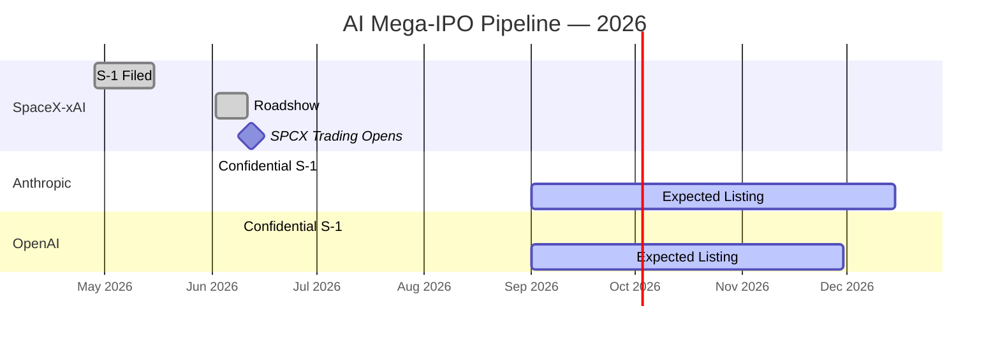
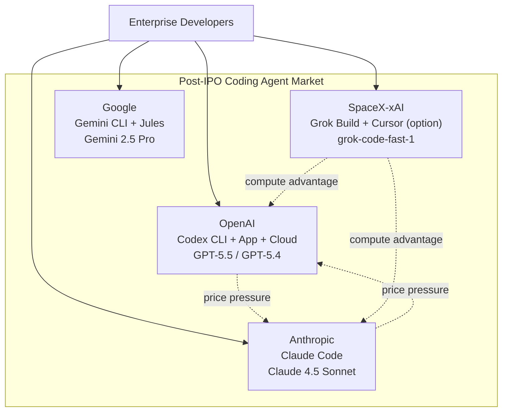

# The AI Token Price War: OpenAI's Pre-IPO Price Cuts, the SpaceX Nasdaq Debut, and What Codex CLI Developers Should Budget For


---

SpaceX began trading on the Nasdaq today under the ticker SPCX at \$135 per share, valuing the combined SpaceX-xAI entity at \$1.77 trillion and completing the largest IPO in stock market history[^1][^2]. Twenty-four hours earlier, the Wall Street Journal reported that OpenAI is weighing significant token price cuts ahead of its own public listing[^3]. Anthropic's confidential S-1 has been with the SEC since 1 June[^4]. Together, these three events mark the opening of a pricing war that will reshape what every Codex CLI developer pays per token over the next twelve months.

This article traces the competitive dynamics now in play, maps the pricing surface that Codex CLI users actually operate on, and outlines practical configuration and budgeting steps to take before the cuts land.

---

## The AI IPO Pipeline: Three Listings, \$3.6 Trillion

The sequence matters. SpaceX listed first, Anthropic is expected between September and December 2026, and OpenAI is targeting a Nasdaq debut as early as September[^4][^5].



The combined prospective market capitalisation — \$1.77 trillion (SpaceX-xAI), roughly \$1 trillion (Anthropic), and north of \$1 trillion (OpenAI) — exceeds \$3.6 trillion[^1][^4][^5]. For context, that is larger than the entire 2021 IPO market combined[^5]. Institutional investors have a finite capacity to absorb new equity, and the order of listing creates a sequencing effect: if SPCX prices strongly, it validates the AI valuation framework and benefits Anthropic and OpenAI; if it disappoints, both face a more sceptical institutional market[^5].

---

## Why the Price War Is Coming

### The WSJ Report

On 11 June 2026, the Wall Street Journal reported that OpenAI is considering "drastic" cuts to API token pricing[^3]. The discussions, still in flux, are driven by two converging pressures:

1. **Enterprise resistance to high AI costs.** Uber exhausted its entire 2026 AI coding budget in four months after Claude Code adoption jumped from 32% to 84% of its 5,000-engineer organisation, with monthly API costs per engineer reaching \$500–\$2,000[^6]. Microsoft's Experiences & Devices division cancelled Claude Code licences for the same reason[^6].

2. **Anthropic's revenue trajectory.** Claude Code hit \$1 billion in annualised revenue within six months of its public launch and surpassed \$2.5 billion by February 2026[^3]. OpenAI's CEO acknowledged that AI expenses have become "a huge issue" for business customers[^3].

### The IPO Paradox

Deliberately cutting the price of your core product immediately before an IPO is counterintuitive — it compresses revenue per unit at the moment you want to show investors growth[^7]. The counterargument is that lower prices drive volume and lock in enterprise commitments before Anthropic's listing creates a competing public equity narrative. OpenAI appears to be choosing market share over margin, betting that the volume elasticity of agentic coding workflows will more than compensate.

### The SpaceX-xAI Dimension

SpaceX's IPO brings a third pricing vector. The SpaceX-xAI merger (February 2026) gave xAI access to the Colossus compute cluster — 200,000 H100/H200 GPUs — and the Grok Build CLI launched on 14 May 2026 with aggressive API pricing: \$0.20/M input and \$1.50/M output tokens[^8][^9]. The SpaceX-Cursor acquisition option, exercisable post-IPO, could further consolidate the developer tooling stack under the SpaceX-xAI umbrella[^10].

At current rates, Grok Build's API pricing undercuts both OpenAI and Anthropic by an order of magnitude on input tokens:

| Provider | Model | Input ($/M) | Output ($/M) | Cached Input Discount |
|----------|-------|-------------|--------------|----------------------|
| OpenAI | GPT-5.5 | 5.00 | 30.00 | 90% |
| OpenAI | GPT-5.4 | 2.50 | 15.00 | 90% |
| OpenAI | GPT-5.4 Nano | 0.20 | 1.25 | 90% |
| Anthropic | Claude 4.5 Sonnet | 3.00 | 15.00 | 90% |
| xAI | grok-code-fast-1 | 0.20 | 1.50 | — |

Sources: OpenAI API Pricing[^11], Anthropic Pricing[^12], xAI Grok Build reviews[^8].

---

## What This Means for Codex CLI Developers

### Pricing You Actually Pay

Most Codex CLI developers operate on one of two billing models:

1. **Subscription (ChatGPT Plus/Pro):** A fixed monthly fee (\$20/\$200) with usage limits. Price cuts to API tokens do not directly affect subscription pricing, but they may trigger raised usage ceilings or new tier options.

2. **API key:** Direct API billing at per-token rates. This is where price cuts hit immediately — every `codex exec` call, every subagent spawn, and every background automation becomes cheaper overnight.

For API-key users, the maths is straightforward. A typical Codex CLI session running GPT-5.5 consumes 50,000–200,000 input tokens and 10,000–50,000 output tokens per task[^13]. With the 90% cached input discount, a well-structured session's effective input rate is already \$0.50/M. If OpenAI cuts the base rate by even 30%, the cached rate drops to \$0.35/M — approaching Grok Build's headline rate but with a significantly more capable model.

### The Model Routing Opportunity

Price cuts change the model routing calculus. Current best practice is to route lightweight tasks (linting, formatting, simple generation) to cheaper models like GPT-5.4 Nano or `codex-spark` while reserving GPT-5.5 for complex reasoning[^13]. If GPT-5.5 pricing drops to the neighbourhood of today's GPT-5.4, the cost argument for running a cheaper model weakens — and teams can simplify their profile configuration.

Current multi-model profile in `config.toml`:

```toml
[profiles.fast]
model = "gpt-5.4-nano"
model_reasoning_effort = "low"

[profiles.deep]
model = "gpt-5.5"
model_reasoning_effort = "high"

[profiles.ci]
model = "gpt-5.4"
model_reasoning_effort = "medium"
```

If GPT-5.5 drops to \$3.50/M input, a simpler single-model config becomes viable for many teams:

```toml
[profiles.default]
model = "gpt-5.5"
model_reasoning_effort = "medium"
```

### Multi-Provider Failover Becomes Essential

The IPO pipeline introduces platform risk that goes beyond pricing. Public companies face quarterly earnings scrutiny, and product decisions start optimising for metrics that matter to analysts — revenue per user, gross margin, engagement — rather than developer experience[^14]. Model deprecation cadences may accelerate if a model is expensive to serve but used by a minority of paying customers.

Codex CLI's custom provider support means you can configure failover today:

```toml
[providers.openai]
wire_api = "responses"
api_key_env = "OPENAI_API_KEY"

[providers.bedrock]
wire_api = "responses"
api_key_env = "AWS_BEDROCK_API_KEY"
base_url = "https://bedrock-runtime.eu-west-1.amazonaws.com/model/openai.gpt-5.5/responses"

[providers.oci]
wire_api = "responses"
api_key_env = "OCI_GENAI_AUTH"
base_url = "https://inference.generativeai.eu-frankfurt-1.oci.oraclecloud.com/20231130/actions/responses"
```

The AGENTS.md portability principle means your project instructions, skills, and hooks work identically regardless of which provider serves the model[^15].

---

## Five Budget Moves to Make Before the Cuts Land

### 1. Audit Your Current Token Spend

Before you can benefit from price changes, you need to know what you spend. Use the Codex CLI telemetry pipeline to export token consumption:

```bash
# Export last 30 days of session metrics
codex exec --output-schema '{"type":"object","properties":{"total_input_tokens":{"type":"integer"},"total_output_tokens":{"type":"integer"},"cached_input_ratio":{"type":"number"},"sessions":{"type":"integer"}}}' \
  "Analyse my codex session logs from the last 30 days. Report total input tokens, total output tokens, cached input ratio, and number of sessions."
```

### 2. Maximise Cache Hit Rates Now

The 90% cached input discount is already the single largest cost lever available. Ensure your AGENTS.md, system prompt, and MCP server configuration remain stable across sessions to preserve prefix cache hits[^16]. Avoid changing tool configurations mid-session. Use `codex resume` rather than starting fresh for related work.

### 3. Lock Enterprise Agreements Before Q3

If you are on an enterprise plan, negotiate pricing commitments now — before OpenAI's roadshow locks in public pricing tiers. Enterprise agreements signed before the IPO may carry grandfathered rates that outlast the initial post-IPO pricing adjustments[^14].

### 4. Configure Multi-Provider Profiles

Do not wait for a provider outage or price shock to discover your configuration is single-vendor. Set up at least one alternative provider (AWS Bedrock, Azure OpenAI Service, Oracle OCI) in your `config.toml` and test that your workflows run correctly against it[^15].

### 5. Set Token Budgets Per Task Class

Use profile-based configuration to enforce cost ceilings:

```toml
[profiles.ci]
model = "gpt-5.4-nano"
model_reasoning_effort = "low"
tool_output_token_limit = 4096

[profiles.review]
model = "gpt-5.4"
model_reasoning_effort = "medium"
tool_output_token_limit = 8192

[profiles.deep]
model = "gpt-5.5"
model_reasoning_effort = "high"
tool_output_token_limit = 16384
```

---

## The Competitive Landscape After SPCX

The SpaceX IPO transforms the coding agent market from a three-player race (OpenAI, Anthropic, Google) into a four-cornered battle. SpaceX-xAI now has public-market capital, the Colossus compute cluster, a coding agent (Grok Build), and an option on the most popular IDE-integrated agent (Cursor)[^10].



For Codex CLI practitioners, the competitive dynamic is unambiguously positive. More competition means lower prices, faster iteration, and stronger incentives for each vendor to maintain developer experience quality. The risk is fragmentation — if enterprise procurement starts splitting budgets across four vendors, the per-vendor investment in each coding agent's tooling may thin out.

---

## What to Watch Next

Three events in the next ninety days will determine the pricing trajectory:

1. **OpenAI's pricing announcement.** The WSJ report suggests a decision is imminent. Any cut will likely land before the IPO roadshow begins[^3].

2. **Anthropic's public filing.** When Anthropic's S-1 becomes public, its revenue figures, cost structure, and pricing strategy will be visible for the first time — and will either validate or challenge OpenAI's pricing response[^4].

3. **SpaceX-Cursor deal resolution.** The option to acquire Cursor for \$60 billion becomes exercisable post-IPO. If SpaceX exercises it, the combined Grok Build + Cursor platform will be the first vertically integrated IDE-plus-CLI-plus-compute stack in the market[^10].

For now, the actionable step is straightforward: audit your spend, maximise your cache hit rate, diversify your provider configuration, and be ready to adjust model routing the moment new pricing lands. The token price war benefits everyone who is prepared for it.

---

## Citations

[^1]: NPR, "SpaceX blasts off with a record-breaking \$75 billion IPO," 11 June 2026. [https://www.npr.org/2026/06/11/nx-s1-5853199/spacex-ipo-price-elon-musk](https://www.npr.org/2026/06/11/nx-s1-5853199/spacex-ipo-price-elon-musk)

[^2]: CNBC, "SpaceX targets \$135 IPO price at valuation of \$1.77 trillion," 3 June 2026. [https://www.cnbc.com/2026/06/03/spacex-ipo-stock-price-roadshow-musk.html](https://www.cnbc.com/2026/06/03/spacex-ipo-stock-price-roadshow-musk.html)

[^3]: CNBC, "OpenAI mulls slashing prices as it competes with Anthropic for users: WSJ," 11 June 2026. [https://www.cnbc.com/2026/06/11/openai-mulls-slashing-prices-ahead-of-competition-from-anthropic-wsj.html](https://www.cnbc.com/2026/06/11/openai-mulls-slashing-prices-ahead-of-competition-from-anthropic-wsj.html)

[^4]: IndMoney, "SpaceX, OpenAI & Anthropic IPOs 2026: Dates, Valuations, Risks & Market Impact," June 2026. [https://www.indmoney.com/blog/us-stocks/spacex-openai-anthropic-ipo-explained](https://www.indmoney.com/blog/us-stocks/spacex-openai-anthropic-ipo-explained)

[^5]: TheStreet, "OpenAI makes IPO decision amid Anthropic, SpaceX fervor," June 2026. [https://www.thestreet.com/investing/stocks/openai-makes-ipo-decision-amid-anthropic-spacex-fervor](https://www.thestreet.com/investing/stocks/openai-makes-ipo-decision-amid-anthropic-spacex-fervor)

[^6]: OpenTools, "OpenAI Considers Drastic Price Cuts as AI Token War With Anthropic Heats Up," June 2026. [https://opentools.ai/news/openai-drastic-price-cuts-anthropic-token-war-2026](https://opentools.ai/news/openai-drastic-price-cuts-anthropic-token-war-2026)

[^7]: BeInCrypto, "OpenAI's Price War with Anthropic Could Undermine Its IPO," June 2026. [https://beincrypto.com/openai-price-cuts-anthropic-ipo/](https://beincrypto.com/openai-price-cuts-anthropic-ipo/)

[^8]: RejoiceHub, "Grok Build vs Claude Code vs Codex CLI: Best AI Coding Agent 2026," May 2026. [https://rejoicehub.com/blogs/grok-build-vs-claude-code-vs-codex-cli](https://rejoicehub.com/blogs/grok-build-vs-claude-code-vs-codex-cli)

[^9]: DevOps.com, "xAI Enters the Coding Agent Race With Grok Build," May 2026. [https://devops.com/xai-enters-the-coding-agent-race-with-grok-build/](https://devops.com/xai-enters-the-coding-agent-race-with-grok-build/)

[^10]: TokenMix, "SpaceX Acquires xAI \$250B: What Grok's \$1.25T Future Means," 2026. [https://tokenmix.ai/blog/spacex-xai-merger-grok-future-2026](https://tokenmix.ai/blog/spacex-xai-merger-grok-future-2026)

[^11]: OpenAI, "API Pricing," accessed 12 June 2026. [https://openai.com/api/pricing/](https://openai.com/api/pricing/)

[^12]: ⚠️ Anthropic pricing figures based on publicly reported rates from multiple comparison sites; the official Anthropic pricing page was not directly verified at time of writing.

[^13]: OpenAI, "Codex CLI Features — Model Selection," accessed 12 June 2026. [https://developers.openai.com/codex/cli/features](https://developers.openai.com/codex/cli/features)

[^14]: OpenAI, "OpenAI's S-1 Filing: What the IPO Path Means for Codex CLI Developers," codex.danielvaughan.com, 10 June 2026.

[^15]: OpenAI, "Advanced Configuration — Codex," accessed 12 June 2026. [https://developers.openai.com/codex/config-advanced](https://developers.openai.com/codex/config-advanced)

[^16]: OpenAI, "Prompt Caching," accessed 12 June 2026. [https://developers.openai.com/api/docs/guides/prompt-caching](https://developers.openai.com/api/docs/guides/prompt-caching)
