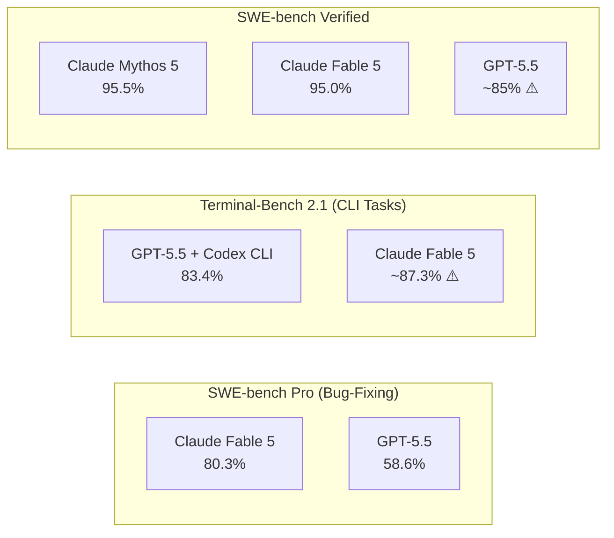
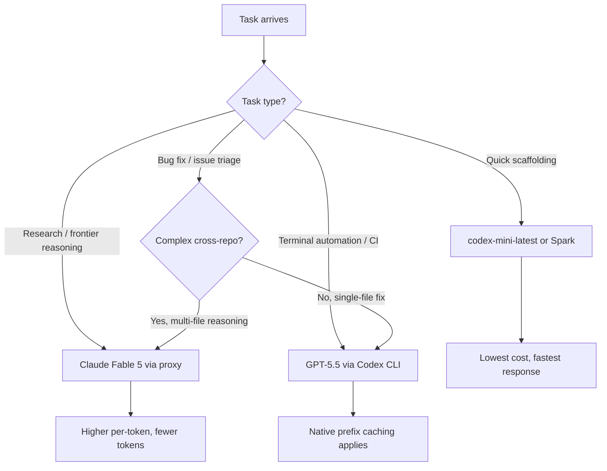

# Claude Fable 5 Enters the Arena: What Anthropic's Benchmark-Topping Model Means for Codex CLI Multi-Model Strategies


---

Three days ago Anthropic released Claude Fable 5 — a publicly available distillation of its restricted Mythos 5 tier — and the SWE-bench Pro leaderboard rearranged itself overnight [^1]. At 80.3 per cent on SWE-bench Pro, Fable 5 sits eleven points clear of GPT-5.5's 58.6 per cent on the same benchmark [^2]. For Codex CLI practitioners whose daily workflow depends on GPT-5.5 or GPT-5-Codex, the question is blunt: should you care, and if so, what should you actually change?

This article unpacks the benchmarks, maps the pricing arithmetic, shows how to route Codex CLI through alternative models, and offers a decision framework for when Fable 5 justifies its premium — and when it does not.

## What Claude Fable 5 Actually Is

Fable 5 and Mythos 5 are the same underlying foundation model [^1]. Mythos 5 is the unrestricted variant, available only to vetted partners; Fable 5 adds a safety routing layer that diverts flagged cybersecurity, biology, chemistry, and distillation queries to Opus 4.8, affecting fewer than five per cent of sessions [^3]. The distinction matters because benchmark figures published under the Mythos label apply equally to Fable 5 on non-flagged coding tasks.

Anthropic positions Fable 5 above the Opus family entirely — it is not Opus 5 [^1]. In practical terms, it delivers Mythos-class reasoning with consumer-grade guardrails, making it the strongest generally available model Anthropic has ever shipped.

## The Benchmark Picture: Where Each Model Leads

The headline numbers create a misleading impression if read in isolation. A careful look at the benchmark landscape reveals complementary strengths rather than outright dominance by either vendor.



### SWE-bench Pro

Fable 5 leads at 80.3 per cent, with GPT-5.5 at 58.6 per cent — a 21.7-point gap [^2]. SWE-bench Pro evaluates real GitHub bug-fixing across complex repositories. This is the benchmark most directly relevant to developers using coding agents for issue triage and automated fixes.

### Terminal-Bench 2.1

GPT-5.5 scores 83.4 per cent on Terminal-Bench 2.1 when evaluated through its native Codex CLI harness [^4]. Some sources report Fable 5 leading Terminal-Bench by approximately 4.6 points [^5], but the comparison carries a significant caveat: GPT-5.5's score comes from the Codex CLI's own harness and is not directly comparable to a public-harness evaluation [^5]. Terminal-Bench measures "execute command, interpret output, next action" loops — precisely the workflow Codex CLI was optimised for.

### The Harness Effect

Benchmark scores are inseparable from the agent harness that runs them [^4]. Codex CLI's tight integration with the Responses API, prefix caching, and sandboxed tool execution gives GPT-5.5 a home-court advantage on terminal-native tasks. Running Fable 5 through a third-party harness or proxy introduces translation overhead that raw scores do not capture.

## Pricing: The 2x Input Premium

The cost arithmetic is straightforward but consequential at scale.

| Model | Input (per 1M tokens) | Output (per 1M tokens) | Cached Input |
|---|---|---|---|
| GPT-5.5 | \$5.00 | \$30.00 | \$0.50 (90% discount) |
| Claude Fable 5 | \$10.00 | \$50.00 | Not disclosed [^6] |
| GPT-5.5 Pro | \$30.00 | \$180.00 | N/A |
| Codex-mini-latest | \$1.50 | \$6.00 | — |

Fable 5 costs 2x GPT-5.5 on input and 1.67x on output [^6]. On raw sticker price, GPT-5.5 is the cheaper model for equivalent throughput.

However, effective cost depends on token efficiency, not sticker price. One early Anthropic customer reported that Fable 5 completed a frontier physics research task in 36 hours using one-third the reasoning tokens that GPT-5.5 required over four days [^6]. At that token ratio, Fable 5's effective cost per task was lower despite the higher per-token rate.

For Codex CLI developers, the critical variable is Codex's prefix caching. The 90 per cent discount on cached inputs means that multi-turn Codex sessions accumulate significant savings that are unavailable when routing through a third-party model proxy [^7].

## Routing Codex CLI Through Alternative Models

Codex CLI supports custom model providers through `config.toml`, though with an important constraint: since February 2026, all providers must implement the Responses API wire format [^8]. Direct Anthropic API calls use a different protocol. The practical options for running Fable 5 through Codex CLI are:

### Option 1: LiteLLM Proxy

LiteLLM translates Responses API requests into Anthropic's native protocol [^8]. Configure a local proxy and point Codex at it:

```toml
[model_providers.anthropic]
name = "anthropic-litellm"
base_url = "http://localhost:4000/v1"
api_key_env = "LITELLM_API_KEY"

[[model_providers.anthropic.models]]
name = "claude-fable-5"
```

```bash
# Start the LiteLLM proxy
litellm --model anthropic/claude-fable-5 --port 4000

# Run Codex with the proxy
codex --model claude-fable-5 --provider anthropic-litellm
```

### Option 2: Amazon Bedrock

Claude Fable 5 is available on Bedrock [^9], and Codex CLI supports Bedrock as a native provider. This avoids the translation layer entirely, at the cost of AWS authentication overhead:

```toml
[model_providers.bedrock]
name = "bedrock"
base_url = "https://bedrock-runtime.us-east-1.amazonaws.com"
api_key_env = "AWS_ACCESS_KEY_ID"

[[model_providers.bedrock.models]]
name = "us.anthropic.claude-fable-5-20260609-v1:0"
```

### Option 3: OpenRouter or Bifrost

Gateway services like OpenRouter and Bifrost support 20-plus providers and handle the Responses API translation automatically [^8]. The trade-off is an additional network hop and the gateway's markup on per-token costs.

```toml
[model_providers.openrouter]
name = "openrouter"
base_url = "https://openrouter.ai/api/v1"
api_key_env = "OPENROUTER_API_KEY"

[[model_providers.openrouter.models]]
name = "anthropic/claude-fable-5"
```

> **Caveat:** routing through any proxy forfeits Codex's native prefix caching, which can increase effective costs by 2-10x on multi-turn sessions depending on conversation length [^7].

## The Decision Framework: When to Route, When to Stay

The multi-model question reduces to four scenarios:



### Stay on GPT-5.5 (default Codex CLI) when:

- The task is terminal-native: shell commands, CI pipelines, `codex exec` automation
- You are running multi-turn sessions where prefix caching delivers compounding savings
- The task fits within GPT-5.5's 400K token cap without frequent compaction
- You need the Codex sandbox, hooks, and approval policy integration without proxy overhead

### Route to Fable 5 when:

- The task requires deep cross-repository reasoning — Fable 5's SWE-bench Pro lead suggests stronger performance on complex bug-fixing across multiple files [^2]
- Token efficiency matters more than per-token price — if the model solves the problem in fewer turns, the 2x input premium may be offset
- You are already on a Claude Pro/Max subscription where Fable 5 is included at no extra cost through 22 June 2026 [^1]
- The task benefits from Fable 5's million-token context window (versus Codex's 400K cap on GPT-5.5) [^3]

### Use codex-mini-latest or Spark when:

- Speed matters more than depth: scaffolding, boilerplate, quick lookups
- Budget is the primary constraint: at \$1.50/\$6.00 per million tokens, mini is 3.3x cheaper than GPT-5.5 on input [^10]

## The Competitive Pressure on Codex CLI

Fable 5's release creates real competitive pressure on three fronts:

**Model quality:** The 21.7-point SWE-bench Pro gap is large enough that developers doing complex refactoring or bug-fixing may find Claude Code (Anthropic's native CLI) plus Fable 5 outperforms Codex CLI plus GPT-5.5 on raw task completion [^2]. OpenAI's response will likely come through the 0.140 alpha series currently shipping 14 builds in three days, suggesting significant internal iteration [^4].

**Pricing dynamics:** OpenAI's confidential S-1 filing on 8 June 2026 coincides with reports that the company is considering drastic token price cuts ahead of its IPO [^11]. A Fable 5-triggered price war would benefit Codex CLI developers regardless of which model they prefer.

**Harness lock-in versus model freedom:** Codex CLI's greatest strength — its deeply integrated sandbox, hooks, approval policies, and Responses API optimisation — is also its constraint. The harness is optimised for OpenAI models. Running third-party models through proxies works, but sacrifices the performance advantages that make Codex CLI's terminal workflow compelling. Anthropic's Claude Code, conversely, is optimised for Claude models. The emerging pattern is not "best model wins" but "best model-harness pair for the specific task wins."

## Practical Recommendations

1. **Do not switch your default model.** GPT-5.5 through Codex CLI remains the strongest terminal-native workflow, and prefix caching makes it cost-effective for multi-turn sessions.

2. **Set up a Fable 5 profile for complex reasoning tasks.** Use Codex CLI's profile system to create a dedicated configuration that routes through LiteLLM or Bedrock:

```toml
# ~/.codex/profiles/fable.toml
model = "claude-fable-5"
provider = "anthropic-litellm"
model_reasoning_effort = "high"
```

```bash
codex --profile fable "Analyse the race condition across the payment and notification services"
```

3. **Track effective cost per task, not per token.** If Fable 5 solves a problem in one turn that GPT-5.5 takes four turns to resolve, the cheaper model is Fable 5 despite the higher rate card.

4. **Watch the 22 June deadline.** Claude subscription plans include Fable 5 at no extra cost until 22 June [^1]. After that date, it moves to usage credits. If you are evaluating the model, do it now.

5. **Monitor the 0.140 stable release.** The rapid alpha cadence suggests OpenAI is preparing a significant Codex CLI update — potentially including model-level improvements that narrow the SWE-bench gap.

## Citations

[^1]: Anthropic, "Claude Fable 5 and Claude Mythos 5," 9 June 2026. [https://www.anthropic.com/news/claude-fable-5-mythos-5](https://www.anthropic.com/news/claude-fable-5-mythos-5)

[^2]: Claude5.ai, "Claude Fable 5 Benchmarks: 80.3% on SWE-Bench Pro, 11 Points Ahead of the Field," June 2026. [https://claude5.ai/news/claude-fable-5-benchmarks-swe-bench-pro-80-percent](https://claude5.ai/news/claude-fable-5-benchmarks-swe-bench-pro-80-percent)

[^3]: Vellum, "Claude Fable 5 & Claude Mythos 5 Full Benchmark Breakdown," June 2026. [https://www.vellum.ai/blog/claude-fable-5-and-mythos-5-benchmarks-explained](https://www.vellum.ai/blog/claude-fable-5-and-mythos-5-benchmarks-explained)

[^4]: GitHub, "openai/codex releases," June 2026. [https://github.com/openai/codex/releases](https://github.com/openai/codex/releases)

[^5]: Digital Applied, "Claude Fable 5 vs GPT-5.5: Benchmarks & Cost Compared," June 2026. [https://www.digitalapplied.com/blog/claude-fable-5-vs-gpt-5-5-frontier-comparison-2026](https://www.digitalapplied.com/blog/claude-fable-5-vs-gpt-5-5-frontier-comparison-2026)

[^6]: Finout, "Claude Fable 5 and Mythos 5: Pricing, API Costs, and Benchmark Comparison vs Opus 4.8 and GPT-5.5," June 2026. [https://www.finout.io/blog/claude-fable-5-mythos-5-pricing-benchmarks](https://www.finout.io/blog/claude-fable-5-mythos-5-pricing-benchmarks)

[^7]: OpenAI, "Unrolling the Codex agent loop," January 2026. [https://openai.com/index/unrolling-the-codex-agent-loop/](https://openai.com/index/unrolling-the-codex-agent-loop/)

[^8]: Morphllm, "Codex config.toml (2026): Add Any Custom Provider in 6 Lines," 2026. [https://www.morphllm.com/codex-provider-configuration](https://www.morphllm.com/codex-provider-configuration)

[^9]: AWS, "Anthropic Claude Fable 5 on AWS: Mythos-class capabilities with built-in safeguards now available," June 2026. [https://aws.amazon.com/blogs/aws/anthropic-claude-fable-5-on-aws-mythos-class-capabilities-with-built-in-safeguards-now-available/](https://aws.amazon.com/blogs/aws/anthropic-claude-fable-5-on-aws-mythos-class-capabilities-with-built-in-safeguards-now-available/)

[^10]: OpenAI, "API Pricing," June 2026. [https://openai.com/api/pricing/](https://openai.com/api/pricing/)

[^11]: OpenTools, "OpenAI Considers Drastic Price Cuts as AI Token War With Anthropic Heats Up," June 2026. [https://opentools.ai/news/openai-drastic-price-cuts-anthropic-token-war-2026](https://opentools.ai/news/openai-drastic-price-cuts-anthropic-token-war-2026)
