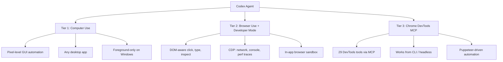
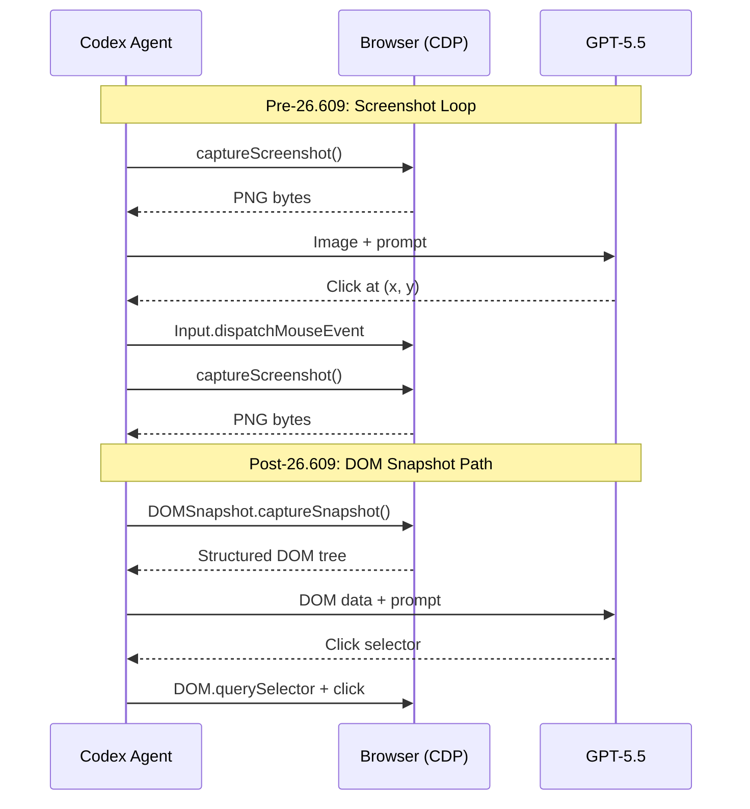

# Codex Browser Use Developer Mode: CDP Access, 2x Performance, and What CLI Developers Gain from the June 2026 Browser Overhaul


---

Codex app 26.609, shipped on 11 June 2026, introduced three browser-related changes that shift the balance of power for frontend-focused workflows[^1]. First, a new **Developer Mode** grants controlled Chrome DevTools Protocol (CDP) access from within browser use sessions. Second, CDP and DOM snapshot optimisations make browser use **up to 2x faster** by cutting round trips. Third, Windows administrators can now configure **per-app access controls** for Computer Use, tightening the scope of what the agent can touch on the desktop[^1].

These are Codex app features, not CLI-only changes — but they reshape the tooling landscape that Codex CLI developers navigate. This article maps the three tiers of browser interaction available in June 2026, explains the new developer mode in detail, and shows how CLI practitioners connect to the same capabilities through Chrome DevTools MCP.

## The Three Browser Interaction Tiers

Codex now offers three distinct layers for working with browsers, each with a different trust boundary, capability surface, and performance profile.



### Tier 1 — Computer Use

Computer Use sees and controls the graphical desktop at the pixel level[^2]. It can operate any application — not just browsers — by taking screenshots, identifying UI elements, and emitting mouse and keyboard events. On macOS it can run in the background via the locked-use feature; on Windows it takes foreground control of the active desktop[^2].

**When to use it:** Testing native desktop applications, reproducing GUI-only bugs, working with tools that have no API or plugin, and multi-app workflows that span browser and non-browser surfaces.

**Trade-offs:** Pixel-level inference is slower and less reliable than DOM-aware interaction. Computer Use cannot automate terminal applications or approve system permission prompts[^2]. On Windows, the user loses control of the desktop for the duration of the task.

### Tier 2 — Browser Use with Developer Mode

Browser use operates the Codex in-app browser (or a connected Chrome instance via the Codex Chrome extension)[^3]. Unlike Computer Use, it interacts with the DOM directly — clicking elements by selector, typing into form fields, inspecting rendered state, executing read-only JavaScript, and taking screenshots.

With the 26.609 release, enabling Developer Mode under **Settings > Browser > Enable full CDP access** unlocks Chrome DevTools Protocol capabilities[^3]:

- **Performance profiling** — record and analyse JavaScript execution traces
- **Network inspection** — examine request/response headers, timings, and payloads
- **Console monitoring** — capture `console.log`, `console.error`, and runtime exceptions
- **DOM and style inspection** — query computed styles, layout geometry, and accessibility properties
- **Page state diagnosis** — interrogate live pages for rendering and layout issues

CDP access requires explicit per-site approval before Codex can inspect a given website, and organisational administrators can disable the setting entirely[^3].

### Tier 3 — Chrome DevTools MCP (CLI Path)

For Codex CLI users who work in the terminal, the equivalent capability comes through the Chrome DevTools MCP server maintained by Google[^4]. Adding it to a CLI workflow takes one command:

```bash
codex mcp add chrome-devtools -- npx chrome-devtools-mcp@latest
```

This registers a stdio MCP server that Codex launches automatically at session start. It exposes 29 tools covering DOM inspection, console monitoring, network capture, screenshot capture, performance trace recording, Lighthouse audits, and memory snapshots[^4]. Under the hood, it uses Puppeteer to drive a Chrome instance with the `--remote-debugging-port` flag, connecting over CDP[^5].

The MCP route provides the same protocol surface as browser use developer mode, but without requiring the Codex desktop app. It works from headless CI environments, SSH sessions, and any context where the TUI runs but no desktop is present.

## The 2x Performance Improvement

The headline number from 26.609 is that browser use is "up to 2x faster through CDP and DOM snapshot optimisations that reduce browser round trips"[^1]. Prior to this release, browser use relied heavily on full-page screenshots and pixel-based inference to understand page state — an approach inherited from the Computer Use architecture. The new implementation takes a different path.

### DOM Snapshots Replace Screenshot Inference

A DOM snapshot captures the document structure, computed styles, and text content in a single CDP call (`DOMSnapshot.captureSnapshot`)[^6]. This is vastly cheaper than rendering a screenshot, encoding it as PNG, and sending it to the vision model for interpretation. The snapshot gives the model structured data — element positions, bounding boxes, attribute values — rather than requiring it to parse pixels.

### Reduced Round Trips

The previous browser use pipeline followed a loop:

1. Take screenshot
2. Send to model with vision
3. Receive action (click at coordinates)
4. Execute action via CDP
5. Wait for page to settle
6. Take another screenshot

With DOM snapshots, the model receives a structured representation of the page and can emit targeted actions (click element by selector, read text content, check computed styles) without the screenshot-encode-decode cycle[^6]. This collapses multiple round trips into fewer, faster interactions.



### What This Means for CLI Developers

CLI developers using Chrome DevTools MCP already had access to DOM queries and structured page data[^4]. The 2x improvement primarily benefits users of the Codex app's browser use feature. However, the architectural shift validates the approach that MCP-based CLI workflows have taken from the start: structured tool calls beat pixel inference for speed and reliability.

## Windows Per-App Access Controls

The 26.609 release also adds per-app access controls for Computer Use on Windows[^1]. Administrators can create a configuration file at `$CODEX_HOME/computer-use/config.toml` to declare which applications the agent may interact with[^2]:

```toml
[apps]
allowed = ["chrome.exe", "code.exe", "slack.exe"]
denied  = ["regedit.exe", "powershell.exe", "cmd.exe"]
```

Denied entries take precedence over allowed entries. Any application not listed in either array triggers an interactive approval prompt[^2].

For CLI developers, this matters in two scenarios. First, when orchestrating Computer Use from a CLI-initiated session via the app server, the agent respects these controls. Second, teams running Codex across mixed workstation fleets can deploy the configuration file via MDM or endpoint management, ensuring consistent security posture without relying on per-user discipline.

## Connecting the Dots: A Practical CLI Frontend Workflow

A senior developer working on a frontend application in June 2026 might combine all three tiers within a single session:

### Step 1 — Code changes via CLI

```bash
codex "Refactor the checkout form to use the new design system tokens. \
Run npm test after every file change."
```

The agent edits source files, runs tests, and verifies linting — all within the CLI sandbox.

### Step 2 — Visual verification via Chrome DevTools MCP

With Chrome DevTools MCP configured in `~/.codex/config.toml`:

```toml
[mcp_servers.chrome-devtools]
command = "npx"
args    = ["chrome-devtools-mcp@latest"]
```

The agent can launch Chrome, navigate to `http://localhost:3000/checkout`, take a screenshot, run a Lighthouse audit, and capture a performance trace — all from the same CLI session[^4].

### Step 3 — DOM-level debugging

If the Lighthouse audit flags a layout shift, the agent can query the DOM for the offending element:

```
Check the CLS score for the checkout page. If any element contributes more
than 0.05 to CLS, identify its selector and suggest a CSS fix.
```

The Chrome DevTools MCP exposes the Performance domain, allowing the agent to record traces, extract Core Web Vitals (LCP, INP, CLS), and map them back to specific DOM elements[^4][^5].

### Step 4 — Desktop verification via Computer Use (if needed)

For scenarios requiring native app interaction — verifying that a downloaded PDF opens correctly, checking email notifications, or testing a PWA's install prompt — the developer escalates to Computer Use via the Codex app, with per-app controls ensuring the agent stays within the approved application scope.

## Configuration Checklist for CLI Developers

| Setting | Location | Purpose |
|---|---|---|
| Chrome DevTools MCP | `~/.codex/config.toml` | Browser debugging from CLI |
| `startup_timeout_ms` | MCP server config | Increase for slow Chrome launches |
| `CHROME_PATH` env var | MCP server env block | Custom Chrome binary location |
| Per-app access controls | `$CODEX_HOME/computer-use/config.toml` | Restrict Computer Use scope (Windows) |
| Developer mode toggle | Codex app Settings > Browser | Enable CDP in browser use (app) |
| `codex mcp add` | CLI command | Register Chrome DevTools server |

## Choosing the Right Tier

| Criterion | Computer Use | Browser Use + Dev Mode | Chrome DevTools MCP |
|---|---|---|---|
| Works from CLI/headless | No | No (requires app) | Yes |
| DOM-aware interaction | No (pixel-based) | Yes | Yes |
| Performance traces | No | Yes (with CDP) | Yes |
| Non-browser apps | Yes | No | No |
| Speed | Slowest | Fast (2x as of 26.609) | Fast |
| Enterprise lockdown | Per-app config.toml | Admin toggle | MCP server allowlist |
| Parallel with user work | macOS only | Yes | Yes |

For most frontend debugging and verification tasks, Chrome DevTools MCP from the CLI offers the best combination of speed, automation-friendliness, and headless compatibility. Browser use developer mode shines when you need the visual context of a running desktop app alongside CDP data. Computer Use remains the fallback for anything that requires pixel-level desktop interaction outside the browser.

## What Comes Next

The Ona acquisition (announced 11 June 2026) promises persistent cloud sandboxes that can run for hours or days[^7]. When browser use and CDP access extend into those persistent sessions, agents will be able to run continuous frontend monitoring — watching for regressions, capturing performance baselines, and alerting on CLS spikes — without tying up a developer's local machine. The 2x performance improvement in 26.609 is a stepping stone toward that always-on verification loop.

## Citations

[^1]: OpenAI. "Codex Changelog — Codex app 26.609 (11 June 2026)." *OpenAI Developers*, 2026. [https://developers.openai.com/codex/changelog](https://developers.openai.com/codex/changelog)

[^2]: OpenAI. "Computer Use — Codex app." *OpenAI Developers*, 2026. [https://developers.openai.com/codex/app/computer-use](https://developers.openai.com/codex/app/computer-use)

[^3]: OpenAI. "Browser — Codex app." *OpenAI Developers*, 2026. [https://developers.openai.com/codex/app/browser](https://developers.openai.com/codex/app/browser)

[^4]: Google Chrome DevTools Team. "Chrome DevTools for agents." *Chrome for Developers*, 2026. [https://developer.chrome.com/docs/devtools/agents](https://developer.chrome.com/docs/devtools/agents)

[^5]: Google Chrome DevTools Team. "chrome-devtools-mcp." *GitHub*, 2026. [https://github.com/ChromeDevTools/chrome-devtools-mcp](https://github.com/ChromeDevTools/chrome-devtools-mcp)

[^6]: Chrome DevTools Protocol. "DOMSnapshot Domain." *Chrome DevTools Protocol Documentation*, 2026. [https://chromedevtools.github.io/devtools-protocol/](https://chromedevtools.github.io/devtools-protocol/)

[^7]: OpenAI. "OpenAI to acquire Ona." *OpenAI News*, 11 June 2026. [https://openai.com/index/openai-acquires-ona/](https://openai.com/index/openai-acquires-ona/)
