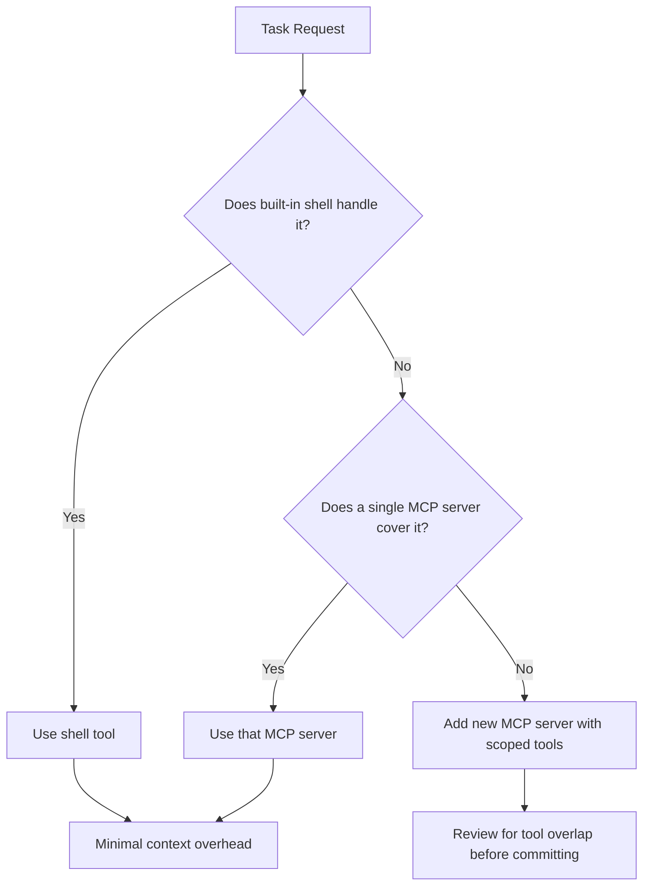

# Codex CLI Configuration Anti-Patterns: Twelve Settings Mistakes That Waste Tokens, Break Sandboxes, and Frustrate Your Agent


---

Codex CLI's configuration surface has grown substantially since its early days. Between `config.toml`, `requirements.toml`, AGENTS.md, profiles, hooks, MCP servers, and skills, there are now dozens of knobs to turn — and a growing catalogue of ways to turn them incorrectly. After reviewing community issue reports, forum discussions, and enterprise deployment audits through the first half of 2026, twelve configuration anti-patterns emerge repeatedly. Each one wastes tokens, degrades agent quality, or creates security gaps that are invisible until something breaks.

## 1. The Bloated AGENTS.md

The single most common configuration mistake is an oversized AGENTS.md file. Codex concatenates every AGENTS.md from your global `~/.codex/AGENTS.md` through each directory on the path to your working directory, capped at 32 KiB by default[^1]. A sprawling root-level file that tries to encode every team convention, coding standard, and architectural decision quickly approaches that ceiling — especially in monorepos with nested AGENTS.md files at the package level.

The result is silent truncation. Codex drops everything past the byte budget without warning, meaning the rules you added most recently (typically appended at the bottom) are the first to vanish[^1].

**Fix:** Keep each AGENTS.md under 4 KB. Move detailed reference material into separate markdown files that Codex can read on demand via skills or explicit file references. Verify what the agent actually loaded:

```bash
codex --approval-policy on-request "Summarise the instructions you have loaded for this session"
```

## 2. Running on a Deprecated Model Without Knowing It

OpenAI has sunset GPT-5.2 and GPT-5.3-Codex as of June 2026[^2]. If your `config.toml` still pins `model = "gpt-5.3-codex"`, the CLI silently falls back to the replacement model, but with none of the reasoning-effort tuning or context-window expectations you originally calibrated for.

**Fix:** Audit your configuration files quarterly:

```bash
grep -r "model\s*=" ~/.codex/ .codex/ | grep -v "model_provider"
```

As of mid-June 2026, `gpt-5.5` is the current frontier model and `gpt-5.4-mini` is the cost-efficient alternative[^2][^3].

## 3. danger-full-access on a Long-Lived Machine

Setting `sandbox_mode = "danger-full-access"` disables the OS-native sandbox entirely — no Landlock on Linux, no Seatbelt on macOS, no restricted SID on Windows[^4]. This mode exists for ephemeral containers where the entire environment is disposable. On a developer workstation, it grants the agent unrestricted filesystem access, including to `~/.ssh`, `~/.aws/credentials`, and your shell history.

Worse, `danger-full-access` automatically switches web search from `cached` (OpenAI's curated index) to `live` (real-time fetching), opening the door to prompt injection via malicious web content[^4][^5].

**Fix:** Use `workspace-write` for interactive work and reserve `danger-full-access` for CI containers that are destroyed after each run. Enterprise teams should enforce this via `requirements.toml`:

```toml
allowed_sandbox_modes = ["read-only", "workspace-write"]
```

## 4. Approval Policy Set to `never` Without Hooks

Combining `approval_policy = "never"` with no PreToolUse or PostToolUse hooks creates an agent that can execute arbitrary shell commands, write to any file within the sandbox scope, and install packages — all without human review[^5][^6].

This is not inherently wrong in a trusted, well-scoped context. It becomes an anti-pattern when there are no compensating controls: no hooks to block destructive commands, no writable_roots restrictions, and no post-execution verification.

**Fix:** If you need autonomous execution, layer at least a PreToolUse hook that blocks high-risk operations:

```toml
[hooks.pre_tool_use.block_destructive]
event = "pre_tool_use"
match_tools = ["shell"]
match_content = ["rm -rf", "git push --force", "DROP TABLE", "FORMAT"]
action = "deny"
message = "Destructive command blocked by policy"
```

## 5. Ignoring the Project Config Security Boundary

A repo-level `.codex/config.toml` cannot override provider, authentication, notification, telemetry, or profile-selection keys[^7]. This is a deliberate security boundary preventing cloned repositories from silently redirecting prompts and API keys to attacker-controlled endpoints.

The anti-pattern is attempting to set `model_provider` or `openai_base_url` in a project config, finding it has no effect, and then moving those keys to the global config — inadvertently applying a project-specific provider to every session.

**Fix:** Use named profiles for project-specific provider configuration:

```toml
# ~/.codex/internal-project.config.toml
model_provider = "azure-openai"
model = "gpt-5.5"

[model_providers.azure-openai]
base_url = "https://myorg.openai.azure.com/v1"
wire_api = "responses"
```

Then launch with `codex --profile internal-project`.

## 6. One Reasoning Effort for Everything

The `model_reasoning_effort` setting accepts five levels: `minimal`, `low`, `medium`, `high`, and `xhigh`[^8]. Setting it to `high` globally means every file rename, simple grep, and trivial formatting change burns through the same extended reasoning budget as a complex architectural refactoring.

The token cost difference is substantial. A `high`-effort session on GPT-5.5 can consume three to five times the tokens of a `medium`-effort session for tasks that produce identical output[^8][^3].

**Fix:** Create task-specific profiles:

```toml
# ~/.codex/quick.config.toml
model_reasoning_effort = "low"
model = "gpt-5.4-mini"

# ~/.codex/architect.config.toml
model_reasoning_effort = "high"
model = "gpt-5.5"
```

Use `Alt+,` and `Alt+.` in the TUI to adjust reasoning effort mid-session without restarting[^9].

## 7. MCP Servers with No Timeout or Tool Scoping

Adding an MCP server with default settings means every tool it exposes is available to the agent on every turn. A server like the GitHub MCP server exposes dozens of tools — most of which are irrelevant to any single task[^10]. Each tool's schema is injected into the system prompt, consuming context window budget and increasing the probability of the agent selecting a wrong tool.

**Fix:** Scope tools explicitly and set timeouts:

```toml
[mcp_servers.github]
command = "npx"
args = ["-y", "@modelcontextprotocol/server-github"]
enabled_tools = ["search_repositories", "get_file_contents", "list_commits"]
timeout_seconds = 30
```

## 8. Duplicate Tools Across Multiple MCP Servers

Running both the Filesystem MCP server and the Git MCP server alongside Codex's built-in shell tool creates three overlapping ways to read and write files. The agent cannot reliably choose between them, leading to inconsistent tool selection, wasted turns, and occasional conflicts when two tools attempt the same operation through different code paths[^10][^11].

**Fix:** Audit your MCP server stack for overlapping capabilities. Prefer Codex's built-in tools for operations the shell handles natively (file reads, writes, git commands). Reserve MCP servers for capabilities the shell genuinely cannot provide — structured API access, database queries, or service-specific integrations.



## 9. Not Setting `writable_roots` in Workspace-Write Mode

The `workspace-write` sandbox mode restricts writes to the current working directory and its children by default[^4]. But if you launch Codex from your home directory, the writable scope becomes your entire home folder. Equally, if your project writes build artefacts or generated code to directories outside the repo root (a common pattern with monorepo build systems), those writes silently fail.

**Fix:** Set explicit writable roots in your project config:

```toml
[sandbox_workspace_write]
writable_roots = [
  ".",
  "../shared-build-output",
  "/tmp/codex-scratch"
]
```

## 10. Skipping `codex doctor` After Environment Changes

After upgrading Node.js, changing shells, updating MCP servers, or switching authentication methods, many developers simply run `codex` and hope for the best. The `codex doctor` command — significantly enhanced in v0.139.0 to include editor/pager environment details and JSON output — detects misconfigured providers, missing binaries, stale credentials, and incompatible shell settings before they cause cryptic mid-session failures[^9][^12].

**Fix:** Run `codex doctor` after any environment change and in CI setup scripts:

```bash
codex doctor --json | jq '.issues[] | select(.severity == "error")'
```

## 11. Global Config That Should Be Per-Profile

Putting `model = "gpt-5.4-mini"` in your global `~/.codex/config.toml` to save costs is sensible — until you forget it is there and spend an hour wondering why the agent struggles with a complex refactoring task. Global settings apply to every session unless explicitly overridden, creating a baseline that may be wrong for specialised work[^7][^8].

**Fix:** Keep the global config minimal — authentication, telemetry preferences, and notification settings only. Use profiles for everything task-specific:

```bash
# Quick tasks
codex --profile quick "rename the variable foo to bar across the project"

# Deep architectural work
codex --profile architect "refactor the authentication module to use OAuth 2.1"
```

## 12. Ignoring the `compact_prompt` and `tool_output_token_limit` Settings

Long-running sessions eventually hit the context window ceiling. Codex's automatic compaction handles this, but two settings influence how aggressively it works: `compact_prompt` (the instruction Codex uses when summarising conversation history) and `tool_output_token_limit` (the maximum tokens kept from any single tool response)[^7][^13]. Leaving both at defaults when working with large codebases means tool outputs from `grep` or `find` flood the context with thousands of lines of file listings, pushing earlier conversation turns out of the window.

**Fix:** Set an explicit tool output limit for large-codebase work:

```toml
tool_output_token_limit = 8000
compact_prompt = "Summarise this conversation, preserving all file paths, error messages, and decisions made. Drop exploratory dead ends."
```

## The Configuration Audit Checklist

Run this before each sprint or after any Codex CLI upgrade:


1. `grep -r "model\s*=" ~/.codex/ .codex/` — no deprecated models
2. `wc -c AGENTS.md` — under 4 KB per file, under 32 KB total chain
3. `sandbox_mode` is `workspace-write` on workstations, `danger-full-access` only in CI
4. At least one PreToolUse hook if `approval_policy = "never"`
5. No two MCP servers exposing the same tool category
6. `codex doctor` passes cleanly
7. Named profiles exist for quick, standard, and deep-reasoning work

## Citations

[^1]: [Custom instructions with AGENTS.md – Codex CLI, OpenAI Developers](https://developers.openai.com/codex/guides/agents-md)
[^2]: [OpenAI Sunsets GPT-5.2 and GPT-5.3-Codex – ChatGPT AI Hub](https://chatgptaihub.com/openai-sunsets-gpt-5-2-gpt-5-3-codex-model-transition-guide/)
[^3]: [GPT-5.5 is here – OpenAI Developer Community](https://community.openai.com/t/gpt-5-5-is-here-available-in-the-api-codex-and-chatgpt-today/1379630)
[^4]: [Sandbox – Codex, OpenAI Developers](https://developers.openai.com/codex/concepts/sandboxing)
[^5]: [Agent approvals & security – Codex, OpenAI Developers](https://developers.openai.com/codex/agent-approvals-security)
[^6]: [Best practices – Codex, OpenAI Developers](https://developers.openai.com/codex/learn/best-practices)
[^7]: [Configuration Reference – Codex, OpenAI Developers](https://developers.openai.com/codex/config-reference)
[^8]: [Advanced Configuration – Codex, OpenAI Developers](https://developers.openai.com/codex/config-advanced)
[^9]: [Codex Changelog – OpenAI Developers](https://developers.openai.com/codex/changelog)
[^10]: [MCP Schema Bloat and System Prompt Tax – Codex Knowledge Base](https://codex.danielvaughan.com/2026/04/23/mcp-schema-bloat-system-prompt-tax-tool-definition-performance/)
[^11]: [Codex CLI MCP Debugging Diagnostics and Troubleshooting Guide – Codex Knowledge Base](https://codex.danielvaughan.com/2026/04/24/codex-cli-mcp-debugging-diagnostics-troubleshooting-guide/)
[^12]: [Codex CLI v0.139.0 Release Guide – Codex Knowledge Base](https://codex.danielvaughan.com/2026/06/09/codex-cli-v0139-release-guide-code-mode-web-search-mcp-schema-fidelity-doctor-diagnostics/)
[^13]: [Config basics – Codex, OpenAI Developers](https://developers.openai.com/codex/config-basic)
