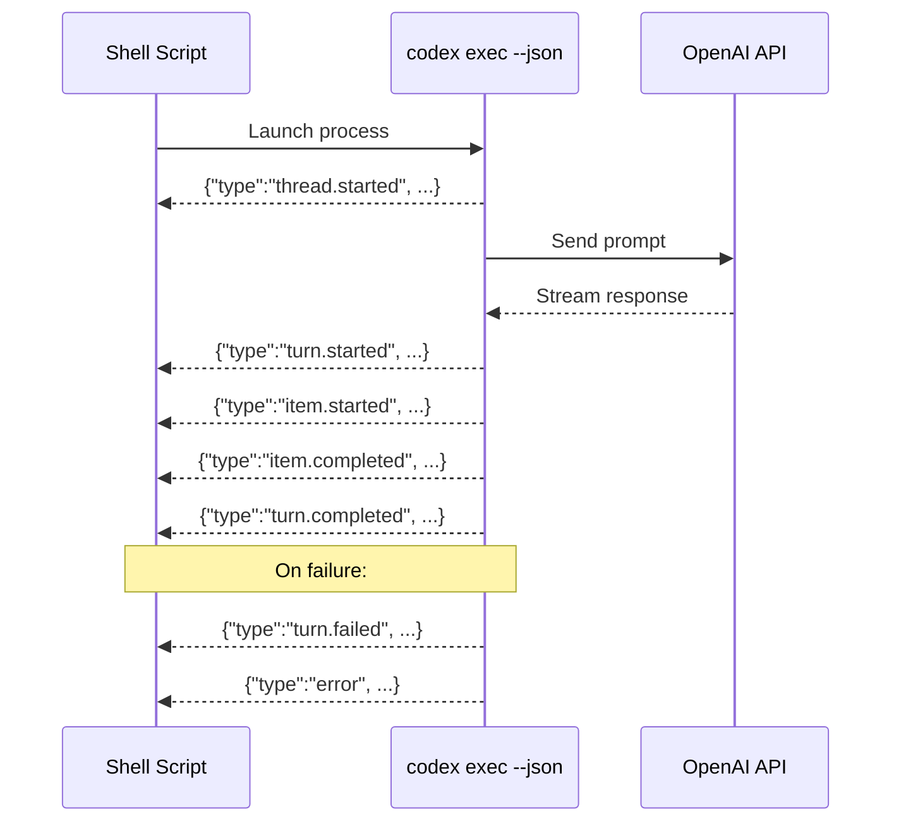
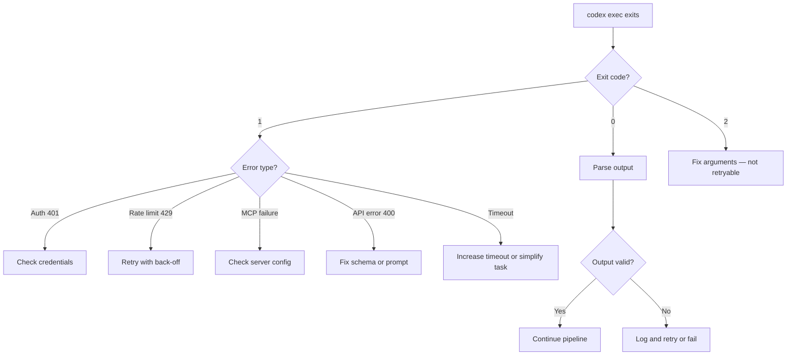

# Codex CLI Exit Codes and Error Handling: Building Resilient Shell Scripts and CI Pipelines Around Agent Failures


---

Every `codex exec` invocation is a subprocess. Subprocesses communicate success or failure through exit codes. Yet Codex CLI's exit code semantics, JSONL error events, and failure recovery patterns are scattered across GitHub issues, community gists, and a few sentences in the official docs. This article consolidates the complete error-handling surface into a single reference for developers building shell scripts, CI pipelines, and multi-step automation around Codex CLI v0.139 [^1].

## The Exit Code Contract

Codex CLI follows Unix conventions with three exit code ranges [^2][^3]:

| Exit Code | Meaning | Example Trigger |
|-----------|---------|-----------------|
| `0` | Success | Agent completed the task |
| `1` | Runtime error | Auth failure, rate limit, API error, missing config |
| `2` | Usage error | Invalid flags, bad flag placement, missing arguments |

### Exit Code 0: Success

A zero exit means the agent ran to completion and produced output. It does **not** guarantee the agent's work is correct — only that the process did not crash. A `codex exec` run that writes buggy code to disk still exits `0` [^2]. Your pipeline must validate the output separately.

### Exit Code 1: Runtime Errors

Exit code `1` covers every operational failure after argument parsing succeeds. The most common triggers, catalogued from the Codex issue tracker and community testing [^3][^4]:

**Authentication failures:**
```bash
# Invalid API key
$ CODEX_API_KEY=fake-key codex exec --skip-git-repo-check "ping"
# Error: unexpected status 401 Unauthorized: Incorrect API key provided
# Exit code: 1
```

**Git repository requirement:**
```bash
# Running outside a git repo without the escape hatch
$ cd /tmp && codex exec "ping"
# Error: Not inside a trusted directory and --skip-git-repo-check was not specified.
# Exit code: 1
```

**Rate limit exhaustion:**
```bash
# 429 response from the API
# Error: Rate limit reached for model gpt-5.5 ...
# Exit code: 1
```

Rate-limit handling has historically been a pain point. Early versions crashed with an uncaught exception on `429` responses [^4]. Current stable builds (v0.139) retry with exponential back-off before surfacing the error, but the CLI still exits `1` once retries are exhausted [^5].

**Invalid output schema:**
```bash
$ codex exec --skip-git-repo-check \
    --output-schema '{"type":"invalid"}' \
    "summarise the repo"
# Error: Invalid schema for response_format 'codex_output_schema'
# Exit code: 1
```

**MCP server startup failure:**
When an MCP server marked `required = true` in `config.toml` fails to initialise, the entire `codex exec` run exits `1` before the agent processes any prompt [^1].

### Exit Code 2: Usage Errors

Exit code `2` signals argument-parsing failures — the command never reached the API. The subtlest source is flag placement. Codex CLI has **global** flags (before the subcommand) and **subcommand** flags (after `exec`). Misplacing a flag triggers exit `2` [^3]:

```bash
# Wrong: --search is a global flag, not an exec flag
$ codex exec --skip-git-repo-check --search "find auth bugs"
# error: unexpected argument '--search' found
# Exit code: 2

# Correct: global flags before the subcommand
$ codex --search exec --skip-git-repo-check "find auth bugs"
```

Other exit `2` triggers include referencing a non-existent profile (`--profile nonexistent`), omitting required review parameters (`codex exec review` without `--uncommitted`, `--base`, or `--commit`), and passing TUI-only flags like `--no-alt-screen` to `exec` mode [^3].

## The JSONL Event Stream: Structured Error Detection

For pipelines that need more than a binary pass/fail, `codex exec --json` emits a newline-delimited JSONL stream to stdout [^6][^7]. Each line is a JSON object with a `type` field:



### Key Event Types for Error Handling

| Event Type | Meaning | Action |
|-----------|---------|--------|
| `turn.completed` | Agent turn finished normally | Extract results |
| `turn.failed` | Agent turn failed | Log error, decide retry |
| `error` | Unrecoverable stream error | Abort pipeline |
| `item.completed` with `item.type = "agent_message"` | Final agent response | Parse output |

A `turn.failed` event includes the failure reason in its payload, giving your script structured data about **why** the agent failed — far richer than a bare exit code [^7].

### Parsing JSONL in Shell Scripts

```bash
#!/usr/bin/env bash
set -euo pipefail

RESULT=$(codex exec --json --skip-git-repo-check \
    --sandbox read-only \
    "list the top 5 security risks in this repo" 2>/dev/null)

# Check for fatal errors in the stream
if echo "$RESULT" | jq -e 'select(.type == "error")' > /dev/null 2>&1; then
    ERROR_MSG=$(echo "$RESULT" | jq -r 'select(.type == "error") | .message')
    echo "::error::Codex stream error: $ERROR_MSG"
    exit 1
fi

# Check for turn failures
if echo "$RESULT" | jq -e 'select(.type == "turn.failed")' > /dev/null 2>&1; then
    echo "::warning::Codex turn failed, retrying..."
    # Retry logic here
fi

# Extract the final agent message
ANSWER=$(echo "$RESULT" | \
    jq -r 'select(.type == "item.completed" and .item.type == "agent_message") | .item.content')
echo "$ANSWER"
```

## Building Resilient CI Pipelines

### Pattern 1: Retry with Exponential Back-Off

Rate limits and transient API errors are the most common CI failures [^4][^5]. Wrap `codex exec` in a retry loop:

```bash
#!/usr/bin/env bash
set -euo pipefail

MAX_RETRIES=3
RETRY_DELAY=10

for attempt in $(seq 1 "$MAX_RETRIES"); do
    echo "Attempt $attempt of $MAX_RETRIES"

    if codex exec \
        --skip-git-repo-check \
        --sandbox read-only \
        --output-schema ./quality-schema.json \
        -o ./report.json \
        "Review src/ for critical issues"; then
        echo "Codex succeeded on attempt $attempt"
        break
    fi

    EXIT_CODE=$?
    if [ "$EXIT_CODE" -eq 2 ]; then
        echo "Usage error (exit 2) — not retryable"
        exit 2
    fi

    if [ "$attempt" -lt "$MAX_RETRIES" ]; then
        SLEEP_TIME=$((RETRY_DELAY * attempt))
        echo "Retrying in ${SLEEP_TIME}s..."
        sleep "$SLEEP_TIME"
    else
        echo "All $MAX_RETRIES attempts failed"
        exit 1
    fi
done
```

The critical detail: exit `2` (usage error) should **never** be retried. The arguments are wrong; retrying will not help [^3].

### Pattern 2: Pre-Flight Validation

Catch configuration errors before burning API tokens:

```bash
#!/usr/bin/env bash
set -euo pipefail

# 1. Verify authentication
if ! codex login status > /dev/null 2>&1; then
    echo "::error::Codex authentication missing"
    exit 1
fi

# 2. Verify config parses cleanly
if ! codex exec --strict-config --skip-git-repo-check \
    --sandbox read-only "echo ok" > /dev/null 2>&1; then
    echo "::error::config.toml validation failed"
    exit 1
fi

# 3. Verify required MCP servers are reachable
if ! codex doctor --json 2>/dev/null | jq -e '.mcp_servers | all(.status == "ok")' > /dev/null; then
    echo "::warning::One or more MCP servers unreachable"
fi

# 4. Run the actual task
codex exec --skip-git-repo-check \
    --sandbox workspace-write \
    "Run tests and fix any failures"
```

The `--strict-config` flag causes Codex to exit `1` if `config.toml` contains unrecognised fields — catching stale configuration from older CLI versions before the agent runs [^1].

### Pattern 3: GitHub Actions with Structured Output

The official `openai/codex-action@v1` handles retry and authentication internally [^8]. For custom pipelines that need finer control:


```yaml
name: Codex Quality Gate
on: [pull_request]

jobs:
  review:
    runs-on: ubuntu-latest
    steps:
      - uses: actions/checkout@v4

      - name: Install Codex CLI
        run: npm install -g @openai/codex@latest

      - name: Run Codex Review
        id: codex-review
        env:
          CODEX_API_KEY: ${{ secrets.OPENAI_API_KEY }}
        run: |
          set +e
          codex exec \
            --skip-git-repo-check \
            --sandbox read-only \
            --output-schema .codex/review-schema.json \
            -o review-output.json \
            "Review the PR diff for P0/P1 issues"
          CODEX_EXIT=$?
          set -e

          if [ "$CODEX_EXIT" -eq 2 ]; then
            echo "::error::Codex usage error — check flags"
            exit 2
          elif [ "$CODEX_EXIT" -ne 0 ]; then
            echo "::warning::Codex failed (exit $CODEX_EXIT) — skipping quality gate"
            echo "codex_ok=false" >> "$GITHUB_OUTPUT"
            exit 0  # Don't block the PR on agent failure
          fi

          echo "codex_ok=true" >> "$GITHUB_OUTPUT"

      - name: Enforce Quality Gate
        if: steps.codex-review.outputs.codex_ok == 'true'
        run: |
          CRITICAL=$(jq '.findings | map(select(.severity == "P0")) | length' review-output.json)
          if [ "$CRITICAL" -gt 0 ]; then
            echo "::error::$CRITICAL P0 findings — blocking merge"
            exit 1
          fi
```


The key design decision: agent failures (`exit 1`) produce a **warning** but do not block the PR. Only validated quality findings block the merge. This prevents flaky API errors from stalling your entire delivery pipeline [^8].

### Pattern 4: The Stop Hook as a Verification Gate

The Stop hook fires after each agent turn and can force continuation [^9]. Use it to inject verification steps:

```bash
#!/usr/bin/env bash
# stop-verify.sh — Stop hook that verifies test passage
set -euo pipefail

INPUT=$(cat)
LAST_MSG=$(echo "$INPUT" | jq -r '.last_assistant_message // empty')

# If the agent claims it fixed something, verify
if echo "$LAST_MSG" | grep -qi "fixed\|resolved\|passing"; then
    if ! npm test > /dev/null 2>&1; then
        # Tests still failing — force the agent to continue
        echo '{"decision":"block","reason":"Tests are still failing. Review the error output and fix the remaining issues."}'
        exit 0
    fi
fi

# Allow the turn to complete
echo '{"decision":"approve"}'
```

This pattern catches the common failure mode where the agent declares success without verification — the hook runs the actual tests and forces continuation until they pass [^9].

## Timeout Management

Long-running `codex exec` sessions can exceed CI job time limits. Two configuration levers control this [^1][^10]:

```toml
# config.toml — set per-session token budget
model_auto_compact_token_limit = 80000
tool_output_token_limit = 16384
```

For CI, set an explicit wall-clock timeout:

```bash
# Timeout after 5 minutes
timeout 300 codex exec --skip-git-repo-check \
    --sandbox read-only \
    "summarise the repo structure"

# timeout exits 124 on expiry
if [ $? -eq 124 ]; then
    echo "::warning::Codex timed out after 5 minutes"
fi
```

The `timeout` utility sends `SIGTERM`, which Codex handles gracefully — it flushes the session transcript before exiting [^5]. Avoid `SIGKILL` (`timeout -s KILL`) as it can leave orphaned MCP server processes.

## Error Handling Decision Framework



## Key Takeaways

1. **Exit `0` means the process succeeded, not that the agent's work is correct.** Always validate output with `--output-schema`, hooks, or downstream tests.

2. **Exit `2` is never retryable.** It signals a usage error — fix the command, do not loop.

3. **Use `--json` for structured error detection** in pipelines that need to distinguish between turn failures and stream errors.

4. **Pre-flight with `codex login status` and `--strict-config`** before burning API tokens on long runs.

5. **Decouple agent failures from pipeline failures.** A flaky API should produce a warning, not block your deployment. Let validated findings drive the gate decision.

6. **The Stop hook is your verification safety net.** It catches the "agent claims success without testing" failure mode before the session ends.

## Citations

[^1]: [Command line options – Codex CLI | OpenAI Developers](https://developers.openai.com/codex/cli/reference) — Official CLI reference documenting flags including `--strict-config`, `--skip-git-repo-check`, MCP `required` behaviour, and `codex login status`

[^2]: [Codex CLI exec mode experiments: 81 flag/feature tests with raw outputs](https://gist.github.com/alexfazio/359c17d84cb6a5af12bac88fa1db9770) — Community-maintained gist cataloguing exit codes across 81 flag combinations for `codex exec`

[^3]: [Return non-zero exit code on SIGINT (Ctrl+C) in exec mode — Issue #4721](https://github.com/openai/codex/issues/4721) — GitHub issue documenting exit code `2` for usage errors and `1` for runtime failures

[^4]: [Codex CLI exits abruptly on rate_limit_exceeded — Issue #690](https://github.com/openai/codex/issues/690) — Historical issue tracking the evolution from crash-on-429 to retry-then-exit behaviour

[^5]: [Codex commands timeout issue — Issue #7353](https://github.com/openai/codex/issues/7353) — Issue documenting timeout and sandbox-related failure modes in `codex exec`

[^6]: [Non-interactive mode – Codex | OpenAI Developers](https://developers.openai.com/codex/noninteractive) — Official documentation for `codex exec`, JSONL output, `--output-schema`, and exit semantics

[^7]: [Codex exec --json event cheatsheet](https://takopi.dev/reference/runners/codex/exec-json-cheatsheet/) — Community reference cataloguing all JSONL event types including `turn.failed` and `error`

[^8]: [GitHub Action – Codex | OpenAI Developers](https://developers.openai.com/codex/github-action) — Official `openai/codex-action@v1` documentation with built-in retry and authentication proxy

[^9]: [Hooks – Codex | OpenAI Developers](https://developers.openai.com/codex/hooks) — Official hooks documentation covering the Stop event, its JSON input/output schema, and continuation semantics

[^10]: [Configuration Reference – Codex | OpenAI Developers](https://developers.openai.com/codex/config-reference) — Official reference for `model_auto_compact_token_limit`, `tool_output_token_limit`, and all configuration keys
