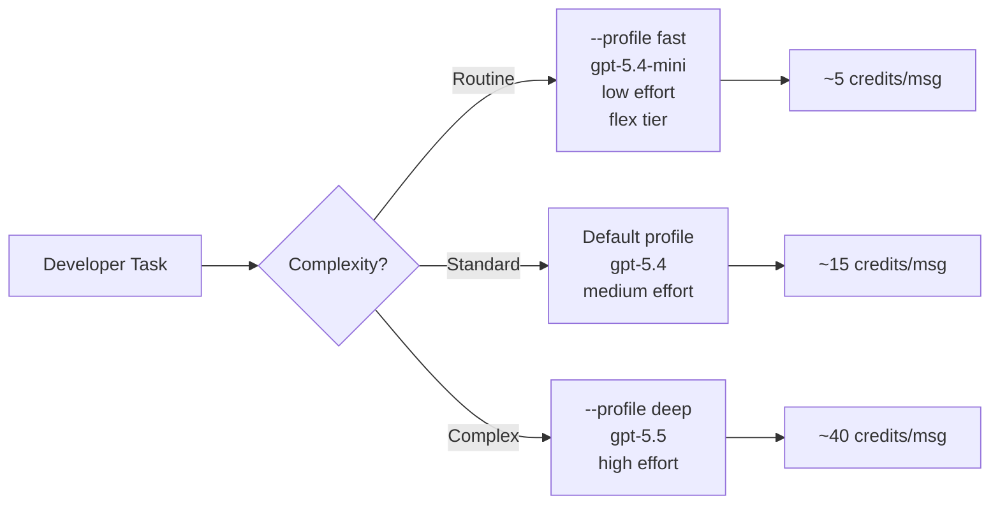

# Codex CLI Rate-Limit Reset Banking and Usage Optimisation: Managing Agent Costs from the Terminal


---

## Introduction

On 11 June 2026, Codex app 26.609 introduced **rate-limit reset banking** for Plus and Pro subscribers — a mechanism that lets developers accumulate unused rate-limit resets and deploy them on their own schedule rather than watching them expire on a fixed timer[^1]. For CLI-heavy developers burning through rolling windows during deep coding sessions, this changes the calculus of when and how to use the agent.

But reset banking is only one lever. Codex CLI exposes a rich surface of `config.toml` keys, profiles, and runtime flags that directly control token consumption, reasoning depth, and cost per task. This article maps the full cost-control toolkit available to senior developers in June 2026: from the new reset banking system through credit arithmetic, profile-based switching, and the configuration keys that prevent your agent from draining your quota on verbose tool output.

---

## The 5-Hour Rolling Window

Every Codex plan measures usage against a **5-hour rolling window**, not a monthly cap[^2]. When you hit your limit, the window resets 5 hours after the usage that consumed it — not at midnight, not on a fixed schedule.

The practical implication: a burst of heavy agent work at 09:00 means your window reopens at 14:00. If you spread work across the day, you might never hit the limit. If you front-load a complex refactoring session before standup, you could be locked out until after lunch.

### Current Window Allocations (June 2026)

| Plan | GPT-5.5 | GPT-5.4 | GPT-5.4-mini |
|------|---------|---------|--------------|
| Plus (\$20/mo) | 15–80 messages | 20–100 | 60–350 |
| Pro 5x (\$100/mo) | 80–400 | 100–500 | 300–1,750 |
| Pro 20x (\$200/mo) | 300–1,600 | 400–2,000 | 1,200–7,000 |

The ranges reflect message complexity — a single-line prompt costs fewer credits than a multi-file refactoring instruction with tool output[^2].

---

## Reset Banking: How It Works

Before reset banking, hitting your rate limit meant one thing: wait. The 5-hour timer was non-negotiable. Developers on deadline would either switch to an API key (usage-based billing) or sit idle.

Reset banking changes this by letting eligible users **save resets** that would otherwise expire and redeem them manually when needed[^1]. The mechanism is straightforward:

1. **Complimentary grant:** Every Plus and Pro subscriber received one free banked reset at launch (11 June 2026)[^1].
2. **Referral programme:** Invite a colleague; when they complete their first Codex interaction, both parties earn an additional banked reset. Each user can refer up to three people during the promotional window (11–24 June 2026)[^3].
3. **Redemption:** Banked resets are activated from the Codex profile or usage menu. Activating one immediately resets your current rolling window[^1].
4. **Expiry:** Banked resets are valid for 30 days after grant[^3].

There is no paid tier for purchasing additional resets — the feature is free for qualifying plan subscribers[^1].

### CLI Implications

Reset banking currently operates through the Codex app's usage menu rather than a CLI command. However, the practical impact for CLI developers is significant: when `codex exec` hits a rate limit mid-pipeline, a banked reset can unblock you without switching to API-key billing. Monitor your remaining resets in the app before starting long `codex exec` chains or batch workflows.

---

## Credit Arithmetic: What Your Agent Actually Costs

Since April 2026, Codex pricing has been token-based rather than per-message[^4]. Every interaction consumes credits calculated as:

```
credits = (input_tokens * input_rate) + (cached_input * cached_rate) + (output_tokens * output_rate)
```

### Per-Model Credit Rates (per 1M tokens)

| Model | Input | Cached Input | Output |
|-------|-------|--------------|--------|
| GPT-5.5 | 125 | 12.50 | 750 |
| GPT-5.4 | 62.50 | 6.25 | 375 |
| GPT-5.4-mini | 18.75 | 1.875 | 113 |

A typical message consumes 5–45 credits depending on complexity[^2]. The gap between GPT-5.5 and GPT-5.4-mini is roughly **6.6x on output tokens** — a difference that compounds across a full working day.

### The Cached Input Discount

Cached input tokens cost **90% less** than fresh input[^2]. This matters for Codex CLI sessions where the context window carries forward AGENTS.md content, prior tool output, and conversation history. Longer sessions benefit from higher cache hit rates, making the case for `codex resume --last` over starting fresh sessions for related work.

---

## CLI Configuration Keys for Cost Control

Codex CLI's `config.toml` exposes several keys that directly reduce token consumption without changing what you ask the agent to do[^5][^6].

### Model Selection

```toml
# ~/.codex/config.toml
model = "gpt-5.4-mini"  # Default to cheapest model
```

Override per session when you need the full GPT-5.5:

```bash
codex -c model="gpt-5.5" "refactor the payment module"
```

### Reasoning Effort

```toml
model_reasoning_effort = "medium"  # Global default
plan_mode_reasoning_effort = "high" # Think harder during planning
```

The `model_reasoning_effort` key accepts `minimal`, `low`, `medium`, `high`, and `xhigh`[^5]. Setting your global default to `medium` handles most development work whilst avoiding the token cost of deep reasoning on routine tasks. Use `plan_mode_reasoning_effort = "high"` to separate planning from execution — the agent thinks carefully about *what* to do, then executes efficiently.

In the TUI, `Alt+,` and `Alt+.` adjust reasoning effort mid-session without restarting[^7].

### Tool Output Token Limit

```toml
tool_output_token_limit = 12000
```

This is the single most impactful cost-control setting. Without it, a verbose test suite or a large `git diff` can flood the context window with thousands of tokens of tool output, triggering premature compaction and inflating every subsequent turn[^6]. Set it aggressively — 12,000 tokens captures meaningful output whilst preventing runaway accumulation.

### Context Compaction

```toml
model_auto_compact_token_limit = 64000
```

When conversation history exceeds this threshold, Codex automatically compacts it using an LLM summarisation pass[^6]. Lower values trigger compaction earlier, keeping per-turn costs down but risking loss of detail. Higher values preserve context at the cost of larger payloads on every turn.

### Service Tier

```toml
service_tier = "flex"
```

The `flex` tier trades latency for cost — requests may queue briefly but process at reduced rates[^5]. Ideal for `codex exec` batch jobs and CI pipelines where response time is less critical than throughput.

### Verbosity

```toml
model_verbosity = "low"
hide_agent_reasoning = true
```

Reducing verbosity cuts output tokens. Hiding reasoning events (`hide_agent_reasoning`) prevents reasoning traces from consuming output quota in `codex exec` pipelines[^5].

---

## Profile-Based Cost Management

Profiles are the primary mechanism for switching between cost postures without editing `config.toml` on every task[^8].

```toml
# ~/.codex/fast.config.toml
model = "gpt-5.4-mini"
model_reasoning_effort = "low"
service_tier = "flex"
tool_output_token_limit = 8000
model_verbosity = "low"

# ~/.codex/deep.config.toml
model = "gpt-5.5"
model_reasoning_effort = "high"
plan_mode_reasoning_effort = "xhigh"
tool_output_token_limit = 24000
```

Switch at invocation:

```bash
# Quick formatting fix — use the cheap profile
codex --profile fast "fix the linting errors in src/"

# Complex architecture refactor — use the expensive profile
codex --profile deep "migrate the auth module from session tokens to JWTs"
```



Name profiles after intent, not people. `fast`, `deep`, `ci`, and `review` age better than `alice` or `frontend-team`[^8].

---

## Practical Optimisation Workflows

### 1. Front-Load Planning, Then Switch Down

Start a session with high reasoning to produce a plan, then drop effort for execution:

```bash
# Plan with full reasoning
codex -c model_reasoning_effort="high" "analyse the codebase and create a refactoring plan for the API layer, write it to PLAN.md"

# Execute the plan with lower effort
codex --profile fast "follow the plan in PLAN.md and implement each step"
```

### 2. Batch with codex exec and flex Tier

For CI/CD and batch operations, `codex exec` with the `flex` service tier minimises cost:

```bash
codex exec \
  -c service_tier="flex" \
  -c model="gpt-5.4-mini" \
  -c model_reasoning_effort="low" \
  "review all TODO comments in src/ and create GitHub issues for each"
```

### 3. Resume Instead of Restart

Every fresh session re-processes your AGENTS.md, project context, and system prompt as fresh input tokens. Resuming an existing session hits the **cached input** rate — 90% cheaper[^2]:

```bash
# Resume the most recent session
codex resume --last
```

As of v0.139.0, `resume --last` uses the state database to find the newest matching session, making it significantly faster on large local histories[^9].

### 4. Trim MCP Servers

Each connected MCP server adds tool definitions to the system prompt on every turn[^10]. If you have six MCP servers connected but only need two for the current task, the idle four are still consuming input tokens. Use profiles to scope MCP servers per workflow:

```toml
# ~/.codex/backend.config.toml
[mcp_servers.postgres]
command = "npx"
args = ["-y", "@modelcontextprotocol/server-postgres"]

# ~/.codex/frontend.config.toml
[mcp_servers.playwright]
command = "npx"
args = ["-y", "@anthropic-ai/mcp-playwright"]
```

### 5. Monitor Before You Optimise

Use `codex doctor` to inspect your current configuration, including model, reasoning effort, and connected services[^9]. Pair this with the usage statistics visible in the Codex profile screen (added to iOS in June 2026) to correlate config changes with actual credit consumption[^11].

---

## When to Use API Keys Instead

The subscription model (Plus/Pro) works well for interactive development. But for high-volume batch processing, API-key billing may be cheaper:

| Scenario | Recommendation |
|----------|---------------|
| Interactive coding sessions | Plus/Pro subscription |
| CI/CD pipeline with < 50 runs/day | Plus with `codex exec --profile ci` |
| Heavy batch processing (> 100 tasks/day) | API key with usage-based billing |
| Overnight autonomous loops | API key (no rolling window limits) |

Configure API-key mode in `config.toml`:

```toml
# Switch a profile to API-key billing
# ~/.codex/batch.config.toml
api_key_source = "env"  # reads OPENAI_API_KEY
```

API-key usage bypasses the 5-hour rolling window entirely but charges per token at standard API rates[^2].

---

## The Referral Programme: Free Resets for Your Team

The June 2026 referral window (11–24 June) offers a straightforward way to accumulate banked resets across a team[^3]:

1. Each Plus/Pro user can invite up to **3 colleagues**.
2. When the invitee completes their first Codex interaction, both parties receive a banked reset.
3. A team of 5 developers can accumulate up to **15 resets** across the group (each person refers 3 others).
4. Resets are valid for **30 days** from the grant date.

For teams evaluating Codex, the referral window doubles as a low-risk onboarding mechanism — new users get a free reset to explore without pressure, and existing users gain breathing room for intensive sessions.

---

## Conclusion

Rate-limit reset banking addresses the most common frustration among Codex CLI developers: hitting the wall mid-session with no recourse but waiting. Combined with profile-based model switching, aggressive `tool_output_token_limit` settings, and strategic use of the `flex` service tier, the CLI's cost surface is now controllable enough to run agent workflows sustainably across a full working day.

The key insight is that **cost optimisation in Codex CLI is a configuration problem, not a usage problem**. The same task can cost 5 credits or 40 credits depending on your profile, reasoning effort, and model selection. Build profiles that match your intent, resume sessions instead of restarting them, and treat reset banking as insurance for the sessions that matter most.

---

## Citations

[^1]: OpenAI, "Codex app 26.609 changelog — Rate-limit reset banking," *OpenAI Developers*, 11 June 2026. [https://developers.openai.com/codex/changelog](https://developers.openai.com/codex/changelog)

[^2]: OpenAI, "Pricing — Codex," *OpenAI Developers*, June 2026. [https://developers.openai.com/codex/pricing](https://developers.openai.com/codex/pricing)

[^3]: CryptoBriefing, "OpenAI introduces free banked reset system for Codex users," June 2026. [https://cryptobriefing.com/openai-codex-free-rate-limit-reset/](https://cryptobriefing.com/openai-codex-free-rate-limit-reset/)

[^4]: OpenAI Community, "Codex Rate limits reset for all paid plans April 28, 2026," *OpenAI Developer Community*, April 2026. [https://community.openai.com/t/codex-rate-limits-reset-for-all-paid-plans-april-28-2026/1379921](https://community.openai.com/t/codex-rate-limits-reset-for-all-paid-plans-april-28-2026/1379921)

[^5]: OpenAI, "Configuration Reference — Codex," *OpenAI Developers*, June 2026. [https://developers.openai.com/codex/config-reference](https://developers.openai.com/codex/config-reference)

[^6]: OpenAI, "Sample Configuration — Codex," *OpenAI Developers*, June 2026. [https://developers.openai.com/codex/config-sample](https://developers.openai.com/codex/config-sample)

[^7]: Blake Crosley, "Codex CLI v0.135 Reference: history search, doctor, profiles," 2026. [https://blakecrosley.com/guides/codex](https://blakecrosley.com/guides/codex)

[^8]: OpenAI, "Advanced Configuration — Codex," *OpenAI Developers*, June 2026. [https://developers.openai.com/codex/config-advanced](https://developers.openai.com/codex/config-advanced)

[^9]: OpenAI, "Codex CLI v0.139.0 release notes," *GitHub Releases*, 9 June 2026. [https://github.com/openai/codex/releases](https://github.com/openai/codex/releases)

[^10]: OpenAI, "Codex CLI Performance Optimisation," *Codex Knowledge Base*, April 2026. [https://codex.danielvaughan.com/2026/04/08/codex-cli-performance-optimization/](https://codex.danielvaughan.com/2026/04/08/codex-cli-performance-optimization/)

[^11]: OpenAI, "ChatGPT for iOS 1.2026.153 release notes — Codex profile screen with usage statistics," *OpenAI Developers*, 9 June 2026. [https://developers.openai.com/codex/changelog](https://developers.openai.com/codex/changelog)
