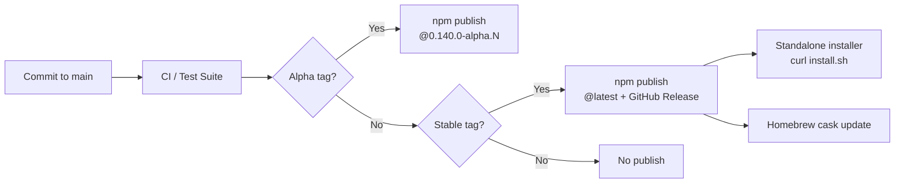

# Codex CLI Release Channels and Version Management: Alpha Builds, Version Pinning, and Team-Wide Update Strategies


---

Codex CLI ships new versions at a pace that most developer tools cannot match. Between January and June 2026, the project pushed over 300 releases — sometimes multiple builds in a single day[^1]. The v0.140 alpha series alone produced fourteen alpha builds across three days (10–12 June 2026)[^2]. For individual developers, this velocity means a constant stream of improvements. For teams, it means version management becomes a genuine engineering concern.

This article covers how Codex CLI's release pipeline works, how to install and switch between stable and alpha builds, and how enterprise teams can enforce version discipline across dozens or hundreds of developers.

## How the Release Pipeline Works

Codex CLI follows a model closer to browser release channels than traditional semantic versioning. There is no formal "beta" or "release candidate" stage. Instead, builds fall into two practical categories:

| Channel | Example | Audience | Risk |
|---------|---------|----------|------|
| **Stable** | `0.139.0` | Production use | Low — tested, documented |
| **Alpha** | `0.140.0-alpha.14` | Early adopters, feature chasers | Medium — functional but not fully baked |

Stable releases land on npm's `latest` tag and through the standalone installer[^3]. Alpha releases are published to npm under their full semver pre-release tag but do not overwrite `latest`, so `npm update -g @openai/codex` will never pull an alpha build unless you explicitly ask for one[^4].



The standalone installer (`curl -fsSL https://chatgpt.com/codex/install.sh | sh`) always installs the latest stable build[^3]. Rerunning it upgrades an existing installation in place.

## Installing a Specific Version

### Stable builds

```bash
# Latest stable (default)
npm install -g @openai/codex

# Pin to a known-good version
npm install -g @openai/codex@0.139.0

# Standalone installer (always latest stable)
curl -fsSL https://chatgpt.com/codex/install.sh | sh
```

### Alpha builds

```bash
# Install a specific alpha
npm install -g @openai/codex@0.140.0-alpha.14

# Check what you are running
codex --version
```

Alpha builds are also available as platform-specific binaries from the GitHub Releases page[^2]. Download the archive for your OS and architecture, extract, and place the binary on your `PATH`:

```bash
# Example: Linux x86_64
curl -L -o codex.tar.gz \
  https://github.com/openai/codex/releases/download/v0.140.0-alpha.14/codex-linux-x64.tar.gz
tar xzf codex.tar.gz
sudo mv codex /usr/local/bin/codex
```

### Rolling back

If an alpha misbehaves, drop back to stable:

```bash
npm install -g @openai/codex@0.139.0
```

There is no built-in rollback command. Version switching is handled entirely through your package manager or by rerunning the standalone installer.

## Controlling Update Checks

By default, Codex CLI checks for new stable releases on startup and prompts you to upgrade[^5]. In environments where updates are centrally managed — CI runners, locked-down workstations, air-gapped networks — disable this check in `~/.codex/config.toml`:

```toml
# Suppress the "a new version is available" prompt
check_for_update_on_startup = false
```

This key is the only officially supported update-related configuration[^5]. A community proposal to add a `update_channel` key for selecting stable versus prerelease builds was closed in February 2026; the maintainers noted that the CLI's release frequency makes formal channel management less practical than simply pinning a specific version via npm[^6].

## Team Version Management

### The problem

When ten developers on a team each run a different CLI version, behaviour diverges. A skill that relies on a v0.137 hook event might silently fail on v0.135. A model name valid in v0.139 might not resolve on v0.128. Debugging "it works on my machine" issues when the machine's agent differs is a productivity drain.

### Strategy 1: Pin in the project lockfile

If your project already uses npm or a Node.js package manager, add Codex CLI as a dev dependency:

```bash
npm install --save-dev @openai/codex@0.139.0
```

Then invoke via `npx codex` or add a script to `package.json`:

```json
{
  "scripts": {
    "codex": "codex"
  }
}
```

This pins the version per-repository through the lockfile. CI and local development use the same build[^7].

### Strategy 2: Enterprise managed configuration

For organisations on ChatGPT Business or Enterprise plans, administrators can enforce constraints through `requirements.toml`[^8]. While `requirements.toml` does not directly pin the CLI binary version, it constrains the operational surface — allowed models, permission profiles, sandbox modes, MCP server allowlists, and feature flags:

```toml
# /etc/codex/requirements.toml — enforced, users cannot override

[features]
hooks = true
browser_use = false
computer_use = false

allowed_approval_policies = ["unless-allow-listed"]
allowed_sandbox_modes = ["seatbelt", "landlock"]
```

Requirements follow a strict precedence chain: cloud-managed requirements take priority over MDM-delivered requirements (via `com.openai.codex:requirements_toml_base64` on macOS), which override the system file at `/etc/codex/requirements.toml`[^8]. When user configuration conflicts with a requirement, Codex falls back to a compatible value and notifies the user.

### Strategy 3: Container-based pinning

For CI/CD pipelines and reproducible builds, pin the version in a Dockerfile:

```dockerfile
FROM node:22-slim
RUN npm install -g @openai/codex@0.139.0
ENV CODEX_NON_INTERACTIVE=1
ENTRYPOINT ["codex", "exec"]
```

The `CODEX_NON_INTERACTIVE` environment variable suppresses interactive prompts, including update checks[^3].

## When to Run Alpha Builds

Alpha builds are worth the risk in a narrow set of circumstances:

1. **You need a specific fix or feature** that landed after the latest stable. Check the GitHub Releases page for the changelog of each alpha[^2].
2. **You are testing integration** with an upcoming stable release — for example, verifying that your skills, hooks, or MCP servers work correctly before the next stable drops.
3. **You are reporting bugs**. Running the latest alpha and filing issues against it is the most effective way to contribute to the project. Include `codex --version` output in every issue.

Avoid alpha builds in:

- Production CI/CD pipelines
- Shared team environments without explicit opt-in
- Customer-facing automations or scheduled tasks

## The v0.140 Alpha Series: What Is Being Tested

The v0.140 alpha series has been unusually active, with fourteen builds between 10 and 12 June 2026[^2]. Signals from earlier alpha notes and the v0.140 preview article[^9] suggest the series is testing:

- **Extensions unification** — converging the plugin, skill, and MCP tool surfaces into a more coherent extension model
- **Multi-Agent v2 path tracking** — improvements to how subagent threads are traced and managed
- **Python SDK integration** — tighter coupling between the CLI runtime and the `@openai/codex-sdk` package
- **Goal workflow refinements** — improvements to long-running goal persistence and state management

These are directional signals, not confirmed stable features. Alpha builds may include, remove, or change any of these between releases. ⚠️ The specific features shipping in v0.140 stable have not been officially announced by OpenAI at the time of writing.

## IDE Extension Channels

The Codex IDE extensions for VS Code and Cursor support their own pre-release channels through the standard marketplace mechanism[^10]. In VS Code, open the extension's marketplace page and click "Switch to Pre-Release Version" to receive alpha-equivalent updates for the IDE integration. This channel is independent of the CLI version — you can run a stable CLI with a pre-release IDE extension, or vice versa.

## Monitoring the Release Stream

Keeping track of what ships and when:

| Source | URL | Format |
|--------|-----|--------|
| GitHub Releases | `github.com/openai/codex/releases` | Per-version changelogs |
| Official Changelog | `developers.openai.com/codex/changelog` | Curated, stable-focused |
| npm | `npmjs.com/package/@openai/codex` | Version list, publish dates |
| Releasebot | `releasebot.io/updates/openai/codex` | Aggregated feed |

For automated monitoring, use the GitHub Releases RSS feed or set up a CI job that runs `npm info @openai/codex version` and alerts on changes.

## Practical Recommendations

1. **Individual developers**: stay on stable. Run `npm update -g @openai/codex` weekly. Only jump to alpha when chasing a specific fix.
2. **Small teams**: pin the version in your project's `package.json` or a shared setup script. Upgrade as a team, not individually.
3. **Enterprise**: use `requirements.toml` to constrain the operational surface. Pin the binary version through your MDM or container images. Disable startup update checks on managed machines.
4. **CI/CD**: always pin an explicit version. Never rely on `@latest` in automated pipelines — a mid-day npm publish could change behaviour between runs.
5. **Open-source maintainers**: document the minimum Codex CLI version your skills or plugins require. Use the `codex --version` output in bug report templates.

## Citations

[^1]: [Codex CLI Releases — GitHub](https://github.com/openai/codex/releases) — Over 700 releases as of mid-2026.
[^2]: [Codex CLI GitHub Releases — v0.140.0 alpha series](https://github.com/openai/codex/releases) — Fourteen alpha builds between 10–12 June 2026.
[^3]: [Codex CLI Installation — OpenAI Developers](https://developers.openai.com/codex/cli) — Standalone installer and npm installation instructions.
[^4]: [@openai/codex — npm](https://www.npmjs.com/package/@openai/codex) — Latest stable version 0.139.0, last published 9 June 2026.
[^5]: [Configuration Reference — OpenAI Developers](https://developers.openai.com/codex/config-reference) — `check_for_update_on_startup` boolean, defaults to `true`.
[^6]: [Feature: allow choosing stable releases vs prereleases for update checks — GitHub Issue #12467](https://github.com/openai/codex/issues/12467) — Closed February 2026; maintainers recommended manual version pinning.
[^7]: [Codex CLI Cheatsheet — Shipyard](https://shipyard.build/blog/codex-cli-cheat-sheet/) — npm-based version management patterns.
[^8]: [Managed Configuration — OpenAI Developers](https://developers.openai.com/codex/enterprise/managed-configuration) — Enterprise requirements.toml enforcement and precedence chain.
[^9]: [Codex CLI v0.140 Alpha Signals — Codex Knowledge Base](https://codex.danielvaughan.com/2026/06/10/codex-cli-v0140-alpha-signals-extensions-unification-multi-agent-v2-path-tracking-python-sdk-goals/) — Directional feature signals from the alpha series.
[^10]: [VS Code Marketplace — Pre-Release Versions](https://code.visualstudio.com/updates/v1_63#_pre-release-extensions) — Standard VS Code pre-release extension channel mechanism.
