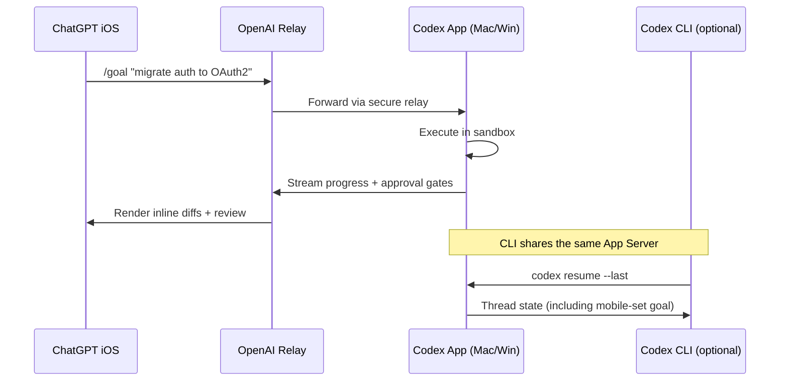
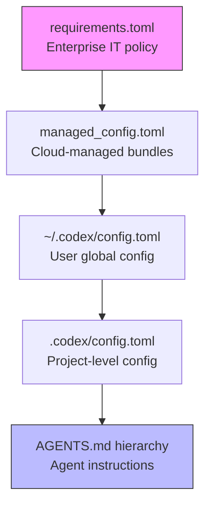
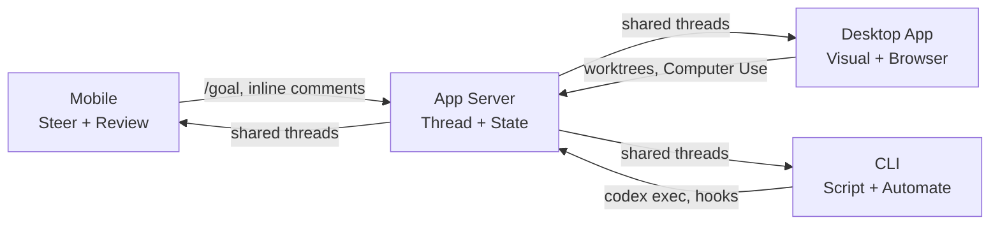

# Codex Mobile in ChatGPT iOS: Branch Selection, Goal Management, and Inline Code Review from Your Phone


---

On 9 June 2026, ChatGPT iOS build 1.2026.153 shipped six features that transform the mobile Codex experience from a notification-and-approval relay into a genuine development companion[^1]. Branch selection, worktree creation, environment setup scripts, `/goal` management, inline review comments on changed files, and prompt editing now live on your phone — capabilities that previously required the desktop app or the CLI. For CLI-first developers, this changes the calculus of when and how you use your phone to steer agent work.

This article maps each new capability to the CLI workflows it complements, explains the architectural constraints that govern what the mobile surface can and cannot do, and provides the configuration recipes that make the combination productive.

---

## What Shipped in 1.2026.153

Six additions arrived in the same iOS build[^1]:

| Feature | What It Does | CLI Equivalent |
|---|---|---|
| **Branch selection** | Choose a Git branch when starting a new thread | `codex --cd /path && git checkout branch` |
| **Worktree creation** | Spin up an isolated worktree for the new thread | `git worktree add` + `codex --cd` |
| **Setup script support** | Run `.codex/setup.sh` or equivalent before the agent starts | Automatic in desktop; manual in CLI |
| **`/goal` command** | Create, pause, resume, and clear persistent goals | `/goal` in the TUI since v0.128[^2] |
| **Inline review comments** | Annotate changed files with line-level comments | `/review` or `codex exec "review this diff"` |
| **Prompt editing** | Edit the last sent prompt without retyping | Up-arrow in the TUI |

Together, these features close the gap between the mobile surface and the desktop app for the most common steering operations. The mobile client still cannot create new Appshots, run local terminal commands, or modify `config.toml` — those require the host machine's graphics stack and filesystem[^3].

---

## Architecture: How Mobile Reaches Your Machine

Understanding the mobile surface's limitations requires understanding its connection model. Codex Mobile does not run code on your phone. Every operation — file edits, shell commands, test runs — executes on the host machine (macOS or Windows) where the Codex App is running[^4].



The mobile client connects through a secure relay layer that keeps the host reachable without exposing it to the public internet[^4]. The host must be awake, online, and signed into the same ChatGPT account and workspace[^4]. When the host sleeps or loses connectivity, the mobile session pauses until the connection is restored.

Critically, the mobile surface connects to the same **App Server** that the CLI uses[^5]. This means a thread started from your phone with a specific branch and goal can be resumed in the CLI with `codex resume --last`, and vice versa. The thread carries its full conversation history, goal state, and file changes across surfaces[^5].

---

## Branch Selection and Worktree Creation

### The Problem This Solves

Before 1.2026.153, starting a new Codex thread from mobile defaulted to whatever branch the host project had checked out[^6]. If a colleague had left `main` checked out and you wanted to start work on a feature branch from your phone, you had no option but to wait until you reached your desk — or use SSH to manually switch branches.

### How It Works

When you tap "New Thread" in the Codex mobile interface, a branch picker now lists all local and remote-tracking branches from the host's repository[^1]. Selecting a non-current branch triggers one of two behaviours:

1. **Checkout** — If no worktree isolation is needed, Codex switches the project to the selected branch before the thread starts.
2. **Worktree creation** — If you toggle the worktree option, Codex creates a new `git worktree` in a sibling directory, scoped to the selected branch, and the new thread executes entirely within that worktree[^1].

Worktree creation on mobile follows the same lifecycle as the desktop app: the worktree persists until you explicitly remove it, and it appears in the project list on all surfaces[^7].

### CLI Synergy

The worktree created from mobile is a standard Git worktree. You can `cd` into it from the CLI and start a new Codex session there, or resume the mobile-initiated thread:

```bash
# List worktrees created from any surface
git worktree list

# Resume the thread started from mobile
codex resume --last --cd ~/projects/myapp-worktrees/feature-oauth
```

### Setup Script Execution

If the project contains a `.codex/setup.sh` script (or the equivalent configured in `.codex/config.toml`), the mobile-initiated thread runs it before the agent begins work[^1]. This ensures that dependency installation, virtual environment activation, and database seeding happen automatically — even when you start work from your phone at a coffee shop.

---

## Goal Management from Mobile

### Why This Matters for CLI Developers

The `/goal` command — available in the CLI TUI since v0.128[^2] and GA since v0.133[^8] — creates a persistent objective that the agent pursues autonomously until it either succeeds, exhausts its token budget, or hits an unresolvable blocker. Goals survive session breaks and compaction cycles[^2].

Adding `/goal` to the mobile surface means you can:

1. **Set a goal from your phone** before you reach your desk — the agent starts working immediately on the host machine.
2. **Monitor progress** via the mobile thread view, which shows the goal timer, current step, and any approval gates.
3. **Pause and resume** the goal from mobile — useful when you want the agent to stop while you review its partial output.
4. **Clear the goal** and take over manually, either from mobile or by switching to the CLI.

### Practical Pattern: The Commute Kickoff

A workflow emerging among CLI developers who commute:

```
Morning commute (phone):
  1. Open ChatGPT iOS → Codex
  2. Select project, choose feature branch, create worktree
  3. /goal "Implement the OAuth2 PKCE flow per RFC 7636.
     Write tests. All tests must pass."
  4. Pocket phone

At desk (CLI):
  1. codex resume --last
  2. Review what the agent accomplished during the commute
  3. Take over interactive steering if needed
```

The key insight is that the goal state is shared across surfaces via the App Server[^5]. The CLI session sees the same goal, the same progress, and the same approval history as the mobile session.

### Approval Mode Interaction

A June 11, 2026 fix ensured that scheduled automations honour the selected approval mode[^9]. This fix also affects mobile-initiated goals: the approval policy set in your `config.toml` or profile now consistently governs whether the agent pauses for approval on mobile, desktop, or CLI. Previously, mobile-initiated threads could silently default to a more permissive approval mode than the host configuration specified[^9].

Configure your approval policy in `config.toml` to control mobile-initiated goal behaviour:

```toml
[profile.mobile-safe]
model = "gpt-5.4"
approval_policy = "unless-allow-listed"
model_reasoning_effort = "high"
sandbox_mode = "workspace-write"
```

---

## Inline Review Comments

### What Changed

Prior to 1.2026.153, reviewing code from mobile meant reading a flat diff in the thread transcript. The new inline review feature renders changed files with a proper diff viewer, and you can tap any line to add a comment that the agent sees as additional context on its next turn[^1].

This mirrors the review pane in the desktop app, which pulls GitHub pull request context — reviewer comments, changed files, and diffs — directly into the sidebar[^10].

### How Inline Comments Reach the Agent

When you add an inline comment on a changed file from mobile, the comment is injected into the conversation as a user message with file path and line number metadata[^10]. The agent treats it like any other user instruction but with precise spatial context:

```
User comment on src/auth/pkce.ts:42:
"This nonce generation uses Math.random().
Use crypto.getRandomValues() instead — this is a security-sensitive path."
```

The agent can then make the targeted fix without you needing to describe the file, function, or line number.

### CLI Integration

Inline review comments made from mobile appear in the thread history. When you resume the thread in the CLI, you see both the comments and the agent's responses to them. This creates a natural workflow:

1. **Agent works autonomously** (via goal mode, from any surface)
2. **You review from mobile** (inline comments on the diff)
3. **Agent addresses feedback** (autonomously, or waiting for your CLI session)
4. **You do final review from CLI** (with full terminal tooling)

---

## Configuration for CLI-Mobile Workflows

### Shared Configuration

The mobile surface inherits the host's configuration stack. When the host runs the Codex App with the CLI's shared `config.toml`, both surfaces see the same profiles, model selections, and sandbox policies[^5]. The precedence chain remains:



Mobile-initiated threads inherit this full stack. There is no separate "mobile config" — the host's environment governs everything[^4].

### Recommended Profile for Mobile-Initiated Work

Because mobile-initiated goals may run for extended periods without direct supervision, a dedicated profile with conservative settings reduces risk:

```toml
[profile.mobile]
model = "gpt-5.4"
approval_policy = "on-failure"
model_reasoning_effort = "high"
sandbox_mode = "workspace-write"
model_auto_compact_token_limit = 160000
tool_output_token_limit = 8000

[profile.mobile.sandbox_workspace_write]
network_access = false
```

Activate it from the CLI before leaving your desk:

```bash
codex --profile mobile
```

Or set it as the default for a specific project by adding to `.codex/config.toml`:

```toml
default_profile = "mobile"
```

### SSH Host Connections

For developers who run Codex on a remote server rather than a local Mac, the mobile surface can connect via SSH[^4]. Add the host to `~/.ssh/config` with a concrete alias, ensure `codex` is in the remote user's PATH, and enable the SSH host in Codex App Settings → Connections[^4]. The mobile client then tunnels through the relay to the SSH host, giving you the same branch selection, goal management, and inline review capabilities.

---

## Limitations and Caveats

The mobile surface remains a steering layer, not an execution environment:

- **No Appshots creation** — requires macOS screen recording and accessibility APIs[^3]
- **No terminal access** — you cannot run arbitrary shell commands from mobile
- **No `config.toml` editing** — configuration changes require the host or CLI
- **Host dependency** — if the host sleeps or disconnects, the mobile session pauses[^4]
- **Windows constraints** — Windows hosts cannot be controlled from other computers; mobile control works only via the relay to the Codex App itself[^4]
- **Network exposure** — never expose the App Server directly to public networks; use VPN for remote host access[^4]

---

## The Bigger Picture: Mobile as the Third Leg

The June 9 iOS update completes a three-surface workflow that CLI developers can rely on:



The CLI remains the primary surface for scripted automation (`codex exec`), CI/CD integration, and deep interactive sessions. The desktop app handles visual workflows, browser use, and Computer Use. Mobile now handles the steering and review operations that previously required you to be at your desk — setting goals, choosing branches, reviewing diffs, and providing targeted feedback.

The practical value is not in replacing the CLI. It is in eliminating the dead time between leaving your desk and arriving at the next one.

---

## Citations

[^1]: OpenAI, "Codex Changelog — ChatGPT iOS 1.2026.153," 9 June 2026. [https://developers.openai.com/codex/changelog](https://developers.openai.com/codex/changelog)

[^2]: OpenAI, "Codex CLI v0.128.0 Release — Goal Workflows," 30 April 2026. [https://github.com/openai/codex/releases/tag/rust-v0.128.0](https://github.com/openai/codex/releases/tag/rust-v0.128.0)

[^3]: OpenAI, "Appshots — Codex," 2026. [https://developers.openai.com/codex/appshots](https://developers.openai.com/codex/appshots)

[^4]: OpenAI, "Remote Connections — Codex," 2026. [https://developers.openai.com/codex/remote-connections](https://developers.openai.com/codex/remote-connections)

[^5]: OpenAI, "Codex App Server Architecture," 2026. [https://developers.openai.com/codex/app](https://developers.openai.com/codex/app)

[^6]: "Codex Mobile remote new thread cannot choose worktree or starting branch," GitHub Issue #22925, 2026. [https://github.com/openai/codex/issues/22925](https://github.com/openai/codex/issues/22925)

[^7]: OpenAI, "Worktrees — Codex App," 2026. [https://developers.openai.com/codex/app/worktrees](https://developers.openai.com/codex/app/worktrees)

[^8]: OpenAI, "Codex CLI v0.133.0 Release — Goals GA," May 2026. [https://github.com/openai/codex/releases](https://github.com/openai/codex/releases)

[^9]: OpenAI, "Codex Changelog — Codex App 26.609," 11 June 2026. [https://developers.openai.com/codex/changelog](https://developers.openai.com/codex/changelog)

[^10]: OpenAI, "Review — Codex App," 2026. [https://developers.openai.com/codex/app/review](https://developers.openai.com/codex/app/review)
