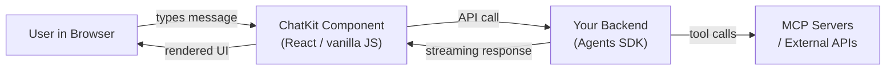

# Codex Through the Glass: ChatKit as a Codex Interface

*Series: Codex Through the Glass — Interface Patterns for Non-Developer Users (Part 4 of 8)*

---

If Teams and Slack put the agent inside an existing platform, ChatKit puts the agent inside your own application. OpenAI's ChatKit, which reached general availability in June 2026, is an embeddable chat component that handles message rendering, input, streaming, threading, and in-chat app experiences — all backed by the same infrastructure that powers ChatGPT.

For organisations that want a branded agent experience without building a chat UI from scratch, ChatKit is the shortest path.

## The Architecture

ChatKit operates in two modes:

**Hosted mode:** ChatKit connects directly to OpenAI's infrastructure. Your agent runs in OpenAI's cloud. Minimal backend code needed — configure the agent via the Agents SDK and ChatKit handles the frontend.

**Self-hosted mode:** ChatKit connects to your own backend server running the Agents SDK. You control where data flows, where it is stored, and what the agent can access. Required for data residency, on-premises deployment, or custom authentication.

## What ChatKit Provides

ChatKit is not just a text input and a message list. It handles:

- **Streaming responses** with typing indicators and progressive rendering
- **Model thinking display** — shows the agent's reasoning when enabled
- **In-chat app experiences** — rich interactive components within the conversation
- **Threading** — multiple conversation threads with history
- **Branding** — customisable colours, icons, and predefined prompts
- **File uploads** — documents, images, and attachments
- **Citations** — source references with links
- **Feedback buttons** — thumbs up/down for response quality

Standard OpenAI API pricing applies. There is no separate ChatKit fee.

## Invoice Matching Example

A finance team opens the internal "AP Assistant" web page. The page contains a ChatKit widget branded with the company logo and colours.

The user types: "Show me today's unmatched invoices from Acme Components"

The ChatKit widget:
1. Sends the message to the backend (Agents SDK)
2. The agent calls MCP tools to query the invoice inbox
3. Streaming response appears in the chat: "Found 3 unmatched invoices from Acme Components..."
4. Results render as a structured table within the chat
5. User replies: "Match them against purchase orders"
6. Agent processes each invoice, reports matches and flags
7. For the flagged invoice, the agent asks: "Invoice INV-4417-090 has a price discrepancy (GBP 12.50 vs contract GBP 12.00). Approve, reject, or investigate?"
8. User types: "Approve — contract renegotiation pending"
9. Agent posts the journal entry and confirms

The entire interaction happens within a single chat interface. No adaptive cards, no block kit, no spreadsheet — just a conversation.

## Build Complexity

| Component | Effort | Notes |
|---|---|---|
| ChatKit frontend | 0.5 day | `npm install @openai/chatkit`. Drop into React or vanilla JS. |
| Backend (Agents SDK) | 1–2 days | Define the agent, tools, and instructions using the Agents SDK. |
| MCP tool servers | Variable | Same as other patterns. |
| Branding and customisation | 0.5 day | Colours, logo, predefined prompts, welcome message. |
| Self-hosted setup | 1 day | Only if data residency required. Run backend on your infrastructure. |
| Authentication | 0.5–1 day | Your app's auth system. ChatKit does not handle auth — your backend does. |
| **Total MVP** | **3–5 days** | Fastest of all the interface options |

**Build complexity rating: 1/5** — Low. ChatKit is designed to minimise frontend work. If you are already using the Agents SDK, adding ChatKit is a day's work.

## When to Choose ChatKit

**Choose ChatKit when:**
- You want the fastest possible path to a branded agent interface
- Conversational interaction suits the workflow
- You are already using or planning to use the OpenAI Agents SDK
- Data residency requires self-hosting (ChatKit supports it)
- You want OpenAI's native streaming, threading, and rendering

**Do not choose ChatKit when:**
- Users need the agent inside Teams or Slack (use their respective integrations)
- You need structured data entry forms (ChatKit is conversational, not form-based)
- You want to avoid OpenAI vendor lock-in
- The interface needs to work offline

## Key Considerations

**Agent Builder shutdown.** OpenAI is sunsetting Agent Builder on 30 November 2026. New ChatKit apps should be built on the Agents SDK, not Agent Builder. Existing Agent Builder workflows can be exported to Agents SDK code using OpenAI's migration tool.

**Approval patterns.** ChatKit does not have built-in approval buttons like Adaptive Cards or Block Kit. Approvals happen conversationally — the agent asks, the user types "approve" or "reject." For structured approvals, build a custom in-chat app experience using ChatKit's extensibility hooks.

**Multi-user.** ChatKit is per-user. Each user has their own conversation threads. For team-wide visibility (e.g. a shared invoice matching queue), you need a custom dashboard that aggregates agent activity across users.

**Pricing.** ChatKit itself is free. You pay standard OpenAI API rates for the model usage. At current GPT-5.1-codex pricing, an average invoice matching conversation costs roughly USD 0.02–0.10 depending on tool calls and context length.

---

*Next in the series: [Codex Sites as a Codex Interface](/articles/2026-06-12-codex-through-the-glass-codex-sites-as-a-codex-interface/) — prompt-to-hosted-web-app for internal dashboards and tools.*
