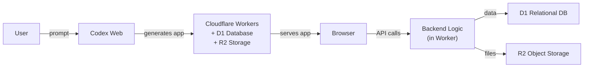

# Codex Through the Glass: Codex Sites as a Codex Interface

*Series: Codex Through the Glass — Interface Patterns for Non-Developer Users (Part 5 of 8)*

---

What if you could describe the interface you want, and the agent builds it for you?

Codex Sites, launched on 2 June 2026, does exactly that. You write a prompt — "Build me an invoice matching dashboard that shows today's unmatched invoices, lets me approve or reject each one, and displays a weekly summary chart" — and Codex creates a working web application, deploys it to Cloudflare edge infrastructure, and gives you a URL.

No code. No deployment pipeline. No infrastructure decisions. Prompt to production in minutes.

## The Architecture

Codex Sites builds a Cloudflare Worker-compatible bundle with three components:
- **Worker** — the application logic (JavaScript/TypeScript)
- **D1** — a relational database provisioned and managed by OpenAI within your workspace
- **R2** — object storage for files and assets

The application is hosted on an OpenAI-managed URL. There is no custom domain support, no public URL option, and no code export — as of June 2026, it is strictly for internal and team-facing tools.

## What Codex Sites Can Build

Codex Sites targets the same class of tools that Retool and Superblocks serve — internal dashboards, review workflows, planners, and lightweight tools. Examples:

- Invoice matching dashboard with approval buttons
- Expense report review queue
- Supplier onboarding checklist
- Weekly AP reconciliation summary
- Contract renewal tracker

The key difference from Retool is that there is no visual builder. You describe what you want in natural language, and Codex generates the full application.

## Invoice Matching Example

A finance manager opens Codex Web and types:

> "Build an invoice matching tool. It should show a table of today's unmatched invoices with columns for invoice number, supplier, amount, PO number, match status, and agent notes. Include approve and reject buttons on each row. Show a summary bar at the top with counts of matched, flagged, and exception invoices. Add a weekly trend chart."

Codex generates the application, deploys it, and returns a URL. The finance manager opens the URL and sees a working dashboard. The data can be populated via the D1 database (manually, via API, or by a scheduled Codex task that runs the matching agent and writes results to D1).

## Build Complexity

| Component | Effort | Notes |
|---|---|---|
| Prompt engineering | 0.5 day | Describe the application. Iterate on the prompt until the UI matches requirements. |
| Data integration | 1–2 days | Populate D1 database. Options: manual entry, API ingestion, or scheduled Codex tasks. |
| Agent connection | 1–2 days | Write a scheduled task or API endpoint that runs the matching agent and writes results to D1. |
| Customisation | Variable | Iterate on the prompt to refine layout, colours, and behaviour. |
| **Total MVP** | **2–4 days** | Fastest for dashboard-style interfaces |

**Build complexity rating: 1/5** — Very low for the initial build. Higher if you need custom backend logic or complex data integrations.

## When to Choose Codex Sites

**Choose Codex Sites when:**
- You need an internal dashboard or review tool quickly
- The interface is primarily read-and-approve (not complex data entry)
- Your organisation has a ChatGPT Business or Enterprise workspace
- You want zero infrastructure management
- The tool is for a small team (< 50 users)

**Do not choose Codex Sites when:**
- You need a public-facing application
- You need custom domains or branding
- You need code export or portability
- Complex form inputs or multi-step wizards are required
- You need to integrate with on-premises systems behind a firewall
- You need the application to scale beyond team use

## Key Considerations

**Business/Enterprise only.** Codex Sites is currently limited to ChatGPT Business and Enterprise workspaces. Not available on Plus, Pro, or Free plans.

**No code export.** You cannot download the generated application and host it elsewhere. If you outgrow Codex Sites, you would need to rebuild the application using a traditional framework.

**No custom domains.** Applications are served from OpenAI-managed URLs. This limits use to internal tools where URL branding does not matter.

**No payments or sensitive data.** Codex Sites is not suitable for applications that handle payment processing, personally identifiable information, or regulated data — the hosting and data residency controls are not configurable.

**Iteration model.** The application is modified by prompting Codex again. "Add a filter dropdown for supplier name." "Change the chart to show monthly totals." This is powerful for quick iteration but can become unwieldy for complex applications.

---

*Next in the series: [Retool and Superblocks as a Codex Interface](/articles/2026-06-12-codex-through-the-glass-retool-superblocks-as-a-codex-interface/) — the low-code dashboard approach with full control over layout, data sources, and deployment.*
