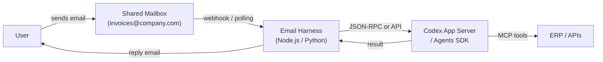

# Codex Through the Glass: Email as a Codex Interface

*Series: Codex Through the Glass — Interface Patterns for Non-Developer Users (Part 7 of 8)*

---

Every person in your organisation already has an email client. They know how to compose a message, attach a file, and read a reply. They do not need to learn a new tool, join a new channel, or open a new application.

Email is the lowest-friction interface for users who do not want another tool — and for async workflows where the user does not need an immediate response.

## The Architecture

The harness monitors a shared mailbox (or a dedicated agent address like `ap-agent@company.com`). When an email arrives, the harness extracts the content and attachments, submits them as a Codex turn, and replies with the result.

Two integration methods:

**Microsoft Graph API** — for Microsoft 365 organisations. Use webhooks for real-time notification or delta queries for polling. Full access to attachments, conversation threading, and send-as capabilities.

**Gmail API** — for Google Workspace. Use push notifications via Cloud Pub/Sub or polling via history list. Similar capabilities to Graph.

## The Email as Agent Protocol

Email naturally supports the key agent interaction patterns:

| Agent Pattern | Email Equivalent |
|---|---|
| Task submission | Send email to agent address |
| Context / attachments | Email attachments (PDF invoices, spreadsheets) |
| Agent response | Reply email with results |
| Approval request | Email with approve/reject links or reply instructions |
| Conversation threading | Email thread (Re: subject line) |
| Escalation | CC a human manager |
| Audit trail | Email archive |

The last point is underappreciated: email is inherently auditable. Every message, every attachment, every approval is stored in the mailbox with timestamps and sender identity. For regulated industries, this is valuable.

## Invoice Matching Example

A supplier sends an invoice PDF to `invoices@company.com`. The harness:

1. Detects the new email via Microsoft Graph webhook
2. Downloads the PDF attachment
3. Submits to Codex: "Match this invoice to a purchase order"
4. The agent extracts data from the PDF (OCR/LLM), queries the ERP, matches to PO
5. If matched within tolerance: replies to the email thread with "Invoice INV-4417-089 matched to PO-8831. Auto-approved and posted to ledger."
6. If flagged: replies with "Invoice INV-4417-090 has a price discrepancy. Reply APPROVE or REJECT. Details: contract says GBP 12.00, invoice says GBP 12.50."
7. User replies "APPROVE — contract renegotiation pending"
8. Harness detects the reply, sends approval to the agent, agent posts the journal entry
9. Final confirmation email sent

The user never leaves Outlook. The entire workflow happens via email replies.

## Build Complexity

| Component | Effort | Notes |
|---|---|---|
| Mailbox setup | 0.5 day | Shared mailbox + app registration in Azure AD or Google Workspace. |
| Email harness | 2–3 days | Graph API or Gmail API integration. Parse emails, extract attachments, handle threading. |
| Codex integration | 1–2 days | Same JSON-RPC or API bridge as other patterns. |
| Reply formatting | 1 day | HTML email templates for results, approvals, and confirmations. |
| MCP tool servers | Variable | Same as other patterns. |
| **Total MVP** | **5–7 days** | Moderate complexity due to email parsing and threading |

**Build complexity rating: 3/5** — Moderate. Email parsing (especially attachments and threading) adds complexity compared to structured messaging APIs. The trade-off is universal accessibility.

## When to Choose Email

**Choose email when:**
- Users are resistant to adopting new tools
- The workflow is naturally async (supplier invoices, approval requests, reports)
- Attachments are a primary input (PDF invoices, spreadsheets, contracts)
- Audit trail via email archive is valuable
- External parties (suppliers, clients) need to interact with the agent
- Mobile access matters — email works on every device

**Do not choose email when:**
- Real-time interaction is needed
- Complex multi-step conversations are required
- Rich UI (charts, dashboards, interactive elements) is needed
- High-volume processing where email threading becomes unwieldy

## Key Considerations

**Parsing complexity.** Email is messy. HTML formatting, quoted reply chains, signature blocks, attachment MIME types — all need handling. Use a library like `mailparser` (Node.js) or `email.parser` (Python) and be prepared for edge cases.

**Reply detection.** Distinguish between user replies (approvals, instructions) and auto-replies (out-of-office, delivery receipts). Filter on sender, subject patterns, and content heuristics.

**Rate limits.** Microsoft Graph allows 10,000 API calls per 10 minutes per app per tenant. Gmail API allows 250 quota units per second. Both are generous for invoice matching volumes.

**Security.** The agent address should have appropriate permissions — read the shared mailbox, send replies, but not access other mailboxes. Use application permissions with minimal scope.

**Spam and abuse.** If the agent address is externally reachable (for supplier invoices), implement sender verification. Only process emails from known supplier domains or registered addresses.

---

*Next in the series: [WhatsApp and Telegram as a Codex Interface](/articles/2026-06-12-codex-through-the-glass-whatsapp-telegram-as-a-codex-interface/) — mobile-first messaging for field workers and distributed teams.*
