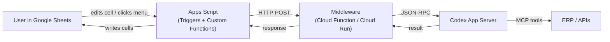

# Codex Through the Glass: Google Sheets as a Codex Interface

*Series: Codex Through the Glass — Interface Patterns for Non-Developer Users (Part 3 of 8)*

---

For many business users, a spreadsheet is not just a tool — it is the tool. Finance teams, procurement teams, operations teams: they think in rows and columns. They filter, sort, and conditional-format their way through the working day. If you want these users to interact with a Codex-powered agent, meet them where they already are.

This article shows how to build a Google Sheets interface to Codex where every row is a task and every cell is an output.

## The Architecture



The middleware layer exists because Apps Script cannot maintain a persistent WebSocket connection to the Codex app-server. Instead, it sends HTTP requests to a Cloud Function that acts as a JSON-RPC bridge.

For simpler setups, the middleware can call the OpenAI API directly via the Responses API or Agents SDK, bypassing the app-server entirely. This trades Codex-specific features (sandbox, approvals, MCP) for simplicity.

## The Spreadsheet as Interface

### Row-Per-Invoice Pattern

The most natural spreadsheet pattern for invoice matching:

| A: Invoice # | B: Supplier | C: Amount | D: PO # | E: Status | F: Agent Notes | G: Action |
|---|---|---|---|---|---|---|
| INV-4417-089 | Acme Components | 12,450.00 | PO-8831 | Matched | Quantities and prices verified | Auto-approved |
| INV-4417-090 | Acme Components | 3,200.00 | PO-8832 | Flagged | Price discrepancy: GBP 12.50 vs contract GBP 12.00 | [Approve] [Reject] |
| INV-5521-044 | Bolton Fasteners | 890.00 | — | Exception | No matching PO found | [Assign PO] |

Column E uses conditional formatting: green for "Matched," amber for "Flagged," red for "Exception." Column G contains data validation dropdowns or checkbox controls for human decisions.

### Custom Functions

Apps Script custom functions let users invoke the agent from any cell:

```javascript
/**
 * Match an invoice to a purchase order using the Codex agent.
 * @param {string} invoiceId The invoice identifier
 * @return {string} Match result summary
 * @customfunction
 */
function CODEX_MATCH(invoiceId) {
  const response = UrlFetchApp.fetch(MIDDLEWARE_URL, {
    method: 'post',
    contentType: 'application/json',
    payload: JSON.stringify({
      task: 'invoice_match',
      invoiceId: invoiceId,
    }),
  });
  return JSON.parse(response.getContentText()).summary;
}
```

The user types `=CODEX_MATCH(A2)` in cell F2, and the agent's match result appears in the cell. It looks and feels like any other spreadsheet formula.

### Trigger-Based Processing

For batch operations, an `onEdit` trigger watches a control cell:

```javascript
function onEdit(e) {
  if (e.range.getA1Notation() === 'I1' && e.value === 'RUN') {
    const sheet = e.source.getActiveSheet();
    const data = sheet.getDataRange().getValues();

    for (let i = 1; i < data.length; i++) {
      if (data[i][4] === 'Pending') {
        const result = matchInvoice(data[i][0]);
        sheet.getRange(i + 1, 5).setValue(result.status);
        sheet.getRange(i + 1, 6).setValue(result.notes);
      }
    }
    sheet.getRange('I1').setValue('DONE');
  }
}
```

The user types "RUN" in cell I1. The script processes every pending invoice, populates the Status and Notes columns, and writes "DONE" when finished. The entire batch operation happens within the familiar spreadsheet environment.

## Approval Pattern

Approvals in a spreadsheet use data validation dropdowns in the Action column:

1. Agent flags an invoice by setting Status to "Flagged" and Notes to the reason
2. User reviews the row, reads the agent's notes
3. User selects "Approve" or "Reject" from the dropdown in column G
4. An `onEdit` trigger detects the change and sends the approval back to the middleware
5. The agent continues processing based on the decision

This is not as immediate as an Adaptive Card button, but it fits the spreadsheet mental model perfectly. Finance users already approve transactions in spreadsheets.

## Build Complexity

| Component | Effort | Notes |
|---|---|---|
| Apps Script functions | 1 day | Custom functions + triggers. Google's built-in editor. |
| Middleware (Cloud Function) | 1–2 days | HTTP-to-JSON-RPC bridge. Node.js or Python. |
| Codex app-server or API | 1–2 days | Can use app-server JSON-RPC or direct OpenAI API calls. |
| Spreadsheet template | 0.5 day | Column layout, conditional formatting, data validation. |
| MCP tool servers | Variable | Same as other patterns. |
| Authentication | 0.5 day | Apps Script runs as the user. Middleware needs API key. |
| **Total MVP** | **4–6 days** | Similar to Slack. Simpler UI, slightly more middleware work. |

**Build complexity rating: 2/5** — Low-moderate. Apps Script is accessible to non-developers who know basic JavaScript. The middleware layer adds a step but keeps things simple.

## When to Choose Sheets

**Choose Sheets when:**
- Users already work in spreadsheets for the process being automated
- Batch processing is more common than real-time interaction
- Data needs to be filtered, sorted, and analysed after agent processing
- The output format is naturally tabular (invoice lists, reconciliation reports)
- You want the lowest possible adoption barrier

**Do not choose Sheets when:**
- Real-time conversational interaction is needed
- The workflow requires complex approval chains with multiple stages
- Data sensitivity requires enterprise-grade access controls
- You need streaming progress updates during processing

## Key Considerations

**Execution time limits.** Apps Script custom functions have a 30-second timeout. For complex agent tasks, use a trigger-based pattern that processes rows asynchronously and polls for results.

**Concurrent access.** Multiple users editing the same sheet can cause conflicts. Use a dedicated "agent results" sheet that users read but do not edit directly.

**Cell output limits.** Custom functions can only return a string or a 2D array. For rich output, return a summary string in the cell and write detailed results to a separate sheet or a linked Google Doc.

**No persistent connection.** Apps Script cannot maintain a WebSocket to the app-server. The middleware must handle request-response translation. For long-running tasks, use a polling pattern: submit task, get job ID, poll for completion.

**Excel alternative.** The same pattern works with Microsoft Excel using Office Scripts (TypeScript) and Power Automate as the middleware layer, or with Excel's Python integration for direct API calls.

---

*Next in the series: [ChatKit as a Codex Interface](/articles/2026-06-12-codex-through-the-glass-chatkit-as-a-codex-interface/) — OpenAI's own embeddable chat component for branded agent experiences.*
