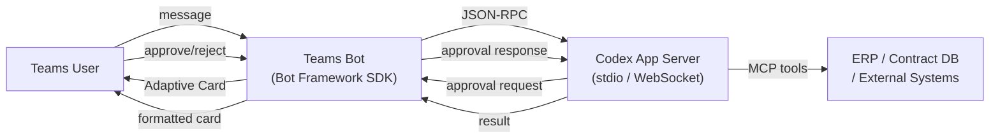

# Codex Through the Glass: Microsoft Teams as a Codex Interface

*Series: Codex Through the Glass — Interface Patterns for Non-Developer Users (Part 1 of 8)*

---

Microsoft Teams is where most enterprise knowledge workers already live. They chat, approve purchase orders, join standup calls, and file expense reports without ever leaving the purple sidebar. If you want non-developer users to interact with a Codex-powered agent, the shortest path to adoption is putting the agent where the users already are.

This article shows how to wire Microsoft Teams to the Codex app-server, turning a Teams channel into a full agent interface — complete with task submission, streaming progress, and human-in-the-loop approvals via Adaptive Cards.

## The Architecture

The pattern follows the same approach that NanoClaw uses for Telegram: a lightweight harness sits between the messaging platform and the agent runtime. The harness receives messages, translates them into agent instructions, and formats results for the user.



Three components:

1. **Teams Bot** — A Node.js application using the Bot Framework SDK v4. Receives messages from Teams, maintains conversation state, and renders responses as Adaptive Cards.
2. **Codex App Server** — The same JSON-RPC engine that powers the Codex TUI, IDE extension, and mobile app. Runs on a VM or container. Manages threads, turns, sandbox execution, and MCP tool calls.
3. **MCP Tool Servers** — External system integrations (ERP, contract database, supplier history) exposed as MCP servers that the agent calls during execution.

## How It Works

### Message Flow

When a user sends a message in Teams:

1. The Bot Framework delivers the message to your bot's webhook endpoint
2. Your bot creates or resumes a Codex thread via `thread/start` or `thread/resume`
3. Your bot submits the message as a turn via `turn/start` with the user's text as input
4. The app-server streams events: `item/started`, `item/agentMessage/delta`, `item/commandExecution`, `item/fileChange`
5. On `turn/completed`, your bot formats the result as an Adaptive Card and posts it to Teams

### The Approval Bridge

This is the feature that makes Teams particularly powerful as a Codex interface. The Codex app-server's approval system maps directly to Adaptive Card actions.

When the agent wants to execute a sensitive operation — posting a journal entry, modifying a supplier record, sending a payment file — the app-server emits an `approval/commandExecution` notification. Your harness converts this into an Adaptive Card:

```json
{
  "type": "AdaptiveCard",
  "body": [
    {
      "type": "TextBlock",
      "text": "Agent Approval Required",
      "weight": "Bolder",
      "size": "Medium"
    },
    {
      "type": "TextBlock",
      "text": "The invoice matching agent wants to post a journal entry:",
      "wrap": true
    },
    {
      "type": "FactSet",
      "facts": [
        { "title": "Supplier", "value": "4417 — Acme Components Ltd" },
        { "title": "Invoice", "value": "INV-2026-4417-0089" },
        { "title": "Amount", "value": "GBP 12,450.00" },
        { "title": "PO Match", "value": "PO-2026-8831 (exact match)" },
        { "title": "Confidence", "value": "98.7%" }
      ]
    }
  ],
  "actions": [
    { "type": "Action.Submit", "title": "Approve", "data": { "action": "approve" } },
    { "type": "Action.Submit", "title": "Reject", "data": { "action": "deny" } },
    { "type": "Action.ShowCard", "title": "Details", "card": { "...": "..." } }
  ]
}
```

When the user taps "Approve," the bot sends `approval/*/approve` back to the app-server, and the agent continues. This is the Codex terminal approval mode, but rendered in a familiar enterprise UI.

### Thread Management

Each Teams conversation maps to a Codex thread. The harness maintains a mapping in SQLite:

| Teams Conversation ID | Codex Thread ID | Created | Last Turn |
|---|---|---|---|
| `19:abc123@thread` | `thread-uuid-1` | 2026-06-12 | 2026-06-12T14:30 |

This means users can have ongoing conversations with context. The agent remembers previous invoices discussed, decisions made, and preferences learned — because it is the same Codex thread underneath.

## Invoice Matching Example

A finance team member in Teams types:

> *"Match the invoices from Acme Components that came in this morning"*

The agent:
1. Queries the invoice inbox via MCP tool (ERP connector)
2. Finds three invoices from Acme Components dated today
3. Matches each against purchase orders
4. Auto-approves two that are within tolerance
5. Flags one with a price discrepancy (contract says GBP 12.00, invoice says GBP 12.50)
6. Posts an Adaptive Card summary to Teams with the flagged invoice requiring human approval

The user sees a clean card with three rows — two green ticks and one amber flag. They tap the amber row, see the price discrepancy detail, check the contract override, and tap "Approve with note: contract renegotiation pending." The agent posts the journal entries.

Total time: under two minutes, without leaving Teams.

## Build Complexity

| Component | Effort | Notes |
|---|---|---|
| Teams bot scaffolding | 1–2 days | Teams Toolkit + Bot Framework SDK. Azure Bot Service for hosting. |
| Codex app-server integration | 2–3 days | JSON-RPC client over stdio or WebSocket. Handle initialise handshake, thread/turn lifecycle. |
| Adaptive Card templates | 1–2 days | Approval cards, result summaries, error states. Use Adaptive Cards Designer. |
| MCP tool servers | Variable | Depends on external systems. One per integration (ERP, contracts, etc.) |
| Authentication | 1 day | Azure AD SSO for Teams. Codex API key or ChatGPT auth for app-server. |
| **Total MVP** | **5–8 days** | For a single-process agent (e.g. invoice matching) |

**Build complexity rating: 3/5** — Moderate. The Bot Framework SDK handles Teams protocol complexity. The Codex app-server handles agent complexity. Your harness is glue code.

## When to Choose Teams

**Choose Teams when:**
- Your users already live in Teams all day
- You need approval workflows with audit trails
- Enterprise SSO and compliance matter (Azure AD, data residency)
- You want threaded conversations with persistent context
- IT governance requires a managed platform

**Do not choose Teams when:**
- You need a public-facing interface (Teams is internal only)
- Your users are not on Microsoft 365
- You need rich custom UI beyond what Adaptive Cards support
- Real-time streaming display matters more than structured cards

## Key Considerations

**Adaptive Card limitations.** Cards support text, images, inputs, buttons, and fact sets — but not arbitrary HTML, charts, or interactive visualisations. For complex output, link to a Codex Sites dashboard or external tool.

**Message size limits.** Teams messages have a 28 KB limit for Adaptive Cards. For large agent outputs (full reports, multi-page analyses), post a summary card with a link to the full document.

**Rate limits.** Bot Framework allows approximately 1 message per second per conversation. Batch streaming deltas into periodic updates rather than forwarding every `item/agentMessage/delta` event.

**Security.** The Codex app-server should run on infrastructure the organisation controls — not a developer laptop. Use Azure Container Instances or an internal VM. The Teams bot authenticates via Azure AD; the app-server connection should use mTLS or run over a private network.

---

*Next in the series: [Slack as a Codex Interface](/articles/2026-06-12-codex-through-the-glass-slack-as-a-codex-interface/) — the Bolt SDK pattern with Block Kit and Socket Mode.*
