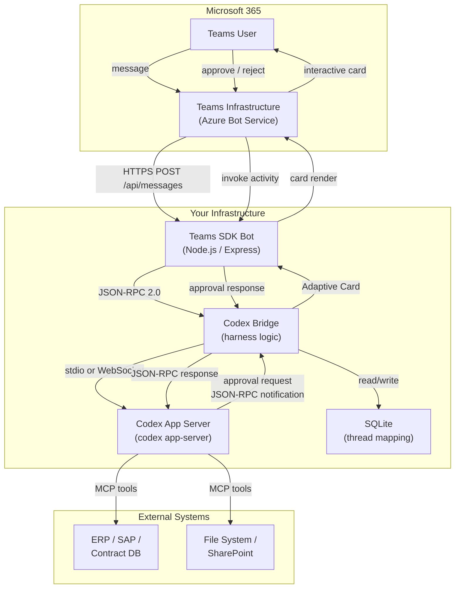
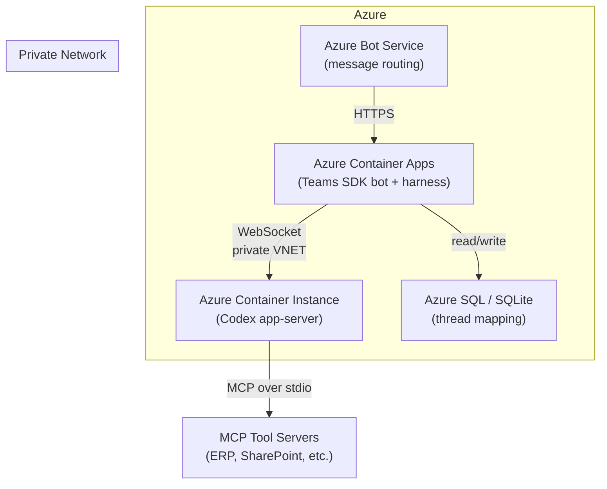
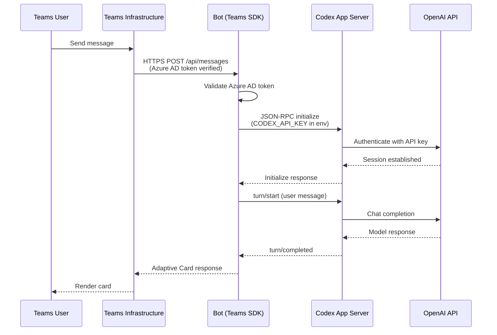
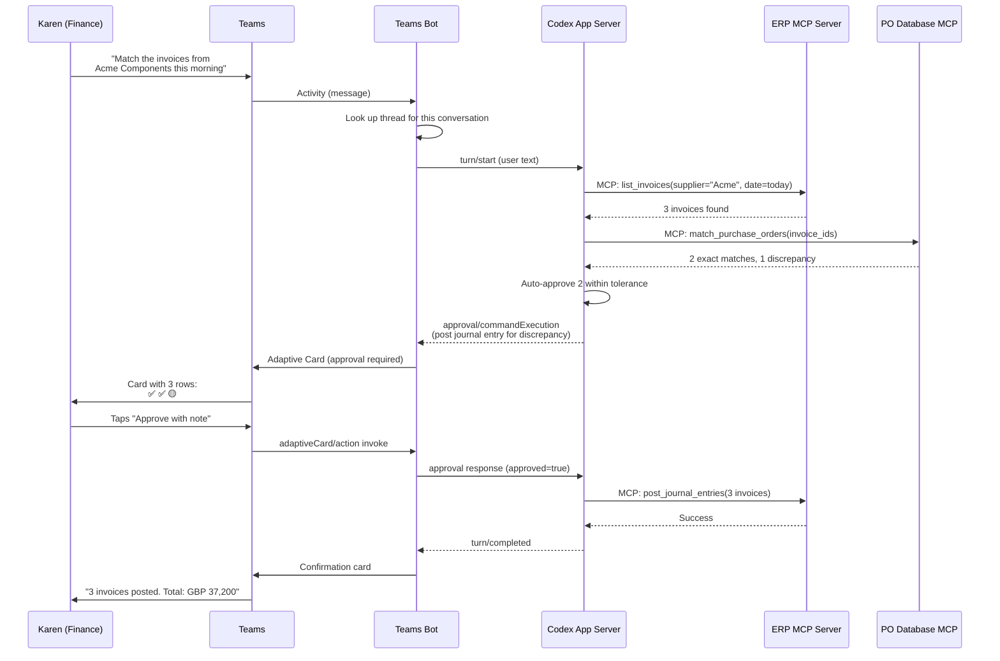

# Codex Through the Glass: Microsoft Teams as a Codex Interface

*The Complete Implementation Guide*

*Series: Codex Through the Glass — Interface Patterns for Non-Developer Users (Part 1 of 8)*

---

Microsoft Teams is where most enterprise knowledge workers already live. They chat, approve purchase orders, join standup calls, and file expense reports without ever leaving the purple sidebar. If you want non-developer users to interact with a Codex-powered agent, the shortest path to adoption is putting the agent where the users already are.

This article is a full implementation guide. It covers the architecture, the SDK choices, the Codex app-server protocol, complete code for every critical component, Adaptive Card templates for approval workflows, and production deployment patterns. By the end you will have everything you need to build a working Teams-to-Codex harness.

---

## Part 1: The SDK Landscape in 2026

Before writing a line of code, you need to choose the right Microsoft SDK. The landscape has shifted significantly, and picking the wrong foundation will cost you weeks.

### What happened to Bot Framework SDK v4?

Microsoft archived the Bot Framework SDK at the end of December 2025. Support tickets are no longer serviced. The repository remains on GitHub for reference, but no new features, security patches, or bug fixes will ship.[^1]

If you are starting a new project in 2026, **do not use Bot Framework SDK v4**. If you have an existing Bot Framework bot, plan a migration.

### The three current options

| SDK | Status | Best for | MCP support | Language |
|-----|--------|----------|-------------|----------|
| **Teams SDK v2** (formerly Teams AI Library) | GA (JS/C#), Preview (Python) | New Teams bots and agents | Yes — built-in MCP client plugin | TypeScript, C#, Python |
| **Microsoft 365 Agents SDK** | GA | Multi-channel agents (Teams, Copilot, Web Chat) | Yes — via extensibility | C#, JavaScript, Python |
| **Copilot Studio** | GA | No-code/low-code agents | Yes — declarative agents with MCP | Visual designer |

For a Codex harness, the **Teams SDK v2** is the right choice. It is the most lightweight, it handles authentication and event routing, and its MCP support means the bot itself can participate in the MCP ecosystem alongside Codex.[^3][^22]

### How others have done it

Five distinct integration patterns exist in the wild as of June 2026:

1. **Microsoft Copilot Studio agents** — no-code drag-and-drop. Microsoft's own Copilot products use this. Great for simple Q&A, poor for custom agent backends.[^15]
2. **Azure OpenAI + Bot Framework** — the classic 2023-2024 pattern. An Azure App Service hosts a bot that calls Azure OpenAI. Still works but uses the archived SDK.[^20]
3. **Teams SDK v2 + external agent** — the pattern this article implements. A Teams SDK bot acts as a frontend, forwarding messages to a separate agent backend (Codex, LangChain, Azure AI Foundry, or any custom service).[^7]
4. **NanoClaw messaging adapter** — an open-source personal AI agent that connects to Teams (alongside Telegram, Slack, WhatsApp, Discord, and Gmail) using a skills-based architecture built on Anthropic's Claude Agent SDK. NanoClaw demonstrates the "lightweight harness" pattern at production scale.[^8]
5. **Power Automate + HTTP connector** — a workflow-based approach where Power Automate receives Teams messages and calls an external API. Simple but limited for streaming or interactive approvals.[^17]

This guide follows pattern 3, informed by the architectural lessons of pattern 4.

---

## Part 2: Architecture

The architecture has three layers. The Teams SDK handles the messaging protocol. Your harness translates between Teams and Codex. The Codex app-server runs the agent.



### The four components

**1. Teams SDK bot** — A Node.js Express application using `@microsoft/teams.apps`. Receives messages from Teams, handles authentication, and renders Adaptive Cards. Approximately 80 lines of code.[^1]

**2. Codex bridge** — Your harness logic. Manages the JSON-RPC 2.0 connection to the Codex app-server, translates between Teams activities and Codex protocol, and handles the approval flow. Approximately 200 lines of code.

**3. Codex app-server** — The same engine that powers the Codex TUI, VS Code extension, JetBrains plugin, and mobile app. Runs as a child process (stdio) or a WebSocket server. Manages threads, turns, sandbox execution, model selection, and MCP tool calls.[^2][^12]

**4. SQLite database** — Maps Teams conversation IDs to Codex thread IDs. Stores conversation references for proactive messaging. Persists approval state for crash recovery.

### Why not call the OpenAI API directly?

You could skip the app-server and call the Chat Completions API from your bot. But you would lose:

- **Sandbox execution** — the app-server runs commands in an isolated environment with permission profiles
- **MCP tool orchestration** — the app-server manages MCP server lifecycles and tool routing
- **Thread persistence** — conversation history, session archival, and context compaction
- **Approval flow** — built-in human-in-the-loop with configurable policies
- **Goal mode** — multi-turn autonomous execution across hours or days
- **Model discovery** — automatic model selection and fallback

The app-server is the differentiator. Without it, you have a chatbot. With it, you have an agent.

---

## Part 3: Prerequisites and Setup

### What you need

| Requirement | Details |
|-------------|---------|
| **Node.js** | v20+ (LTS recommended) |
| **Microsoft 365 tenant** | With permission to sideload custom apps |
| **Azure subscription** | For Azure Bot Service registration (free tier sufficient for development) |
| **Codex CLI** | v0.139.0+ installed globally: `npm install -g @openai/codex` |
| **OpenAI account** | API key or ChatGPT auth for the app-server |
| **Teams Developer CLI** | `npm install -g @microsoft/teams.cli` (preview) |

### Step 1: Register your Teams bot

The Teams Developer CLI automates Azure AD app registration, client secret generation, manifest creation, and bot setup in a single command:

```bash
# Install the CLI
npm install -g @microsoft/teams.cli

# Register a new bot (creates Azure AD app + bot channel registration)
teams app create \
  --name "Codex Invoice Agent" \
  --endpoint "https://your-domain.com/api/messages"
```

This creates a `.env` file with `CLIENT_ID`, `CLIENT_SECRET`, and `TENANT_ID`.[^1]

For development, use Dev Tunnels (built into VS Code) or ngrok to expose your local server:

```bash
# Using Dev Tunnels
devtunnel create --allow-anonymous
devtunnel port create -p 3978

# Or using ngrok
ngrok http 3978
```

Update your bot's messaging endpoint to the tunnel URL + `/api/messages`.

### Step 2: Scaffold the project

```bash
mkdir codex-teams-harness && cd codex-teams-harness
npm init -y
npm install @microsoft/teams.apps express better-sqlite3 ws dotenv
npm install -D typescript @types/node @types/express @types/better-sqlite3
```

Create the project structure:

```
codex-teams-harness/
  src/
    index.ts           # Express server + Teams SDK setup
    codex-bridge.ts    # JSON-RPC client for Codex app-server
    card-factory.ts    # Adaptive Card templates
    thread-store.ts    # SQLite conversation mapping
    types.ts           # Shared type definitions
  .env                 # Secrets (auto-generated by teams app create)
  tsconfig.json
  package.json
```

---

## Part 4: The Teams SDK Bot

### The message handler

The Teams SDK v2 reduces boilerplate by 70-90% compared to Bot Framework SDK v4. The core pattern is an event-driven message handler:[^3][^7]

```typescript
// src/index.ts
import { App } from '@microsoft/teams.apps';
import { ExpressAdapter } from '@microsoft/teams.apps';
import express from 'express';
import dotenv from 'dotenv';
import { CodexBridge } from './codex-bridge';
import { CardFactory } from './card-factory';
import { ThreadStore } from './thread-store';

dotenv.config();

const expressApp = express();
const adapter = new ExpressAdapter(expressApp);
const app = new App({
  httpServerAdapter: adapter,
  clientId: process.env.CLIENT_ID!,
  clientSecret: process.env.CLIENT_SECRET!,
  tenantId: process.env.TENANT_ID!,
});

const bridge = new CodexBridge();
const cards = new CardFactory();
const store = new ThreadStore();

// Handle incoming messages from Teams users
app.on('message', async ({ reply, activity }) => {
  const conversationId = activity.conversation.id;
  const userText = activity.text?.trim();
  const userName = activity.from.name;

  if (!userText) return;

  // Send a typing indicator while the agent works
  await reply({ type: 'typing' });

  // Look up or create a Codex thread for this conversation
  let threadId = store.getThread(conversationId);

  if (!threadId) {
    // Start a new Codex thread
    const thread = await bridge.startThread();
    threadId = thread.id;
    store.mapThread(conversationId, threadId, activity);
  }

  // Submit the user's message as a Codex turn
  try {
    const result = await bridge.startTurn(threadId, userText, userName);

    // Format the result as an Adaptive Card
    const card = cards.resultCard(result);
    await reply({ attachments: [card] });

  } catch (error) {
    const errorCard = cards.errorCard(
      'The agent encountered an error. Please try again.',
      error instanceof Error ? error.message : 'Unknown error'
    );
    await reply({ attachments: [errorCard] });
  }
});

// Handle Adaptive Card actions using verb-specific sub-routes
// Teams SDK v2 maps 'adaptiveCard/action' invokes to 'card.action' aliases
// and supports sub-routes per verb: 'card.action.{verb}'
app.on('card.action.approveAction', async ({ activity }) => {
  const data = activity.value?.action?.data;
  if (!data?.approvalId) return;

  await bridge.approveAction(data.approvalId);
  return {
    statusCode: 200,
    type: 'application/vnd.microsoft.adaptive.card',
    value: cards.approvalConfirmationCard(data, 'approved').content,
  };
});

app.on('card.action.rejectAction', async ({ activity }) => {
  const data = activity.value?.action?.data;
  if (!data?.approvalId) return;

  await bridge.rejectAction(data.approvalId);
  return {
    statusCode: 200,
    type: 'application/vnd.microsoft.adaptive.card',
    value: cards.approvalConfirmationCard(data, 'rejected').content,
  };
});

// Initialise and start the server
(async () => {
  await app.initialize();
  await bridge.initialize();

  const port = process.env.PORT || 3978;
  expressApp.listen(port, () => {
    console.log(`Codex Teams harness running on port ${port}`);
  });
})();
```

### What the SDK handles for you

The Teams SDK automatically:[^7]

- **Verifies incoming requests** are legitimately from Teams before processing
- **Routes messages** to the correct event handler
- **Injects the `/api/messages` endpoint** into your Express app
- **Handles OAuth and token refresh** for Azure AD authentication
- **Manages conversation references** for proactive messaging

Your server remains yours. The adapter is a lightweight seam — not a framework takeover.

---

## Part 5: The Codex Bridge

The bridge is the core of the harness. It manages a JSON-RPC 2.0 connection to the Codex app-server and translates between Teams events and the Codex protocol.

### Understanding the Codex app-server protocol

The Codex app-server exposes a bidirectional JSON-RPC 2.0 API. Every surface that uses Codex — the TUI, VS Code extension, JetBrains plugin, iOS app, and now your Teams bot — speaks this same protocol. OpenAI designed it so that "internal teams and external partners could embed the same harness in their own products."[^12]

Working clients exist in Go, Python, TypeScript, Swift, and Kotlin.[^2]

**Supported transports:**

| Transport | Use case | Configuration |
|-----------|----------|---------------|
| **stdio** (default) | Local development, single-tenant | `codex app-server` (or `--listen stdio://`) |
| **WebSocket** (experimental) | Multi-tenant, remote servers | `codex app-server --listen ws://127.0.0.1:8765` |
| **Unix socket** | Same-host container communication | `codex app-server --listen unix:///path/to/socket` |

**Key JSON-RPC methods:**[^2]

| Method | Direction | Purpose |
|--------|-----------|---------|
| `initialize` | Client -> Server | Handshake with client metadata and capabilities |
| `thread/start` | Client -> Server | Create a new conversation thread |
| `thread/resume` | Client -> Server | Resume an existing thread by ID |
| `turn/start` | Client -> Server | Submit user input, begin agent execution |
| `turn/interrupt` | Client -> Server | Cancel an in-flight turn |
| `thread/list` | Client -> Server | Page through stored threads |
| `turn/started` | Server -> Client | Notification: turn has begun |
| `turn/completed` | Server -> Client | Notification: turn finished |
| `item/agentMessage/delta` | Server -> Client | Streaming agent text |
| `item/commandExecution` | Server -> Client | Agent wants to run a command |
| `item/commandExecution/outputDelta` | Server -> Client | Streaming command output |
| `turn/diff/updated` | Server -> Client | Unified diff of file changes |

### The approval protocol

When the agent wants to execute a sensitive operation, the flow is:[^2]

1. App-server sends `approval/commandExecution` (server-initiated JSON-RPC request)
2. Your client must respond with `{ "approved": true }` or `{ "approved": false }`
3. If approved, the agent proceeds. If rejected, the agent adjusts its plan.

The approval payload includes the full command, working directory, and sandbox policy — everything your Adaptive Card needs to show the user.

### Bridge implementation

```typescript
// src/codex-bridge.ts
import { spawn, ChildProcess } from 'child_process';
import { EventEmitter } from 'events';
import { createInterface, Interface } from 'readline';

interface JsonRpcMessage {
  jsonrpc: '2.0';
  id?: number;
  method?: string;
  params?: any;
  result?: any;
  error?: { code: number; message: string };
}

interface TurnResult {
  status: 'completed' | 'interrupted' | 'failed';
  output: string;
  diffs: string[];
  approvals: ApprovalRequest[];
}

interface ApprovalRequest {
  id: string;
  command: string;
  workingDir: string;
  sandboxPolicy: string;
}

export class CodexBridge extends EventEmitter {
  private process: ChildProcess | null = null;
  private reader: Interface | null = null;
  private requestId = 0;
  private pending = new Map<number, {
    resolve: (value: any) => void;
    reject: (error: Error) => void;
  }>();
  private approvalCallbacks = new Map<string, {
    resolve: (approved: boolean) => void;
  }>();
  private turnResults = new Map<string, TurnResult>();

  async initialize(): Promise<void> {
    // Spawn the Codex app-server as a child process (stdio transport)
    this.process = spawn('codex', ['app-server'], {
      stdio: ['pipe', 'pipe', 'pipe'],
      env: {
        ...process.env,
        CODEX_API_KEY: process.env.OPENAI_API_KEY,
      },
    });

    // Read newline-delimited JSON from stdout
    this.reader = createInterface({ input: this.process.stdout! });
    this.reader.on('line', (line) => this.handleMessage(line));

    this.process.stderr?.on('data', (data) => {
      console.error('[codex-stderr]', data.toString());
    });

    this.process.on('exit', (code) => {
      console.error(`[codex] App-server exited with code ${code}`);
      // Implement reconnection logic for production
    });

    // Send the initialize handshake
    await this.sendRequest('initialize', {
      clientInfo: {
        name: 'teams-codex-harness',
        title: 'Codex Teams Bot',
        version: '1.0.0',
      },
      capabilities: {
        experimentalApi: false,
      },
    });

    console.log('[codex] App-server initialised');
  }

  async startThread(): Promise<{ id: string }> {
    const result = await this.sendRequest('thread/start', {});
    return { id: result.threadId };
  }

  async resumeThread(threadId: string): Promise<void> {
    await this.sendRequest('thread/resume', { threadId });
  }

  async startTurn(
    threadId: string,
    userText: string,
    userName: string
  ): Promise<TurnResult> {
    // Initialise a result collector for this turn
    const turnResult: TurnResult = {
      status: 'completed',
      output: '',
      diffs: [],
      approvals: [],
    };

    return new Promise(async (resolve, reject) => {
      // Listen for turn completion
      const onTurnCompleted = (params: any) => {
        if (params.threadId === threadId) {
          turnResult.status = params.status;
          this.removeListener('turn/completed', onTurnCompleted);
          resolve(turnResult);
        }
      };
      this.on('turn/completed', onTurnCompleted);

      // Listen for streaming agent text
      const onDelta = (params: any) => {
        if (params.threadId === threadId) {
          turnResult.output += params.delta || '';
        }
      };
      this.on('item/agentMessage/delta', onDelta);

      // Listen for diffs
      const onDiff = (params: any) => {
        if (params.threadId === threadId) {
          turnResult.diffs.push(params.diff);
        }
      };
      this.on('turn/diff/updated', onDiff);

      // Start the turn
      try {
        await this.sendRequest('turn/start', {
          threadId,
          input: [{ type: 'text', text: `[${userName}]: ${userText}` }],
        });
      } catch (error) {
        this.removeListener('turn/completed', onTurnCompleted);
        this.removeListener('item/agentMessage/delta', onDelta);
        this.removeListener('turn/diff/updated', onDiff);
        reject(error);
      }
    });
  }

  async approveAction(approvalId: string): Promise<void> {
    const callback = this.approvalCallbacks.get(approvalId);
    if (callback) {
      callback.resolve(true);
      this.approvalCallbacks.delete(approvalId);
    }
  }

  async rejectAction(approvalId: string): Promise<void> {
    const callback = this.approvalCallbacks.get(approvalId);
    if (callback) {
      callback.resolve(false);
      this.approvalCallbacks.delete(approvalId);
    }
  }

  private handleMessage(line: string): void {
    let msg: JsonRpcMessage;
    try {
      msg = JSON.parse(line);
    } catch {
      return; // Skip non-JSON lines (e.g. startup logs)
    }

    // Handle responses to our requests
    if (msg.id !== undefined && this.pending.has(msg.id)) {
      const { resolve, reject } = this.pending.get(msg.id)!;
      this.pending.delete(msg.id);
      if (msg.error) {
        reject(new Error(`${msg.error.code}: ${msg.error.message}`));
      } else {
        resolve(msg.result);
      }
      return;
    }

    // Handle server-initiated notifications
    if (msg.method) {
      this.emit(msg.method, msg.params);

      // Handle approval requests — these require a response
      if (msg.method.startsWith('approval/') && msg.id !== undefined) {
        this.handleApprovalRequest(msg);
      }
    }
  }

  private async handleApprovalRequest(msg: JsonRpcMessage): Promise<void> {
    const approvalId = `approval-${Date.now()}-${msg.id}`;

    // Emit an event so the Teams bot can render an Adaptive Card
    const approvalRequest: ApprovalRequest = {
      id: approvalId,
      command: msg.params?.command || 'Unknown command',
      workingDir: msg.params?.workingDirectory || '.',
      sandboxPolicy: msg.params?.sandboxPolicy || 'unknown',
    };

    // Store a callback that will be resolved when the user approves/rejects
    const approvalPromise = new Promise<boolean>((resolve) => {
      this.approvalCallbacks.set(approvalId, { resolve });
    });

    // Emit the approval request for the Teams handler
    this.emit('approval:requested', approvalRequest);

    // Wait for the user's decision (with timeout)
    const timeoutMs = 5 * 60 * 1000; // 5 minutes
    const approved = await Promise.race([
      approvalPromise,
      new Promise<boolean>((_, reject) =>
        setTimeout(() => reject(new Error('Approval timeout')), timeoutMs)
      ),
    ]).catch(() => false); // Default to reject on timeout

    // Respond to the app-server
    this.sendResponse(msg.id!, { approved });
  }

  private sendRequest(method: string, params: any): Promise<any> {
    return new Promise((resolve, reject) => {
      const id = ++this.requestId;
      this.pending.set(id, { resolve, reject });

      const message = JSON.stringify({
        jsonrpc: '2.0',
        id,
        method,
        params,
      });

      this.process!.stdin!.write(message + '\n');
    });
  }

  private sendResponse(id: number, result: any): void {
    const message = JSON.stringify({
      jsonrpc: '2.0',
      id,
      result,
    });
    this.process!.stdin!.write(message + '\n');
  }

  destroy(): void {
    this.process?.kill();
    this.reader?.close();
  }
}
```

### Connecting the approval bridge to Teams

Add this to your `index.ts` to wire approval requests to Adaptive Cards:

```typescript
// Listen for approval requests from the Codex bridge
bridge.on('approval:requested', async (approval) => {
  // Look up which Teams conversation this thread belongs to
  const mapping = store.getConversationForThread(approval.threadId);
  if (!mapping) return;

  // Build and send the approval card
  const card = cards.approvalCard(approval);

  // Use proactive messaging to send the card to the right conversation
  await app.sendProactive(mapping.conversationReference, async (send) => {
    await send({ attachments: [card] });
  });
});
```

---

## Part 6: Adaptive Card Templates

Adaptive Cards are JSON-based UI components that render natively in Teams across desktop, web, and mobile. They support text, images, inputs, buttons, and fact sets — and automatically adapt to light and dark mode.[^4]

### Critical design decisions

**Action.Execute vs Action.Submit.** Use `Action.Execute` with Universal Actions. Unlike `Action.Submit`, it supports sequential workflows where the bot returns a new card that replaces the current one. It also works consistently across Teams, Outlook, and Copilot Chat.[^5]

**Schema version.** Target Adaptive Cards schema v1.5 for Teams desktop and mobile. Do not use v1.6 features — they are only supported in Bot Framework Web Chat.[^4]

**Card size limit.** Teams enforces a 28 KB limit for Adaptive Card payloads. For large agent outputs (full reports, multi-page analyses), post a summary card with a link to the full document.

**Refresh pattern.** Use the `refresh` property to keep cards up to date. When a user views a card, Teams can automatically invoke the bot to get the latest state — useful for showing real-time approval status.[^5]

### Card factory implementation

```typescript
// src/card-factory.ts

interface TurnResult {
  status: string;
  output: string;
  diffs: string[];
}

interface ApprovalRequest {
  id: string;
  command: string;
  workingDir: string;
  sandboxPolicy: string;
  details?: {
    supplier?: string;
    invoice?: string;
    amount?: string;
    poMatch?: string;
    confidence?: string;
  };
}

export class CardFactory {

  /**
   * Renders agent output as a structured result card.
   */
  resultCard(result: TurnResult) {
    const body: any[] = [
      {
        type: 'TextBlock',
        text: 'Agent Result',
        weight: 'Bolder',
        size: 'Medium',
        style: 'heading',
      },
      {
        type: 'TextBlock',
        text: result.output.slice(0, 2000), // Truncate for card size limit
        wrap: true,
      },
    ];

    // Add diff summary if files were changed
    if (result.diffs.length > 0) {
      body.push({
        type: 'TextBlock',
        text: `Files changed: ${result.diffs.length}`,
        weight: 'Bolder',
        spacing: 'Medium',
      });
      body.push({
        type: 'FactSet',
        facts: result.diffs.slice(0, 10).map((diff, i) => ({
          title: `Change ${i + 1}`,
          value: diff.split('\n')[0] || 'File modified',
        })),
      });
    }

    // Status indicator
    const statusColour = result.status === 'completed' ? 'Good' :
                          result.status === 'interrupted' ? 'Warning' : 'Attention';
    body.push({
      type: 'TextBlock',
      text: `Status: ${result.status}`,
      color: statusColour,
      weight: 'Bolder',
      spacing: 'Medium',
    });

    return {
      contentType: 'application/vnd.microsoft.card.adaptive',
      content: {
        $schema: 'http://adaptivecards.io/schemas/adaptive-card.json',
        type: 'AdaptiveCard',
        version: '1.5',
        body,
      },
    };
  }

  /**
   * Renders an approval request as an interactive card.
   * Uses Action.Execute for Universal Actions compatibility.
   */
  approvalCard(approval: ApprovalRequest) {
    const facts: any[] = [];

    if (approval.details) {
      if (approval.details.supplier)
        facts.push({ title: 'Supplier', value: approval.details.supplier });
      if (approval.details.invoice)
        facts.push({ title: 'Invoice', value: approval.details.invoice });
      if (approval.details.amount)
        facts.push({ title: 'Amount', value: approval.details.amount });
      if (approval.details.poMatch)
        facts.push({ title: 'PO Match', value: approval.details.poMatch });
      if (approval.details.confidence)
        facts.push({ title: 'Confidence', value: approval.details.confidence });
    }

    facts.push({ title: 'Command', value: `\`${approval.command}\`` });
    facts.push({ title: 'Directory', value: approval.workingDir });
    facts.push({ title: 'Sandbox', value: approval.sandboxPolicy });

    return {
      contentType: 'application/vnd.microsoft.card.adaptive',
      content: {
        $schema: 'http://adaptivecards.io/schemas/adaptive-card.json',
        type: 'AdaptiveCard',
        version: '1.5',
        body: [
          {
            type: 'ColumnSet',
            columns: [
              {
                type: 'Column',
                width: 'auto',
                items: [{
                  type: 'Image',
                  url: 'https://adaptivecards.io/content/pending.png',
                  size: 'Small',
                }],
              },
              {
                type: 'Column',
                width: 'stretch',
                items: [
                  {
                    type: 'TextBlock',
                    text: 'Agent Approval Required',
                    weight: 'Bolder',
                    size: 'Medium',
                    style: 'heading',
                  },
                  {
                    type: 'TextBlock',
                    text: 'The agent wants to execute the following operation. Review the details and approve or reject.',
                    wrap: true,
                    isSubtle: true,
                  },
                ],
              },
            ],
          },
          {
            type: 'FactSet',
            facts,
            separator: true,
            spacing: 'Medium',
          },
        ],
        actions: [
          {
            type: 'Action.Execute',
            title: 'Approve',
            verb: 'approveAction',
            style: 'positive',
            data: {
              action: 'approve',
              approvalId: approval.id,
            },
          },
          {
            type: 'Action.Execute',
            title: 'Reject',
            verb: 'rejectAction',
            style: 'destructive',
            data: {
              action: 'reject',
              approvalId: approval.id,
            },
          },
          {
            type: 'Action.ShowCard',
            title: 'Show full command',
            card: {
              type: 'AdaptiveCard',
              body: [
                {
                  type: 'TextBlock',
                  text: approval.command,
                  fontType: 'Monospace',
                  wrap: true,
                },
              ],
            },
          },
        ],
      },
    };
  }

  /**
   * Invoice matching approval card — the fully-worked example.
   */
  invoiceApprovalCard(invoices: InvoiceMatch[]) {
    const rows = invoices.map((inv) => ({
      type: 'ColumnSet',
      columns: [
        {
          type: 'Column',
          width: 'auto',
          items: [{
            type: 'TextBlock',
            text: inv.status === 'matched' ? '✅' :
                  inv.status === 'flagged' ? '🟡' : '❌',
          }],
        },
        {
          type: 'Column',
          width: 'stretch',
          items: [{
            type: 'TextBlock',
            text: `${inv.invoiceNumber} — ${inv.supplier}`,
            weight: 'Bolder',
          }],
        },
        {
          type: 'Column',
          width: 'auto',
          items: [{
            type: 'TextBlock',
            text: inv.amount,
            horizontalAlignment: 'Right',
          }],
        },
        {
          type: 'Column',
          width: 'auto',
          items: [{
            type: 'TextBlock',
            text: `${inv.confidence}%`,
            color: inv.confidence >= 95 ? 'Good' :
                   inv.confidence >= 80 ? 'Warning' : 'Attention',
          }],
        },
      ],
    }));

    return {
      contentType: 'application/vnd.microsoft.card.adaptive',
      content: {
        $schema: 'http://adaptivecards.io/schemas/adaptive-card.json',
        type: 'AdaptiveCard',
        version: '1.5',
        body: [
          {
            type: 'TextBlock',
            text: 'Invoice Matching Results',
            weight: 'Bolder',
            size: 'Large',
            style: 'heading',
          },
          {
            type: 'TextBlock',
            text: `${invoices.filter(i => i.status === 'matched').length} matched, ${invoices.filter(i => i.status === 'flagged').length} flagged for review`,
            isSubtle: true,
            spacing: 'None',
          },
          // Header row
          {
            type: 'ColumnSet',
            columns: [
              { type: 'Column', width: 'auto', items: [{ type: 'TextBlock', text: ' ', size: 'Small' }] },
              { type: 'Column', width: 'stretch', items: [{ type: 'TextBlock', text: 'Invoice', weight: 'Bolder', size: 'Small' }] },
              { type: 'Column', width: 'auto', items: [{ type: 'TextBlock', text: 'Amount', weight: 'Bolder', size: 'Small' }] },
              { type: 'Column', width: 'auto', items: [{ type: 'TextBlock', text: 'Match', weight: 'Bolder', size: 'Small' }] },
            ],
            separator: true,
          },
          ...rows,
        ],
        actions: invoices.some(i => i.status === 'flagged') ? [
          {
            type: 'Action.Execute',
            title: 'Approve all flagged',
            verb: 'approveAllFlagged',
            style: 'positive',
            data: {
              action: 'approve',
              approvalId: 'batch-' + Date.now(),
              invoiceIds: invoices.filter(i => i.status === 'flagged').map(i => i.id),
            },
          },
          {
            type: 'Action.Execute',
            title: 'Review individually',
            verb: 'reviewIndividual',
            data: {
              action: 'review',
              invoiceIds: invoices.filter(i => i.status === 'flagged').map(i => i.id),
            },
          },
        ] : [],
      },
    };
  }

  /**
   * Confirmation card shown after approval/rejection.
   * Replaces the original approval card via Sequential Workflow.
   */
  approvalConfirmationCard(
    data: { approvalId: string; command?: string },
    decision: 'approved' | 'rejected'
  ) {
    return {
      contentType: 'application/vnd.microsoft.card.adaptive',
      content: {
        $schema: 'http://adaptivecards.io/schemas/adaptive-card.json',
        type: 'AdaptiveCard',
        version: '1.5',
        body: [
          {
            type: 'TextBlock',
            text: decision === 'approved'
              ? '✅ Action Approved'
              : '❌ Action Rejected',
            weight: 'Bolder',
            size: 'Medium',
            color: decision === 'approved' ? 'Good' : 'Attention',
          },
          {
            type: 'FactSet',
            facts: [
              { title: 'Decision', value: decision },
              { title: 'Approval ID', value: data.approvalId },
              { title: 'Time', value: new Date().toISOString() },
            ],
          },
        ],
      },
    };
  }

  /**
   * Error card for when the agent fails.
   */
  errorCard(message: string, detail?: string) {
    const body: any[] = [
      {
        type: 'TextBlock',
        text: '⚠️ Agent Error',
        weight: 'Bolder',
        size: 'Medium',
        color: 'Attention',
      },
      {
        type: 'TextBlock',
        text: message,
        wrap: true,
      },
    ];

    if (detail) {
      body.push({
        type: 'TextBlock',
        text: detail,
        fontType: 'Monospace',
        size: 'Small',
        isSubtle: true,
        wrap: true,
      });
    }

    return {
      contentType: 'application/vnd.microsoft.card.adaptive',
      content: {
        $schema: 'http://adaptivecards.io/schemas/adaptive-card.json',
        type: 'AdaptiveCard',
        version: '1.5',
        body,
      },
    };
  }
}

// Type definitions
interface InvoiceMatch {
  id: string;
  invoiceNumber: string;
  supplier: string;
  amount: string;
  confidence: number;
  status: 'matched' | 'flagged' | 'rejected';
  poNumber?: string;
  discrepancy?: string;
}
```

### Designing cards with the Adaptive Cards Designer

Microsoft provides a browser-based visual designer at [adaptivecards.microsoft.com/designer.html](https://adaptivecards.microsoft.com/designer.html) where you can prototype and test card layouts in real time without writing JSON manually.[^13]

Set the **Target version** to 1.5 and the **Host app** to Microsoft Teams. The designer includes starter templates and live preview across light and dark themes.

The [Microsoft Teams Adaptive Card Samples repository](https://github.com/OfficeDev/Microsoft-Teams-Adaptive-Card-Samples) on GitHub contains production-quality templates for common patterns including approval workflows, data visualisations, and sequential flows.[^18]

---

## Part 7: Thread and State Management

### The thread store

```typescript
// src/thread-store.ts
import Database from 'better-sqlite3';

interface ThreadMapping {
  conversationId: string;
  threadId: string;
  createdAt: string;
  lastTurnAt: string;
  conversationReference: string; // Serialised for proactive messaging
}

export class ThreadStore {
  private db: Database.Database;

  constructor(dbPath = './codex-teams.db') {
    this.db = new Database(dbPath);
    this.db.exec(`
      CREATE TABLE IF NOT EXISTS thread_map (
        conversation_id TEXT PRIMARY KEY,
        thread_id TEXT NOT NULL,
        created_at TEXT NOT NULL DEFAULT (datetime('now')),
        last_turn_at TEXT NOT NULL DEFAULT (datetime('now')),
        conversation_reference TEXT
      );

      CREATE TABLE IF NOT EXISTS approval_log (
        id TEXT PRIMARY KEY,
        thread_id TEXT NOT NULL,
        conversation_id TEXT NOT NULL,
        command TEXT NOT NULL,
        decision TEXT,
        decided_by TEXT,
        decided_at TEXT,
        created_at TEXT NOT NULL DEFAULT (datetime('now'))
      );

      CREATE INDEX IF NOT EXISTS idx_thread_map_thread
        ON thread_map(thread_id);
      CREATE INDEX IF NOT EXISTS idx_approval_log_thread
        ON approval_log(thread_id);
    `);
  }

  getThread(conversationId: string): string | null {
    const row = this.db
      .prepare('SELECT thread_id FROM thread_map WHERE conversation_id = ?')
      .get(conversationId) as { thread_id: string } | undefined;
    return row?.thread_id || null;
  }

  mapThread(
    conversationId: string,
    threadId: string,
    activity?: any
  ): void {
    const ref = activity
      ? JSON.stringify({
          serviceUrl: activity.serviceUrl,
          conversationId: activity.conversation.id,
          tenantId: activity.conversation.tenantId,
          userId: activity.from.id,
        })
      : null;

    this.db
      .prepare(`
        INSERT OR REPLACE INTO thread_map
        (conversation_id, thread_id, conversation_reference)
        VALUES (?, ?, ?)
      `)
      .run(conversationId, threadId, ref);
  }

  getConversationForThread(threadId: string): ThreadMapping | null {
    return this.db
      .prepare('SELECT * FROM thread_map WHERE thread_id = ?')
      .get(threadId) as ThreadMapping | undefined || null;
  }

  updateLastTurn(conversationId: string): void {
    this.db
      .prepare(
        "UPDATE thread_map SET last_turn_at = datetime('now') WHERE conversation_id = ?"
      )
      .run(conversationId);
  }

  logApproval(
    id: string,
    threadId: string,
    conversationId: string,
    command: string,
    decision: string,
    decidedBy: string
  ): void {
    this.db
      .prepare(`
        INSERT INTO approval_log
        (id, thread_id, conversation_id, command, decision, decided_by, decided_at)
        VALUES (?, ?, ?, ?, ?, ?, datetime('now'))
      `)
      .run(id, threadId, conversationId, command, decision, decidedBy);
  }
}
```

### Conversation reference persistence

A critical detail for production: you must persist `ConversationReference` objects immediately after the first interaction. These references contain the `serviceUrl`, `conversationId`, `tenantId`, and `userId` needed for proactive messaging — sending messages to Teams without the user initiating a conversation.[^10]

Best practices from the Microsoft Q&A community:[^10]

| Practice | Details |
|----------|---------|
| **Database design** | Partition by `tenantId` for multi-tenant safety |
| **Include tenantId always** | Prevents cross-tenant messaging errors |
| **Error handling** | Monitor for `403 Forbidden` (user blocked or uninstalled bot) |
| **TTL for stale references** | References can expire; implement cleanup for conversations that haven't been active in 90+ days |

---

## Part 8: Sequential Approval Workflows

The real power of Teams as a Codex interface is the sequential workflow pattern. When a user approves or rejects, the bot returns a new card that replaces the existing one — creating a multi-step flow within a single card.[^5]

### How it works

1. Agent finds three invoices. Bot sends a summary card with "Review" button.
2. User taps "Review." Bot replaces the card with the first flagged invoice's details and "Approve / Reject" buttons.
3. User taps "Approve." Bot replaces the card with the next flagged invoice.
4. After the last invoice, bot replaces the card with a final confirmation showing all decisions.

Each step uses `Action.Execute` with a `verb` property. The bot's handler returns an `adaptiveCard/action` invoke response containing the next card.[^5][^19]

### Bot-side invoke response

When Teams sends an `adaptiveCard/action` invoke for an `Action.Execute` button, your bot must return a specific response format:

```typescript
// Handle sequential card navigation with verb-specific sub-routes
// Each Action.Execute verb gets its own handler — idiomatic Teams SDK v2
app.on('card.action.approveAction', async ({ activity }) => {
  const data = activity.value?.action?.data;

  await bridge.approveAction(data.approvalId);
  store.logApproval(
    data.approvalId,
    data.threadId,
    activity.conversation.id,
    data.command || '',
    'approved',
    activity.from.name
  );

  // Return a replacement card (Sequential Workflow)
  return {
    statusCode: 200,
    type: 'application/vnd.microsoft.adaptive.card',
    value: cards.approvalConfirmationCard(data, 'approved').content,
  };
});

app.on('card.action.rejectAction', async ({ activity }) => {
  const data = activity.value?.action?.data;

  await bridge.rejectAction(data.approvalId);
  store.logApproval(
    data.approvalId,
    data.threadId,
    activity.conversation.id,
    data.command || '',
    'rejected',
    activity.from.name
  );

  return {
    statusCode: 200,
    type: 'application/vnd.microsoft.adaptive.card',
    value: cards.approvalConfirmationCard(data, 'rejected').content,
  };
});

app.on('card.action.reviewIndividual', async ({ activity }) => {
  const data = activity.value?.action?.data;
  const firstInvoice = data.invoiceIds?.[0];

  if (firstInvoice) {
    return {
      statusCode: 200,
      type: 'application/vnd.microsoft.adaptive.card',
      value: cards.singleInvoiceReviewCard(firstInvoice, data.invoiceIds).content,
    };
  }
});
```

### The catering bot precedent

Microsoft provides an official [Sequential Workflows Adaptive Cards sample](https://github.com/OfficeDev/Microsoft-Teams-Samples/tree/main/samples/bot-sequential-flow-adaptive-cards/nodejs) that demonstrates this exact pattern. The sample uses a catering ordering scenario — food selection, drink selection, order confirmation — where each `Action.Execute` returns a new card that replaces the previous one. The Codex approval flow is architecturally identical.[^19]

---

## Part 9: Handling Streaming and Rate Limits

### The streaming challenge

The Codex app-server streams agent output via `item/agentMessage/delta` notifications — often dozens per second during active generation. Teams has rate limits of approximately one message per second per conversation. You cannot forward every delta as a Teams message.

### The batching pattern

Buffer deltas and post periodic updates:

```typescript
class StreamBatcher {
  private buffer = '';
  private timer: NodeJS.Timeout | null = null;
  private readonly intervalMs = 2000; // Update every 2 seconds
  private sendFn: (text: string) => Promise<void>;
  private lastMessageId: string | null = null;

  constructor(sendFn: (text: string) => Promise<void>) {
    this.sendFn = sendFn;
  }

  append(delta: string): void {
    this.buffer += delta;

    if (!this.timer) {
      this.timer = setInterval(async () => {
        if (this.buffer.length > 0) {
          await this.flush();
        }
      }, this.intervalMs);
    }
  }

  async flush(): Promise<void> {
    if (this.buffer.length === 0) return;

    const text = this.buffer;
    this.buffer = '';

    // Update the existing message rather than posting a new one
    // This avoids flooding the conversation with partial updates
    await this.sendFn(text);
  }

  stop(): void {
    if (this.timer) {
      clearInterval(this.timer);
      this.timer = null;
    }
  }
}
```

### AI-generated content citations

Teams supports a special format for bot messages that contain AI-generated content, including sensitivity labels, citation references, and feedback buttons. Use this for agent outputs to signal to users that the content was generated by an AI agent.[^16]

---

## Part 10: Production Deployment

### Infrastructure architecture

For production, the Codex app-server should not run on a developer laptop. Deploy it on infrastructure the organisation controls:



### Deployment options

| Component | Recommended | Alternative | Notes |
|-----------|-------------|-------------|-------|
| **Teams bot** | Azure Container Apps | Azure App Service | Container Apps scales to zero; App Service is simpler |
| **Codex app-server** | Azure Container Instance | VM (Ubuntu/Debian) | ACI for ephemeral; VM for persistent threads |
| **Database** | Azure SQL Database | SQLite on persistent volume | SQLite is fine for single-tenant; SQL for multi-tenant |
| **MCP tool servers** | Same VNET as app-server | Sidecar containers | Keep MCP servers close to the app-server for latency |
| **Secrets** | Azure Key Vault | Environment variables | Key Vault for production; env vars for development |

### WebSocket transport for multi-tenant

For multi-tenant deployments where multiple Teams conversations need simultaneous agent sessions, use the WebSocket transport instead of stdio:

```bash
# Start the Codex app-server with WebSocket transport
codex app-server \
  --listen ws://127.0.0.1:8765 \
  --ws-auth capability-token \
  --ws-token-file /run/secrets/codex-ws-token
```

The bot connects via WebSocket and can multiplex multiple threads over a single connection. Health endpoints at `GET /readyz` and `GET /healthz` support load balancer probes.[^2]

### Authentication flow



Two separate authentication chains:

1. **Teams -> Bot:** Azure AD verifies that incoming requests are legitimately from Teams. The Teams SDK handles this automatically.
2. **Bot -> Codex:** Your harness authenticates to the Codex app-server using an OpenAI API key (set via `CODEX_API_KEY` environment variable) or ChatGPT auth flow.

### Security hardening

| Measure | Implementation |
|---------|----------------|
| **Network isolation** | Run bot and app-server in the same Azure VNET. No public endpoint for the app-server. |
| **mTLS** | If using WebSocket transport across machines, terminate TLS at both ends. |
| **Approval timeout** | Default to reject if no user response within 5 minutes.[^11] |
| **Audit logging** | Log all approvals to the `approval_log` table with timestamp, user, and command. |
| **Sandbox policy** | Set the app-server's default sandbox to `readOnly` or `workspaceWrite`. Reserve `dangerFullAccess` for explicitly approved commands. |
| **Data residency** | Azure Bot Service and Container Apps can be deployed in specific regions. Check your compliance requirements. |
| **Telemetry** | Codex CLI sends anonymous telemetry by default. For regulated environments, disable with `CODEX_TELEMETRY=off`. |

---

## Part 11: The NanoClaw Pattern — Lessons from Production

NanoClaw is an open-source personal AI agent that connects to Teams, Telegram, Slack, WhatsApp, Discord, and Gmail. It uses a "skills over features" architecture: instead of building platform integrations as code, contributors submit skills that transform your fork. The project runs every agent group inside an isolated Docker container for security.[^8]

### What NanoClaw teaches us about harness design

| NanoClaw concept | Teams-Codex equivalent |
|------------------|------------------------|
| **Messaging adapter** (grammy for Telegram, Teams SDK for Teams) | Teams SDK `app.on('message')` handler |
| **Agent runtime** (Claude Agent SDK) | Codex app-server (JSON-RPC) |
| **Container isolation** (Docker per group) | Azure Container Instance per tenant |
| **Conversation state** (in-memory + persistent) | SQLite thread mapping |
| **Approval flow** (Telegram inline keyboards) | Adaptive Cards with Action.Execute |
| **Proactive messaging** (scheduled tasks) | Proactive messaging via stored ConversationReference |
| **Skills** (Claude Code skills) | MCP tool servers |

The key architectural insight from NanoClaw: **the harness should be as thin as possible.** NanoClaw's core is approximately 15 source files. The Codex Teams harness described in this article is four files plus card templates. The agent runtime (Codex app-server or Claude Agent SDK) handles all the intelligence. The harness just translates protocols.

### Adapting the NanoClaw pattern for Codex

If you have an existing NanoClaw deployment and want to add Codex as a provider alongside Claude:

1. NanoClaw supports `/add-codex` as a skill that configures a Codex provider
2. The skill sets up the JSON-RPC bridge to the Codex app-server
3. Messages from any connected platform (including Teams) route through the harness to Codex
4. Approvals surface as platform-native interactive elements (Adaptive Cards in Teams, inline keyboards in Telegram)

This is a viable alternative to building a standalone harness: deploy NanoClaw, connect it to Teams, and add the Codex provider.

---

## Part 12: Invoice Matching — The Complete Worked Example

Putting it all together. A finance team member in Teams types:

> *"Match the invoices from Acme Components that came in this morning"*

### What happens under the hood



### The AGENTS.md for invoice matching

The Codex app-server reads an `AGENTS.md` file for project-level instructions. For invoice matching:

```markdown
# Invoice Matching Agent

## Role
You are an invoice matching agent for the finance team.
You match incoming supplier invoices against purchase orders.

## Rules
- NEVER auto-approve invoices above GBP 50,000 — always request human approval
- NEVER auto-approve invoices with confidence below 85%
- ALWAYS show the price discrepancy when flagging an invoice
- ALWAYS include the PO number in approval cards
- Log every decision to the audit trail

## Tolerance
- Price tolerance: 2% or GBP 50, whichever is greater
- Quantity tolerance: 0 (exact match required)
- Date tolerance: 5 business days between invoice and goods receipt

## MCP Servers
- erp-connector: queries invoice inbox and posts journal entries
- po-database: matches invoices against purchase orders
- contract-store: retrieves current contract terms for price validation
```

---

## Part 13: Testing and Debugging

### Local development loop

1. Start the Codex app-server: `codex app-server` (stdio is the default)
2. Start your bot: `npm run dev` (Express on port 3978)
3. Start a Dev Tunnel: `devtunnel host -p 3978`
4. Sideload your app manifest into Teams
5. Send a message to your bot in Teams

### Microsoft 365 Agents Playground

Microsoft provides the Agents Playground for debugging bots without sideloading into Teams. You can chat with your bot and see its messages and Adaptive Cards as they would appear in Teams.[^9]

### Testing Adaptive Cards

Use the [Adaptive Cards Designer](https://adaptivecards.microsoft.com/designer.html) to preview your cards before deploying. Set the target version to 1.5 and the host app to Microsoft Teams. Test in both light and dark mode.[^13]

### Common failure modes

| Symptom | Cause | Fix |
|---------|-------|-----|
| Bot never receives messages | Messaging endpoint URL wrong or tunnel not running | Verify endpoint in Azure Bot Service → Settings → Configuration |
| Adaptive Card doesn't render | Schema version > 1.5 or malformed JSON | Validate in Adaptive Cards Designer with Teams host |
| Approval times out | Callback not wired between bridge and bot | Check that `approval:requested` event fires and card is sent |
| `403 Forbidden` on proactive message | User uninstalled bot or conversation reference stale | Re-install bot; clean stale references |
| App-server exits immediately | Missing `CODEX_API_KEY` or invalid auth | Check environment variables and API key validity |
| Card exceeds 28 KB | Agent output too large for single card | Truncate output; link to full report in SharePoint or Codex Sites |

---

## Part 14: Build Complexity — Revised Estimate

| Component | Effort | Notes |
|-----------|--------|-------|
| Teams SDK bot scaffolding | 1 day | Teams Developer CLI + Teams SDK v2. Simpler than Bot Framework v4. |
| Codex bridge (JSON-RPC client) | 2–3 days | stdio (default) for MVP; WebSocket (`--listen ws://`) for production. Handle initialise handshake, thread/turn lifecycle, approval protocol. |
| Adaptive Card templates | 1–2 days | Approval cards, result summaries, invoice tables, error states, sequential workflows. Use Adaptive Cards Designer.[^13] |
| Thread store + state management | 0.5 days | SQLite schema, conversation reference persistence, approval audit log. |
| MCP tool servers | Variable | Depends on external systems. 1–3 days per integration (ERP, contracts, etc.) |
| Authentication | 0.5 days | Azure AD SSO handled by Teams SDK. Codex API key in environment. |
| Streaming + rate limit handling | 0.5 days | Delta batching, message update pattern. |
| Testing + debugging | 1 day | Agents Playground, Adaptive Cards Designer, end-to-end flow. |
| **Total MVP** | **5–8 days** | For a single-process agent (e.g. invoice matching) |
| **Production hardening** | **+3–5 days** | WebSocket transport, multi-tenant, monitoring, error recovery, CI/CD. |

**Build complexity rating: 3/5** — Moderate. The Teams SDK handles Teams protocol complexity. The Codex app-server handles agent complexity. Your harness is approximately 300 lines of glue code across four files.

---

## When to Choose Teams

**Choose Teams when:**
- Your users already live in Teams all day
- You need approval workflows with audit trails
- Enterprise SSO and compliance matter (Azure AD, data residency)
- You want threaded conversations with persistent context
- IT governance requires a managed platform
- You need the Sequential Workflow pattern for multi-step approvals
- Your organisation already uses Microsoft 365

**Do not choose Teams when:**
- You need a public-facing interface (Teams is internal only)
- Your users are not on Microsoft 365
- You need rich custom UI beyond what Adaptive Cards support (charts, drag-and-drop, custom visualisations)
- Real-time streaming display matters more than structured cards
- You need sub-second message delivery (Teams has inherent latency from Azure Bot Service routing)

**Consider Teams alongside another interface when:**
- You want Teams for internal users and a web interface (Codex Sites or Retool) for external users
- You want Teams for approvals and Slack for developer notifications
- You want Teams for the primary workflow and email for async summaries

---

## Summary

The Teams-Codex harness is four files and approximately 300 lines of TypeScript:

1. **`index.ts`** — Teams SDK message handler and Adaptive Card action router
2. **`codex-bridge.ts`** — JSON-RPC 2.0 client for the Codex app-server
3. **`card-factory.ts`** — Adaptive Card templates for results, approvals, and errors
4. **`thread-store.ts`** — SQLite persistence for thread mapping and approval audit

The Teams SDK v2 handles the messaging protocol. The Codex app-server handles the agent intelligence. Your harness translates between them. The approval flow maps directly from Codex's `approval/commandExecution` to Adaptive Card `Action.Execute` buttons — and back.

Five to eight days for an MVP. Three hundred lines of code. A finance team that never leaves Teams.

---

*Next in the series: [Slack as a Codex Interface](/articles/2026-06-12-codex-through-the-glass-slack-as-a-codex-interface/) — the Bolt SDK pattern with Block Kit and Socket Mode.*

---

## Sources

[^1]: [Teams SDK (Formerly Teams AI Library) — Microsoft Learn](https://learn.microsoft.com/en-us/microsoftteams/platform/teams-sdk/welcome)
[^2]: [Codex App Server — Official Documentation](https://developers.openai.com/codex/app-server)
[^3]: [Announcing the Microsoft Teams SDK and MCP Support — Microsoft 365 Developer Blog](https://devblogs.microsoft.com/microsoft365dev/announcing-the-updated-teams-ai-library-and-mcp-support/)
[^4]: [Adaptive Cards for Agent Design — Microsoft Learn](https://learn.microsoft.com/en-us/agents/design-guidelines/adaptive-cards-for-agent-design)
[^5]: [Sequential Workflow for Adaptive Cards — Microsoft Learn](https://learn.microsoft.com/en-us/microsoftteams/platform/task-modules-and-cards/cards/universal-actions-for-adaptive-cards/sequential-workflows)
[^6]: [Teams Bots Overview — Microsoft Learn](https://learn.microsoft.com/en-us/microsoftteams/platform/bots/overview)
[^7]: [Bring Your Agent to Teams — Teams SDK Blog](https://microsoft.github.io/teams-sdk/blog/bring-your-agent-to-teams/)
[^8]: [NanoClaw — Secure AI Agent for Messaging Platforms](https://nanoclaw.dev/)
[^9]: [Microsoft 365 Agents SDK — GitHub](https://github.com/microsoft/agents)
[^10]: [Integrating Teams Bot with External Agentic Platform — Microsoft Q&A](https://learn.microsoft.com/en-us/answers/questions/5778338/guidance-needed-integrating-microsoft-teams-bot-wi)
[^11]: [Building a High-Performance App Server for Codex Agents — n1n.ai](https://explore.n1n.ai/blog/building-codex-app-server-json-rpc-guide-2026-02-05)
[^12]: [Unlocking the Codex Harness: How We Built the App Server — OpenAI](https://openai.com/index/unlocking-the-codex-harness/)
[^13]: [Adaptive Cards Designer](https://adaptivecards.microsoft.com/designer.html)
[^14]: [Custom Microsoft Teams Bot for Approval Workflows — Microsoft Q&A](https://learn.microsoft.com/en-in/answers/questions/5705984/custom-microsoft-teams-bot-for-approval-workflows)
[^15]: [Multistage Approvals in Agent Flows — Microsoft Copilot Studio](https://learn.microsoft.com/en-us/microsoft-copilot-studio/flows-advanced-approvals)
[^16]: [Bot Messages with AI-generated Content — Microsoft Learn](https://learn.microsoft.com/en-us/microsoftteams/platform/bots/how-to/bot-messages-ai-generated-content)
[^17]: [Build AI Microsoft Teams Bot for Workflow Automation — Low Code Agency](https://www.lowcode.agency/blog/how-to-build-an-ai-microsoft-teams-bot-for-internal-workflow-automation)
[^18]: [Microsoft Teams Adaptive Card Samples — GitHub](https://github.com/OfficeDev/Microsoft-Teams-Adaptive-Card-Samples)
[^19]: [Sequential Workflows Adaptive Cards Sample — GitHub](https://github.com/OfficeDev/Microsoft-Teams-Samples/tree/main/samples/bot-sequential-flow-adaptive-cards/nodejs)
[^20]: [Microsoft Teams Azure OpenAI Integration Guide — Visionet](https://www.visionet.com/blog/how-to-integrate-azure-openai-with-microsoft-teams)
[^21]: [How to Add an Adaptive Card in Microsoft 365 Agent SDK — Microsoft Community](https://techcommunity.microsoft.com/blog/iis-support-blog/how-to-add-an-adaptive-card-in-microsoft-365-agent-sdk/4472022)
[^22]: [Teams SDK — GitHub Repository](https://github.com/microsoft/teams-sdk)
