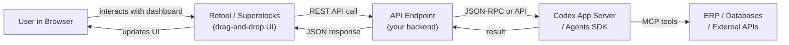

# Codex Through the Glass: Retool and Superblocks as a Codex Interface

*Series: Codex Through the Glass — Interface Patterns for Non-Developer Users (Part 6 of 8)*

---

If ChatKit gives you a chat window and Codex Sites gives you a generated dashboard, Retool and Superblocks give you a visual builder where you control every pixel, every data source, and every interaction — while still connecting to Codex underneath.

These low-code platforms sit in a sweet spot: more flexible than any of the messaging or embeddable options, but far less effort than building a custom React application. For organisations that need enterprise-grade internal tools with full control over layout and data flow, this is the most powerful interface pattern.

## The Architecture

The low-code platform handles the frontend. Your backend handles the agent integration. The two communicate via REST APIs — which is how Retool and Superblocks connect to everything.

## What Low-Code Platforms Provide

Both Retool and Superblocks offer:

- **Drag-and-drop UI builder** — tables, forms, charts, buttons, modals, tabs
- **Data source connectors** — PostgreSQL, MySQL, REST APIs, GraphQL, S3, Google Sheets
- **JavaScript transformers** — custom logic between data source and UI
- **Workflows** — server-side logic for complex multi-step operations
- **Role-based access control** — who can see what, who can approve what
- **Audit logging** — every action tracked for compliance
- **Self-hosted option** — on-premises deployment for regulated industries

The critical advantage: you can build a UI that shows agent results alongside live data from the ERP, contract database, and other systems — all in a single dashboard.

## Invoice Matching Example

A Retool dashboard for invoice matching:

**Top bar:** Date range picker, supplier filter, status filter (All / Matched / Flagged / Exception)

**Main table:** Invoice list with columns for invoice number, supplier, amount, PO, status, confidence score, and agent notes. Each row has action buttons: Approve, Reject, Investigate.

**Side panel (on row click):** Full invoice detail — line items, PO comparison, contract terms, agent reasoning. Includes an embedded chat widget (ChatKit) for asking the agent follow-up questions about the specific invoice.

**Bottom charts:** Match rate over time, exception categories breakdown, average processing time, cost per invoice.

The "Match New Invoices" button triggers a Retool Workflow that:
1. Calls your backend API
2. Backend submits the task to the Codex app-server
3. Agent processes invoices via MCP tools
4. Results are written to a PostgreSQL database
5. Retool table auto-refreshes with new results

## Build Complexity

| Component | Effort | Notes |
|---|---|---|
| Retool/Superblocks setup | 0.5 day | Sign up, connect data sources, familiarise with builder. |
| Dashboard layout | 2–3 days | Tables, charts, filters, detail panels. Drag-and-drop. |
| Backend API | 1–2 days | REST endpoints that bridge to Codex app-server or Agents SDK. |
| Workflows | 1 day | Server-side logic for batch processing and approval chains. |
| Data connectors | 1 day | Connect to ERP, databases, and agent results store. |
| RBAC and audit | 0.5 day | Configure roles, permissions, and audit logging. |
| **Total MVP** | **6–9 days** | Most effort of any option, but most flexible result |

**Build complexity rating: 3/5** — Moderate. The low-code platform handles UI complexity, but you need backend API work and data modelling. The result is a production-grade internal tool.

## When to Choose Retool/Superblocks

**Choose low-code platforms when:**
- You need a rich dashboard with tables, charts, and forms
- Multiple data sources need to be combined in one view
- Role-based access control and audit logging are required
- You want to iterate on the UI without redeploying code
- The tool will be used by a large team (50+ users)
- Self-hosted deployment is required for compliance

**Do not choose low-code platforms when:**
- Conversational interaction is the primary use case (use ChatKit or messaging)
- The team is small enough that a spreadsheet suffices
- Budget is very constrained (Retool and Superblocks have per-user pricing)
- You need a public-facing application (these are internal tool platforms)

## Key Considerations

**Pricing.** Retool charges per user per month (free tier for small teams, paid tiers from USD 10/user/month). Superblocks has similar pricing. Factor this into the total cost of the Codex-powered workflow.

**Vendor choice.** Retool is the established leader with the largest community. Superblocks differentiates on performance and developer experience. Both support the same integration patterns for Codex.

**Hybrid pattern.** The most powerful pattern combines Retool's dashboard with ChatKit's conversation widget. The dashboard shows structured data (tables, charts). The embedded ChatKit widget allows natural language interaction with the agent. This gives users both views into the same underlying Codex agent.

**Workflows vs app-server.** Retool Workflows (server-side logic) can replace some of the middleware you would otherwise build. The workflow can call the OpenAI API directly, process results, and write to databases — reducing the amount of custom backend code.

---

*Next in the series: [Email as a Codex Interface](/articles/2026-06-12-codex-through-the-glass-email-as-a-codex-interface/) — the async pattern for users who do not want another tool.*
