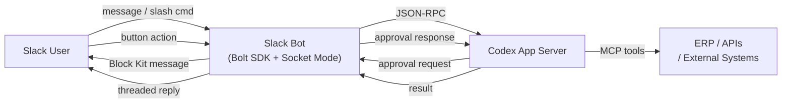

# Codex Through the Glass: Slack as a Codex Interface

*Series: Codex Through the Glass — Interface Patterns for Non-Developer Users (Part 2 of 8)*

---

If Teams is where enterprises live, Slack is where startups, scale-ups, and developer-adjacent teams live. Slack's Bolt SDK, Socket Mode, and Block Kit provide a mature platform for building AI agent interfaces — and unlike Teams, Slack's ecosystem has a head start in agent integration, with official OpenAI Agents SDK examples already published.

This article shows how to wire Slack to the Codex app-server using the Bolt SDK, giving non-developer users a channel-based interface to Codex-powered workflows.

## The Architecture



The pattern is nearly identical to the Teams architecture. The differences are in the SDK, the UI primitives, and the deployment model.

## Slack-Specific Advantages

### Socket Mode — No Public Endpoint

Socket Mode connects your bot to Slack via a WebSocket, eliminating the need for a public HTTPS endpoint. Your harness runs behind a firewall, connects outbound to Slack's servers, and receives events over the socket. This is ideal for prototyping and internal deployments where exposing a public URL is undesirable or requires security review.

```javascript
const { App } = require('@slack/bolt');

const app = new App({
  token: process.env.SLACK_BOT_TOKEN,
  appToken: process.env.SLACK_APP_TOKEN,
  socketMode: true,
});
```

### Threaded Conversations = Threaded Agents

Slack threads map naturally to Codex threads. When a user starts a conversation with the bot in a channel, the bot replies in a thread. All subsequent messages in that thread route to the same Codex thread, preserving full conversational context.

```javascript
app.message(async ({ message, say }) => {
  const threadTs = message.thread_ts || message.ts;
  const codexThreadId = await getOrCreateThread(threadTs);

  // Submit to Codex app-server
  const result = await submitTurn(codexThreadId, message.text);

  await say({
    text: result.summary,
    thread_ts: threadTs,
    blocks: formatAsBlockKit(result),
  });
});
```

### Block Kit for Approvals

Block Kit is Slack's equivalent of Adaptive Cards — structured UI components rendered natively in the Slack client. Approval workflows use interactive buttons:

```javascript
// When Codex app-server sends approval/commandExecution
const approvalMessage = {
  thread_ts: threadTs,
  blocks: [
    {
      type: "section",
      text: {
        type: "mrkdwn",
        text: "*Agent Approval Required*\nThe invoice matching agent wants to post a journal entry:"
      }
    },
    {
      type: "section",
      fields: [
        { type: "mrkdwn", text: "*Supplier:*\n4417 — Acme Components" },
        { type: "mrkdwn", text: "*Amount:*\nGBP 12,450.00" },
        { type: "mrkdwn", text: "*PO Match:*\nPO-2026-8831 (exact)" },
        { type: "mrkdwn", text: "*Confidence:*\n98.7%" },
      ]
    },
    {
      type: "actions",
      elements: [
        { type: "button", text: { type: "plain_text", text: "Approve" }, style: "primary", action_id: "approve_action" },
        { type: "button", text: { type: "plain_text", text: "Reject" }, style: "danger", action_id: "deny_action" },
      ]
    }
  ]
};
```

### Slash Commands for Structured Input

Slack slash commands provide a clean entry point for structured agent tasks:

- `/invoice match` — trigger invoice matching for today's inbox
- `/invoice status INV-2026-4417-0089` — check status of a specific invoice
- `/invoice report weekly` — generate a weekly matching summary

Each command maps to a specific Codex skill or prompt template, reducing ambiguity and improving agent reliability.

## Invoice Matching Example

An accounts payable team member in Slack types:

> `/invoice match --supplier acme --today`

The bot:
1. Acknowledges in-thread: "Matching today's Acme invoices..."
2. Submits the task to Codex app-server via `turn/start`
3. Streams progress updates as threaded messages (every 10 seconds, batched from `item/agentMessage/delta`)
4. Posts a Block Kit summary: 2 matched, 1 flagged
5. The flagged invoice appears as an interactive Block Kit message with Approve/Reject buttons
6. User taps Approve → bot sends `approval/*/approve` → agent posts journal entry
7. Final confirmation posted in thread

## Build Complexity

| Component | Effort | Notes |
|---|---|---|
| Slack app + Bolt SDK | 0.5–1 day | `@slack/bolt` npm package. Socket Mode needs no public URL. |
| Codex app-server integration | 2–3 days | Same JSON-RPC client as the Teams version. |
| Block Kit templates | 1 day | Approval messages, result summaries. Use Block Kit Builder. |
| Slash commands | 0.5 day | Register in Slack app config. Route to Codex skills. |
| MCP tool servers | Variable | Same as any Codex integration. |
| Authentication | 0.5 day | Slack OAuth for workspace install. Codex API key. |
| **Total MVP** | **4–6 days** | Slightly faster than Teams due to simpler auth and Socket Mode |

**Build complexity rating: 2/5** — Low-moderate. Bolt SDK is well-documented and Socket Mode eliminates infrastructure complexity. The Codex integration is the same regardless of platform.

## When to Choose Slack

**Choose Slack when:**
- Your team already uses Slack as primary communication
- You want rapid prototyping (Socket Mode = no public URL needed)
- Developer and developer-adjacent teams are the primary users
- You want threaded conversations with natural context
- Slash commands suit structured task input

**Do not choose Slack when:**
- Your organisation is on Microsoft 365 (use Teams instead)
- You need rich form inputs beyond what Block Kit supports
- You need offline or async workflows (Slack expects real-time)
- Compliance requires Microsoft ecosystem integration

## Key Considerations

**Thread limitations.** Slack threads can become unwieldy with many messages. Batch agent progress updates rather than streaming every delta. Post a single summary card at completion.

**Block Kit constraints.** Block Kit supports text, images, buttons, selects, date pickers, and overflow menus — but not arbitrary HTML or complex layouts. For detailed reports, post a summary with a link to a full document.

**Rate limits.** Slack allows roughly 1 message per second per channel. Use `chat.update` to modify an existing message rather than posting new ones for progress updates.

**Workspace installation.** Slack bots are installed per-workspace. For multi-workspace deployments, use Slack's OAuth flow and store tokens per workspace.

---

*Next in the series: [Google Sheets as a Codex Interface](/articles/2026-06-12-codex-through-the-glass-google-sheets-as-a-codex-interface/) — the spreadsheet-native pattern where every row is a task and every cell is an output.*
