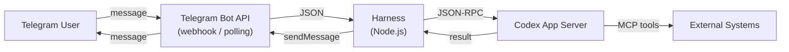
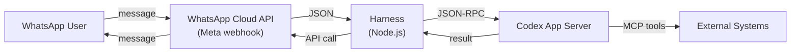

# Codex Through the Glass: WhatsApp and Telegram as a Codex Interface

*Series: Codex Through the Glass — Interface Patterns for Non-Developer Users (Part 8 of 8)*

---

Two billion people use WhatsApp. Seven hundred million use Telegram. In many markets — India, Brazil, Indonesia, much of Africa and the Middle East — these are not messaging apps. They are the internet.

For organisations with field workers, distributed teams, or users who operate primarily from a phone, WhatsApp and Telegram provide the most accessible interface to a Codex-powered agent. The NanoClaw project — a persistent AI orchestration platform — has been running this pattern with Telegram since early 2026, proving it works in production.

## The Architecture

### Telegram

Telegram's Bot API is straightforward: register a bot with BotFather, receive a token, and either poll for updates or register a webhook. The harness receives message objects, extracts text and attachments, submits to Codex, and sends results back.

NanoClaw's implementation demonstrates the production pattern: a ~500-line Node.js orchestrator with SQLite state management, container isolation for each agent session, and a task scheduler for cron-based operations. Telegram is the primary messaging channel, handling everything from scheduled morning briefings to interactive research sessions.

### WhatsApp

WhatsApp uses Meta's Cloud API. The key difference from Telegram: WhatsApp requires business verification, has stricter content policies, and charges per conversation for template (outbound) messages. Support replies within a 24-hour window are free.

As of 2026, WhatsApp mandates that AI bots perform concrete business tasks — open-ended chatbots are no longer permitted. This aligns well with the Codex pattern: the agent performs a specific job (invoice matching), not open-ended chat.

## What Both Platforms Provide

| Feature | Telegram | WhatsApp |
|---|---|---|
| Text messages | Yes | Yes |
| Photo/document attachments | Yes | Yes |
| Inline buttons | Yes (InlineKeyboardMarkup) | Yes (Interactive messages) |
| Location sharing | Yes | Yes |
| Voice messages | Yes | Yes |
| Group chats | Yes | Yes (up to 1024 members) |
| Threading | Reply-to-message | Reply-to-message |
| Bot API cost | Free | Free (Cloud API), per-message for templates |
| Business verification | Not required | Required |
| End-to-end encryption | Optional (Secret Chats) | Default |

Both support inline buttons for approvals — Telegram via InlineKeyboardMarkup, WhatsApp via interactive message templates. This gives you the same approve/reject pattern as Teams Adaptive Cards, rendered natively in the mobile app.

## Invoice Matching Example

A warehouse manager in a distribution centre receives a delivery. They photograph the delivery note with their phone and send it to the company's WhatsApp bot:

> *[Photo of delivery note]*
> "Check this delivery against the PO"

The agent:
1. Receives the image via WhatsApp Cloud API
2. Extracts data from the delivery note using OCR/LLM
3. Matches quantities against the purchase order in the ERP
4. Replies via WhatsApp: "Delivery matches PO-8831. 3 line items verified. Quantities: 100/100, 248/250 (within tolerance), 50/50."
5. Sends an interactive message: "Confirm goods receipt? [Yes] [No] [Report Damage]"
6. Warehouse manager taps "Yes"
7. Agent posts the goods receipt to the ERP

The finance team's invoice matching agent can now use this confirmed goods receipt for three-way matching — PO, goods receipt, invoice — all triggered by a WhatsApp photo.

## Build Complexity

| Component | Effort | Notes |
|---|---|---|
| Bot registration | 0.5 day | Telegram: BotFather. WhatsApp: Meta Business verification (can take days). |
| Harness | 2–3 days | Webhook handler, message parsing, attachment processing. |
| Codex integration | 1–2 days | Same JSON-RPC or API bridge as other patterns. |
| Inline buttons / interactive messages | 1 day | Approval buttons, menu options, quick replies. |
| MCP tool servers | Variable | Same as other patterns. |
| **Total MVP** | **4–6 days (Telegram)** / **5–8 days (WhatsApp)** | WhatsApp longer due to business verification |

**Build complexity rating: 2/5 (Telegram)** — Low-moderate. Simple API, no business verification, free.
**Build complexity rating: 3/5 (WhatsApp)** — Moderate. Business verification adds process overhead. Content policies restrict what the bot can do.

## When to Choose Mobile Messaging

**Choose Telegram when:**
- You are building a personal or small-team agent (like NanoClaw)
- Rapid prototyping — Telegram has the simplest bot API
- Users are tech-comfortable (developers, power users)
- You want group chat support for team interactions
- No business verification process is acceptable

**Choose WhatsApp when:**
- Users are in markets where WhatsApp dominates (India, Brazil, LATAM, EMEA)
- Field workers need mobile-first access
- End-to-end encryption is required
- The use case is a concrete business task (matching WhatsApp's policy)
- External parties (suppliers, customers) need to interact with the agent

**Do not choose either when:**
- Users need rich dashboards or data visualisation
- Complex form inputs are required
- Enterprise compliance requires a managed platform (use Teams)
- The workflow is primarily desktop-based

## Key Considerations

**Message formatting.** Both platforms support basic formatting (bold, italic, code blocks) but not rich HTML or structured layouts. Keep agent responses concise. For detailed outputs, send a summary message with a link to a web dashboard.

**File size limits.** Telegram: 50 MB for bot uploads. WhatsApp: 100 MB for documents, 16 MB for images. Sufficient for invoices and delivery notes but not for large data exports.

**WhatsApp 24-hour window.** After the last user message, you have 24 hours to send free-form replies. After that, you can only send pre-approved template messages (which cost money). Design workflows so the agent completes its response within the window.

**The NanoClaw precedent.** NanoClaw has been running the Telegram pattern in production since early 2026 — scheduled tasks, interactive research, daily briefings, article generation, and accountability check-ins — all through a Telegram interface. The pattern is proven. The Codex app-server or Agents SDK simply replaces the Claude Agent SDK as the engine.

---

## Series Summary

Eight interfaces, one agent engine. The choice depends on where your users already are:

| Interface | Best For | Build Complexity | Users |
|---|---|---|---|
| **Teams** | Enterprise approval workflows | 3/5 | Microsoft 365 orgs |
| **Slack** | Developer-adjacent teams | 2/5 | Slack workspaces |
| **Google Sheets** | Tabular data processing | 2/5 | Finance, ops teams |
| **ChatKit** | Branded chat experience | 1/5 | Any web user |
| **Codex Sites** | Zero-code dashboards | 1/5 | Internal teams (Biz/Ent) |
| **Retool/Superblocks** | Enterprise dashboards | 3/5 | Large teams, regulated |
| **Email** | Async workflows, suppliers | 3/5 | Everyone |
| **WhatsApp/Telegram** | Mobile-first, field workers | 2–3/5 | Global, distributed |

The agent is not the product. The interface is the product. Choose the glass your users already look through.
