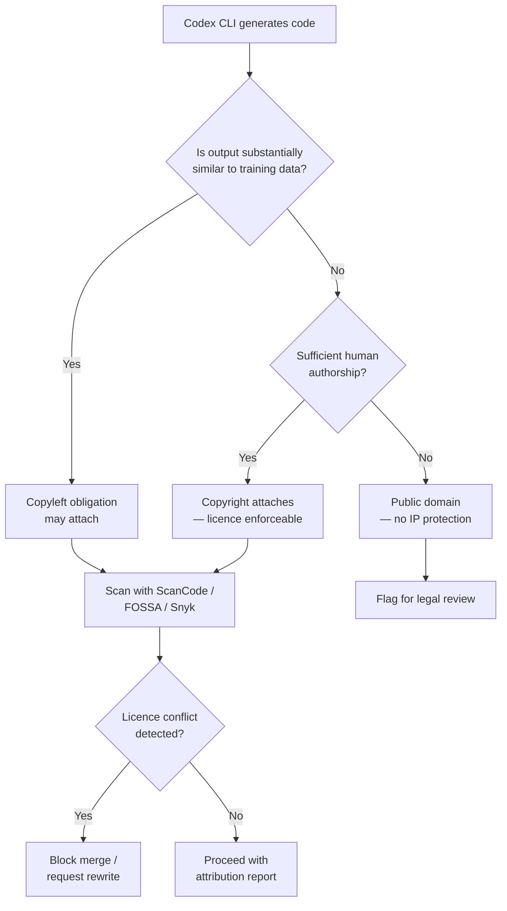
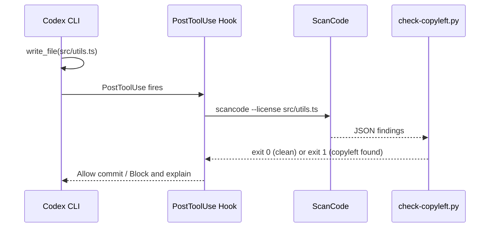

# Agent-Generated Code and Open Source Licence Compliance


---

The Black Duck 2026 Open Source Security and Risk Analysis (OSSRA) report found that 68 per cent of the 947 commercial codebases it audited contained licence conflicts — the largest single-year jump in the study's eleven-year history [^1]. The primary driver: AI coding assistants generating snippets derived from copyleft-licensed repositories without retaining licence metadata. Black Duck calls the phenomenon **licence laundering** — and every team running Codex CLI is exposed to it [^1].

This article maps the compliance surface, reviews the tooling you can wire into Codex CLI today, and outlines the AGENTS.md and hook configurations that turn licence scanning from afterthought into guardrail.

## The Compliance Problem, Stated Precisely

When Codex CLI generates code, three licence risks arise simultaneously:

1. **Reproduction risk** — the model may emit a function that is substantially similar to a GPL- or AGPL-licensed original, creating a copyleft obligation the developer never agreed to [^2].
2. **Attribution risk** — even permissive licences (MIT, BSD, Apache-2.0) require attribution. AI-generated code arrives without provenance metadata, so attribution obligations are silently dropped [^3].
3. **Copyright void risk** — the US Copyright Office and the Supreme Court's March 2026 denial of certiorari in *Thaler v. Perlmutter* confirm that AI-generated output lacking human authorship is ineligible for copyright protection [^4]. Code you cannot copyright is code you cannot enforce a licence on — competitors can copy it freely.



## The Governance Gap

Black Duck's report reveals a telling asymmetry: 76 per cent of surveyed organisations check AI-generated code for security vulnerabilities, but only 54 per cent evaluate it for intellectual property and licence risks [^1]. The tooling exists; the governance does not.

For Codex CLI teams, the gap is structural. Codex operates inside a sandbox, generates code, and commits it — often without a human ever reading the diff in detail. Unless licence scanning is embedded in the agent's own workflow, it happens too late or not at all.

## Tooling: Three Scanners, One MCP Pattern

Three mature licence scanners integrate cleanly with Codex CLI's MCP and hook architecture.

### ScanCode Toolkit

ScanCode is the open-source heavyweight — it detects licences, copyrights, and package manifests across codebases and is maintained by the AboutCode project [^5]. It runs locally, produces JSON output, and requires no SaaS account.

```bash
# Install ScanCode
pip install scancode-toolkit

# Scan a directory for licences
scancode --license --copyright --json-pp scan-results.json ./src/
```

ScanCode's strength is snippet-level detection: it can identify a 15-line function that matches a GPL-licensed original, even when variable names have been changed. This is precisely the failure mode that AI-generated code creates.

### FOSSA CLI

FOSSA provides dependency-level and snippet-level licence analysis with a SaaS backend. Its CLI achieves 99.8 per cent licence scanning accuracy across 17 languages and 20 build systems [^6]. The free tier covers open-source projects; enterprise plans add policy enforcement and SBOM generation.

```bash
# Install FOSSA CLI
curl -H 'Cache-Control: no-cache' \
  https://raw.githubusercontent.com/fossas/fossa-cli/master/install-latest.sh | bash

# Analyse the current project
fossa analyze

# Check licence policy compliance
fossa test
```

### Snyk Open Source

Snyk's MCP server integrates directly with Codex CLI, enabling in-session scanning of both dependencies and generated code [^7]. The licence compliance module is available on Team and Enterprise plans and supports policy-based blocking of specific licence families.

```toml
# ~/.codex/config.toml — add Snyk MCP server
[mcp_servers.snyk]
command = "npx"
args = ["@snyk/mcp-server"]
env = { SNYK_TOKEN = "your-token-here" }
```

Once registered, Codex can invoke Snyk scanning mid-session — for example, after generating a new module but before committing it.

## AGENTS.md: Encoding Licence Constraints

The AGENTS.md specification — now adopted by over 60,000 open-source repositories and governed by the Agentic AI Foundation under the Linux Foundation [^8] — supports a three-tier boundary model: **Always do**, **Ask first**, and **Never do**. Licence constraints belong in all three tiers.

```markdown
<!-- AGENTS.md excerpt -->
## Boundaries

### Always do
- Include SPDX licence headers in every new source file
- Run `fossa test` before committing generated code
- Preserve existing copyright notices in modified files

### Ask first
- Adding dependencies with AGPL, SSPL, or EUPL licences
- Generating code that reproduces algorithms from external repositories

### Never do
- Remove or modify existing licence headers
- Introduce GPL-licensed code into MIT/Apache-licensed modules
- Commit code without a passing licence scan
```

The 32 KiB cap on Codex CLI's AGENTS.md processing means licence rules must be concise [^8]. Avoid pasting full licence texts; reference SPDX identifiers instead.

## PostToolUse Hooks: Automated Scanning on Every Generation

Codex CLI's hook system allows you to run arbitrary commands after tool invocations. A `PostToolUse` hook that triggers ScanCode on every file write creates a hard compliance gate:

```toml
# ~/.codex/config.toml
[[hooks]]
event = "PostToolUse"
tool = "write_file"
command = "scancode --license --only-findings --json /tmp/licence-check.json ${FILE_PATH} && python3 /opt/scripts/check-copyleft.py /tmp/licence-check.json"
blocking = true
```

The `blocking = true` flag ensures Codex cannot proceed if the scan detects a copyleft match. The companion script (`check-copyleft.py`) parses ScanCode's JSON output, exits non-zero on GPL/AGPL/LGPL findings, and prints a human-readable explanation that Codex can use to rewrite the offending code.



## CI Pipeline Integration

Hooks catch problems during development; CI catches everything else. A minimal GitHub Actions workflow:


```yaml
name: Licence Compliance
on: [pull_request]

jobs:
  licence-scan:
    runs-on: ubuntu-latest
    steps:
      - uses: actions/checkout@v4
      - name: Run FOSSA analysis
        uses: fossas/fossa-action@main
        with:
          api-key: ${{ secrets.FOSSA_API_KEY }}
      - name: Check licence policy
        uses: fossas/fossa-action@main
        with:
          api-key: ${{ secrets.FOSSA_API_KEY }}
          run-tests: true
```


For teams using ScanCode without a SaaS dependency:

```bash
# CI script — fail on any copyleft finding in new/modified files
git diff --name-only origin/main...HEAD | \
  xargs scancode --license --only-findings --json-pp /tmp/scan.json && \
  jq -e '[.files[].licenses[] | select(.category == "Copyleft")] | length == 0' /tmp/scan.json
```

## The Legal Landscape: What You Cannot Ignore

### Doe v. GitHub (Ninth Circuit)

Discovery continues in the class action alleging that GitHub Copilot violates the DMCA by stripping licence notices from training data [^9]. The Ninth Circuit is currently deciding whether DMCA Section 1202(b) requires AI output to be *identical* to copyrighted material or merely *substantially similar*. A ruling favouring "substantially similar" would expose every AI coding assistant to liability [^9].

### EU AI Act and the Copyright Directive

The EU AI Act requires providers of general-purpose AI models to publish summaries of copyrighted training data and comply with the Copyright Directive's opt-out mechanism [^10]. The General-Purpose AI Code of Practice, finalised in June 2026, mandates copyright policies, technical protective measures against infringing output, and explicit prohibitions in terms of service [^10]. Member states must transpose Directive (EU) 2024/2853 — the AI Liability Directive — into national law by December 2026 [^11].

### Practical Implication

If you ship a product substantially composed of AI-generated code, you likely cannot enforce copyright on it [^4]. Competitors can reproduce it without consequence. The defence is human authorship: review, modify, and document your contributions to every file.

## A Five-Step Compliance Checklist

1. **Add licence constraints to AGENTS.md** — SPDX headers, forbidden licence families, mandatory scan commands.
2. **Wire a PostToolUse hook** — ScanCode or FOSSA on every `write_file`, blocking on copyleft findings.
3. **Register Snyk's MCP server** — enables Codex to scan dependencies mid-session without leaving the terminal.
4. **Add CI gates** — FOSSA or ScanCode in your pull request workflow, failing on policy violations.
5. **Generate attribution reports** — `fossa report attribution` or ScanCode's `--copyright` flag, committed alongside releases.

## Conclusion

The licence compliance problem is not theoretical. Two-thirds of commercial codebases already contain conflicts, the case law is actively evolving, and the EU is legislating hard deadlines. Codex CLI's MCP, AGENTS.md, and hook architecture give you the integration points to embed scanning into the agent's own workflow — but only if you configure them. The default is unscanned code with unknown provenance. The alternative is five files and a CI job.

---

## Citations

[^1]: Black Duck, "2026 Open Source Security and Risk Analysis Report," February 2026. [https://www.blackduck.com/resources/analyst-reports/open-source-security-risk-analysis.html](https://www.blackduck.com/resources/analyst-reports/open-source-security-risk-analysis.html)

[^2]: DEV Community, "AI License Laundering: How Code Generators Strip Open Source Obligations," 2026. [https://dev.to/pickuma/ai-license-laundering-how-code-generators-strip-open-source-obligations-2i0m](https://dev.to/pickuma/ai-license-laundering-how-code-generators-strip-open-source-obligations-2i0m)

[^3]: Sesame Disk, "AI and Open Source License Compliance in 2026: Myths and Realities." [https://sesamedisk.com/ai-open-source-license-compliance-2026/](https://sesamedisk.com/ai-open-source-license-compliance-2026/)

[^4]: Norton Rose Fulbright, "AI in Litigation Series: An Update on AI Copyright Cases in 2026," March 2026. [https://www.nortonrosefulbright.com/en/knowledge/publications/ce8eaa5f/ai-in-litigation-series-an-update-on-ai-copyright-cases-in-2026](https://www.nortonrosefulbright.com/en/knowledge/publications/ce8eaa5f/ai-in-litigation-series-an-update-on-ai-copyright-cases-in-2026)

[^5]: AboutCode / ScanCode Toolkit, GitHub repository. [https://github.com/aboutcode-org/scancode-toolkit](https://github.com/aboutcode-org/scancode-toolkit)

[^6]: FOSSA, "Open Source License Compliance." [https://fossa.com/solutions/oss-license-compliance/](https://fossa.com/solutions/oss-license-compliance/)

[^7]: Snyk, "Developer Guardrails for Agentic Workflows — Codex CLI Guide." [https://docs.snyk.io/integrations/developer-guardrails-for-agentic-workflows](https://docs.snyk.io/integrations/developer-guardrails-for-agentic-workflows)

[^8]: Augment Code, "How to Build Your AGENTS.md (2026)." [https://www.augmentcode.com/guides/how-to-build-agents-md](https://www.augmentcode.com/guides/how-to-build-agents-md)

[^9]: AI Copyright Digest, "GitHub Copilot Class Action (Doe v. GitHub)." [https://kb3k.github.io/ai-copyright-digest/cases/github-copilot-class-action-(doe-v-github).html](https://kb3k.github.io/ai-copyright-digest/cases/github-copilot-class-action-(doe-v-github).html)

[^10]: EU AI Act, "Overview of the Code of Practice for General-Purpose AI." [https://artificialintelligenceact.eu/code-of-practice-overview/](https://artificialintelligenceact.eu/code-of-practice-overview/)

[^11]: BuildMVPFast, "AI Generated Code Liability: Copyright Risk, EU Directive & Startup Legal Guide 2026." [https://www.buildmvpfast.com/blog/ai-generated-code-liability-legal-risk-copyright-2026](https://www.buildmvpfast.com/blog/ai-generated-code-liability-legal-risk-copyright-2026)
