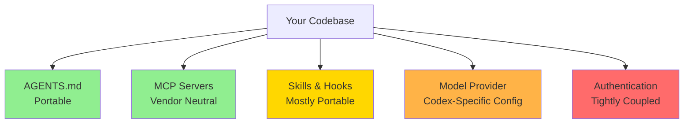

# Anthropic Overtakes OpenAI in Business Adoption: What the Ramp AI Index Means for Codex CLI Platform Strategy


---

## The Crossover Nobody Expected This Soon

For the first time since the generative AI race began, more American businesses are paying for Anthropic's Claude than for OpenAI's ChatGPT. The May 2026 Ramp AI Index — drawn from spending data across more than 50,000 US businesses — shows Anthropic at 34.4% adoption versus OpenAI at 32.3%[^1]. Anthropic climbed from 0.03% in June 2023 to this position in under three years[^2]. Claude Code alone now generates over \$2.5 billion in annualised revenue and accounts for roughly 4% of all public GitHub commits[^3][^4].

This is not an abstract market-share statistic. If you run Codex CLI as your primary coding agent, the platform beneath your workflows just lost its market-share lead. That does not mean you should panic — but it does mean you should think carefully about platform risk, provider optionality, and where your configuration surface creates hard dependencies.

## Reading the Data Carefully

The Ramp numbers measure breadth of adoption: what proportion of businesses have at least one transaction with each vendor. They do not measure depth. IDC's March 2026 FERS Survey tells a different story: 42% of enterprises use OpenAI products versus just 19% using Claude extensively[^5]. Menlo Ventures' December 2025 report placed Anthropic at 40% of enterprise LLM spend, up from 12% in 2023[^6].

The picture that emerges is nuanced:

- **Breadth**: Anthropic leads in the number of businesses paying for AI tools
- **Depth**: OpenAI retains a commanding lead in extensive enterprise use
- **Developer tools**: Claude Code's 4% GitHub commit share is growing rapidly — SemiAnalysis projects 20% by year-end[^3]

For Codex CLI practitioners, the relevant question is not "who is winning" but "what happens to my workflows if the competitive balance shifts further?"

## Where Codex CLI Creates Provider Dependencies

Codex CLI's architecture creates dependencies at four layers. Understanding them is the first step toward a sound diversification strategy.

### Layer 1: Model Provider

Codex CLI defaults to GPT-5.5 but supports alternative providers through configuration:

```toml
# ~/.codex/config.toml — default provider
model = "gpt-5.5"

# Profile for Claude via LiteLLM proxy
[profiles.claude]
model = "litellm/claude-fable-5"
model_provider = "openai-compatible"
model_provider_base_url = "http://localhost:4000/v1"
```

Since v0.124, Codex CLI also supports Amazon Bedrock as a native provider[^7], and since the Microsoft–OpenAI exclusivity clause was dropped on 27 April 2026[^8], multi-cloud model access has become straightforward.

### Layer 2: Authentication

The ChatGPT sign-in path creates the tightest coupling — your billing, rate limits, and model access all flow through OpenAI's consumer infrastructure. The API key path is looser: you can route through proxies, gateways, or alternative providers. Enterprise access tokens (v0.138) add a third option[^9].

### Layer 3: AGENTS.md and Configuration

Your AGENTS.md files, skills, hooks, and profiles are largely model-agnostic. This is Codex CLI's strongest portability advantage. Claude Code reads AGENTS.md as a fallback when no CLAUDE.md exists[^10], meaning your project instructions transfer across tools with minimal friction.

### Layer 4: MCP Servers and Plugins

MCP is an open protocol. Any MCP server you configure for Codex CLI works identically with Claude Code, Cursor, Windsurf, and other MCP-compatible agents[^11]. This layer is vendor-neutral by design.



## The Five-Point Platform Hedging Checklist

### 1. Audit Your Hard Dependencies

Run `codex doctor --json` and review the output for provider-specific assumptions. Then audit your configuration:

```bash
# Find all model-specific references in your config
grep -r 'model.*=' ~/.codex/config.toml .codex/config.toml
grep -r 'gpt-5\|o3\|o4-mini' .agents/ AGENTS.md
```

Any model name hardcoded in AGENTS.md or skills is a hard dependency. Replace with capability descriptions where possible:

```markdown
<!-- Before: hard dependency -->
Use gpt-5.5 for all code generation tasks.

<!-- After: capability description -->
Use the most capable available model for code generation.
Model selection is handled by profile configuration.
```

### 2. Configure Multi-Provider Profiles

Create named profiles that route to different providers. This lets you switch with a single flag:

```toml
# ~/.codex/config.toml

[profiles.openai]
model = "gpt-5.5"

[profiles.bedrock]
model = "gpt-5.5"
model_provider = "amazon-bedrock"

[profiles.claude-proxy]
model = "litellm/claude-fable-5"
model_provider = "openai-compatible"
model_provider_base_url = "http://localhost:4000/v1"
model_reasoning_effort = "high"

[profiles.openrouter]
model = "openrouter/anthropic/claude-fable-5"
model_provider = "openai-compatible"
model_provider_base_url = "https://openrouter.ai/api/v1"
```

Use them with:

```bash
codex --profile claude-proxy "Refactor the auth module"
codex exec --profile bedrock "Generate test coverage report"
```

### 3. Keep Your MCP Investment Portable

Every MCP server you add to your stack is a portable investment. The same `codex mcp add` configuration works identically if you later switch to Claude Code or another MCP-compatible agent:

```toml
# .codex/config.toml — MCP servers are protocol-level, not vendor-level
[mcp_servers.github]
command = "gh"
args = ["copilot", "mcp"]

[mcp_servers.context7]
command = "npx"
args = ["-y", "@context7/mcp-server"]
```

Avoid vendor-specific MCP servers that exist only in one ecosystem's plugin marketplace. Prefer open-source, self-hosted MCP servers with published schemas.

### 4. Version-Control Everything Except Credentials

Your `.codex/` directory, AGENTS.md hierarchy, skills, and hook scripts should all live in version control. This is your portability insurance:

```
.codex/
├── config.toml          # Profiles, MCP servers, hook config
├── skills/
│   ├── code-review/
│   │   └── SKILL.md     # Portable across agents
│   └── db-migration/
│       └── SKILL.md
AGENTS.md                # Read by Codex CLI and Claude Code
```

If you need to migrate to a different agent tomorrow, your configuration surface comes with you.

### 5. Run Periodic Cross-Agent Smoke Tests

The most rigorous hedge is empirical. Run the same task through multiple agents periodically and compare results:

```bash
# Cross-agent comparison script
PROMPT="Review src/auth.ts for security issues. Output JSON with findings."

# Codex CLI with GPT-5.5
codex exec --profile openai --output-schema review-schema.json "$PROMPT" \
  > results/openai.json

# Codex CLI with Claude via proxy
codex exec --profile claude-proxy --output-schema review-schema.json "$PROMPT" \
  > results/claude.json

# Diff the results
jq -s '.[0].findings as $a | .[1].findings as $b |
  {openai_only: ($a - $b), claude_only: ($b - $a), shared: ($a & $b)}' \
  results/openai.json results/claude.json
```

This gives you concrete data about where models diverge, helping you make informed switching decisions rather than reacting to benchmark headlines.

## The Bedrock Factor

OpenAI's general availability on Amazon Bedrock since 1 June 2026[^12] fundamentally changes the lock-in calculus. AWS-anchored teams can now run Codex CLI against GPT-5.5 through Bedrock, billing against existing cloud commitments, with all data processed within AWS infrastructure:

```toml
[profiles.bedrock-production]
model = "gpt-5.5"
model_provider = "amazon-bedrock"
# Authenticates via AWS IAM — no OPENAI_API_KEY needed
```

This means your Codex CLI workflows can run on AWS infrastructure today, and if Anthropic's models become available on Bedrock (⚠️ unconfirmed as of June 2026), you could switch model providers without changing your deployment architecture.

## What This Does Not Mean

The Ramp crossover does not mean:

- **Codex CLI is at risk of discontinuation.** OpenAI has over 2 million weekly active Codex CLI users[^13] and is actively investing in the platform with rapid release cadence (four stable releases in June alone).
- **You should switch to Claude Code immediately.** Tool switching has real costs — relearning workflows, reconfiguring automation, retraining muscle memory. The operational overhead of migration often exceeds the marginal quality gain.
- **Claude models are universally better.** Claude Fable 5 leads SWE-bench Pro at 80.3%, but Codex CLI on GPT-5.5 leads Terminal-Bench 2.1 at 83.4%[^14]. Benchmark leadership depends on which benchmark you trust and which harness you use.

What it does mean is that platform concentration risk is real, market positions are not permanent, and engineering teams that build portable configuration surfaces today will have more options tomorrow.

## The Strategic Posture

The optimal Codex CLI platform strategy in June 2026 is not "abandon ship" nor "ignore the data". It is **deliberate optionality**:

1. **Primary workflow**: Continue using Codex CLI with GPT-5.5 — the harness is mature, the tooling is deep, and the model is competitive.
2. **Portable configuration**: Keep AGENTS.md, skills, and MCP servers vendor-neutral. They are your transferable investment.
3. **Multi-provider profiles**: Maintain at least one non-OpenAI profile (Bedrock, LiteLLM, or OpenRouter) and test it monthly.
4. **Watch the indicators**: Track the Ramp AI Index quarterly. If Anthropic's lead widens beyond 5 percentage points or OpenAI's release cadence slows materially, revisit the balance.
5. **Invest in MCP**: Every MCP server you add works across agents. Every vendor-specific plugin does not.

The businesses that thrive through platform transitions are not the ones that predict the winner correctly. They are the ones that build their workflows to survive being wrong.

## Citations

[^1]: [Ramp AI Index — May 2026](https://ramp.com/data/ai-index) — Anthropic at 34.4% vs OpenAI at 32.3% business adoption across 50,000+ US businesses.

[^2]: [Anthropic finally beat OpenAI in business AI adoption — VentureBeat](https://venturebeat.com/technology/anthropic-finally-beat-openai-in-business-ai-adoption-but-3-big-threats-could-erase-its-lead) — Growth from 0.03% in June 2023 to 34.4% by April 2026.

[^3]: [Claude Code is the Inflection Point — SemiAnalysis](https://newsletter.semianalysis.com/p/claude-code-is-the-inflection-point) — 4% of GitHub commits authored by Claude Code; 20% projected by year-end 2026.

[^4]: [Deedy Das on X — Anthropic at \$14B run rate](https://x.com/deedydas/status/2022028789321281930) — Claude Code at \$2.5B run rate, 4% of GitHub commits, \$1M+ customers 40x'd year-over-year.

[^5]: [IDC FERS Survey, March 2026 — via The Register](https://www.theregister.com/ai-and-ml/2026/06/11/claude-is-ready-for-its-corporate-close-up/5254565) — 42% of enterprises use OpenAI; only 19% use Claude extensively.

[^6]: [Menlo Ventures December 2025 Report — via MindStudio](https://www.mindstudio.ai/blog/anthropic-vs-openai-business-adoption-2026-ramp-data-2) — Anthropic at 40% of enterprise LLM spend, up from 12% in 2023.

[^7]: [Codex CLI Amazon Bedrock Provider — OpenAI Developers](https://developers.openai.com/codex/amazon-bedrock) — Native Bedrock provider support for Codex CLI, desktop app, and VS Code extension.

[^8]: [OpenAI models come to AWS via Amazon Bedrock — TechWyse](https://www.techwyse.com/news/ai-search/openai-models-codex-managed-agents-amazon-bedrock-aws) — Microsoft–OpenAI exclusivity clause dropped 27 April 2026.

[^9]: [Codex CLI v0.138 Release — OpenAI Developers](https://developers.openai.com/codex/changelog) — Enterprise access tokens and v2 personal access tokens added in v0.138.0.

[^10]: [AGENTS.md Cross-Tool Compatibility — OpenAI Developers](https://developers.openai.com/codex/concepts/customization) — Claude Code reads AGENTS.md as a fallback when no CLAUDE.md exists.

[^11]: [Model Context Protocol — OpenAI Developers](https://developers.openai.com/codex/mcp) — MCP is an open protocol; servers work across Codex CLI, Claude Code, Cursor, and other compatible agents.

[^12]: [OpenAI Frontier Models and Codex GA on Amazon Bedrock — AWS News Blog](https://aws.amazon.com/blogs/aws/get-started-with-openai-gpt-5-5-gpt-5-4-models-and-codex-on-amazon-bedrock/) — General availability since 1 June 2026.

[^13]: [OpenAI Codex (AI agent) — Wikipedia](https://en.wikipedia.org/wiki/OpenAI_Codex_(AI_agent)) — Over 2 million weekly active Codex CLI users as of March 2026.

[^14]: [Terminal-Bench 2.1 June 2026 — Codex Knowledge Base](https://codex.danielvaughan.com/2026/06/11/terminal-bench-2-1-june-2026-benchmark-landscape-codex-cli-harness-engineering-model-scores/) — Codex CLI on GPT-5.5 at 83.4%; Claude Fable 5 at 80.3% SWE-bench Pro.
