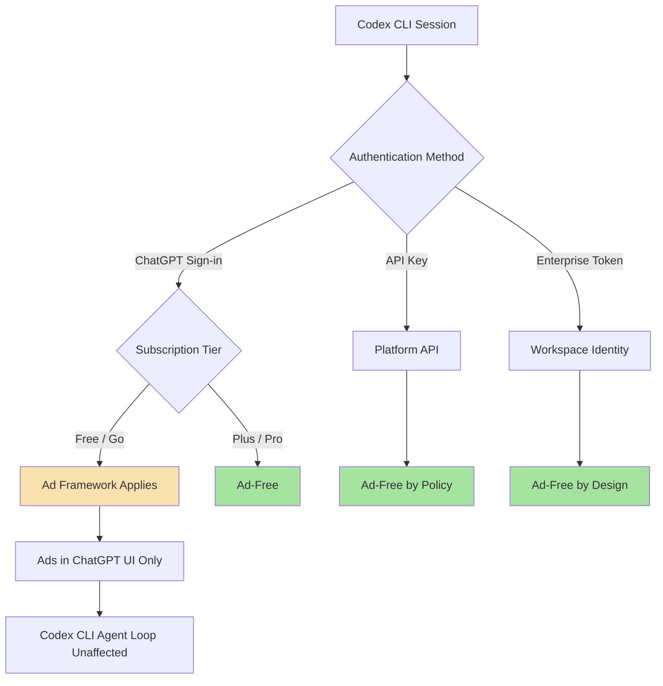
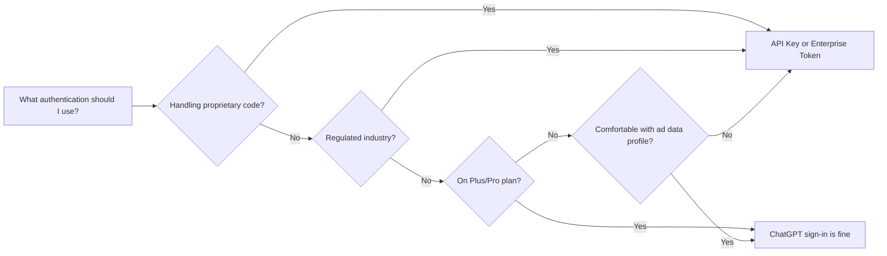

# ChatGPT Advertising Arrives: What Sponsored Recommendations Mean for Codex CLI Developer Trust and Ad-Free Agent Workflows


---

OpenAI began rolling out advertising inside ChatGPT on 9 February 2026 [^1]. By June, the LiveRamp conversion-measurement partnership added a second data layer, letting advertisers connect in-product ad exposure to real-world purchases [^2]. For the millions of developers who pipe every keystroke through Codex CLI, a question that once seemed hypothetical is now operational: does the tool I trust with my source code also serve ads — and if so, what data does that entail?

This article maps the advertising surface, explains which Codex CLI authentication paths are affected, dissects the April 2026 privacy policy changes, and provides the configuration patterns that guarantee ad-free agent workflows.

## The Advertising Surface: Sponsored Recommendations

ChatGPT ads are branded "Sponsored Recommendations" [^1]. They appear in a visually distinct, labelled box below the AI-generated answer — never inline within the response text [^3]. Targeting is contextual: ads are matched to the current conversation topic and, if chat history is enabled, to previous interactions [^3]. OpenAI states unambiguously that ads do not influence the answers ChatGPT produces [^4].

The initial rollout targeted consumer-facing queries — product recommendations, travel planning, app discovery. Developer and coding workflows are not a current advertising vertical, but the policy does not structurally exclude them. If you ask ChatGPT a question that happens to match an advertiser's category, you may see a sponsored result below the answer.

### Who Sees Ads, Who Does Not

| Plan | Monthly Cost | Ads Displayed | Ad Data Collection |
|------|:-----------:|:-------------:|:------------------:|
| Free | \$0 | Yes | Yes (opt-out available) |
| Go | \$8 | Yes | Yes (opt-out available) |
| Plus | \$20 | No | No |
| Pro | \$200 | No | No |
| Business | Per-seat | No | No |
| Enterprise | Per-seat | No | No |
| Edu | Per-seat | No | No |
| API (pay-as-you-go) | Usage-based | N/A | N/A |

Ads are restricted to Free and Go plan users [^4]. Every paid tier from Plus upwards is fully exempt. API usage operates under a separate privacy framework entirely [^5].

## How This Maps to Codex CLI Authentication

Codex CLI supports two primary authentication paths, plus a third enterprise path introduced in v0.138 [^6]:

1. **ChatGPT sign-in** — authenticates via your ChatGPT subscription. Your plan tier determines whether the broader ChatGPT platform applies advertising policies to your account.
2. **API key** — authenticates against the OpenAI Platform API. Billing is pay-per-token. The ChatGPT advertising and privacy framework does not apply [^5].
3. **Enterprise access token** — authenticates against a workspace-managed identity. Ads never apply [^7].



### The Critical Distinction

Even on the Free or Go plan with ChatGPT sign-in, Codex CLI's agent loop does not render sponsored recommendations. Ads appear in the ChatGPT web and mobile interfaces, not in the Responses API calls that power local CLI sessions [^8]. However, the privacy policy changes affect how OpenAI handles data associated with your account — regardless of which surface generated that data.

## The April 2026 Privacy Policy Update

On 30 April 2026, OpenAI updated its US privacy policy to formalise advertising data practices [^9]. Three changes matter for Codex CLI users:

### 1. Marketing Cookies and Device Identifiers

For Free and Go users, OpenAI now collects cookie IDs and device identifiers that may be shared with marketing partners for third-party ad targeting [^9]. These identifiers are tied to your ChatGPT account. If you authenticate Codex CLI with the same account, your device fingerprint is associated with a profile that includes advertising interactions — even though those interactions occurred in the ChatGPT web interface, not in the CLI.

### 2. Advertiser Conversion Data

The LiveRamp partnership enables advertisers to send hashed purchase data back to OpenAI to measure whether ad exposure led to conversions [^2]. OpenAI receives this data server-to-server; it is not surfaced to the user. The mechanism operates at the account level, meaning that a Free-tier account used for both ChatGPT browsing and Codex CLI sessions has a single data profile spanning both surfaces.

### 3. API Customer Exemption

The privacy policy explicitly states: "This Privacy Policy does not apply to content that OpenAI processes on behalf of customers of its business offerings, such as its API" [^5]. API key authentication places your Codex CLI usage under the Platform Terms of Use and Data Processing Addendum — a completely separate legal and technical framework with no advertising component.

## The Trust Question: Can Ads Influence Agent Output?

OpenAI's ad policy states that sponsored recommendations are served separately from AI-generated answers and do not influence model output [^4]. For Codex CLI, this separation is architecturally enforced: the CLI communicates via the Responses API, which returns model completions without an advertising payload. The ad-serving infrastructure lives in the ChatGPT web application layer, not in the model inference pipeline.

That said, trust in AI coding tools rests on more than architectural separation. Three concerns merit attention:

**Data co-mingling risk.** A Free-tier account creates a unified data profile across ChatGPT browsing and Codex CLI coding sessions. Even if ads are never served inside the CLI, the behavioural data from coding sessions exists in the same account namespace as advertising interaction data. For teams handling proprietary code, this co-mingling — however theoretical the downstream risk — violates the principle of data minimisation.

**Policy drift.** OpenAI's current ad policy restricts ads to Free and Go tiers. Policies can change. The April 2026 update itself expanded data collection practices that were not present six months earlier. API key authentication provides a structural guarantee — not merely a policy promise — that your workflows remain outside the advertising framework.

**Perception and audit.** In regulated industries, the question is not only "are ads influencing output?" but "can you demonstrate to an auditor that they are not?" API key authentication produces a clean audit trail under the Platform DPA. ChatGPT sign-in on a Free tier produces a trail that includes advertising data flows, even if those flows never touch agent output.

## Configuration Patterns for Ad-Free Workflows

### Pattern 1: API Key for All Production Work

The simplest guarantee. Set your API key in the environment and use it for all Codex CLI sessions:

```bash
export OPENAI_KEY="<your-platform-api-key>"
codex --model gpt-5.5 "refactor the auth module"
```

Cost implications: you pay per token at API rates rather than using subscription allowances. For teams already on Plus or Pro, this may increase costs. For teams on Enterprise, the access token path (Pattern 3) avoids this trade-off entirely.

### Pattern 2: Profile-Based Tier Separation

Use Codex CLI profiles to enforce API key authentication for sensitive projects while allowing ChatGPT sign-in for casual exploration:

```toml
# ~/.codex/profiles/production.config.toml
[auth]
provider = "api-key"

[model]
default = "gpt-5.5"

[permissions]
profile = ":workspace"
```

```toml
# ~/.codex/profiles/explore.config.toml
[auth]
provider = "chatgpt"

[model]
default = "codex-mini-latest"
```

Switch profiles per session:

```bash
# Production work — API key, no ad framework
codex --profile production "implement the payment webhook handler"

# Quick exploration — ChatGPT login, subscription rates
codex --profile explore "explain this regex"
```

### Pattern 3: Enterprise Access Tokens

For organisations on ChatGPT Enterprise or Business plans, access tokens provide workspace-scoped authentication that is ad-free by design [^7]:

```bash
export CODEX_ACCESS_TOKEN="cat-..."
codex --model gpt-5.5 "run the migration scripts"
```

Enterprise tokens also integrate with SSO, audit logging, and admin-managed permission profiles — making them the recommended path for any team with compliance requirements.

### Pattern 4: CI/CD Pipeline Hardening

Automated pipelines should never rely on ChatGPT sign-in. Pin API key authentication in your CI configuration:


```yaml
# .github/workflows/codex-review.yml
jobs:
  agent-review:
    runs-on: ubuntu-latest
    env:
      OPENAI_KEY: ${{ secrets.OPENAI_KEY }}
    steps:
      - uses: openai/codex-action@v2
        with:
          model: gpt-5.5
          profile: production
```


This ensures pipeline-generated code reviews, test generation, and automated refactoring never touch the ChatGPT advertising infrastructure.

## The LiveRamp Factor

The June 2026 LiveRamp partnership [^2] adds conversion-measurement capability to ChatGPT ads. Advertisers can now correlate ad impressions inside ChatGPT with downstream purchases, using hashed email identifiers transmitted server-to-server. This is standard ad-tech plumbing — but it represents a new data flow that did not exist when most teams adopted Codex CLI.

For Codex CLI users, the practical impact is nil if you authenticate via API key or enterprise token. The LiveRamp integration operates within the ChatGPT application layer, not the Platform API. But for the subset of developers using Free-tier ChatGPT sign-in for Codex CLI, the data profile attached to their account now includes a richer advertising signal chain.

## Decision Framework



The short version: if you are on Plus or above, ChatGPT sign-in is ad-free and operationally equivalent. If you are on Free or Go, switch to API key authentication for any work involving proprietary code or compliance requirements. If you are in an enterprise, use access tokens.

## What to Watch

The 42 US state attorneys general served OpenAI with a subpoena on 12 June 2026 [^10], demanding records on advertising practices, consumer data handling, and internal policies. The investigation's scope explicitly includes advertising — meaning OpenAI's ad data practices may be subject to regulatory enforcement actions that could change the privacy landscape for all users, including developers.

Additionally, OpenAI's planned IPO creates revenue pressure that historically drives advertising expansion. The current policy restricts ads to Free and Go tiers. Whether that boundary holds through 2027 is a business decision, not a technical one. API key authentication insulates your workflows from future policy changes by placing them under the Platform terms — a separate contractual framework.

## Recommendations

1. **Audit your authentication path.** Run `codex doctor` to confirm which authentication method your sessions use. If it shows ChatGPT sign-in on a Free or Go plan, consider switching.
2. **Separate concerns with profiles.** Use API key profiles for production and compliance-sensitive work. Reserve ChatGPT sign-in for exploration and learning.
3. **Update your AGENTS.md.** Document your team's required authentication method so that new developers do not default to Free-tier ChatGPT sign-in for production codebases.
4. **Monitor the privacy policy.** Bookmark [openai.com/policies/us-privacy-policy](https://openai.com/policies/us-privacy-policy/) and check quarterly. The April 2026 update expanded data collection; future updates may expand or restrict further.
5. **Brief your compliance team.** If your organisation operates under GDPR, HIPAA, or financial regulations, ensure your data protection officer is aware that ChatGPT now includes advertising data flows — and that your Codex CLI configuration avoids them.

---

## Citations

[^1]: OpenAI, "Ads in ChatGPT," OpenAI Help Center, February 2026. [https://help.openai.com/en/articles/20001047-ads-in-chatgpt](https://help.openai.com/en/articles/20001047-ads-in-chatgpt)

[^2]: TechWyse, "ChatGPT Ads Gain LiveRamp Conversion Measurement," June 2026. [https://www.techwyse.com/news/platform-updates/chatgpt-ads-liveramp-conversion-measurement](https://www.techwyse.com/news/platform-updates/chatgpt-ads-liveramp-conversion-measurement)

[^3]: Marketing Agent Blog, "ChatGPT Ads 2026: Complete Guide to OpenAI's Sponsored Recommendations," March 2026. [https://marketingagent.blog/2026/03/30/chatgpt-ads-2026-complete-guide-to-openais-sponsored-recommendations/](https://marketingagent.blog/2026/03/30/chatgpt-ads-2026-complete-guide-to-openais-sponsored-recommendations/)

[^4]: ALM Corp, "OpenAI's Privacy Policy Update and ChatGPT Ads Expansion: The Complete 2026 Guide," 2026. [https://almcorp.com/blog/openai-privacy-policy-update-chatgpt-ads-2026/](https://almcorp.com/blog/openai-privacy-policy-update-chatgpt-ads-2026/)

[^5]: OpenAI, "US Privacy Policy," updated April 2026. [https://openai.com/policies/us-privacy-policy/](https://openai.com/policies/us-privacy-policy/)

[^6]: OpenAI, "Authentication — Codex CLI," OpenAI Developers, 2026. [https://developers.openai.com/codex/auth](https://developers.openai.com/codex/auth)

[^7]: OpenAI, "Access Tokens — Codex," OpenAI Developers, 2026. [https://developers.openai.com/codex/enterprise/access-tokens](https://developers.openai.com/codex/enterprise/access-tokens)

[^8]: OpenAI, "Codex CLI Changelog," OpenAI Developers, June 2026. [https://developers.openai.com/codex/changelog](https://developers.openai.com/codex/changelog)

[^9]: Search Engine Land, "OpenAI updates privacy policy as ads expand in ChatGPT," April 2026. [https://searchengineland.com/openai-updates-privacy-policy-as-ads-expand-in-chatgpt-471150](https://searchengineland.com/openai-updates-privacy-policy-as-ads-expand-in-chatgpt-471150)

[^10]: Build Fast With AI, "AI News Today — June 13, 2026: 16 Biggest Stories," June 2026. [https://www.buildfastwithai.com/blogs/ai-news-today-june-13-2026](https://www.buildfastwithai.com/blogs/ai-news-today-june-13-2026)
