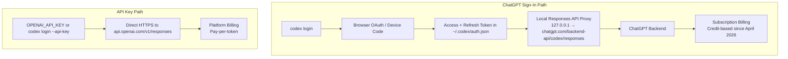
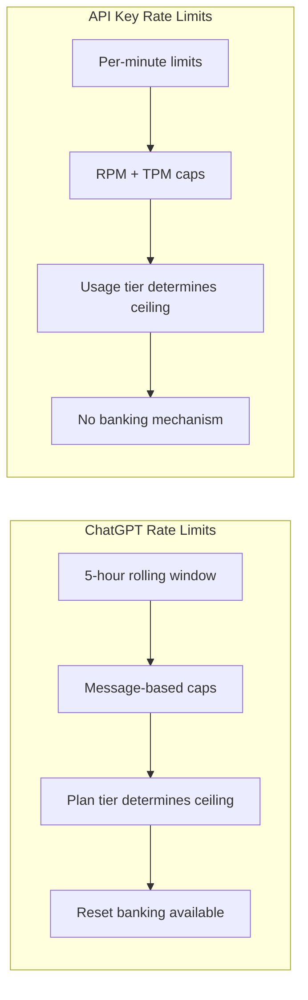
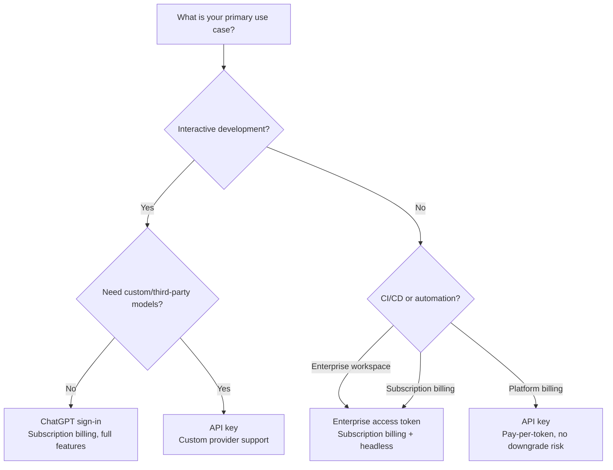

# Codex CLI's Two Worlds: How Your Authentication Path Shapes Billing, Rate Limits, and Model Access in June 2026


---

Every Codex CLI session starts with a single fork in the road: **ChatGPT sign-in** or **API key**. The choice looks trivial — one opens a browser, the other pastes a token — but it quietly determines your billing model, which models appear in your picker, how rate limits reset, whether you can use Codex Cloud, and how the silent model downgrade problem affects you. With the GPT-5.2 removal on 12 June 2026[^1], the introduction of rate-limit reset banking on 11 June[^2], and enterprise access tokens maturing in v0.138[^3], the implications of this fork have never been more consequential.

This article maps the full architecture of both paths as they stand today, the trade-offs between them, and a decision framework for teams choosing one — or both.

## The Architectural Split

Under the hood, the two authentication paths use fundamentally different request pipelines[^4][^5]:



### ChatGPT sign-in: the proxy model

When you authenticate via ChatGPT (the default), the CLI stores an OAuth access token and refresh token in `~/.codex/auth.json`[^4]. On each request, the CLI routes traffic through a local proxy to `chatgpt.com/backend-api/codex/responses`[^6]. If the access token has expired, the CLI silently refreshes it using the stored refresh token[^6].

This proxy architecture means ChatGPT-authenticated sessions talk to a **different backend** than API-key sessions. The backend is shared with the Codex app, the IDE extension, and ChatGPT mobile — which is why subscription features like Codex Cloud, fast mode, realtime voice, and Codex-Spark are available through this path but not through API keys[^4][^5].

### API key: direct wire

An API key session bypasses the proxy entirely. The CLI sends Responses API requests directly to `api.openai.com`, authenticated by a bearer token[^4]. This is the same endpoint used by the Python and Node SDKs. The session belongs to your **Platform project**, not your ChatGPT account — a distinction that matters for billing, usage dashboards, and data handling policies[^5].

## Model Picker: What You See Depends on How You Logged In

The models available in each path diverge, and the gap widened on 12 June 2026 when GPT-5.2 variants were removed from ChatGPT[^1]:

| Model | ChatGPT Sign-In | API Key |
|-------|-----------------|---------|
| GPT-5.5 | ✅ (default) | ✅ |
| GPT-5.4 | ✅ | ✅ |
| GPT-5.4 mini | ✅ | ✅ |
| GPT-5.3-Codex | ✅ (cloud/review default) | ✅ |
| GPT-5.3-Codex-Spark | ✅ (Pro only) | ❌ |
| GPT-5.2 variants | ❌ (removed 12 June)[^1] | ⚠️ API sunset 30 June[^7] |
| Custom/third-party models | ❌ | ✅ (via `chat_completions_custom_provider`)[^8] |

The critical practical difference: **ChatGPT sign-in locks you into OpenAI's model catalogue**. If you need to route through OpenRouter, LiteLLM, or Azure OpenAI Service, you must use an API key (or a custom provider configuration)[^8].

## Billing: Two Separate Ledgers

Since 2 April 2026, ChatGPT-authenticated Codex sessions use **credit-based billing** rather than per-message billing[^9]. This is an entirely separate ledger from API-key billing[^5]:

### ChatGPT subscription credits

Credits are consumed per million tokens at rates that vary by model[^9]:

| Model | Input (credits/1M) | Cached Input | Output (credits/1M) |
|-------|--------------------|--------------|--------------------|
| GPT-5.5 | 125 | 12.50 | 750 |
| GPT-5.4 | 62.50 | 6.250 | 375 |
| GPT-5.4 mini | 18.75 | 1.875 | 113 |

GPT-5.5 averages 5–45 credits per message depending on context size and output length[^9]. Credits are bundled with your subscription plan and reset on a rolling window.

### API key pay-per-token

API-key sessions bill at standard OpenAI Platform rates[^10]:

| Model | Input ($/1M) | Cached Input ($/1M) | Output ($/1M) |
|-------|-------------|--------------------|----|
| GPT-5.5 | \$5.00 | \$0.50 | \$30.00 |
| GPT-5.4 | \$2.50 | \$0.25 | \$15.00 |
| GPT-5.3-Codex | \$1.75 | \$0.175 | \$14.00 |

⚠️ These rates are as of June 2026 and are subject to the pre-IPO pricing adjustments OpenAI has signalled[^11].

### The break-even calculation

For light usage (fewer than 8 substantial sessions per month), API key billing is typically cheaper. At 8–50 sessions per month, Plus at \$20/month wins. Beyond 50 sessions, Pro at \$100/month delivers the best unit economics[^5]. The cached input discount (50–90% off depending on path) shifts this calculation significantly for long-running agentic sessions that maintain stable prompt prefixes[^12].

## Rate Limits: Rolling Windows vs RPM/TPM

The rate-limiting mechanisms differ architecturally between the two paths:

### ChatGPT: five-hour rolling windows

ChatGPT-authenticated sessions use **five-hour activity windows** rather than fixed daily caps[^9]:

| Plan | GPT-5.5 messages/5h | GPT-5.4 messages/5h | GPT-5.4 mini/5h |
|------|---------------------|---------------------|-----------------|
| Plus (\$20) | 15–80 | 20–100 | 60–350 |
| Pro 5x (\$100) | 80–400 | 100–500 | 300–1750 |
| Pro 20x (\$200) | 300–1600 | 400–2000 | 1200–7000 |

The range reflects message complexity — simple queries consume less than complex multi-tool agent turns[^9].

Since 11 June 2026, Plus and Pro users can **bank rate-limit resets** through a referral programme (active until 24 June), earning additional reset credits that extend their effective window[^2].

### API key: RPM and TPM tiers

API-key rate limits follow the standard OpenAI Platform tier system: requests per minute (RPM) and tokens per minute (TPM), scaling with your organisation's usage tier[^10]. There are no message-based windows — you pay for what you use, and the limits are purely throughput-based.



## The Silent Downgrade Problem

One of the most consequential differences between the two paths is susceptibility to **silent model downgrades**. When a ChatGPT-authenticated session exhausts its rate limit for GPT-5.5, the backend may silently fall back to GPT-5.4 mini without explicit notification[^13]. This has generated over 1,000 verified quality complaints and is documented as affecting the 160-message/3-hour threshold[^13].

API-key sessions are **not affected** by this behaviour. The model you request is the model you get — if your rate limit is exceeded, the API returns a `429 Too Many Requests` error rather than silently downgrading[^10].

For teams where output quality consistency is critical, this is a compelling reason to use API keys for production and CI/CD workflows, even if subscription billing is cheaper for interactive development.

## Enterprise Access Tokens: The Third Path

Codex v0.138 (8 June 2026) expanded support for **v2 personal access tokens** (PATs) in CLI and app-server flows[^3]. Enterprise workspace admins can now grant members permission to create long-lived Codex access tokens intended for automation:

```toml
# config.toml — enterprise access token
[auth]
preferred_auth_method = "access_token"
```

Enterprise access tokens combine the subscription billing model of ChatGPT sign-in with the headless automation capability of API keys[^14]. They inherit workspace RBAC policies, retention settings, and managed configuration bundles — making them the preferred path for enterprise CI/CD pipelines that need subscription-tier features without interactive login[^14].

Admins can enforce authentication restrictions through managed configuration:

```toml
# Managed config — restrict to ChatGPT auth only
[auth]
forced_login_method = "chatgpt"
forced_chatgpt_workspace_id = "ws_abc123"
```

## Credential Storage

Both paths store credentials locally, with configurable backends[^4]:

```toml
# config.toml
[auth]
cli_auth_credentials_store = "auto"  # "file", "keyring", or "auto"
```

| Backend | Storage Location | Security |
|---------|-----------------|----------|
| `file` | `~/.codex/auth.json` | Plaintext JSON — protect with filesystem permissions |
| `keyring` | OS credential store (macOS Keychain, Windows Credential Manager, Linux Secret Service) | Encrypted at rest |
| `auto` | Prefers `keyring`, falls back to `file` | Best available |

For CI/CD pipelines, credentials can be injected via the `CODEX_ACCESS_TOKEN` environment variable or `CODEX_AUTH_JSON` for ChatGPT sessions, bypassing the need for interactive login[^4].

## Decision Framework

Choose your authentication path based on your primary workflow:



### Hybrid strategy

Many teams run both paths simultaneously using Codex CLI profiles[^15]:

```toml
# ~/.codex/config.toml

[profile.interactive]
# ChatGPT login for daily development
# Uses subscription credits, full feature set

[profile.ci]
# API key for automation pipelines
preferred_auth_method = "apikey"
model = "gpt-5.4-mini"
# Pay-per-token, no silent downgrades

[profile.deep]
# API key for quality-critical work
preferred_auth_method = "apikey"
model = "gpt-5.5"
model_reasoning_effort = "high"
```

Switch profiles at invocation:

```bash
# Daily interactive work — subscription billing
codex -p interactive

# CI pipeline — API key billing
codex exec -p ci "Run the test suite and fix failures"

# Deep refactoring — API key, no downgrade risk
codex -p deep
```

## Configuration Quick Reference

| Setting | Purpose | Values |
|---------|---------|--------|
| `preferred_auth_method` | Default login method | `"chatgpt"`, `"apikey"`, `"access_token"` |
| `cli_auth_credentials_store` | Credential backend | `"auto"`, `"file"`, `"keyring"` |
| `forced_login_method` | Admin enforcement | `"chatgpt"`, `"api"` |
| `forced_chatgpt_workspace_id` | Workspace lockdown | Workspace ID string |

Environment variables for headless injection:

```bash
export OPENAI_API_KEY="sk-..."           # API key auth
export CODEX_ACCESS_TOKEN="cat-..."       # Enterprise access token
export CODEX_AUTH_JSON='{"access_token":"...","refresh_token":"..."}'  # ChatGPT auth
export CODEX_CA_CERTIFICATE="/path/to/cert.pem"  # Corporate proxy TLS
```

## What Changed This Week

Three events in the past 48 hours have shifted the authentication calculus:

1. **GPT-5.2 removal from ChatGPT** (12 June): ChatGPT-authenticated sessions can no longer select GPT-5.2 variants. Existing conversations auto-migrated to GPT-5.5[^1]. API-key sessions retain access until the 30 June API sunset[^7].

2. **Rate-limit reset banking** (11 June): ChatGPT Plus and Pro users can now bank rate-limit resets through a referral programme, extending their effective session budget[^2]. This benefit is unavailable to API-key sessions.

3. **Additional usage purchasing** (13 June): ChatGPT users who exhaust their plan limits can now purchase additional credits without upgrading their plan[^16]. This closes the previous gap where hitting the limit meant either waiting or switching to API-key billing.

Together, these changes make ChatGPT subscription billing more flexible for interactive work while reinforcing the API-key path's advantages for automation and quality-critical workflows.

## Citations

[^1]: OpenAI, "ChatGPT Release Notes — June 12, 2026: GPT-5.2 Model Removal," [help.openai.com/en/articles/6825453-chatgpt-release-notes](https://help.openai.com/en/articles/6825453-chatgpt-release-notes)

[^2]: OpenAI, "Codex App 26.609 Changelog — Rate-Limit Reset Banking," [developers.openai.com/codex/changelog](https://developers.openai.com/codex/changelog)

[^3]: OpenAI, "Codex CLI 0.138.0 Release Notes — v2 Personal Access Tokens," [developers.openai.com/codex/changelog](https://developers.openai.com/codex/changelog)

[^4]: OpenAI, "Authentication — Codex," [developers.openai.com/codex/auth](https://developers.openai.com/codex/auth)

[^5]: LaoZhang AI, "Codex API Key vs Subscription: Which Route Should You Use?," [blog.laozhang.ai/en/posts/codex-api-key-vs-subscription](https://blog.laozhang.ai/en/posts/codex-api-key-vs-subscription)

[^6]: David Factor, "codex-responses-proxy — Local Responses-API Proxy," [pkg.go.dev/github.com/David-Factor/codex-responses-proxy](https://pkg.go.dev/github.com/David-Factor/codex-responses-proxy)

[^7]: GitHub Changelog, "Upcoming Deprecation of GPT-5.2 and GPT-5.2-Codex," [github.blog/changelog/2026-05-01-upcoming-deprecation-of-gpt-5-2-and-gpt-5-2-codex](https://github.blog/changelog/2026-05-01-upcoming-deprecation-of-gpt-5-2-and-gpt-5-2-codex/)

[^8]: OpenAI, "Command Line Options — Codex CLI," [developers.openai.com/codex/cli/reference](https://developers.openai.com/codex/cli/reference)

[^9]: OpenAI, "Codex Pricing," [developers.openai.com/codex/pricing](https://developers.openai.com/codex/pricing)

[^10]: OpenAI, "API Pricing," [openai.com/api/pricing](https://openai.com/api/pricing/)

[^11]: Wall Street Journal, "OpenAI Considers Drastic Token Price Cuts Ahead of IPO," 11 June 2026

[^12]: OpenAI, "Prompt Caching 201," [developers.openai.com/cookbook/examples/prompt_caching_201](https://developers.openai.com/cookbook/examples/prompt_caching_201)

[^13]: chatgptdisaster.com, "GPT-5.5 Silent Model Downgrade Reports," [chatgptdisaster.com](https://chatgptdisaster.com)

[^14]: OpenAI, "Access Tokens — Codex Enterprise," [developers.openai.com/codex/enterprise/access-tokens](https://developers.openai.com/codex/enterprise/access-tokens)

[^15]: OpenAI, "Codex CLI Features," [developers.openai.com/codex/cli/features](https://developers.openai.com/codex/cli/features)

[^16]: OpenAI, "ChatGPT Release Notes — June 13, 2026: Additional Usage Purchasing," [help.openai.com/en/articles/6825453-chatgpt-release-notes](https://help.openai.com/en/articles/6825453-chatgpt-release-notes)
