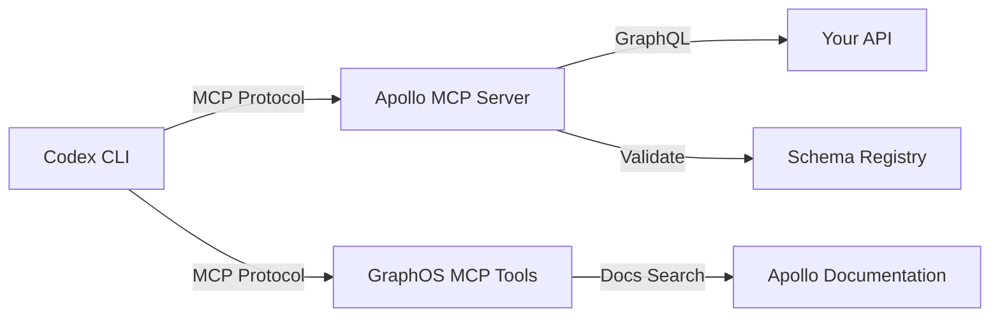
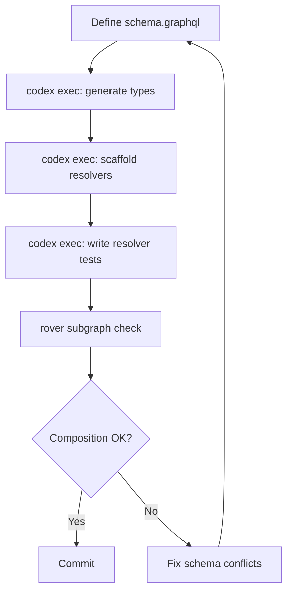

# Codex CLI for GraphQL Development: Apollo MCP Server, Schema-First Workflows, and Agent-Ready API Design


---

GraphQL's typed schema, operation-level granularity, and precise data fetching make it a remarkably good fit for AI coding agents. Unlike REST endpoints that return fixed response shapes — burning tokens on fields the agent never inspects — a GraphQL query returns exactly what was requested [^1]. Combine that with Apollo's MCP Server, which exposes GraphQL operations as individually addressable MCP tools, and Codex CLI gains a structured, type-safe API surface that is both cheaper to consume and harder to misuse.

This article maps the practical integration points: configuring Apollo MCP Server as a Codex CLI tool source, wiring GraphOS documentation tools into your workflow, structuring AGENTS.md for GraphQL projects, and applying the security boundaries that stop an agent from running an unbounded `allUsers` query against production.

## Why GraphQL Suits Agent Workflows

The GraphQL AI Working Group — active since 2025 and meeting monthly through 2026 — has been explicit about the alignment: "GraphQL schemas describe your domain in a declarative, structured way, making them a natural fit for AI agents that need context, clear boundaries, and predictable data contracts" [^2]. Three properties matter most for Codex CLI integration:

1. **Type-safe validation before execution.** The agent can validate an operation against the schema without making a network request. Field typos, argument type mismatches, and missing required variables are caught at validation time, not at the cost of a failed API call and wasted tokens [^1].

2. **Precise data fetching.** A single GraphQL query replaces multiple REST calls, and the response contains only the requested fields. For token-budgeted agent sessions, this precision directly reduces `tool_output_token_limit` pressure.

3. **Schema as documentation.** Introspection provides machine-readable type definitions, descriptions, and deprecation notices. The agent does not need to parse HTML documentation pages or guess at endpoint structures.



## Setting Up Apollo MCP Server for Codex CLI

Apollo MCP Server is open source and exposes your GraphQL API's operations as MCP tools [^3]. Installation is straightforward:

```bash
npm install -g @apollo/mcp-server
```

### Three Configuration Patterns

Apollo MCP Server offers three approaches, each with different security and flexibility tradeoffs [^1] [^3]:

**Pattern 1: Pre-defined Operations (Recommended Starting Point)**

Define `.graphql` files that each become an MCP tool with a typed input schema. This works with any GraphQL API — no Apollo infrastructure required.

```yaml
# apollo-mcp-config.yaml
graphql:
  endpoint: https://api.example.com/graphql
operations:
  source: local
  paths:
    - ./operations/*.graphql
```

Each operation file maps directly to a tool:

```graphql
# operations/getUser.graphql
query GetUser($id: ID!) {
  user(id: $id) {
    id
    name
    email
    role
  }
}
```

Parameter requirements derive automatically from GraphQL's type system: non-null types (`ID!`, `String!`) become required parameters, nullable types become optional, and variables with defaults (`$limit: Int = 10`) become optional with the specified default [^3].

**Pattern 2: Persisted Queries via Apollo GraphOS**

If you already use Apollo GraphOS, persisted query manifests provide automatic safelisting:

```yaml
operations:
  source: uplink
```

Apollo Router only accepts operations from the manifest, preventing arbitrary query execution [^3]. This is the strongest security posture for production APIs.

**Pattern 3: Dynamic Introspection**

Four runtime tools enable schema exploration and ad-hoc operation construction:

| Tool | Purpose |
|------|---------|
| `introspect` | Navigate schema structure |
| `search` | Find types and fields via semantic search |
| `validate` | Check operations before execution |
| `execute` | Run valid GraphQL operations |

This is powerful for development but requires careful security configuration for production use.

### Registering with Codex CLI

```bash
codex mcp add apollo-server -- npx @apollo/mcp-server --config ./apollo-mcp-config.yaml
```

For teams sharing configuration, add the server definition to `.codex/config.toml`:

```toml
[mcp_servers.apollo-server]
command = "npx"
args = ["@apollo/mcp-server", "--config", "./apollo-mcp-config.yaml"]
```

## GraphOS Documentation Tools

Separately from the API-facing MCP server, Apollo provides GraphOS MCP Tools — a hosted service that gives your agent access to Apollo's documentation and the Connectors specification [^4]:

```bash
codex mcp add graphos-tools --url https://mcp.apollographql.com
```

This requires the experimental RMCP client:

```toml
# config.toml
experimental_use_rmcp_client = true
```

Three tools become available: `ApolloDocsSearch` for searching official documentation, `ApolloDocsRead` for retrieving full markdown content, and `ApolloConnectorsSpec` for the Connectors integration specification [^4]. No API key is required.

For teams using both Apollo MCP Server (API access) and GraphOS MCP Tools (documentation), scope them with `enabled_tools` to avoid tool bloat:

```toml
[mcp_servers.apollo-server]
command = "npx"
args = ["@apollo/mcp-server", "--config", "./apollo-mcp-config.yaml"]
enabled_tools = ["GetUser", "ListOrders", "CreateOrder"]

[mcp_servers.graphos-tools]
url = "https://mcp.apollographql.com"
enabled_tools = ["ApolloDocsSearch", "ApolloDocsRead"]
```

## Structuring AGENTS.md for GraphQL Projects

A GraphQL project's AGENTS.md should encode the conventions that prevent common agent mistakes — unnamed operations, missing `id` fields, and overly broad queries:

```markdown
## GraphQL Conventions

- Always use **named operations** (visible in Apollo Studio traces)
- Always include the `id` field on any object type (enables cache normalisation)
- Use **variables** for all dynamic values — never interpolate into query strings
- Prefer `@connection` directives for paginated lists
- Maximum query depth: 5 levels

## Schema-First Workflow

1. Define types in `schema.graphql` first
2. Generate TypeScript types with `graphql-codegen`
3. Implement resolvers against the generated types
4. Run `rover subgraph check` before committing

## Testing

- Run `npm run codegen` before `npm test`
- Integration tests use the test schema at `./test/schema.graphql`
- Mock resolvers live in `./test/mocks/`
```

## Mutation Security: The Critical Configuration

By default, Apollo MCP Server blocks all mutations via the `execute` introspection tool [^3]. Three modes control mutation access:

| Mode | Behaviour | Use Case |
|------|-----------|----------|
| `none` | Block all mutations | Read-only agent workflows |
| `explicit` | Allow only pre-defined mutation files | Controlled writes |
| `all` | Permit agent-constructed mutations | Development only |

The hybrid configuration — dynamic reads with explicit writes — is the recommended production pattern:

```yaml
operations:
  source: local
  paths:
    - ./mutations/*.graphql
introspection:
  execute:
    enabled: true
  search:
    enabled: true
overrides:
  mutation_mode: explicit
```

This lets the agent explore the schema freely for queries but restricts mutations to the approved `.graphql` files you have reviewed [^3].

### Demand Control

Apollo Router's demand control calculates operation cost and rejects expensive queries before execution [^1]. Use `@cost` and `@listSize` directives in your schema:

```graphql
type Query {
  users(first: Int = 10): UserConnection
    @listSize(assumedSize: 50, slicingArguments: ["first"])
}

type User {
  posts: [Post!]! @cost(weight: 5)
}
```

This prevents an agent from accidentally constructing a query that fans out across millions of records.

## Schema-First Development with Codex CLI

The schema-first workflow — define types in SDL, generate code, implement resolvers — maps cleanly to agent-assisted development:



A practical `codex exec` pipeline for adding a new GraphQL type:

```bash
# Generate TypeScript types from schema
codex exec "Add a 'Review' type to schema.graphql with fields: id, rating, comment, author, createdAt. Then run graphql-codegen to generate TypeScript types."

# Scaffold resolvers
codex exec "Create resolvers for the Review type following the existing resolver patterns in src/resolvers/. Include proper DataLoader usage for the author field."

# Generate tests
codex exec "Write integration tests for the Review resolvers using the test patterns in test/resolvers/. Cover create, read, list with pagination, and the author relationship."
```

## Apollo Federation and Multi-Subgraph Workflows

For federated architectures, each subgraph is an independently developed schema and resolver set [^5]. Codex CLI's multi-directory support (`--add-dir`) enables cross-subgraph work:

```bash
codex --add-dir ../users-subgraph --add-dir ../orders-subgraph \
  "Add a reviews field to User in the users-subgraph that references the Review entity from the orders-subgraph using @requires"
```

The AGENTS.md in each subgraph should specify its entity boundaries:

```markdown
## Federation Boundaries

This subgraph owns: User, Team, Organisation
This subgraph references (external): Order, Product
Do NOT add fields owned by other subgraphs without checking rover subgraph check
```

## The GraphQL AI Working Group and the @mock Directive

The GraphQL AI Working Group has proposed a `@mock` directive specification designed to improve development and testing workflows for both humans and AI agents [^2]. When applied, client tooling intercepts execution and returns predefined mock responses instead of making network requests:

```graphql
type Query {
  user(id: ID!): User @mock(data: { id: "1", name: "Test User" })
}
```

This is particularly relevant for Codex CLI workflows where the agent needs to develop against a schema without a live backend — a common scenario during schema-first development and when working on subgraph changes that have not yet been deployed.

⚠️ The `@mock` directive remains a proposal as of June 2026 and has not been formally adopted into the GraphQL specification.

## Token Economics: GraphQL vs REST in Agent Workflows

The token efficiency advantage of GraphQL over REST is measurable. REST APIs return fixed response shapes — every field in the resource, whether the agent needs it or not. GraphQL returns only requested fields [^1].

For a practical comparison using Codex CLI's `tool_output_token_limit`:

| Approach | Tokens per user lookup | Fields returned |
|----------|----------------------|-----------------|
| REST `GET /users/123` | ~800 | All 25 fields |
| GraphQL `{ user(id: "123") { name email role } }` | ~120 | 3 requested fields |

Over a session with 50 API calls, that difference compounds: ~40,000 tokens saved, roughly \$0.16 at current GPT-5.5 output rates [^6].

## Practical Checklist

1. **Install Apollo MCP Server** and define your most-used queries as `.graphql` operation files
2. **Set `mutation_mode: explicit`** — never give an agent unrestricted write access to a GraphQL API
3. **Add GraphOS MCP Tools** for documentation access during development sessions
4. **Configure `enabled_tools`** to scope exposed operations and avoid the MCP tool definition tax
5. **Add `@cost` and `@listSize` directives** to your schema for demand control
6. **Structure AGENTS.md** with named-operation and `id`-field conventions
7. **Use `rover subgraph check`** in PostToolUse hooks for federated architectures

## Citations

[^1]: [Building a Secure AI Agent API Stack with GraphQL, Apollo Skills, and MCP Server](https://www.apollographql.com/blog/building-a-secure-ai-agent-api-stack-with-graphql-apollo-skills-and-mcp-server) — Apollo GraphQL Blog, 5 March 2026

[^2]: [GraphQL AI Working Group Recap: January 2026](https://graphql.org/blog/2026-01-22-recap-jan-2026-ai-wg/) — GraphQL Foundation, 22 January 2026

[^3]: [Connect AI Agents to Your GraphQL API Using MCP and Type-Safe Tool Configuration](https://www.apollographql.com/blog/connect-ai-agents-to-your-graphql-api-using-mcp-and-type-safe-tool-configuration) — Apollo GraphQL Blog, 2026

[^4]: [GraphOS MCP Tools](https://www.apollographql.com/docs/graphos/platform/graphos-mcp-tools) — Apollo GraphQL Documentation, accessed June 2026

[^5]: [Scalable GraphQL with Composable Apollo Federation](https://medium.com/@sukhvir.rsrajawat/scalable-graphql-with-composable-apollo-federation-subgraphs-supergraph-architecture-apollo-cc4f624234dd) — Medium, 2026

[^6]: [OpenAI API Pricing](https://openai.com/api/pricing/) — OpenAI, accessed June 2026
